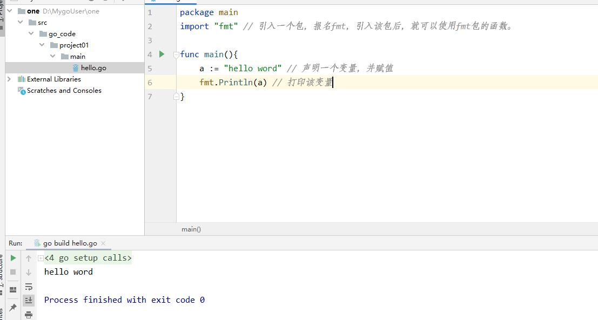
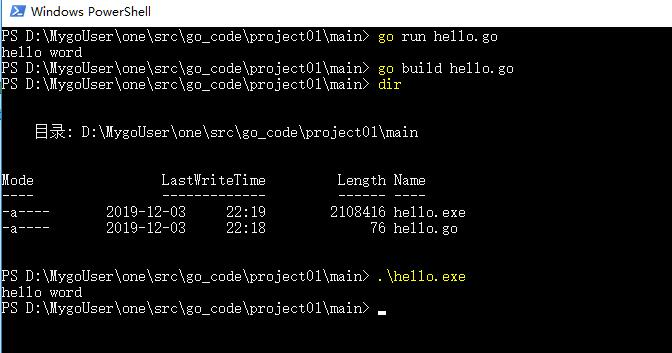
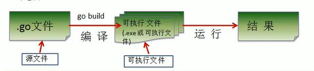
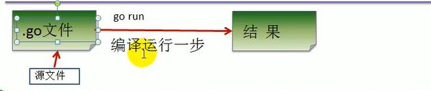

# go简介

[toc]

## go的简史

* 2007.09.21 锥形设计
* 2009.11.10 首次公布
* 2010.01.08 首次当选TOIBE2009年度语言
* 2010.05 google开始投入使用
* 2011.05.05 google app engine支持go
* Golang官方网站：[http://golang.org](http://golang.org)
* Golang官方语法介绍[https://tour.go-zh.org/welcome/1](https://tour.go-zh.org/welcome/1)
* Golang官方帮助文档[https://golang.org/pkg/](https://golang.org/pkg/)
* 国内Golang标准库文档[https://studygolang.com/pkgdoc](https://studygolang.com/pkgdoc)

## Golang的应用领域

* **区块链技术**：简称BT(Blockchain technology),也被称为**分布式账本技术**,是一种互联网数据库技术，其特点是去中心化、公开透明，让每个人均可参与数据记录
* **服务器应用**：支撑主站后台流量(排序，推荐，搜索等)，提供负载均衡，cache,容错，按条件分流，统计运行指标(qps,latency)等功能

## Golang的SDK安装

* SDK下载地址：[golang SDK下载地址](https://golang.google.cn/dl/)
* 下载完成后安装即可
* 配置环境变量说明：
    1. `GOROOT`:指定SDK的安装路径
    2. `GOPATH`:工作目录(即：以后go项目存放路径，即工作目录)

## 开发工具

1. goLand
2. vccode

## 简单测试：

````go
package main
import "fmt" // 引入一个包，报名fmt，引入该包后，就可以使用fmt包的函数。

func main(){
	a := "hello word" // 声明一个变量，并赋值
	fmt.Println(a) // 打印该变量
}
````



* go文件的后缀是`.go`
* package main
    1. 表示hello.go文件所在的包时main，在go中，每个文件都必须归属于一个包。
* import "fmt"
    1. 表示：引入一个包，包名为fmt，引入该包后，就可以使用fmt包的函数，比如：fmt.Println
* func main() {}
    1. func是一个**关键字**，表示一个函数。
    2. main是函数名，是一个**主函数**，即程序的入口。
* fmt.Println("hello,world")
    1. 表示调用fmt包的函数 Println输出"hello,world"。

## 命令行介绍

1. 将go代码编写到名为：hello.go的文件中
2. 通过`go build`命令对该go文件进行编译，生成.exe文件
3. 在dos命令下执行.exe 文件就可以看到运行效果。
4. 注意：通过go run命令可以直接运行hello.go程序（类似执行一个脚本文件的形式）

  

## golang执行流程

1. 对源码编译后，再执行，Go的执行流程如下
  

2. 直接使用go run源码，go的执行流程如下
  

## go语言开发注意事项

1. Go源文件以`.go`为扩展名。
2. Go应用程序的执行入口是main()函数
3. Go语言严格区分大小写。
4. Go方法由一条条语句构成，每个语句后不需要分号(**Go语言会在每行后自动加分号**)。
5. Go编译器是一行行进行编译的，因此每行只能写一条语句，不能把多条语句写在同一行，否则报错。
6. Go语言**定义的变量**或者**import的包**如果没有使用到，代码不能编译通过。
7. 大括号都是成对出现的，缺一不可。

## go语言的注释

1. 介绍：
    * 用于注解说明解释程序的文字就是注释，注释**提高了代码的阅读性**
2. go语言的注释类型
    * go支持c语言风格的`/**/`块注释，也支持C++风格的`//`行注释。行注释更通用，块注释主要用于针对包的详细说明或者屏蔽大块的代码
    1. 行注释
    2. 块注释(多行注释)


