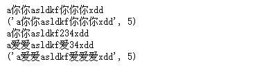

# Python中的re模块
@[toc]
Python使用re模块提供了正则表达式处理的能力。
## 常量
|常量|对应值|说明|
|:--|:--|:-----|
re.I<br/>re.IGNORECASE|2|忽略大小写
re.M<br/>re.MuLTILINE|8|多行模式
re.S<br/>re.DOTALL|16|单行模式
re.X<br/>re.VERBOSE|64|忽略表达式中的空白字符

* 使用|或位运算可以开启多种选项。相加也可以。
## 常用方法
### 编译
* re.compile(pattern,flags=0)->regex #将正则表达式模式编译成正则表达式对象。
    * pattern #需要编译的正则表达式
    * flags #正则表达式使用的模式。re.S|re.M 开启多行模式和单行模式
        * 常用模式有：re.I,re.M,re.S,re.X   
为了提高效率，正则表达式可以被编译，这些编译后的结果被保存，下次使用同样的pattern的时候，就不需要再次编译。   
编译后的对象同样可以使用match(),search()方法进行匹配。
### 单次匹配
* re.match(pattern,string,flags=0)->match #匹配从字符串的开头匹配，返回match对象
    * pattern #正则表达式
    * string #需要匹配的字符串
    * flags #正则表达式使用的模式
        * 常用模式有：re.I,re.M,re.S,re.X   
* regex.match(string[,pos[,endpos]])->match #regex对象match方法可以重设定开始位置和结束位置。返回match对象
    * string #需要匹配的字符串
    * pos  #匹配字符串的开始位置，默认从0索引位置开始匹配
    * endpos #匹配字符串的结束位置(不包含结束位置)，默认值为len(string)
* re.search(pattern,string,flags=0)->match #从头搜索到第一个匹配
    * pattern #正则表达式
    * string #需要匹配的字符串
    # flags #模式
* regex.search(string[,pos[,endpos]])->match #从头搜索到第一个匹配
    * string #需要匹配的字符串
    * pos #匹配的起始位置
    * endpos #匹配的结束位置(不包含结束位置)
* re.fullmatch(pattern,string,flags=0)->match  #整个字符串和正则表达式匹配
    * pattern #正则表达式
    * string #需要匹配的字符串
    * flags #模式
* regex.fullmatch(string[,pos[,endpos]])->match #整个字符串和正则表达式匹配
    * string #需要匹配的字符串
    * pos #匹配的起始位置
    * endpos #匹配的结束位置(不包含结束位置)
### 全文搜索
* re.findall(pattern,string,flags=0)->list #对整个字符串从左至右匹配，返回所有匹配项的列表
    * pattern #正则表达式
    * string #需要匹配的字符
    * flags #模式
* regex.findall(string[,pos[,endpos]])->list  #对整个字符串从左至右匹配，返回所有匹配项的列表
    * stirng #需要匹配的字符
    * pos #匹配的起始位置
    * endpos #匹配的结束位置(不包含结束位置)
* re.finditer(pattern,string,flags=0)->iterable #对整个字符串从左至右匹配，返回所有匹配选项，返回迭代器
    * pattern #正则表达式
    * string #需要匹配的字符
    * flags #模式
    * 注意：每次迭代返回的是match对象
* regex.finditer(string[,pos[,endpos]])->iterable ##对整个字符串从左至右匹配，返回所有匹配选项，返回迭代器
    * string #需要匹配的字符串
    * pos #匹配的起始位置
    * endpos #匹配的结束位置(不包含结束位置)
    * 注意：每次迭代返回的是match对象  
### 匹配替换
* re.sub(pattern,replacement,string,count=0,flags=0)->new_string #将匹配到的字符替换成指定字符
* regex.sub(replacement,string,count=0)->new_string #将匹配到的字符替换成指定字符
    * pattern #正则表达式
    * replacement #替换字符串
    * string #字符串(原始字符串)
    * count #替换的次数，默认值为0 表示全部替换
    * flags #模式
    * 返回值new_string #替换后生成的新字符串
* re.subn(pattern,replacement,string,count=0,flags=0)->(new_string,number_of_subs_made) #将匹配到的字符替换成指定字符
* regex.subn(replacement,string,count=0)->(new_string,number_of_subs_made) #将匹配到的字符替换成指定字符
    * pattern #正则表达式
    * replacement #替换字符串
    * string #字符串(原始字符串)
    * count #替换的次数，默认值为0 表示全部替换
    * flags #模式
    * 返回值是个元组(new_string,number_of_subs_made)
        * new_string #替换后生成的新字符
        * number_of_subs_made #替换的次数   

    简单示例：
    ````python
    import re
    str1 = "a23asldkf234xdd"
    print(re.sub("\d","你",str1))
    print(re.subn("\d","你",str1))
    print(re.sub("\d","你",str1,2))
    req = re.compile("\d")
    print(req.sub("爱",str1,3))
    print(req.subn("爱",str1))
    ````  
    
