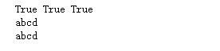
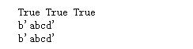

# StringIO和BytesIO

@[TOC](StringIO和BytesIO)  

## StringIO

* io模块中的类  
    * 导入方式

    ````python
    from io import StringIO
    ````

* 内存中，开辟的一个文本模式的buffer，可以像文件对象一样操作它
* 当close方法被调用的时候，这个buffer会被释放
* 大部分方法和文件对象TextIoWrapper方法一样。新增加了getvalue()方法

### 常用方法

* getvalue() #获取缓存区全部内容，跟文件指针没有关系

````python
import io
#在内存中构建
sio = io.StringIO() #像文件对象一样炒作
print(sio.readable(),sio.writable(),sio.seekable())
sio.write("abcd")
sio.seek(0)
print(sio.read())
print(sio.getvalue())#无视指针位置，直接获取所有内容
sio.close()
````  

  

* 其他方法请参照文件操作中BufferedIoBase类中的方法[文件操作](https://github.com/1263351411/xdd.github.io/blob/master/Python/python%E5%9F%BA%E6%9C%AC%E7%9F%A5%E8%AF%86/%E6%96%87%E4%BB%B6IO%E6%93%8D%E4%BD%9C/1.%E6%96%87%E4%BB%B6%E6%93%8D%E4%BD%9C.md)  

## BytesIO

* io模块中的类
    * 导入方法

    ````python
    from io import BytesIO
    ````  

* 内存中，开辟的一个二进制模式的buffer，可以像文件对象(TextIoWrapper)一样操作它
* 当close方法被调用的时候，这个buffer会被释放
* 大部分方法和文件对象TextIoWrapper方法一样。新增加了getvalue()方法

### 常用方法

* getvalue() #获取缓存区全部内容，跟文件指针没有关系

````python
from io import BytesIO
bio = BytesIO()
print(bio.readable(),bio.writable(),bio.seekable())
bio.write(b"abcd")
bio.seek(0)
print(bio.read())
print(bio.getvalue())#无视指针位置，直接获取全部内容
bio.close()
````  



* 其他方法请参照文件操作中BufferedIoBase类中的方法[文件操作](https://github.com/1263351411/xdd.github.io/blob/master/Python/python%E5%9F%BA%E6%9C%AC%E7%9F%A5%E8%AF%86/%E6%96%87%E4%BB%B6IO%E6%93%8D%E4%BD%9C/1.%E6%96%87%E4%BB%B6%E6%93%8D%E4%BD%9C.md)  
