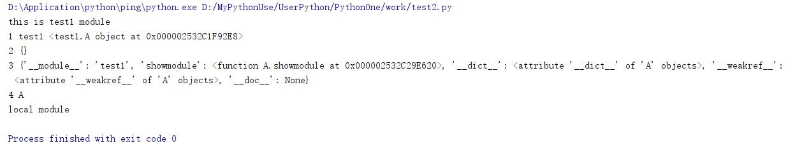
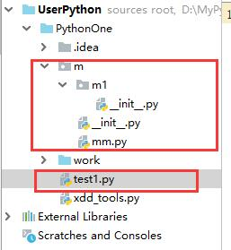
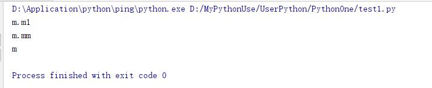

# 模块化与包

1. **模块的定义**：所有以.py结尾的Python源代码文件都是一个**模块**
    * 模块名也是个标识符。可以由字母、下划线和数字组成(注意：不能以数字开头，不能与关键字重名)
    * 模块就像工具包，要想使用这个工具包中的工具，就需要使用import导入这个模块
    * 在模块中定义的全局变量、函数都是模块能够提供给外界直接使用的工具
2. **包的定义**：在一个文件夹下面存在一个`__init__.py`的文件，那么该文件夹就是一个包。
    * `__init__.py`文件为包上定义的内容。在包加载时会同步被加载。
    * 包文件夹下面可以存在多个**子包**或**模块**。
    * 目录可以作为模块，这就是包，不过代码需要写在该目录下 `__init__.py` 中

* 一般来说，编程语言中，库、包、模块是同一种概念，是代码组织方式。
* Python中只有一种模块对象类型，但是为了模块化组织模块的便利，提供了"包"的概念。
* 模块module，指的是Python的源代码文件。  
* 包package，指的是模块组织在一起的和包名同名的目录及其相关文件。  

## 导入语句

|          语句           |   含义   |
| :---------------------- | :------- |
| import 模块1[,模块2...] | 完全导入 |
| import ... as ...       | 模块别名 |

* import 语句
    1. 找到指定的模块，加载和初始化它，生成模块对象。找不到，抛出异常
    2. 在import所在的作用域的局部命名空间中，增加名称和上一步创建的对象关联

* 简单示例

* import functools 表示将functools导入当前作用域中

````python
import functools #导入模块functools
print(dir()) #查看当前作用域的命名名空间
print(functools) #<module 'functools' from 'D:\\Application\\python\\ping\\lib\\functools.py'>
print(functools.wraps) #<function wraps at 0x000002969469EE18>
````


* import os.path #导入os.path,在导入的同时，会将os和os.path加入当前命名空间

````python
import os.path #导入os.path,os加入当前名词空间
import sys
print(dir()) #[...,'os']
print(os)
print(os.path)
print(sys.modules.keys()) #查看系统已经加载的模块
````


* import os.path as osp #导入os.path并赋给osp

````python
import os.path as osp # 导入os.path并赋给osp  
print(dir()) #[..., 'osp']  
print(osp) # <module 'ntpath' from 'path/to/path.py'>
````

* 导入的访问域控制

````python
def textimport():
    import os.path #局部，只能在局部访问
    print(dir())

textimport()
print(globals().keys())
#import os.stat #不可以，应为stat不是模块
````


* 总结
    1. **导入顶级模块，其名称会加入到本地名词空间中，并绑定到其模块对象。**  
    2. **导入非顶级模块，只将其顶级模块名称加入到本地名词空间中。导入的模块必须使用完全限定名称来访问。**  
    3. **如果使用了as，as后的名称直接绑定到导入的模块对象，并将该名称加入到本地名词空间中。**  

## from语句

|         语句          |   含义   |
| :-------------------- | :------- |
| from...import...      | 部分导入 |
| from...import...as... | 别名     |

* **找到from子句中指定的模块，加载并初始化它(注意不是导入)**
* from后面只能是模块名称，或包名称
* from ... import后面可以跟随有效的名称。
    1. 如果from后面是包，先加载包文件，在从包模块内容(`__init__.py`)文件中查找与import后面对应的名称。找到对应的变量名就导入到当前作用域。
        * 如果没找到，就查找包下面与其名称对应的模块，找到就加载该模块，并将该模块作为变量名引入当前作用域。
        * 如果都没找到就抛出ImportError异常
    2. 如果from后面是模块，先加载from后面的模块，再从模块中找到import后面对应的变量名，找到就导入到当前作用域。找不到就抛出ImportError异常

* **使用import或者from...import导入的模块或函数，在内存中只存在一份，不会多次导入**  

````python
from os.path import exists #加载、初始化os、os.path模块，exists加入本地名词空间并绑定

print(exists)

import os.path

print(os.path.exists)
print(os.path.__dict__["exists"])
print(getattr(os.path,"exists"))
````


* 别名

````python
from functools import wraps as wr,partial #别名wr
print(dir()) #[... 'wr',‘partial’]
````

* 当前名词空间中导入该模块指定的成员

````python
from pathlib import Path,PosixPath #在当前名词控件导入该模块指定的成员
print(dir()) #[...,"Path","PosixPath"]
````

* 在当前名词控件导入该模块所有公共成员(非下划线开头成员)或指定成员

````python
from pathlib import * #在当前名词控件导入该模块所有公共成员(非下划线开头成员)或指定成员
print(dir())  # [..., 'Path', 'PosixPath', 'PurePath', 'PurePosixPath', 'PureWindowsPath', 'WindowsPath']
````

## 自定义模块

自定义模块：**.py文件就是一个模块**

### 自定义模块命名规范

1. 模块名就是文件名
2. 模块名必须符合标识符的要求，是非数字开头的字母、数字和下划线的组合。
    * 例如：test-module.py这样的文件名不能作为模块名。也不要使用中文。
3. 不要使用系统模块名，避免冲突。除非你明确知道这个模块名的用途
4. 通常模块名为全小写，下划线来分割

## 模块的搜索顺序

使用sys.path查看搜索顺序

````python
import sys

# print(*sys.path,sep='\n')
for p in sys.path:
    print(p)
````


* **sys.path是一个列表，记录了模块的默认搜索顺序，当加载一个模块的时候，需要从这些搜索路径从前到后依次查找，并不搜索这些目录的子目录。搜索到模块就加载，搜索不到就抛出异常。**
    1. 路径也可以为字典、zip文件、egg文件
        * .egg文件，由setuptools库创建的包，第三方库常用的格式。添加了元数据(版本号、依赖项等)信息的zip文件，实质上就是个zip文件
    2. 路径顺序为：
        * 程序主目录，程序运行的主程序脚本所在的目录
        * PYTHONPATH目录，环境变量PYTHONPATH设置的目录也是搜索模块的路径
        * 标准库目录，Python自带的库模块所在目录
* sys.path可以被修改，增加新的目录

## 模块的重复导入

* 模块不会产生重复导入的现象，所有加载的模块都会记录在**sys.modules**中，sys.modules是存储已经加载过的所有模块的字典。(注意：打印sys.modules可以看到os、os.path都已经加载了。)

````python
# test1.py文件如下
print("this is test1 module")

class A:
    def showmodule(self):
        print(1,self.__module__,self)
        print(2,self.__dict__)
        print(3,self.__class__.__dict__)
        print(4,self.__class__.__name__)

a = A()
a.showmodule()

# test2.py文件如下（运行test2.py）
import test1  #导入当前文件
print("local module")
import test1
import test1
````

  

* 从执行结果来看，不会产生重复导入的现象。所有加载模块都会记录在**sys.modules**中。
* **sys.modules是存储已经加载过的所有模块的字典**。(打印sys.modules可以看到os,os.path都已经加载了)

## 模块的属性

|属性|含义|
|:---|:---|
`__file__`|字符串,源文件路径
`__cached__`|字符串，编译后的字节码文件路径
`__spec__`|显示模块的规范
`__name__`|模块名
`__package__`|当模块是包，同`__name__`;否则，可以设置为顶级模块的字符串

## 模块运行

1. `__name__`,没个模块都会定义一个`__name__`特殊变量来存储当前模块的名称，如果不指定，则默认为源代码文件名，如果是包则有限定名。

2. 解释器初始化的时候，会初始化sys.modules字典(保存已加载的模块),加载builtins(全局函数、常量)模块、`__main__`模块、sys模块，以及初始化模块搜索路径sys.path

3. Python是脚本语言，任何一个脚本都可以直接执行，也可以作为模块被导入。

4. 当从表中输入(命令行方式敲代码)、脚本($ python test.py)或交互式读取的时候，会将模块的`__name__`设置为`__main__`,模块的顶层代码就在`__main__`这个作用域中执行。
    * 顶层代码：模块中缩进最外层的代码。
5. 如果是import导入的，其`__name__`默认就是模块名

* `if __name__ == '__main__'`用途：
    1. 本模块的功能测试，对于非主模块，测试本模块内的函数、类
    2. 避免主模块变更的副作用。假如：顶层代码，没有封装，主模块使用时没有问题。但是，一旦有了新的主模块，老的主模块成了被导入模块，由于原来代码没有封装，会一并执行。

````python
# test1.py文件
import test2

#test2.py文件
# 判断模式是否以主模块方式运行 $python test2.py
if __name__ == "__main__":
    print("in __main__") #主模块方式运行
else:
    print("in imported module") #模块导入的方式运行的代码
````

## 子模块

包目录下的py文件、子目录都是其子模块

## 模块和包的总结

* 包能够更好的组织模块，尤其是大的模块，其代码行数很多，可以把它拆分成很多子模块，便于使用某些功能就加 载相应的子模块。
* 包目录中 `__init__.py` 是在包第一次导入的时候就会执行，内容可以为空，也可以是用于该包初始化工作的代码， 最好不要删除它（低版本不可删除 `__init__.py` 文件）  
* 导入子模块一定会加载父模块，但是导入父模块一定不会导入子模块
* 包目录之间只能使用.点号作为间隔符，表示模块及其子模块的层级关系  
* 模块也是封装，如同类、函数，不过它能够封装变量、类、函数。
* 模块就是命名空间，其内部的顶层标识符，都是它的属性，可以通过 `__dict__` 或dir(module)查看。
* 包也是模块，但模块不一定是包，包是特殊的模块，是一种组织方式，它包含 `__path__` 属性

## 绝对导入，相对导入

### 绝对导入

* 在import语句或者from导入模块，模块名称最前面不是以点(.)开头的
* 绝对导入总是去模块搜索路径中找，当然会查看一下该模块是否已经加载

### 相对导入

* **只在包内使用，且只能用在from语句中**
    1. 使用点(.)号表示当前目录内
    2. 使用(..)表示上一级目录
    3. 使用(...)表示上上级目录。依次内推
* **不要再顶层模块中使用相对导入**
* **一旦一个模块中使用了相对导入，就不可用作为主模块运行**

简单示例：  

* 目录结构如下：



````python
# m文件夹下面的__init__.py文件内容
from . import mm
print(__name__)

# m文件夹下面的mm.py文件内容
from . import m1
print(__name__)

# m1文件夹下面的__init__.py文件内容
print(__name__)

# test1.py文件内容 (运行test1.py)
import m
````

* 运行test1.py输出结果如下：  



## 访问控制

* 模块中以下划线(`_`或者`__`)开头的模块都可以导入，只要是合法的字符，就可以作为模块名。
* 普通变量、保护变量、私有变量、特殊变量，都没有被隐藏，也就是说模块内没有私有的变量，在模块中定义不做 特殊处理。依然可以使用from语句，访问所有变量。  

### `from ... import *` 和`__all__`

* `__all__`是一个列表，元素是字符串，每一个元素都是一个模块内的变量名

一、 使用`from xyz import *` 导入
    1. 如果模块没有`__all__`，`from xyz import *`只导入非下划线开头的该模块的变量。如果是包，子模块也不会导入，除非在`__all__`中设置，或`__init__.py`中导入他们