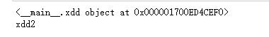

@[toc]

# Python的类

**定义**  

````python
class ClassName:
    语句块
````

1. 必须使用class关键字
2. 类名必须是用**大驼峰**命名
3. 类定义完成后，就产生了一个类对象，绑定到了标识符ClassName上
例如：

````python
class MyClass:
    """我类的注解"""
    x = 'abc' # 类的属性

    def foo(self): #类属性foo，也是方法(属性foo指向了foo方法对象)
        return "My Class"
print(MyClass.x)
print(MyClass.foo)
print(MyClass.__doc__) #查看类的注解
````


## 类对象及属性

* **类对象**：类的定义执行后会生成一个类对象
* **类的属性**：类定义中的变量和类中定义的方法都是类的属性 
* **类变量**：上例中x是类MyClass的变量，同时也是类的属性x
MyClass中，x、foo都是类的属性， \_\_doc\_\_ 也是类的特殊属性  
foo是类的属性，如同**吃时人类的方法**。
foo是方法method，本质上就是普通的函数对象function，它一般要求至少有一个参数。第一个形式参数可以是 self（self只是个惯用标识符，可以换名字），这个参数位置就留给了self。  
**self指代当前实例本身**

## 实例化

````python
a = MyClass() #实例化
````

使用上面的语法，在类对象名称后面加上一个括号，就调用类的实例化方法，完成实例化  
实例化就真正创建一个该类的对象（实例）。例如

````python
tom = Person() #根据Person类创建了一个tom对象
jerry = Person() #根据Person类创建了一个jerry对象
````

上面的tom、jerry都是Person类的实例，通过实例化生成了2个实例。  
每次实例化后获得的实例，是不同的实例，即使是使用同样的参数实例化，也得到不一样的对象。  
Python类**实例化**后，会自动调用 \_\_init\_\_ 方法。这个方法第一个形式参数必须留给self，其它参数随意。 

### __init__初始化方法

MyClass()实际上调用的是 __init__(self) 方法，可以不定义，如果没有定义会在实例化后隐式调用。  
作用：对实例进行**初始化**  

* **注意： \_\_init\_\_方法不能有返回值，也就是只能是return None**  

````python
class MyClass:
    def __init__(self):
        print("init")
print(MyClass) # 不会调用
print(MyClass()) # 调用__init__
a = MyClass() # 调用__init__
````

初始化函数可以多个参数，请注意第一个位置必须是self，例如 \_\_init\_\_(self, name, age)  

````python
class Person:
    def __init__(self, name, age):
        self.name = name
        self.age = age

    def showage(self):
        print('{} is {}'.format(self.name, self.age))

tom = Person('Tom', 20) # 实例化，会调用__init__方法并为实例进行属性的初始化
jerry = Person('Je', 25)
print(tom.name, jerry.age)
jerry.age += 1
print(jerry.age)
jerry.showage()
````

  

### __str__转string方法

* 相当于java中的toString方法，方法必须返回一个str类型的字符串
* 在类对象被转为str类型时调用。返回对象的str类型。
* 如果没有定义__str__方法，默认会调用父类的__str__方法。
    * 父类的__str__方法返回值为：“__main__.{} object at {}”.format(类名,类在内存中的内存地址(16进制表示))

````python
class xdd:
    def __init__(self,name = "xdd"):
        self.name = name
    def show(self):
        print("我是{}对象".format(self.name))
    def __del__(self):
        sys.stdout.writelines("{}被销毁了\n".format(self.name))

class xdd2:
    def __init__(self,name = "xdd"):
        self.name = name
    def show(self):
        print("我是{}对象".format(self.name))
    def __del__(self):
        sys.stdout.writelines("{}被销毁了\n".format(self.name))
    def __str__(self):
        return self.name
#创建xdd对象
xdd1 = xdd("xdd1")
xdd2 = xdd2("xdd2")
print(xdd1)
print(xdd2)
````  

* 输出结果为：  
  

### __repr__对象的字符串表示方法

* 在输出对象时，使用字符表示的对象的方法

````python
class A:
    def __init__(self):
        self.name = "名字"
        self.age = 18
        
    def __repr__(self):
        return "name = {},age = {}".format(self.name,self.age)
    
class B:
    def __init__(self):
        self.name = "名字"
        self.age = 18

print(A,B)
a = A()
b = B()
print(a)
print(b)
````

  

## 实例对象instance

类实例化后一定会获得一个类的实例，就是实例对象。  
上例中的tom、jerry就是Person类的实例。  
**\_\_init\_\_方法的第一个参数self就是指代某一个实例自身**  

* 类实例化后，得到一个实例对象，调用方法时采用jerry.showage(self)的方式，实例对象会绑定到方法上。
    * self 就是jerry，jerry.showage()调用时，会把方法的调用者jerry实例作为第一参数self的实参传入。
    * self.name就是jerry对象的name，name是保存在了jerry对象上，而不是Person类上。所以，称为**实例变量。**

````python
class MyClass:
    def __init__(self):
        print(id(self),self)
    
    def showself(self):
        print(id(self),self)

c = MyClass() #会调用__init__方法
print("c = {}".format(id(c)))
print("- "*30)
c.showself()
````

  
上例说明，self就是调用者，就是c对应的实例对象。  
self这个名字只是一个惯例，它可以修改，但是请不要修改，否则影响代码的可读性  

## 实例属性和类属性

1. **实例属性是每一个实例自己的属性，是自己独有的；类属性是类的属性，是类的所有实例共享的属性和方法**
2. **Python中每一种对象都拥有不同的属性。函数、类都是对象，类的实例也是对象**

````python
class Person:
    age = 3 #定义一个类属性
    def __init__(self,name):
        self.name = name #创建类的实例时，动态的为类生成一个属性name

tom = Person("Tom") #实例化一个对象tom
jerry = Person("jerry") #实例化一个对象jerry

print(tom.name,tom.age)
print(Person.age)
print(Person.age,tom.age,jerry.age)

print("- "*30)
Person.age = 30
print(Person.age,tom.age,jerry.age)
tom.age = 40
print(Person.age,tom.age,jerry.age)
````

  
|特殊属性|含义|
|:---|:----|
\_\_name\_\_|对象名
\_\_class\_\_|对象类型
\_\_dict\_\_|对象的属性字典
\_\_qualname\_\_|类的限定名

### 实例属性的查找顺序

* "\."是成员操作符，对象可以使用“.”来访问属性。会先找自己的"\_\_dict\_\_"字典，如果没有，然后通过属性\_\_class\_\_找自己的类，在去找\_\_dict\_\_中找
* 一般来说，**类变量可以使用全大写来命名。**

### 装饰一个类

需求为一个类通过装饰，增加一些类属性。

````python
def addperson(name,value):
    def _addperson(cls):
        type.__setattr__(cls,name,value)
#         self.__setattr__(name,value)
        return cls
    return _addperson

@addperson("like","ect")
class Person:
    age= 15
    def show(self):
        print("addd")

print(Person.__dict__)
````

  

## 类方法和静态方法

1. **普通方法**，默认会被装饰，动态的传入一个self对象(**类实例化后的对象**)作为该方法的第一个参数。
2. **类方法**，在方法上使用【@classmethod装饰】，会动态的为该方法注入一个参数，该参数为**类的对象**，而不是类实例化后的对象。作为第一次参数，传递给被装饰的函数。被装饰的函数称为类方法。
    * 在类定义中，使用@classmethod装饰的方法
    * 必须至少有一个参数，且第一个参数留给了cls,cls指代调用者即类对象自身
    * cls这个标识符可以是任意的合法名称，但为了易读，一般不会根改为其他名称
    * 通过cls可以直接操作类的属性
    * 类方法，类似于C++、Java中的静态方法
3. **静态方法**，在方法上面使用【@staticmethod】装饰，该方法将**不再被动态注入参数**。该方法称为**静态方法**。
    * 在类定义中，使用@staticmethod装饰器修饰的方法
    * 调用时，不会隐试的传入参数
        * 静态方法，只是表明这个方法属于这个名词空间。函数归在一起，方便组织管理。

* 类几乎可以调用所有内部定义的方法，但是**调用普通的方法**时会报错,原因是**第一参数必须是类的实例**
* 实例也几乎可以调用所有的方法，**普通的函数**的调用一般不可以出现，因为不允许这么定义。
简单示例  

````python
class Person:
    #普通方法
    def method(self):#self是类实例化后的对象，不是类对象
        print("{}\t的mothod".format(self))
    
    #类方法
    @classmethod
    def class_method(cls): #cls是Person类对象，不是类实例对象
        print("class = {0.__name__}({0})".format(cls))
        cls.HEIGHT = 170 #为类对象动态添加一个属性HEIGHT
    
    #静态方法
    @staticmethod
    def static_method(): #静态方法不会为被装饰的方法注入任何参数
        print(Person.HEIGHT)
        
print("--------------类访问")
# print(1,Person.method()) #无法访问，应为需要一个实例化对象可以使用Person.method(Person())
Person.method(Person())
Person.class_method() #使用类调用类方法，会默认将调用的类作为第一个参数传入。所有这里了不需要参数
Person.static_method() #调用静态方法。
print(Person.__dict__)

print("\n\n-----------------实例访问")
tom = Person()
tom.method() #调用普通方法，会默认将tom对象传入
tom.class_method() #调用类方法，会默认将tom.__class__传入
tom.static_method()

print("\n\--------------补充")
tom.__class__.method(tom)  #等价于Person.method(tom)
tom.__class__.class_method()  #等价于Person.class_method()
tom.__class__.static_method() #等价于Person.static_method()
````

  

### 总结

* 类除了普通方法都可以调用，普通方法需要对象的实例作为第一参数。
* 实例可以调用所有类中定义的方法（包括类方法、静态方法），普通方法传入实例自身，静态方法和类方法需要找 到实例的类。

## 访问控制

1. **私有属性和私有方法(private)**

    * **私有属性(private)**: 使用**双下划线**开头的属性名，就是私有属性
    * **私有方法**：使用**双下划线**开头的方法称为，私有方法。  

    **私有方法和私有属性的本质**  
    1. 双下划线开头的方法和属性是私有的。解释器会改名。改为：【_类名__方法名】 
    2. 方法变量都在类的\_\_dict\_\_中可以找到   

类定义的时候，如果声明一个实例变量的时候，使用双下划线，Python解释器会将其改名，转换名称为 _类名__变 量名 的名称，所以用原来的名字访问不到了。  

2. **被保护的属性和被保护的方法(protected)**

    * **被保护的属性**：使用**单下划线**开头的属性，称为被保护的属性
    * **被保护的方法**: 使用**单下划线**开头的方法，称为被保护的方法  

    **被保护的方法和被保护的属性的本质**   
    1. 单下划线的方法只是开发者之间的约定，解释器不做任何改变
    2. 方法变量都在类的\_\_dict\_\_中可以找到

在Python中使用 \_单下划线 或者 \_\_ 双下划线来标识一个成员被保护或者被私有化隐藏起来。但是，不管使用什么样的访问控制，都不能真正的阻止用户修改类的成员。Python中没有绝对的安全的保护成员 或者私有成员。因此，前导的下划线只是一种警告或者提醒，请遵守这个约定。除非真有必要，不要修改或者使用保护成员或者私 有成员，更不要修改它们。

````python
class Person:
    like = "打篮球" #为类定义属性
    __likeect = "冰淇淋" #为类定义私有属性
    _look = "看" #受保护的类属性
    def __init__(self,name,age=18):
        self.name = name
        self.__age = age #为实例化对象定义私有属性
        self._sex = "男" #为实例化对象定义受保护的属性

    def growup(self,i=1):
        if i>0 and i<150:
            self.__age += i

    def getage(self):
        return self.__age

    def __myage(self): #定义私有方法
        return self.__age

p1 = Person("tom")
p1.growup(20)
print(p1.name,p1.getage(),p1._Person__age,p1._Person__myage())
print(Person.like,Person._Person__likeect)
print(p1.__dict__)
print(Person.__dict__)
print(p1._sex,p1._look)
print(Person._look)
````

  

## 属性装饰器

一般好的设计是：把实例的某些属性保护起来，不让外部直接访问，外部使用getter读取属性和setter方法设置属性。  
Python提供了属性property装饰器。  
* **特别注意**：使用property装饰器的时候这三个方法同名
1. property装饰器
    * 后面跟的函数名就是以后的属性名。它就是getter.这个必须有，有了它至少是只读属性
2. setter装饰器
    * 与属性名同名，且接收2个参数，第一个是self，第二个是将要赋值的值。有了它，属性可写。
3. deleter装饰器
    * 可以控制是否删除属性。很少用

* property装饰器必须在前，setter、deleter装饰器在后。  
* property装饰器能通过简单的方式，把对方法的操作变成对属性的访问，并起到了一定隐藏效果  
**示例：**

````python
class Person:
    def __init__(self,name,age=18):
        self.name = name
        self.__age = age
        self.__like = "爱好"
        
    @property
    def age(self):
        return self.__age
    
    @age.setter
    def age(self,age):
        self.__age = age
        
    @age.deleter
    def age(self): #当age引用链接数为0时执行
        print("age已经被删除")
        
    def getlike(self):
        return self.__like
    
    def setlike(self,like):
        self.__like = like
        
    def dellike(self):
        print("like属性被删除了")
        
    #除了使用注解方式，还可以这样定义属性
    like = property(getlike,setlike,dellike) #如果属性只需要get方法，可以使用property(getlike)定义

tom = Person("Tom")
print(tom.age,tom.like)
tom.age = 20
tom.like = "喜欢"
print(tom.age,tom.like)
del tom.age
del tom.like
````

  

## 补丁

可以通过修改或者替换类的成员。使用者调用的方式没有改变，但是，类提供的功能可能已经改变了。  
猴子补丁（Monkey Patch）:  

* 在运行时，对属性、方法、函数等进行动态替换。 
* 其目的往往是为了通过替换、修改来增强、扩展原有代码的能力。 
* 黑魔法，慎用。

1. test2.py文件中的内容如下：

````python
#test2.py文件中的内容
class Person:    
    def get_score(self):        
        # connect to mysql        
        ret = {'English':78, 'Chinese':86, 'History':82}
        return ret
````

2. test3.py文件中的内容如下：

````python
# test3.py 文件中的内容
def get_score(self):
    return dict(name=self.__class__.__name__,English=88, Chinese=90, History=85)
````

3. 主模块中的内容如下：

````python
from test2 import Person 
from test3 import get_score

def monkeypatch4Person():
    Person.get_score = get_score

monkeypatch4Person() # 打补丁

if __name__ == "__main__":
    print(Person().get_score())
````

上例中，假设Person类get_score方法是从数据库拿数据，但是测试的时候，不方便。  
为了测试时方便，使用猴子补丁，替换了get_score方法，返回模拟的数据。  

## 对象的销毁

类中可以定义\_\_del\_\_方法。称为析构函数(方法)。  
作用：销毁类的实例的时候调用，以释放占用的资源。其中就放些清理资源的代码，比如释放连接。  
注意：**当对象的引用次数为0时才执行此方法**  
简单示例：  

````python
class Person:
    def __init__(self,name,age=18):
        self.name = name
        self.__age = age
    
    def __del__(self):
        print(self,"被销毁了")
        
p = Person("Tom")
p.__del__()
print(id(p),p.name) #可以看到p并没有被销毁，只是执行了__del__函数
m = p #实例的引用次数增加，因为又被m记录了
del p #实例的引用次数减少1，
print("对象被m记录，虽然删除了p，但实例的引用次数还是1。")
del m
````

  

由于垃圾回收对象销毁时，才会真正清理对象，还会在回收对象之前自动调用 __del__ 方法，除非你明确知道自 己的目的，建议不要手动调用这个方法。  

## 方法的重载(overload)

其他面向对象的高级语言中，会有重载的概念。所谓重载，就是同一个方法名，但是参数个数、类型不一样，就是同一个方法的重载。  
Python没有重载！,Python不需要重载！  
Python中，方法（函数）定义中，形参非常灵活，不需要指定类型（就算指定了也只是一个说明而非约束），参 数个数也不固定（可变参数）。一个函数的定义可以实现很多种不同形式实参的调用。所以Python不需要方法的 重载。或者说Python语法本身就实现了其它语言的重载。  

## 封装

面向对象的三要素之一，封装Encapsulation  

* 封装
    1. 将数据和操作组织到类中，即属性和方法
    2. 将数据隐藏起来，给使用者提供操作（方法）。使用者通过操作就可以获取或者修改数据。getter和setter。
    3. 通过访问控制，暴露适当的数据和操作给用户，该隐藏的隐藏起来，例如保护成员或私有成员。


