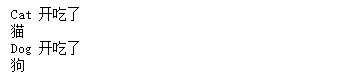
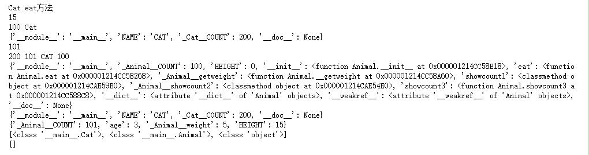
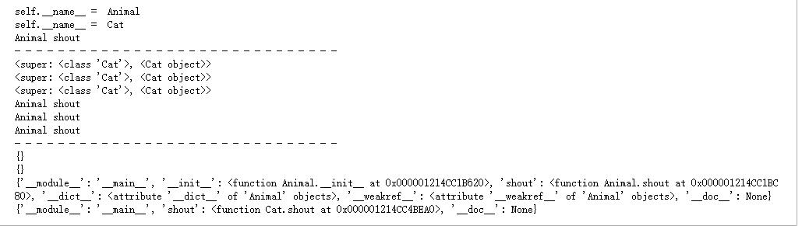
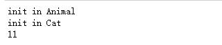

@[toc]

# Python中类的继承

面向对象的三要素之一，继承inheritance  
人类和猫类都继承自动物类。个体继承自父母，继承了父母的一部分特征，但也可以有自己的个性。  
在面向对象的世界中，从父类继承，就可以直接拥有父类的属性和方法，这样可以减少代码、多复用。子类可以定 义自己的属性和方法。

## 继承

* class Cat(Animal) 这种形式就是从父类继承，括号中写上继承的类的列表。  
* 继承可以让子类从父类获取特征（属性和方法）
    * 父类：Animal就是Cat的**父类，也称为基类、超类**。
    * 子类：Cat就是Animal的**子类，也称为派生类**。
* 定义：格式如下：

````text
class 子类名(基类1[，基类2，...]):
    语句块
````

简单示例：

````python
class Animal:
    def __init__(self,name):
        self._name = name

    def shout(self): #一个通用的吃方法
        print("{} 开吃了".format(self.__class__.__name__))

    @property
    def name(self):
        return self._name

class Cat(Animal):
    pass

class Dog(Animal):
    pass

cat = Cat("猫")
dog = Dog("狗")

cat.shout()
print(cat.name)
dog.shout()
print(dog.name)
````



* 如果类定义时，没有**基类**列表，等同于继承自object。在Python3中，object类是所有对象的**根基类**。

````python
class A:
    pass
#等价于
class A(object):
    pass
````

注意，上例在Python2中，两种写法是不同的。  
Python支持多继承，继承也可以多级。  
查看继承的特殊属性和方法有  

|特殊属性和方法|含义|示例|
|:-----------|:---|:---|
\_\_base\_\_|类的基类|
\_\_bases\_\_|类的基类元组|
\_\_mro\_\_|显示方法查找顺序，基类的元组|
mro()方法|同上，返回列表|int.mro()
\_\_subclasses\_\_()|类的子类列表|int.\_\_subclasses\_\_()

## 继承中的访问控制

* 继承时，公有的，子类和实例都可以随意访问；私有成员被隐藏，子类和实例不可直接访问，但私有变量所在的类 内的方法中可以访问这个私有变量。  
* Python通过自己一套实现，实现和其它语言一样的面向对象的继承机制。
* **实例属性查找顺序**
    * 实例的\_\_dict\_\_ ===》 类\_\_dict\_\_  ===如果有继承===》 父类 \_\_dict\_\_
    * 如果搜索这些地方后没有找到就会抛异常，先找到就立即返回了

综合示例

````python
class Animal:
    __COUNT = 100 #会变成_Animal__COUNT
    HEIGHT = 0
    
    def __init__(self,age,weight,height):
        self.__COUNT += 1  #会变成self._Animal__COUNT
        self.age = age
        self.__weight = weight  #会变成self._Animal__weight
        self.HEIGHT = height
        
    def eat(self):
        print("{} eat方法".format(self.__class__.__name__))
        
    def __getweight(self):
        print(self.__weight)  #self._Animal__weight
    
    @classmethod
    def showcount1(cls):
        print(cls.__COUNT,cls.__name__)  #cls._Animal__COUNT
        print(cls.__dict__) 
        
    @classmethod
    def __showcount2(cls):
        print(cls.__COUNT,cls.__name__) #cls._Animal__COUNT
        
        
    def showcount3(self):
        print(self.__COUNT) #self._Animal__COUNT
        
class Cat(Animal):
    NAME = "CAT"
    __COUNT = 200
    
# c = Cat() #__init__函数参数错误
c = Cat(3,5,15) #实例化一个Cat对象
c.eat() #显示Cat
print(c.HEIGHT) # 打印15
# print(c.__COUNT) #无法访问，因为已经变成c._Animal__COUNT=101
c.showcount1() #相当于打印Cat._Animal__COUNT
# c.__showcount2() #会报错，无法访问,应为名称已经改名为_Animal__showcount2。如果访问c._Animal__showcount2()原理和c.showcount1()类似
c.showcount3() #101
print(c._Cat__COUNT,c._Animal__COUNT,c.NAME,Animal._Animal__COUNT) #200,101,CAT,100
print(Animal.__dict__)
print(Cat.__dict__)
print(c.__dict__)
print(c.__class__.mro())#获取Cat的父类列表
print(c.__class__.__subclasses__()) #获取Cat的子类列表
````

  

从父类继承，自己没有的，就可以到父类中找。  
私有的都是不可以访问的，但是本质上依然是改了名称放在这个属性所在类或实例的__dict__中。知道这个新名称 就可以直接找到这个隐藏的变量，这是个黑魔法技巧，慎用。  

## 方法的重写、覆盖override
* 子类中存在一个与父类方法名相同的方法，那么在子类的实例化对象调用该方法时，就会直接调用子类中的重名方法。叫**方法的重写**  
* 如果子类想调用父类中的方法可以使用super()来调用(python3.0后的使用方法)，如果是python2.0那么调用方式为super(self.\_\_class\_\_,self)
* super()可以访问到父类的属性和方法  

实例：  

````python
class Animal:
    def __init__(self):
        print("self.__name__ = ",self.__class__.__name__)
    def shout(self):
        print("Animal shout")
        
class Cat(Animal):
    #重载了父类方法
    def shout(self):
        print("猫")
        
    #覆盖了自身的方法，显示调用了父类的方法
    def shout(self):
        print(super())
        print(super(Cat,self))
        print(super(self.__class__,self))
        
        super().shout()
        super(Cat,self).shout() #等价于super()
        self.__class__.__base__.shout(self) #相当于Animal.shout(self) 不推荐这样使用

a = Animal()
cat = Cat()
a.shout()
print("- "*30)
cat.shout()
print("- "*30)

print(a.__dict__)
print(cat.__dict__)
print(Animal.__dict__)
print(Cat.__dict__)
````

  

* **对于类方法和静态方法，一样都可以重载，原理都一样，是按照属性字典的搜索顺序查找**  

## 继承时使用的初始化

* 通常来说，如果子类中没有定义初始化函数(\_\_init\_\_),那么在子类实例化时，默认会调用父类的初始化函数。
* 如果子类自己重写了初始化函数，那么一般建议在初始化函数中调用一次父类的初始化函数。防止不必要的变量没有初始化。

````python
class Animal:
    def __init__(self,age):
        print("init in Animal")
        self.age = age
        
    def show(self):
        print(self.age)
        
class Cat(Animal):
    def __init__(self,age,weight):
        #调用父类的__init__方法
        super().__init__(age)
        print("init in Cat")
        self.age = age+1
        self.weight = weight

cat = Cat(10,5)
cat.show()
````

  