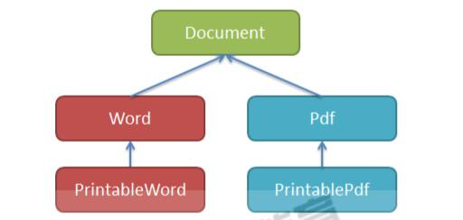

# Python中类的多继承

[toc]

Python2.2之前类是没有共同的祖先的，之后，引入object类，它是所有类的共同祖先类object。Python2中为了兼容，分为古典类（旧式类）和新式类。Python3中全部都是新式类。新式类都是继承自object的，新式类可以使用super。

````python
#一下代码在Python2.x中运行

#古典类(旧式类)
class A:pass

#新式类
class B(object):pass

print(dir(A))
print(dir(B))
print(A.__bases__)
print(B.__bases__)

#古典类
a = A()
print(a.__class__)
print(type(a)) #<type 'instance'>

#新式类
b = B()
print(b.__class__)
print(type(b))
````

## 多继承

*OCP原则*：多用“继承”、少修改  
*继承的用途*：在子类上实现对基类的增强、实现多态  
**多态**: 在面向对象中，父类、子类通过继承联系在一起，如果可以通过一套方法，就可以实现不同表现，就是多态。**一个类继承自多个类就是多继承，它将具有多个类的特征。**  

* 多继承弊端

1. 多继承很好的模拟了世界，因为事物很少是单一继承，但是舍弃简单，必然引入复杂性，带来了冲突。  
2. 多继承的实现会导致代码设计的复杂度增加，所以有些高级编程语言舍弃了类的多继承。  
3. C++支持多继承；Java舍弃了多继承。
    * Java中，一个类可以实现多个接口，一个接口也可以继承多个接口。Java的接口很纯粹，只是方法的声明，继承者 必须实现这些方法，就具有了这些能力，就能干什么。
4. 多继承可能会带来二义性
5. 实现多继承的语言，要解决二义性，深度优先或者广度优先。  

## Python多继承实现

````python
class ClassName(基类列表):
    类体
````

  

左图是多继承（菱形继承），右图是单一继承。  
多继承带来路径选择问题，究竟继承哪个父类的特征呢？  
*Python使用MRO（method resolution order方法解析顺序）解决基类搜索顺序问题。*  

* 历史原因，MRO有三个搜索算法：
    1. **经典算法**：按照定义从左到右，深度优先策略。2.2版本之前 左图的MRO是MyClass,D,B,A,C,A  
    2. **新式类算法**：是经典算法的升级，深度优先，重复的只保留最后一个。2.2版本 左图的MRO是MyClass,D,B,C,A,object  
    3. **C3算法**：在类被创建出来的时候，就计算出一个MRO有序列表。2.3之后，Python3唯一支持的算法 左图中的MRO是MyClass,D,B,C,A,object的列表  
        * C3算法解决多继承的二义性  

* 经典算法有很大的问题，如果C中有覆盖A的方法，就不会访问到了，因为先访问A（深度优先）。  
* 新式类算法，依然采用了深度优先，解决了重复问题，但是同经典算法一样，没有解决继承的单调性。
* C3算法，解决了继承的单调性，它阻止创建之前版本产生二义性的代码。求得的MRO本质是为了线性化，且确定 了顺序。  
    1. 单调性：假设有A、B、C三个类，C的mro是[C, A, B]，那么C的子类的mro中，A、B的顺序一致就是单调的。  

## 多继承的缺点

当类很多，继承复杂的情况下，继承路径太多，很难说清什么样的继承路径。Python语法是允许多继承，但Python代码是解释执行，只有执行到的时候，才发现错误。团队协作开发，如果引入多继承，那代码很有可能不可控。不管编程语言是否支持多继承，都应当避免多继承。Python的面向对象，我们看到的太灵活了，太开放了，所以要团队守规矩。  

## Mixin

类有下面的继承关系  
  
文档Document类是其他所有文档类的抽象基类；Word、Pdf类是Document的子类。  
*需求*：为Document子类提供打印能力  

### *思路1*

* 在Document中提供print方法  
假设已经有了下面3个类

````python
class Document:
    def __init__(self,content):
        self.content = content

    def print(self): #抽象方法
        raise NotImplementedError()

class Word(Document): pass #其他功能略去
class Pdf(Document): pass #其他功能略去
````  

* 基类提供的方法可以不具体实现，因为它未必适合子类的打印，**子类中需要覆盖重写**。
* 基类中只定义，不实现的方法，称为“**抽象方法**“。
    1. 在Python中，如果采用这种方式定义的抽象方法，子类可以不实 现，直到子类使用该方法的时候才报错。  

print算是一种能力 —— 打印功能，不是所有的Document的子类都需要的，所有，从这个角度出发，上面的基类 Document设计有点问题。  

### *思路2*

* 在需要打印的子类上增加打印功能  
如果在现有子类Word或Pdf上直接增加，虽然可以，却违反了OCP的原则，所以可以继承后增加打印功能。因此有下图  
  

````python
class Document: #第三方库，不允许修改
    def __init__(self,content):
        self.content = content
class Word(Document): pass #第三方库，不允许修改
class Pdf(Document): pass #第三方库，不允许修改

#单继承
class PrintableWord(Word):
    def print(self):
        print(self.content,self.__class__.__name__)

print(PrintableWord.__dict__)
print(PrintableWord.mro())

pw = PrintableWord("我是word打印")
pw.print()
````

  
看似不错，如果需要还要提供其他能力，如何继承？  
例如，如果该类用于网络，还应具备序列化的能力，在类上就应该实现序列化。  
可序列化还可能分为使用pickle、json、messagepack等。  
这个时候发现，为了增加一种能力，就要增加一次继承，类可能太多了，继承的方式不是很好了。  
功能太多，A类需要某几样功能，B类需要另几样功能，它们需要的是多个功能的自由组合，继承实现很繁琐。  

### *思路3*

* 装饰器。用装饰器增强一个类，把功能给类附加上去，那个类需要，就装饰它。  

````python
class Document: #第三方库，不允许修改
    def __init__(self,content):
        self.content = content
class Word(Document): pass #第三方库，不允许修改
class Pdf(Document): pass #第三方库，不允许修改

#类装饰器，为类动态增加打印功能
def printtable(cls):
    def _print(self):
        print(self.content,"---装饰器")
    cls.print = _print
    return cls

@printtable
class PrintableWord(Word):pass

@printtable
class PrintablePdf(Pdf):pass

print(PrintableWord.__dict__)
print(PrintableWord.mro())

pw = PrintableWord("我是word打印")
pw.print()

pf = PrintablePdf("我是pdf打印")
pf.print()
````

  

* 优点：
    1. 简单方便，在需要的地方动态增加，直接使用装饰器。
    2. 可以为类灵活的增加功能。  

### *思路4*

* 使用Mixin类，为类增强功能  

````python
class Document: #第三方库，不允许修改
    def __init__(self,content):
        self.content = content
class Word(Document): pass #第三方库，不允许修改
class Pdf(Document): pass #第三方库，不允许修改

class PrintableMixin:
    def print(self):
        print(self.content,"--Mixin类增强功能")

class PrintableWord(PrintableMixin,Word):pass

class PrintablePdf(PrintableMixin,Pdf):pass

print(PrintableWord.__dict__)
print(PrintableWord.mro())

pw = PrintableWord("我是word打印")
pw.print()

pf = PrintablePdf("我是pdf打印")
pf.print()
````  

  
Mixin就是其它类混合进来，同时带来了类的属性和方法。Mixin类和装饰器效果一样，也没有什么特别的。但是Mixin是类，就可以继承。  
如果在上需代码完成后，再次开发，需要对原有的print功能再次增强，可以重新在写个增强的print功能，再类需要使用这种增强的print功能时，可以继承增强后的print功能。

````python
class Document: #第三方库，不允许修改
    def __init__(self,content):
        self.content = content
class Word(Document): pass #第三方库，不允许修改
class Pdf(Document): pass #第三方库，不允许修改

class PrintableMixin:
    def print(self):
        print(self.content,"--Mixin类增强功能")

class PrintableWord(PrintableMixin,Word):pass

class PrintablePdf(PrintableMixin,Pdf):pass

print(PrintableWord.__dict__)
print(PrintableWord.mro())

pw = PrintableWord("我是word打印")
pw.print()

pf = PrintablePdf("我是pdf打印")
pf.print()

#为print类进行功能增强
class SuperPrintableMixin(PrintableMixin):
    def print(self):
        print("- "*10,"打印前增强")
        super().print()
        print("- "*10,"打印后增强")

#使用新增强的功能
class SuperPrintablePdf(SuperPrintableMixin,Pdf):pass

print("")
print(SuperPrintablePdf.__dict__)
print(SuperPrintablePdf.mro())
spp = SuperPrintablePdf("我是super Pdf")
spp.print()
````  

  

# Mixin类

* Mixin本质上就是多继承实现的。  
* Mixin体现的是一种**组合**的设计模式。  
在面向对象的设计中，一个复杂的类，往往需要很多功能，而这些功能有来自不同的类提供，这就需要很多的类组 合在一起。  
从设计模式的角度来说，多组合，少继承。  

* **Mixin类的使用原则**
    1. Mixin类中不应该显式的出现\_\_init\_\_初始化方法  
    2. Mixin类通常不能独立工作，因为它是准备混入别的类中的部分功能实现  
    3. Mixin类的祖先类也应是Mixin类  
    4. 使用时，**Mixin类通常在继承列表的第一个位置**
        * 例如： ````class PrintableWord(PrintableMixin, Word): pass````

Mixin类和装饰器，这两种方式都可以使用，看个人喜好。如果还需要继承就得使用Mixin类的方式。  


