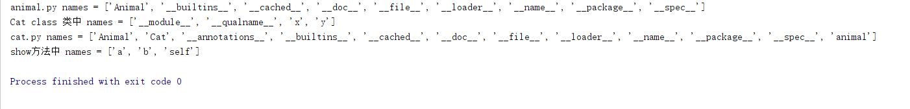
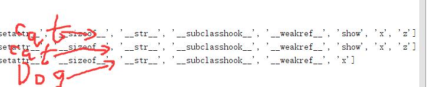
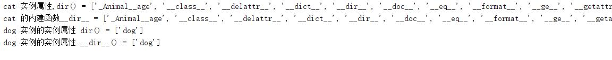
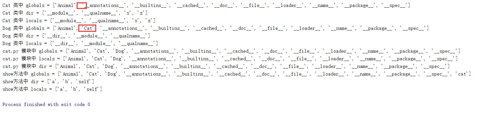
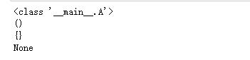

@[toc]

# 类的特殊属性与魔术方法

## 特殊的属性

|      属性      |                                      含义                                       |
| :------------- | :------------------------------------------------------------------------------ |
| \_\_name\_\_   | 类，函数，方法等效的名字。即名称                                                |
| \_\_module\_\_ | 类定义所在的模块名称                                                            |
| \_\_class\_\_  | 对象或类所属的类                                                                |
| \_\_bases\_\_  | 类的基类(父类)的元组，顺序为他们在基类列表中出现的顺序                          |
| \_\_doc\_\_    | 类、函数的文档字符串，如果没有定义则为None                                      |
| \_\_mro\_\_    | 类的mro,class.mro()返回的结果都保存在\_\_mro\_\_中。C3算法帮忙保证类的mro唯一性 |
| \_\_dict\_\_   | 类或实例的属性，可写的字典                                                      |

### 查看属性

|    方法     |                                      含义                                       |
| :---------- | :------------------------------------------------------------------------------ |
| \_\_dir\_\_ | 返回类或者对象的所有成员**名称列表**<br/>dir()函数操作实例就是调用\_\_dir()\_\_ |

如果dir([obj])参数obj包含方法 \_\_dir\_\_() ，该方法将被调用。如果参数obj不包含 \_\_dir\_\_() ，该方法将最大限 度地收集属性信息。  

* dir(obj) #如果没有参数，返回当前局部作用域中的名称列表。使用参数时，尝试返回该对象的有效属性列表。  
    * **dir(obj)相当于调用obj.\_\_dir\_\_()的方法**
    * 对于不同类型的对象obj具有不同的行为：
    1. 如果对象是**模块对象**，返回的列表包含模块的属性名和变量名
    2. 如果对象是类型或者说是**类对象**，返回的列表包含类的属性名，及它祖先类的属性名。
    3. 如果是类的实例
        * 有\_\_dir\_\_方法，返回可迭代对象的返回值
        * 没有\_\_dir\_\_方法，尽可能收集实例的属性名、类的属性和祖先类的属性名
    4. 如果obj不写，返回列表包含内容不同
        * 在模块中，返回模块的属性和变量名
        * 在类中，返回类本地作用域的属性和变量名
        * 在函数中，返回本地作用域的变量名
        * 在方法中，返回本地作用域的变量名  

1. 示例1，不同作用域中的dir返回值  **返回局部作用域中的名称列表**
    * animal.py文件信息如下：

    ````python
    #animal.py文件信息如下：
    class Animal:
    x = 123
    def __init__(self,name):
        self._name = name
        self.__age = 18
        self.weight = 20

    print("animal.py names = {}".format(dir()))
    ````

    * cat.py文件信息如下：

    ````python

    #cat.py文件信息如下：
    import animal
    from animal import Animal

    class Cat(Animal):
        x = "cat"
        y = "abcd"
        print("Cat class 类中 names = {}".format(dir()))

        z = "xyz"

        def show(self):
            a = self
            b = 10
            print("show方法中 names = {}".format(dir()))

    print("cat.py names = {}".format(dir()))
    cat = Cat("苗")
    cat.show()
    ````  

    执行cat.py文件输出结果如下：  
      

2. 示例2：类型中的\_\_dir\_\_
    * 如果对象是类型或者说是**类对象，返回的列表包含类的属性名，及它祖先类的属性名。**
    * dir(类) 等价于调用type.\_\_dir\_\_(类)方法。应为**类**的**类型**是**type**

    ````python
    class Animal:
        x = 123
        def __init__(self,name):
            self._name = name
            self.__age = 18
            self.weight = 20

    class Cat(Animal):
        x = "cat"
        z = "xyz"

        def show(self):
            a = self
            b = 10
            print("show方法中 names = {}".format(dir()))

    class Dog(Animal):
        def __dir__(self):
            return ["dog"]  #__dir__方法必須返回可迭代对象

    #Cat类的dir 会调用type中的__dir__方法返回类Cat的dir,应为Cat是类
    print(type(Cat))
    print("Cat 类的 names = {}".format(dir(Cat)))
    #相当于排序后的集合
    print("Cat 类的 names = {}".format(sorted((Cat.__dict__.keys()| Animal.__dict__.keys() | object.__dict__.keys()))))
    print("Dog 类的 names = {}".format(dir(Dog)))
    ````  

      

3. 示例3：示例属性中的\_\_dir\_\_ (**尽可能的最大收集实例属性的属性名**)  
    * dir(self) 等价于 self.\_\_dir\_\_  #self为实例对象  
    * 如果类中重写了\_\_dir\_\_方法，那么dir(self)调用的返回值是重写的\_\_dir\_\_方法的返回值  
    * \_\_dir\_\_方法的返回值必须是一个可迭代对象  

    ````python
    class Animal:
        x = 123
        def __init__(self,name):
            self._name = name
            self.__age = 18
            self.weight = 20

    class Cat(Animal):
        x = "cat"
        z = "xyz"

        def show(self):
            a = self
            b = 10
            print("show方法中 names = {}".format(dir()))

    class Dog(Animal):
        def __dir__(self):
            return ["dog"]  #__dir__方法必須返回可迭代对象

    cat = Cat("苗")
    dog = Dog("旺旺")

    #注意：dir(cat) 等价于cat.__dir__()
    print("cat 实例属性,dir() = {}".format(dir(cat)))
    print("cat 的内建函数__dir__ = {}".format(sorted(cat.__dir__())))
    print("dog 实例的实例属性 dir() = {}".format(dir(dog)))
    print("dog 实例的实例属性 __dir__() = {}".format(dog.__dir__()))
    ````  

      

### 特殊函数

* locals() 返回**当前作用域**中的变量字典
* globals() 当前**模块全局变量**的字典

````python
class Animal:
    x = 123
    def __init__(self,name):
        self._name = name
        self.__age = 18
        self.weight = 20

class Cat(Animal):
    x = "cat"
    z = "xyz"
    print("Cat 类中 globals = {}".format(sorted(globals().keys())))
    print("Cat 类中 dir = {}".format(dir()))
    print("Cat 类中 locals = {}".format(sorted(locals().keys())))
    def show(self):
        a = self
        b = 10
        print("show方法中 globals = {}".format(sorted(globals().keys())))
        print("show方法中 dir = {}".format(dir()))
        print("show方法中 locals = {}".format(sorted(locals().keys())))

class Dog(Animal):
    def __dir__(self):
        return ["dog"]  #__dir__方法必須返回可迭代对象
    print("Dog 类中 globals = {}".format(sorted(globals().keys())))
    print("Dog 类中 dir = {}".format(dir()))
    print("Dog 类中 locals = {}".format(sorted(locals().keys())))


print("cat.py 模块中 globals = {}".format(sorted(globals().keys())))
print("cat.py 模块中 locals = {}".format(sorted(locals().keys())))
print("cat.py 模块中 dir = {}".format(dir()))
cat = Cat("苗")
cat.show()
````  

  

## 魔术方法

### 实例化

| 方法 | 意义 |
| :--- | :---- |
\_\_new\_\_|示例化一个对象<br/>该方法需要返回一个值，如果该值不少cls的实例，则会调用\_\_init\_\_<br/>该方法永远都是静态方法<br/>调用new方法前还没有实例对象，正常调用完成后会生成实例对象。
\_\_init\_\_| 对实例进行初始化，通常用来设置实例属性，基本配置信息等。<br/>调用init方法前已经存在实例对象
\_\_del\_\_|实例的引用次数为0时调用。即删除实例时调用。<br/>当系统自动调用del方法后实例已经没有对象记录，等着垃圾回收gc来清理。

* new的简单示例(init和del方法在前面文章中已经讲到，这里不做演示)

````python
class A:
    def __new__(cls,*args,**kwargs):
        print(cls)
        print(args)
        print(kwargs)
        # return super().__new__(cls)
        # return 1
        return None

    def __init__(self,name):
        self.name = name

a = A()
print(a)
````

  
\_\_new\_\_ 方法很少使用，即使创建了该方法，也会使用 return super().\_\_new\_\_(cls) 基类object的 \_\_new\_\_ 方 法来创建实例并返回。  

### 可视化

|方法|含义|
\_\_str\_\_|str()函数、format()函数、print()函数调用，需要返回对象的字符串表达式。如果没有定义，就去调用\_\_repr\_\_方法返回字符串的表达。如果\_\_repr\_\_没有定义，就直接返回对象的内存地址信息  
`__repr__`|内建函数repr()对一个对象获取字符串表达。<br/>调用`__repr__`方法返回字符串表达，如果`__repr__`也没有定义，就直接返回object的定义，显示内存地址信息。
`__bytes__`|bytes()函数调用，返回一个对象的bytes表达，即返回bytes对象

* 简单示例：

````python

````