@[toc]

# 类的特殊属性与魔术方法

## 特殊的属性

|      属性      |                                      含义                                       |
| :------------- | :------------------------------------------------------------------------------ |
| \_\_name\_\_   | 类，函数，方法等效的名字。即名称                                                |
| \_\_module\_\_ | 类定义所在的模块名称                                                            |
| \_\_class\_\_  | 对象或类所属的类                                                                |
| \_\_bases\_\_  | 类的基类(父类)的元组，顺序为他们在基类列表中出现的顺序                          |
| \_\_doc\_\_    | 类、函数的文档字符串，如果没有定义则为None                                      |
| \_\_mro\_\_    | 类的mro,class.mro()返回的结果都保存在\_\_mro\_\_中。C3算法帮忙保证类的mro唯一性 |
| \_\_dict\_\_   | 类或实例的属性，可写的字典                                                      |

### 查看属性

|    方法     |                                      含义                                       |
| :---------- | :------------------------------------------------------------------------------ |
| \_\_dir\_\_(self) | 返回类或者对象的所有成员**名称列表**<br/>dir()函数操作实例就是调用\_\_dir()\_\_ |

如果dir([obj])参数obj包含方法 \_\_dir\_\_() ，该方法将被调用。如果参数obj不包含 \_\_dir\_\_() ，该方法将最大限 度地收集属性信息。  

* dir(obj) #如果没有参数，返回当前局部作用域中的名称列表。使用参数时，尝试返回该对象的有效属性列表。  
    * **dir(obj)相当于调用obj.\_\_dir\_\_()的方法**
    * 对于不同类型的对象obj具有不同的行为：
    1. 如果对象是**模块对象**，返回的列表包含模块的属性名和变量名
    2. 如果对象是类型或者说是**类对象**，返回的列表包含类的属性名，及它祖先类的属性名。
    3. 如果是类的实例
        * 有\_\_dir\_\_方法，返回可迭代对象的返回值
        * 没有\_\_dir\_\_方法，尽可能收集实例的属性名、类的属性和祖先类的属性名
    4. 如果obj不写，返回列表包含内容不同
        * 在模块中，返回模块的属性和变量名
        * 在类中，返回类本地作用域的属性和变量名
        * 在函数中，返回本地作用域的变量名
        * 在方法中，返回本地作用域的变量名  

1. 示例1，不同作用域中的dir返回值  **返回局部作用域中的名称列表**
    * animal.py文件信息如下：

    ````python
    #animal.py文件信息如下：
    class Animal:
    x = 123
    def __init__(self,name):
        self._name = name
        self.__age = 18
        self.weight = 20

    print("animal.py names = {}".format(dir()))
    ````

    * cat.py文件信息如下：

    ````python

    #cat.py文件信息如下：
    import animal
    from animal import Animal

    class Cat(Animal):
        x = "cat"
        y = "abcd"
        print("Cat class 类中 names = {}".format(dir()))

        z = "xyz"

        def show(self):
            a = self
            b = 10
            print("show方法中 names = {}".format(dir()))

    print("cat.py names = {}".format(dir()))
    cat = Cat("苗")
    cat.show()
    ````  

    执行cat.py文件输出结果如下：  
      

2. 示例2：类型中的\_\_dir\_\_
    * 如果对象是类型或者说是**类对象，返回的列表包含类的属性名，及它祖先类的属性名。**
    * dir(类) 等价于调用type.\_\_dir\_\_(类)方法。应为**类**的**类型**是**type**

    ````python
    class Animal:
        x = 123
        def __init__(self,name):
            self._name = name
            self.__age = 18
            self.weight = 20

    class Cat(Animal):
        x = "cat"
        z = "xyz"

        def show(self):
            a = self
            b = 10
            print("show方法中 names = {}".format(dir()))

    class Dog(Animal):
        def __dir__(self):
            return ["dog"]  #__dir__方法必須返回可迭代对象

    #Cat类的dir 会调用type中的__dir__方法返回类Cat的dir,应为Cat是类
    print(type(Cat))
    print("Cat 类的 names = {}".format(dir(Cat)))
    #相当于排序后的集合
    print("Cat 类的 names = {}".format(sorted((Cat.__dict__.keys()| Animal.__dict__.keys() | object.__dict__.keys()))))
    print("Dog 类的 names = {}".format(dir(Dog)))
    ````  

      

3. 示例3：示例属性中的\_\_dir\_\_ (**尽可能的最大收集实例属性的属性名**)  
    * dir(self) 等价于 self.\_\_dir\_\_  #self为实例对象  
    * 如果类中重写了\_\_dir\_\_方法，那么dir(self)调用的返回值是重写的\_\_dir\_\_方法的返回值  
    * \_\_dir\_\_方法的返回值必须是一个可迭代对象  

    ````python
    class Animal:
        x = 123
        def __init__(self,name):
            self._name = name
            self.__age = 18
            self.weight = 20

    class Cat(Animal):
        x = "cat"
        z = "xyz"

        def show(self):
            a = self
            b = 10
            print("show方法中 names = {}".format(dir()))

    class Dog(Animal):
        def __dir__(self):
            return ["dog"]  #__dir__方法必須返回可迭代对象

    cat = Cat("苗")
    dog = Dog("旺旺")

    #注意：dir(cat) 等价于cat.__dir__()
    print("cat 实例属性,dir() = {}".format(dir(cat)))
    print("cat 的内建函数__dir__ = {}".format(sorted(cat.__dir__())))
    print("dog 实例的实例属性 dir() = {}".format(dir(dog)))
    print("dog 实例的实例属性 __dir__() = {}".format(dog.__dir__()))
    ````  

      

### 特殊函数

* locals() 返回**当前作用域**中的变量字典
* globals() 当前**模块全局变量**的字典

````python
class Animal:
    x = 123
    def __init__(self,name):
        self._name = name
        self.__age = 18
        self.weight = 20

class Cat(Animal):
    x = "cat"
    z = "xyz"
    print("Cat 类中 globals = {}".format(sorted(globals().keys())))
    print("Cat 类中 dir = {}".format(dir()))
    print("Cat 类中 locals = {}".format(sorted(locals().keys())))
    def show(self):
        a = self
        b = 10
        print("show方法中 globals = {}".format(sorted(globals().keys())))
        print("show方法中 dir = {}".format(dir()))
        print("show方法中 locals = {}".format(sorted(locals().keys())))

class Dog(Animal):
    def __dir__(self):
        return ["dog"]  #__dir__方法必須返回可迭代对象
    print("Dog 类中 globals = {}".format(sorted(globals().keys())))
    print("Dog 类中 dir = {}".format(dir()))
    print("Dog 类中 locals = {}".format(sorted(locals().keys())))


print("cat.py 模块中 globals = {}".format(sorted(globals().keys())))
print("cat.py 模块中 locals = {}".format(sorted(locals().keys())))
print("cat.py 模块中 dir = {}".format(dir()))
cat = Cat("苗")
cat.show()
````  

  

## 魔术方法

### 实例化

| 方法 | 意义 |
| :--- | :---- |
\_\_new\_\_(self,*args,**kwargs)|示例化一个对象<br/>该方法需要返回一个值，如果该值不少cls的实例，则会调用\_\_init\_\_<br/>该方法永远都是静态方法<br/>调用new方法前还没有实例对象，正常调用完成后会生成实例对象。
\_\_init\_\_(self)| 对实例进行初始化，通常用来设置实例属性，基本配置信息等。<br/>调用init方法前已经存在实例对象
\_\_del\_\_(self)|实例的引用次数为0时调用。即删除实例时调用。<br/>当系统自动调用del方法后实例已经没有对象记录，等着垃圾回收gc来清理。

* new的简单示例(init和del方法在前面文章中已经讲到，这里不做演示)

````python
class A:
    def __new__(cls,*args,**kwargs):
        print(cls)
        print(args)
        print(kwargs)
        # return super().__new__(cls)
        # return 1
        return None

    def __init__(self,name):
        self.name = name

a = A()
print(a)
````

  
\_\_new\_\_ 方法很少使用，即使创建了该方法，也会使用 return super().\_\_new\_\_(cls) 基类object的 \_\_new\_\_ 方 法来创建实例并返回。  

### 可视化

|方法|等效的内建函数|含义|
\_\_str\_\_(self)|str()|str()函数、format()函数、print()函数调用，需要返回对象的字符串表达式。如果没有定义，就去调用\_\_repr\_\_方法返回字符串的表达。如果\_\_repr\_\_没有定义，就直接返回对象的内存地址信息  
`__repr__(self)`|repr()|内建函数repr()对一个对象获取字符串表达。<br/>调用`__repr__`方法返回字符串表达，如果`__repr__`也没有定义，就直接返回object的定义，显示内存地址信息。
`__bytes__(self)`|bytes()|bytes()函数调用，返回一个对象的bytes表达，即返回bytes对象

* 简单示例：

````python
class A:
    def __init__(self,name,age=18):
        self.name = name
        self.age = age
        
    def __repr__(self):
        return "repr:{},{}".format(self.name,self.age)
    
    def __str__(self):
        return "str:{},{}".format(self.name,self.age)
    
    def __bytes__(self)->bytes:
        import json
        return json.dumps(self.__dict__).encode()
    
a = A("tom")
print(a) #print函数会默认调用对象的__str__ 等价于a.__str__
print([a]) #等价于[a].__str__  但[]里面会默认调用a的__repr__即等价于[a.__repr__()].__str__()
print([a.__repr__()].__str__())
print(bytes(a)) #等价于str(bytes(a))  等价于 a.__bytes__().__str__()
print( a.__bytes__().__str__())
````  

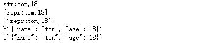  

### 可哈希(hash)与等等运算符(==)

| 方法 | 等效的内建函数 | 意义 |
| :--- | :-------------- | :---- |
`__hash__(self)`|hash()|内建函数hash()调用的返回值，返回一个整数。如果定义这个方法该类的实例就可hash。
`__eq__(self)`| == | 对等等操作符，判断2个对象是否相等，返回值bool值<br/>定义了这个方法，如果不提供`__hash__`方法，那么实例对象将不可hash了。

* `__hash__` 方法只是返回一个hash值作为set的key，但是 去重 ，还需要 `__eq__` 来判断2个对象是否相等。 hash值相等，只是hash冲突，不能说明两个对象是相等的。  
* 因此，一般来说提供 `__hash__` 方法是为了作为set或者dict的key，如果 去重 要同时提供 `__eq__` 方法。
* 判断对象是否可哈希isinstance(obj, collections.Hashable),obj为需要判断的对象。

1. 示例1:
    * 对象的hash值取决于对象的`__hash__`函数的返回值
    * 如果使用"=="运算符，其结果为`__eq__`函数的返回值

    ````python
    class A:
        def __init__(self,name,age=18):
            self.name = name
            self.age = age

        def __hash__(self):
            return hash("{},{}".format(self.name,self.age))

        def __repr__(self):
            return "repr {} {}".format(self.name,self.age)

        def __eq__(self,other):
            # return "abc"  #如果返回字符串，那么print(b==a)的结果就是返回的字符串
            return True

        __str__ = __repr__

    a = A("旺旺")
    b = A("哈哈")
    print(a)
    print(hash(a),a.__hash__())
    print(hash(b),b.__hash__())
    print(b==a) #等价于 b.__eq__(a)
    ````

    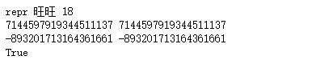  

2. 示例2:
    * set字典中唯一性先判断对象是否可hash，在判断hash值是否相等以及是否“==”来判断新增加的值是否已经存在

    ````python
    class stt:
        def __repr__(self):
            return "("+",".join("{}:{}".format(x,y) for x,y in self.__dict__.items())+")"

    class Point(stt):
        def __init__(self,x,y):
            self.x = x
            self.y = y

    class Point2(stt):
        def __init__(self,x,y):
            self.x = x
            self.y = y

        def __hash__(self):
            return hash("{},{}".format(self.x,self.y))

        def __eq__(self,other):
            return self.x==self.x and self.y==self.y

    print(set([Point(1,2),Point(1,2)]))
    print(set([Point2(1,2),Point2(1,2)]))
    ````

    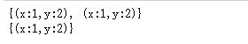  

3. 示例3：
    * 扩展
    * hash值对int类型求值是用一个大整数取摸(%)计算得到的结果
    * hash值的整数为：【2305843009213693951】
    * 下面示例求出hash值对应的大整数是多少

    ````python
    # %%timeit
    def getHashbigInt():
        i = 0
        ii = 2 #增量

        while ii >1:
            i = i+ii
            if hash(i)==i:
                ii = ii*2 #增量加大
            else: #调整增量
                i = i-ii  #i值还原
                ii = ii//2 #增量缩小
        return i+1

    hig = getHashbigInt()
    print(hig)
    print(hash(hig-1),hash(hig),hash(hig+1))
    ````

    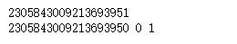  

### bool

| 方法 | 对应的内建函数 | 意义 |
| :--- | -------------- | ---- |
`__bool__(self)`|bool()|内建函数bool()，或者对象放在逻辑表达式的位置，调整这个函数返回布尔值。<br/>如果对象没有定义`__bool__()`，就找`__len__()`返回长度，非0为真<br/>如果`__len__()`也没有定义，那么所有实例都返回真

* `if obj`等价于 `if obj.__bool__()`  
* `bool(obj)`等价于 `obj.__bool__()`  

````python
class A:pass

class B:
    def __bool__(self)->bool:
        #注意：bool函数的返回值必须是bool类型，否则会报错
        return False

class C:
    def __len__(self):
        return 1

class D:
    def __len__(self):
        return 0

a = A()
b = B()
c = C()
d = D()
print(bool(a),bool(b),bool(c),bool(d))
if a: #if a等价于 if a.__bool__()
    print("this is a = true")
if b:
    print("this is b = true")
if c:
    print("this is c = true")
if d:
    print("this is d = true")
````  

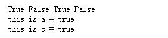  

### 运算符重载

operator模块提供以下的特殊方法，可以将类的实例使用下面的操作符来操作  

#### 1.比较运算符重载

|特殊方法|运算符|含义|
|:----|:-----|:---|
`__lt__(self,other)`|`<`|**小于运算符**等效符调用的对应方法<br/>在`obj1 < obj2`时调用`obj1.__lt__(obj2)`
`__le__(self,other)`|`<=`|**小于等于运算符**等效符调用的对应方法<br/>在`obj1 <= obj2`时调用`obj1.__le__(obj2)`
`__eq__(self,other)`|`==`|**等等运算符**等效调用的对应方法<br/>在`obj1 == obj2`时调用`obj1.__eq__(obj2)`
`__gt__(self,other)`|`>`|**大于运算符**等效调用的对应方法<br/>在`obj1 > obj2`时调用`obj1.__gt__(obj2)`
`__ge__(self,other)`|`>=`|**大于等于运算符**等效调用的对应方法<br/>在`obj1 >= obj2`时调用`obj1.__ge__(obj2)`
`__ne__(self,other)`|`!=`|**不等运算符**等效调用的对应方法<br/>在`obj1 != obj2`时调用`obj1.__ne__(obj2)`

**注意：**  

* 完成小于方法，对应的大于方法可以不用重新也能使用。反之也一样。
* 完成小于等于方法，对应的大于等于方法可以不用重写。反之也一样。
* 简单示例：

````python
class A:
    def __init__(self,age = 18):
        self.age = age

    def __lt__(self,other): #完成小于方法，大于方法也可以使用
        return self.age < other.age

    def __ge__(self,other): #完成大于等于方法，小于等于方法也可以使用
        return self.age >= other.age

    def __eq__(self,other): #完成
        return self.age == other.age

a1 = A()
a2 = A(20)
a3 = A(10)
a4 = A()
print("a1 < a2 ,{}".format( a1 < a2 ))
print("a1 > a2 ,{}".format( a1 > a2 ))
print("a1 >= a2 ,{}".format( a1 >= a2 ))
print("a1 <= a2 ,{}".format( a1 <= a2 ))
print("a1 <= a4 ,{}".format( a1 <= a4 ))
print("a1 == a4 ,{}".format( a1 == a4 ))
````

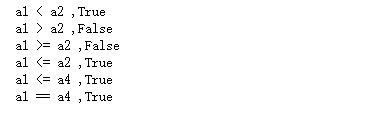  

#### 2.算术运算符重载

|特殊方法|运算符|含义|
|:----|:-----|:---|
`__add__(self,other)`|`+`|**加法运算**等效调用的对应方法<br/>在`obj1 + obj2`时调用`obj1.__add__(obj2)`
`__sub__(self,other)`|`-`|**减法运算**等效调用的对应方法<br/>在`obj1 - obj2`时调用`obj1.__sub__(obj2)`
`__mul__(self,other)`|`*`|**乘法运算**等效调用的对应方法<br/>在`obj1 * obj2`时调用`obj1.__mul__(obj2)`
`__truediv__(self,other)`|`/`|**除法运算**等效调用的对应方法<br/>在`obj1 / obj2`时调用`obj1.__truediv__(obj2)`
`__mod__(self,other)`|`%`|**取摸运算(取余数)**等效调用的对应方法<br/>在`obj1 % obj2`时调用`obj1.__mod__(obj2)`
`__floordiv__(self,other)`|`//`|**整除运算**(向下取整)等效调用的对应方法<br/>在`obj1 // obj2`时调用`obj1.__floordiv__(obj2)`
`__pow__(self,other)`|`**`<br/>pow(x,n)|**次幂运算**等效调用的对应方法。也等价于pow(x,n)方法<br/>在`obj1 ** obj2`时调用`obj1.__pow__(obj2)`
`__divmod__(self,other)`|divmod(obj1,obj2)|**获取数的商和余数组成的元组**等效的对应方法<br/>在`divmod(obj1,obj2)`时调用`obj1.__divmod__(obj2)`
`__matmul__(self,other)`|`@`|**矩阵运算符**等效调用的对应方法<br/>在`obj1 @ obj2`时调用`obj1.__matmul__(obj2)`
`__and__(self,other)`|`&`|**与运算符**等效的对应方法<br/>在`obj1 & obj2`时调用`obj1.__and__(obj2)`
`__or__(self,other)`|`|`|**或运算符**等效的对应方法<br/>在`obj1 | obj2`时调用`obj1.__or__(obj2)`
`__xor__(self,other)`|`^`|**异或运算符**等效的对应方法<br/>在`obj1 ^ obj2`时调用`obj1.__xor__(obj2)`
`__lshift__(self,other)`|`<<`|**左移运算符**等效的对应方法<br/>在`obj1 << obj2`时调用`obj1.__lshift__(obj2)`
`__rshift__(self,other)`|`>>`|**右移运算符**等效的对应方法。<br/>在`obj1 >> obj2`时调用`obj1.__rshift__(obj2)`
`__invert__(self,other)`|`~`|**按位取反运算符**等效的对应方法<br/>在~obj时调用`obj.__invert__()`

* 简单示例：

````python
class A:
    def __init__(self,age=18):
        self.age = age

    def __repr__(self):
        return "(age = {})".format(self.age)

    def __add__(self,other):
        return A(self.age + other.age)

a1 = A(15)
a2 = A(18)
print(a1,a2,a1+a2)
````  

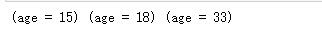  

#### 3.第二参数运算符重载

* 在`obj1 + obj2`中如果obj1不支持`+`操作，那么`obj1.__add__(self,other)`的返回值应该是NotImplemented，此时系统会调用obj2中的`__radd__(self,other)`方法来实现运算。即执行`obj2.__radd__(obj1)`

|特殊方法|运算符|含义|
|:----|:-----|:---|
|||以下示例中。按照`__iadd__`方法来举例：<br/>obj1中必须没有定义对应的方法`__add__`。或者返回值为NotImplemented。才会调用`obj2.__radd__(obj1)`来完成运算|
`__radd__(self,other)`|`+`|**加法运算**等效调用的对应方法<br/>在`obj1 + obj2`时调用`obj2.__radd__(obj1)`
`__rsub__(self,other)`|`-`|**减法运算**等效调用的对应方法<br/>在`obj1 - obj2`时调用`obj2.__rsub__(obj1)`
`__rmul__(self,other)`|`*`|**乘法运算**等效调用的对应方法<br/>在`obj1 * obj2`时调用`obj2.__rmul__(obj1)`
`__rtruediv__(self,other)`|`/`|**除法运算**等效调用的对应方法<br/>在`obj1 / obj2`时调用`obj2.__rtruediv__(obj1)`
`__rmod__(self,other)`|`%`|**取摸运算(取余数)**等效调用的对应方法<br/>在`obj1 % obj2`时调用`obj2.__rmod__(obj1)`
`__rfloordiv__(self,other)`|`//`|**整除运算**(向下取整)等效调用的对应方法<br/>在`obj1 // obj2`时调用`obj2.__rfloordiv__(obj1)`
`__rpow__(self,other)`|`**`<br/>pow(x,n)|**次幂运算**等效调用的对应方法。也等价于pow(x,n)方法<br/>在`obj1 ** obj2`时调用`obj2.__rpow__(obj1)`
`__rdivmod__(self,other)`|divmod(obj1,obj2)|**获取数的商和余数组成的元组**等效的对应方法<br/>如果obj1没有`__divmod__`方法，或者返回NotImplemented，则会调用`obj2.__rdivmod__(obj1)`
`__rmatmul__(self,other)`|`@`|**矩阵运算符**等效调用的对应方法<br/>在`obj1 @ obj2`时调用`obj2.__rmatmul__(obj1)`
`__rand__(self,other)`|`&`|**与运算符**等效的对应方法<br/>在`obj1 & obj2`时调用`obj2.__rand__(obj1)`
`__ror__(self,other)`|`|`|**或运算符**等效的对应方法<br/>在`obj1 | obj2`时调用`obj2.__ror__(obj1)`
`__rxor__(self,other)`|`^`|**异或运算符**等效的对应方法<br/>在`obj1 ^ obj2`时调用`obj2.__rxor__(obj1)`
`__rlshift__(self,other)`|`<<`|**左移运算符**等效的对应方法<br/>在`obj1 << obj2`时调用`obj2.__rlshift__(obj1)`
`__rrshift__(self,other)`|`>>`|**右移运算符**等效的对应方法。<br/>在`obj1 >> obj2`时调用`obj2.__rrshift__(obj1)`

* 简单流程运行图：  
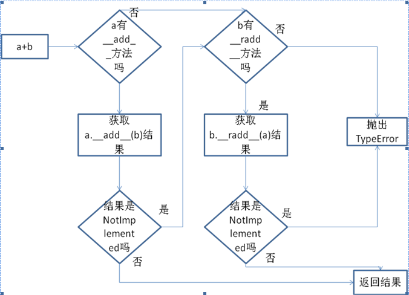  

* 简单示例：  

````python
class A:
    def __init__(self,age=18):
        self.age = age

    def __repr__(self):
        return "(age = {})".format(self.age)

    def __add__(self,other):
        return A(self.age + other.age)

    def __radd__(self,other):
        return A(self.age + other.age)

class B:
    def __init__(self,age= 18):
        self.age = age

    def __repr__(self):
        return "(age = {})".format(self.age)

a = A(10)
b = B(15)
print(a+b)
print(b+a)
````

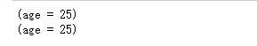  

#### 4.赋值运算符的重载

|特殊方法|运算符|含义|
|:----|:-----|:---|
`__iadd__(self,other)`|`+=`|**加等赋值运算**等效调用的对应方法<br/>在`obj1 += obj2`时调用`obj1 = obj1.__iadd__(obj2)`
`__isub__(self,other)`|`-=`|**减等赋值运算**等效调用的对应方法<br/>在`obj1 -= obj2`时调用`obj1 = obj1.__isub__(obj2)`
`__imul__(self,other)`|`*=`|**乘等赋值运算**等效调用的对应方法<br/>在`obj1 *= obj2`时调用`obj1 = obj1.__imul__(obj2)`
`__itruediv__(self,other)`|`/=`|**除等赋值运算**等效调用的对应方法<br/>在`obj1 /= obj2`时调用`obj1 = obj1.__itruediv__(obj2)`
`__imod__(self,other)`|`%=`|**取模等赋值运算**等效调用的对应方法<br/>在`obj1 %= obj2`时调用`obj1 = obj1.__imod__(obj2)`
`__ifloordiv__(self,other)`|`//=`|**整除等赋值运算符**等效调用的对应方法<br/>在`obj1 //= obj2`时调用`obj1 = obj1.__ifloordiv__(obj2)`
`__ipow__(self,other)`|`**=`|**次幂等运算符**等效调用的对应方法<br/>在`obj1 **= obj2`时调用`obj1 = obj1.__ipow__(obj2)`
`__imatmul__(self,other)`|`@=`|**矩阵等赋值运算**等效调用的对应方法<br/>在`obj1 @= obj2`时调用`obj1 = obj1.__imatmul__(obj2)`
`__iand__(self,other)`|`&=`|**与等赋值运算**等效的对应方法<br/>在`obj1 &= obj2`时调用`obj1 = obj1.__iand__(obj2)`
`__ior__(self,other)`|`|=`|**或等赋值运算**等效的对应方法<br/>在`obj1 |= obj2`时调用`obj1 = obj1.__ior__(obj2)`
`__ixor__(self,other)`|`^=`|**异或等赋值运算**等效的对应方法<br/>在`obj1 ^= obj2`时调用`obj1 = obj1.__ixor__(obj2)`
`__ilshift__(self,other)`|`<<=`|**左移等赋值运算**等效的对应方法<br/>在`obj1 <<= obj2`时调用`obj1 = obj1.__ilshift__(obj2)`
`__irshift__(self,other)`|`>>=`|**右移等赋值运算**等效的对应方法<br/>在`obj1 >>= obj2`时调用`obj1 = obj1.__irshift__(obj2)`

* **注意：**例如：`obj1 += obj2`中，如果obj1**没有**对应的**加法赋值**运算`__iadd__`那么等式会转换成`obj1 = obj1 + obj2`即`obj1 = obj1.__add__(obj2)`，其他赋值也同样适用。
* 简单示例01：  

````python
class A:
    def __init__(self,age=18):
        self.age = age

    def __repr__(self):
        return "(age = {})".format(self.age)

    def __add__(self,other):
        return A(self.age + other.age)

    def __iadd__(self,other):
        self.age = self.age + other.age
        return self

a1 = A(15)
a2 = A(18)
print(a1,a2,a1+a2)
a1 += a2
print(a1)
````

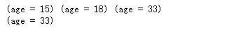  

* 简单示例02：

````python
class A:
    def __init__(self,age=18):
        self.age = age

    def __repr__(self):
        return "(age = {})".format(self.age)

    def __add__(self,other):
        return A(self.age + other.age)

a1 = A(15)
a2 = A(18)
print(a1,a2,a1+a2)
a1 += a2  #如果没有__iadd__方法，会转换成 a1 = a1+a2来调用
print(a1)
````

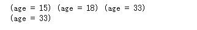  

* 综合示例：完成Point类设计，实现判断点相等的方法，并完成向量的加法
    1. 在直角坐标系里面，定义原点为向量的起点。两个向量和与差的坐标分别等于这两个向量相应坐标的和与差若向量 的表示为(x,y)形式。  
    2. `A(X1,Y1) B(X2,Y2)，则A+B=（X1+X2，Y1+Y2），A-B=（X1-X2，Y1-Y2）`  

````python
class Point:
    def __init__(self,x:int,y:int):
        self.x = x
        self.y = y

    def __add__(self,other):
        return Point(self.x+other.x,self.y+other.y)

    # def __iadd__(self,other):
    #     self.x += other.x
    #     self.y += other.y
    #     return self

    def __sub__(self,other):
        return Point(self.x-other.x,self.y-other.y)

    # def __isub__(self,other):
    #     self.x -= other.x
    #     self.y -= other.y
    #     return self

    def __repr__(self):
        return "<Point {},{}>".format(self.x,self.y)

p1 = Point(5,6)
p2 = Point(1,2)
print(p1+p2,p1-p2)
p1-=p2
print(p1)
````  

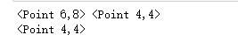  

#### 运算符重载的应用场景

往往是用面向对象实现的类，需要做大量的运算，而运算符是这种运算在数学上最常见的表达方式。例如，上例中 的对+进行了运算符重载，实现了Point类的二元操作，重新定义为Point + Point。提供运算符重载，比直接提供加法方法要更加适合该领域内使用者的习惯。  
int类，几乎实现了所有操作符，可以作为参考。  

#### functools.total_ordering装饰器
`__lt__ , __le__ , __eq__ , __gt__ , __ge__` 是比较大小必须实现的方法，但是全部写完太麻烦，使用 @functools.total_ordering 装饰器就可以大大简化代码。  
但是要求 `__eq__` 必须实现，其它方法 `__lt__ , __le__ , __gt__ , __ge__`  实现其一

````python
from functools import total_ordering

@total_ordering
class Person:
    def __init__(self,name,age):
        self.name = name
        self.age = age
        
    def __eq__(self,other):
        return self.age == other.age
    
    def __gt__(self,other):
        return self.age > other.age
    
tom = Person("tom",20)
jerry = Person("jerry",16)
print(tom > jerry)
print(tom < jerry)
print(tom >= jerry)
print(tom <= jerry)
````

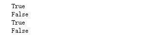  

上例中大大简化代码，但是一般来说比较实现等于或者小于方法也就够了，其它可以不实现，所以这个装饰器只是 看着很美好，且可能会带来性能问题，建议需要什么方法就自己创建，少用这个装饰器。  

````python
class Person:
    def __init__(self,name,age):
        self.name = name
        self.age = age
        
    def __eq__(self,other):
        return self.age == other.age
    
    def __gt__(self,other):
        return self.age >other.age
    
    def __ge__(self,other):
        return self.age >= other.age
    
tom = Person("tom",20)
jerry = Person("jerry",16)
print(tom > jerry)
print(tom < jerry)
print(tom >= jerry)
print(tom <= jerry)
print(tom == jerry)
print(tom != jerry)
````

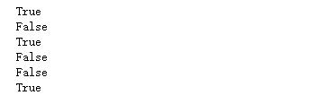  

* `__eq__`等于可以推断不等于
* `__gt__`大于可以推断小于
* `__ge__`大于等于可以推断小于等于  
也就是用3个方法，就可以把所有比较解决了。

### 容器相关方法

|方法|对应的操作|意义|
|:---|:------------|:-----|
`__len__(self)`|len(obj)|内建函数len()，返回对象的长度(>=0的整数)，如果把对象当做容器类型看，就如同list或者dict。<br/>bool()函数调用的时候，如果没有`__bool__()`方法，则会看`__len__()`方法是否存在，存在返回非0为真。
`__iter__(self)`|`for i in obj`|迭代容器时，调用，返回一个**新的可迭代对象**
`__contains__(self,item)`|`x in obj`|in 成员运算符，没有实现，就默认调用`__iter__`方法遍历
`__getitem__(self,key)`|`obj[key]`|实现self[key]访问。序列对象，key接受整数为索引，或者切片。对于set和dict,key为可以hashable(即可哈希)。key不存在引发KeyError异常
`__setitem__(self,key)`|`obj[key] = value`|和`__getitem__`的访问类似，是设置值的方法
`__missing__(self,key)`||字典或其子类使用`__getitem__()`调用时，key不存在执行该方法

* `__missing__(self,key)`例子：

````python
class A(dict):
    def __missing__(self,key):
        print("键值对不存在。。{}".format(key))
        return 0

a = A()
a["a"] = 10
print(a["a"])
print(a["b"])
````

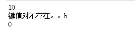  

* 简单综合示例：不使用继承，实现一个容器

````python
class Goods:
    def __init__(self,name):
        self.name = name

    def __repr__(self):
        return "<Goods name = {}>".format(self.name)

class Cart:

    def __init__(self):
        self.__goods = list()

    def __len__(self):
        return len(self.__goods)

    def add(self,good:Goods):
        self.__goods.append(good)

    def __add__(self, other):
        self.add(other)
        return self

    def __iter__(self):
        # yield from self.__goods
        return iter(self.__goods)

    def __getitem__(self, item):
        return self.__goods[item]

    def __setitem__(self, key, value):
        self.__goods[key] = value

    def __repr__(self):
        return str(self.__goods)

gd = Goods("棒棒糖")
gd2 = Goods("宫保鸡丁")
cat = Cart() + gd + gd2
cat.add(Goods("火爆鸡精"))
print(cat)
````  

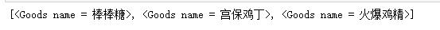  

### 可调用对象

Python中一切皆对象，函数也不例外。

````python
def foo():
    print(foo.__module__,foo.__name__)

foo()
#等价于
foo.__call__()
````

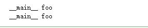  

函数即对象，对象foo加上()，就是调用此函数对象的 `__call__()` 方法

|方法|等效|意义|
|:----|:-----|:-----|
`__call__(self)`|obj()|类中定义一个该方法，**类的实例**就可以像函数一样调用

* 示例1：可调用对象，定义一个类，并实例化得到其实例，将实例像函数一样调用。

````python
class Adder:
    def __call__(self,*args):
        self.sum = sum(args)
        return self.sum

adder = Adder()
print(adder(4,5,6,3,2))
print(adder.sum)
````

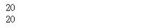  

* 示例2:定义一个斐波拉契数列，方便调用，计算第n项。
    1. 增加迭代的方法、返回容器长度、支持索引的方法。

````python
class Xdd_Fib:
    """
    斐波拉契数列类，获取第num个位置的斐波拉契数列。
    """
    def __init__(self):
        self.fib = [0,1,1]

    def __len__(self):
        return len(self.fib)

    #类的实例可调用
    def __call__(self,num:int):
        if not isinstance(num,int):
            raise TypeError("num必须是int类型")
        if num<0:
            raise KeyError("选项错误，必须大于0")
        elif num<3:
            return self.fib[num]
        else:
            for i in range(len(self),num + 1):
                self.fib.append(self.fib[i-1]+self.fib[i-2])
        return self.fib[num]

    #类可迭代
    def __iter__(self):
        return iter(self.fib)

    def __repr__(self):
        return ",".join(map(str,self.fib))

    __str__ = __repr__
    __getitem__ = __call__ #类可以像数组一样访问

fib = Xdd_Fib()
print(fib(5),fib(6),fib(8))
print(fib)
````

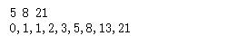  


