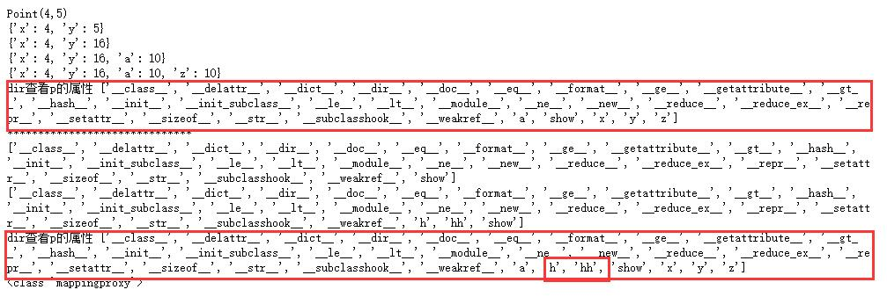
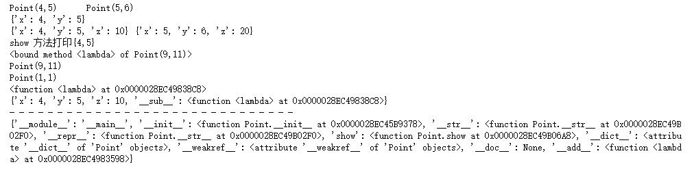

@[toc]

# 类的魔术方法之--反射

## 概述

运行时，区别于编译时，指的是程序被加载到内存中执行的时候。  
反射，reflection，指的是运行时获取类型定义信息。  
一个对象能够在运行时，像照镜子一样，反射出其类型信息。  
简单说，在Python中，能够通过一个对象，找出其type、class、attribute或method的能力，称为反射或者自 省。  
具有反射能力的函数有 type()、isinstance()、callable()、dir()、getattr()等  

示例：为类动态添加属性：

````python
class Point:
    def __init__(self,x,y):
        self.x = x
        self.y = y

    def __str__(self):
        return "Point({},{})".format(self.x,self.y)

    __repr__ = __str__

    def show(self):
        print(self.x,self.y)

p = Point(4,5)
print(p)
print(p.__dict__)
p.__dict__["y"] = 16  #为对象动态修改属性值
print(p.__dict__)
p.__dict__["a"] = 10  #为对象动态添加属性值
print(p.__dict__)
p.z = 10  #为对象动态增加属性
print(p.__dict__)
print("dir查看p的属性",dir(p))
print("******************************")
print(dir(Point))
# Point.__dict__["h"] = 100 #报错出现TypeError异常。type(Point.__dict__) = mappingproxy
setattr(Point,"h",100) #动态为类对象添加属性
Point.hh = 100  #动态为类对象添加属性
print(dir(Point))
print("dir查看p的属性",dir(p))
print(type(Point.__dict__))
````

  
上例通过属性字典__dict__来访问对象的属性，本质上也是利用的反射的能力。  
但是，上面的例子中，访问的方式不优雅，Python提供了内置的函数。

## 与反射相关的内建函数

|内建函数|意义|
|:-----|:---|
getattr(object,name[,default])|通过name返回object的属性值。当属性不存在，将使用default返回，如果没有default，则会抛出AttributeError异常。name必须为字符串  
setattr(object,name,value)|object的属性存在，则覆盖，不存在，新增  
hasattr(object,name)|判断对象是否有这个名字的属性，name必须为字符串  

* 简单演示：

````python
class Point:
    def __init__(self,x,y):
        self.x = x
        self.y = y

    def __str__(self):
        return "Point({},{})".format(self.x,self.y)

    __repr__ = __str__

    def show(self):
        print("show 方法打印{{{},{}}}".format(self.x,self.y))

p1 = Point(4,5)
p2 = Point(5,6)
print(p1,p2,sep="\t")
print(p1.__dict__)
#添加属性
setattr(p1,"z",10)
setattr(p2,"z",20)
print(getattr(p1,"__dict__"),p2.__dict__)

# 动态调用方法
if hasattr(p1,"show"):
    getattr(p1,"show")()

#动态为类增加方法
if not hasattr(Point,"__add__"):
    setattr(Point,"__add__",lambda self,other: Point(self.x + other.x,self.y + other.y))

p3 = p1 + p2  #等价于 p3 = p1.__add__(p2) 绑定
print(p3.__add__) #b绑定
print(p3)

#动态为实例增加方法  未绑定
if not hasattr(p1,"__sub__"):
    setattr(p1,"__sub__",lambda self,other:Point(self.x - other.x,self.y - other.y))

print(p1.__sub__(p2,p1))
print(p1.__sub__)


#__sub__在实例里面
print(p1.__dict__)
print("- "*30)
#__add__在类里面
print(Point.__dict__)
````

  

* 动态增加属性的方式和装饰器修饰一个类、Mixin方式的差异：
    1. 动态增加属性的方式是运行时改变类或者示例的方式。
    2. 装饰器或mixin都是定义时就决定了。
    3. 总结：**反射能力具有更大的灵活性**

## 反射相关的魔术方法

|方法|对应的内建函数|意义|
|:---|:-----|:------|
`__getattr__(self,item)`|`getattr(object,name[,default])`|当通过搜索实例、实例的类及祖先类**查不到**属性，就会调用此方法
`__setattr_(slef,key,values)`|`setattr(object,name,value)`|通过，访问实例属性，进行增加、修改都要调用它
`__delattr__(self,item)`|`del obj.k`|当通过实例来删除属性时调用此方法
`__getattribute__()`|`hasattr(object,name)`|实例所有的属性调用都从这个方法开始

* **属性查找顺序**
    1. `实例调用__getattribute__()` --> `instance.__dict__` --> `instance.__class__.__dict__` --> 继承的祖先类（直到 object）的`__dict__` --> 调用`__getattr__()`

### getattr方法

````python

````
