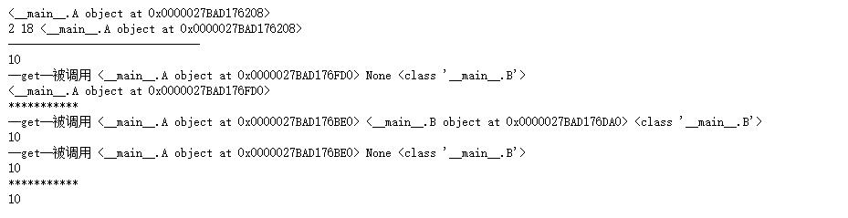
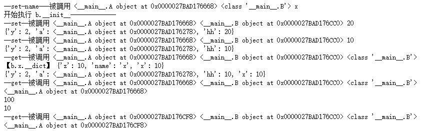
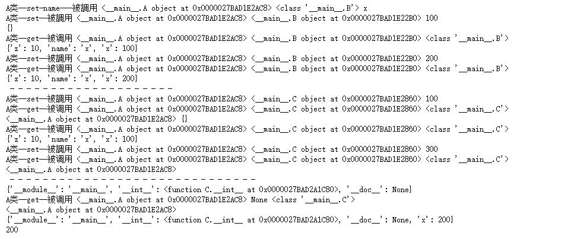
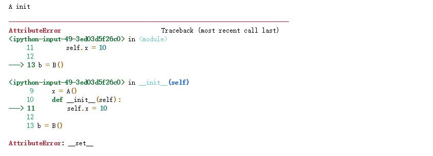
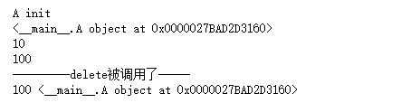
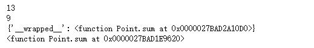

@[toc]

# 类与描述器(Descriptors)

## 描述器的表现

|魔术方法|说明|
|:-----|:----|
`__get__(self,instance,owner)`| 获取所有者类的属性，定义了该函数，那么该类就是一个"非数据描述器"
`__set__(self,instance,value)`|设置所有者类的属性，如果一个"非数据描述器"定义了该函数，那么就是"数据描述器"
`__delete__(self,instance)`|删除所有者类的属性

1. 参数介绍：
    * self指代当前类的实例，调用者
    * instance是个实例，是owner的实例
    * owner是属性的所属的类

## 描述器

* 在类中只要定义了`__get__,__set__,__delete__`三个方法之一，那么该类就是一个**描述器**
    1. 实现了`__get__`，就是**非数据描述器non-data descriptor**
    2. 实现了`__get__,__set__`就是**数据描述器 data descriptor**
    3. 实现了`__get__,__delete__`方法，也是**数据描述器**
    4. 实现了`__get__,__set__,__delete`方法，同样也是**数据描述器**
* 如果一个类的**类属性**设置为描述器示例，那么它被称为owner**属主**
* 当该类的类属性被查找、设置、删除时，就会调用描述器相应的方法。  

注意：  

1. 当一个类的**类属性**被描述器**描述**那么在该类，或该类的实例访**描述器或描述器的属性**时，一定会通过`__get__`方法。而该类的类属性的值取决于**描述器中`__get__`方法的返回值**
2. 非数据描述器**不会改变**属性的访问顺序
3. 数据描述器**会改变**属性的访问顺序。会**优先访问**数据描述器描述的属性。
4. **实例化对象在访问父类属性时，继承体系的优先级，高于"数据描述器"修饰的属性的优先级。**
    * 数据描述器无法改变继承体系中属性访问的优先级，只能改变实例化属性访问的优先级。如果实例化对象访问的属性被父类拦截，其祖先类中被“数据描述器”修饰的属性优先级会被最近父类的属性拦截。

### 非数据描述器

* 如果类中的**类属性**被一个**非数据描述器**描述，那么改类的**类属性**值取决于**非数据描述器**中的`__get__`方法的返回值。
* **非数据描述器不会改变属性的访问顺序**

1. 简单示例：  

````python
class A:
    def __init__(self):
        self.z = 10

    def __get__(self, instance, owner):
        print("--get--被调用",self, instance, owner)
        return self  #如果是None，或其他值，那么b.x或B.x的返回值就是None或其他值。

class B:
    x = A()
    y = 10
    z = A()

    def __init__(self):
        self.y = 2
        self.a = A()
        self.z = 18

b = B()
print(b.a)
print(b.y,b.z,b.a)
print("------------------------------")
print(b.a.z)  #不会调用A中的__get__
print(b.__class__.z)  #可以看到instance值为None,因为不是B的实例调用
print("***********")
print(b.x.z)  #会调用A中的__get__
print(B.x.z)  #会调用A中的__get__
print("***********")
B.x = 10
print(b.x)
````

  

* 上面示例可以看出：`__get__(self,instance,owner)`方法的签名，会传入3个参数  
    1. B.x调用时，self表示A的实例，instance为None,owner为B类
    2. b.x调用时，self表示A的实例，instance为B的实例b,owner为B类

### 数据描述器

#### 带`__set__`的数据描述器

* 实现了`__get__,__set__`就是**数据描述器 data descriptor**
* 数据描述器**会改变**属性的访问顺序。会**优先访问**数据描述器描述的属性。
* 3.6新增描述器方法`__set_name__(self,owner,name)`,它在属主类构建的时候会调用。（**注意：目前动态的为属主owner类使用setattr注入类属性时，不会调用(本人怀疑可以能是bug)**）
* 实现了`__get__,__delete__`方法，也是**数据描述器**

* 简单示例：  

````python
class A:
    def __init__(self):
        self.z = 10

    def __get__(self, instance, owner):
        print("--get--被调用",self, instance, owner)
        return self

    def __set_name__(self, owner, name):
        print("--set-name---被調用",self,owner,name)
        self.name = name

    def __set__(self, instance, value):
        print("--set--被調用",self,instance,value)
        self.__dict__[self.name] = value
        instance.__dict__["hh"] = value #会在实例属性中添加x属性

class B:
    x = A()
    y = 10

    def __init__(self):
        print("开始执行 b.__init__-------------")
        self.y = 2
        self.a = A()
        self.x = 20 #因为类属性中有x，是数据描述器，所有会优先访问数据描述器，即访问B.x的值。会调用__set__

b = B()
print(b.__dict__) #可以看到b的x属性并未写入字典，而是被set拦截
setattr(b,"x",10) #动态写入，依然会调用__set__，因为x属性是“数据描述器”
print(b.__dict__)
print("【b.x.__dict】",b.x.__dict__)
b.__dict__["x"] = 10 #b属性写入成功
print(b.__dict__)
print(b.x)  #依然访问的是类属性x，而不是实例对象b的属性x,证明“数据描述器”访问优先级高
B.x = 100 #修改类属性x使其不是数据描述器，而是普通属性
print(B.x)
print(b.x) #可以访问到自己的属性了
B.x = A() #再次修改使其是"数据描述器"
print(b.x) #又无法访问自己的属性，而被迫优先访问数据描述器
````

  

* 可以看到，当B类中的类属性被"数据描述器A"修饰时，即使B实例b强行为自己的属性添加和(被“数据描述器”修饰)的同名属性。后再访问同名属性，依然被“被数据描述器”修饰的属性优先级高。
* 即数据描述器会改变实例的属性查找顺序。数据描述器示修饰的属性优先级高。

* **实例化对象在访问父类属性时，继承体系的优先级，高于"数据描述器"修饰的属性的优先级。**

简单示例：  

````python
class A:
    def __init__(self):
        self.z = 10

    def __get__(self, instance, owner):
        print("A类--get--被调用",self, instance, owner)
        return self

    def __set_name__(self, owner, name):
        print("A类--set-name---被調用",self,owner,name)
        self.name = name

    def __set__(self, instance, value):
        print("A类--set--被調用",self,instance,value)
        self.__dict__[self.name] = value

class B:
    x = A()
    def __init__(self):
        self.x = 100

class C(B):
#     x = "abc"
    def __int__(self):
        self.x = 10

b = B()
print(b.__dict__)
print(b.x.__dict__)
b.x = 200
print(b.x.__dict__)

print(" -"*20)
c = C()
print(c.x,c.__dict__)
print(c.x.__dict__)
c.x = 300  #继承体系中x被"数据描述器"修饰，所以会访问数据描述器的__set__方法
print(c.x)

print(" -"*30)
print(C.__dict__)
print(C.x) 
C.x = 200
print(C.__dict__)
print(c.x) #可以看到数据描述器对类属性的修改无法阻止。可以修改，在继承体系中无法阻断父类的属性优先级。
````

  

* 在上面例子中可以看出，当B类的属性x被描述符修饰，其子类C继承了B类，C类的实例化对象c修改和访问x时，依然会被描述符中的方法拦截，而当c的父类C中添加一个普通属性x后，会阻断描述符的访问。
* **数据描述器无法改变继承体系中属性访问的优先级**，只能改变实例化属性访问的优先级。如果实例化对象访问的属性被父类拦截，其祖先类中被“数据描述器”修饰的属性优先级会被最近父类的属性拦截。

#### 带`__delete__`的数据描述器

* 只带`__delete__`的数据描述器，如果实例对象创建同名属性，会提示没有`__set__`方法。
* 只有通过`del obj.x`删除"描述器"时才会触发`__delete__`方法。，如果`__delete__`方法中实现了删除属性，那么会真的删除，否则不会。
    1. 通过`del Class.x`时不会触发
    2. 通过`class.x = value`修改值时也不会触发

* 示例1

````python
class A:
    def __init__(self):
        print("A init")

    def __delete__(self,instance):
        print("---------delete被调用了-----")

class B:
    x = A()
    def __init__(self):
        self.x = 10

b = B()
````

  

* 示例2

````python
class A:
    def __init__(self):
        self.a = 10
        print("A init")

    def __delete__(self,instance):
        print("---------delete被调用了-----")

class B:
    x = A()
    def __init__(self):
        pass
#         self.x = 10

b = B()
print(b.x)
print(b.x.a)
b.x.a = 100
print(b.x.a)
del b.x  #删除b.x描述器，会调用__delete__方法，如果方法中未实现删除属性，那么属性将不会被删除。
print(b.x.a,b.x)
# del B.x  #会直接删除类属性，无法触发__delete__
# B.x = 200  #会直接修改类属性值，无法触发__delete__
# print(b.x)
````

  

## Python中常见的描述器类

描述器在Python中应用非常广泛。  
Python的方法(包括staticmethod和classmethod)都实现为非数据描述器。因此，实例可以重新定义和覆盖方法。这允许单个实例获取与同一类的其他实例不同的行为。

### 练习

* 实现StaticMethod装饰器，完成staticmethod装饰器的功能

````python
class StaticMethod:
    def __init__(self,fn):
        self.fn = fn

    def __get__(self, instance, owner):
        return self.fn

class Point:
    def __init__(self):
        self.x = 10
        self.y = 20

    @StaticMethod
    def sum(x,y):
        return x+y

p = Point()
print(p.sum(4,9))
print(p.sum.__name__)
````

  

* 实现ClassMethod装饰器，完成classmethod装饰器的功能  

````python
import functools
class ClassMethod:
    def __init__(self,fn):
        self.fn = fn

    def __get__(self, instance, owner):
        def _fn(*args,**kwargs):
            return self.fn(owner,*args,**kwargs)
        functools.update_wrapper(_fn,self.fn)
        # return functools.partial(self.fn,owner) #也可以使用偏函数
        return _fn

class Point:
    def __init__(self):
        self.x = 10
        self.y = 20

    @ClassMethod
    def sum(cls,x,y):
        return x+y

p = Point()
print(p.sum(4,9))
print(Point.sum(4,5))
print(p.sum.__dict__)
print(Point.sum)
````

  