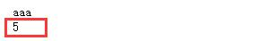
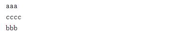
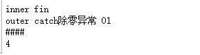

@[toc]

# Python中的异常处理

## 异常Exception

* 错误Error
    1. **逻辑错误**：算法写错了，例如加法写成了减法  
    2. **笔误**：例如变量名写错了，语法错误  
    3. **函数或类使用错误**，其实这也属于逻辑错误  
总之，错误是可以避免的  
* 异常 Exception
本意就是意外情况  
这有个前提，没有出现上面说的错误，也就是说程序写的没有问题，但是在某些情况下，会出现一些意外，导致程 序无法正常的执行下去。  
例如open函数操作一个文件，文件不存在，或者创建一个文件时已经存在了，或者访问一个网络文件，突然断网 了，这就是异常，是个意外的情况。  
异常不可能避免  
* 错误和异常
    1. 在高级编程语言中，一般都有错误和异常的概念，异常是可以捕获，并被处理的，但是错误是不能被捕获的。  
    2. 一个健壮的程序应尽可能的避免错误，尽可能的捕获、处理各种异常。

## 产生异常

产生：  

* raise 语句显示的抛出异常
* Python解释器自己检测到异常并引发它  

````python
def foo():
    print("before")
    print(1/0) #除零异常
    print("after")

foo()

def bar():
    print("before")
    raise Exception("my exception") #使用raise主动抛出异常
    print("after")

bar()
````  

程序会在异常抛出的地方中断执行，如果不捕获，就会提前结束程序（其实是终止当前线程的执行）  

## 异常的捕获

* 语法：  

````python
try:
    <语句>   # 带捕获异常的代码块
except <异常类型>:
    <语句>  #异常的处理代码块
except <异常类型> as <变量名>:
    <语句>  #异常的处理代码块
except:
    <语句>  #异常的处理代码块
else:
    <语句>  #如果没有异常发生，执行的代码
finally:
    <语句>  #退出try时总会执行
````

* **try的工作原理**
    1. 如果try中语句执行时发生异常，搜索except子句，并执行第一个匹配该异常的except子句  
        * 捕获原则：**从小到大，从具体到宽泛**
        * 捕获是从上到下依次比较，如果匹配，则执行匹配的except语句块  
        * 如果被一个except语句捕获，其他except语句就不会再次捕获了
        * 如果没有任何一个except语句捕获到这个异常，则该异常向外抛出
    2. 如果try中语句执行时发生异常，却没有匹配的except子句，异常将被递交到外层的try，如果外层不处理这个异 常，异常将继续向外层传递。如果都不处理该异常，则会传递到最外层，如果还没有处理，就终止异常所在的线程
    3. 如果在try执行时没有发生异常，如有else子句，会执行else子句中的语句  
    4. 无论try中是否发生异常，finally子句最终都会执行  

* **as语句**：声明一个名称指向被捕获的异常对象
* **raise语句**
    1. raise后要求应该是BaseException类的**子类或实例**，**如果是类，将被无参实例化**。  
    2. **raise后什么都没有，表示抛出最近一个被激活的异常，如果没有被激活的异常，则抛类型异常**。这种方式很少用
* **els子句**：没有任何异常发生，则执行。
* **finally语句**
    1. 最终，即最后一定要执行的，try...finally语句块中，不管是否发生了异常，都要执行finally的部分  
    2. finally中一般放置资源的清理、释放工作的语句  
* **异常中的return语句**
    1. 示例：

    ````python
    def foo():
        # return 1
        try:
            return 3
        finally:
            print("aaa")
            return 5
        print("-=-===")
    print(foo())
    ````  

      
    进入try，执行return 3，虽然函数要返回，但是finally一定还要执行，所以执行return 5，函数返回。5被压在栈 顶，所以返回5。简单说，**函数的返回值取决于最后一个执行的return语句**，而finally则是try...finally中最后执行的 语句块。  

## BaseException及子类

* BaseException是所有内建异常类的基类(父类)。
* SystemExit
    1. sys.exit()函数引发的异常，异常不捕获处理，就直接交给Python解释器，解释器退出

    ````python
    import sys
    try:
        sys.exit(1) #触发系统异常， 
    except SystemExit as s: #Exception无法捕获SystemExit异常,BaseException可以捕获
        print("SysExit",s)
    print("outer")
    ````  

    如果except语句捕获了该异常，则继续向后面执行，如果没有捕获住该异常SystemExit，解释器直接退出程序。

* 常用的异常：  
    1. KeyboardInterrupt 对应的捕获用户中断行为Ctrl + C
    2. Exception及子类：Exception是所有内建的、非系统退出的异常的基类，自定义异常类应该继承自它
    3. SyntaxError 语法错误。Python将这种错误也归到异常类下面的Exception下的子类，但是这种错误是不可捕获的  
    4. ArithmeticError 所有算术计算引发的异常，其子类有除零异常等
    5. LookupError 使用映射的键或序列的索引无效时引发的异常的基类：IndexError, KeyError  

## 自定义异常类

* 自定义异常需要继承Exception类或者Exception的子类。

* 示例：  

````python
class MyException(Exception):
    pass

try:
    raise MyException()  #抛出一个自定义异常
except MyException as mye: #捕获自定义异常
    print("自定义异常",mye)
````

## 异常的传递与try嵌套  

1. 异常总是向外层抛出，如果外层没有处理这个异常，就会继续向外抛出  
2. 如果内层捕获并处理了异常，外部就不能捕获到了  
3. 如果到了最外层还是没有被处理，就会中断异常所在的线程的执行。注意整个程序结束的状态返回值。

* 示例1：异常的传递

````python
def fun():
    try:
        1 / 0
    except ZeroDivisionError as e:
        raise KeyError
    finally:
        print("aaa")

try:
    fun()
except KeyError:
    print("cccc")
finally:
    print("bbb")
````  

  

函数fun中触发了除零异常，而在处理除零异常时，又触发了keyError异常。最终被捕获。  

* 示例2：try的嵌套

````python
def fun():
    try:
        try:
            re = 1 / 0  #除零异常 01
        except KeyError as e:
            print(e)
        finally:
            print("inner fin")
    except:
        print("outer catch除零异常 01")  #能捕获内部异常，所以能打印
    finally:
        try:
            try:
                re = 1 / 0  #除零异常 02  
            finally:
                print("####")
                return 4  #由于有return 所以除【零异常02】不会继续向外抛出
        except:
            print("零异常02....")  #异常被屏蔽，无法打印
        print("outer fin")

print(fun())
````  

  

1. 内部捕获不到异常，会向外层传递异常  
2. 但是如果内层有finally且其中有return，break语句，则异常就不会继续向外抛出
    * 注意：官方文档3.7.1中提到，continue语句目前不支持阻止异常传递，但后来会提供。
    * break阻止异常的简单示例：

    ````python
    try:
        for i in range(10):
            try:
                1/0
            except:
                print("异常被捕获001")
                raise
            finally:
                print("内层try结束")
                break
    except:
        print("捕获到异常")
    finally:
        print("执行完成")
    print("我被执行了")
    ````  

      

## 异常的捕获时机

* 立即捕获：需要立即返回一个明确的结果  

````python
def parse_int(s):
    try:
        return int(s)
    except:
        return 0
print(parse_int("s"))
````  

* 边界捕获  
    1. 封装产生了边界。  
    2. 例如，写了一个模块，用户调用这个模块的时候捕获异常，模块内部不需要捕获、处理异常，一旦内部处理了，外 部调用者就无法感知了。  
    3. 例如，open函数，出现的异常交给调用者处理，文件存在了，就不用再创建了，看是否修改还是删除  
    4. 例如，自己写了一个类，使用了open函数，但是出现了异常不知道如何处理，就继续向外层抛出，一般来说最外 层也是边界，必须处理这个异常了，否则线程退出  

## 附加：BaseException继承体系：

* 扩展，树装打印类的继承关系

````python
def showTree(cls:type, n:int=0):
    """树结构查看子类"""
    temp = "" if n < 2 else "   " + "|   " * (n - 2)
    print(temp + "+--" if n else temp, cls.__name__, sep=" " if n else "")
    for name in cls.__subclasses__():
        showTree(name, n + 1)
#递归打印BaseException的结构
showTree(BaseException)
````  

````text
BaseException
+-- Exception
   +-- TypeError
   |   +-- MultipartConversionError
   |   +-- FloatOperation
   +-- StopAsyncIteration
   +-- StopIteration
   +-- ImportError
   |   +-- ModuleNotFoundError
   |   +-- ZipImportError
   +-- OSError
   |   +-- ConnectionError
   |   |   +-- BrokenPipeError
   |   |   +-- ConnectionAbortedError
   |   |   +-- ConnectionRefusedError
   |   |   +-- ConnectionResetError
   |   |   |   +-- RemoteDisconnected
   |   +-- BlockingIOError
   |   +-- ChildProcessError
   |   +-- FileExistsError
   |   +-- FileNotFoundError
   |   +-- IsADirectoryError
   |   +-- NotADirectoryError
   |   +-- InterruptedError
   |   |   +-- InterruptedSystemCall
   |   +-- PermissionError
   |   +-- ProcessLookupError
   |   +-- TimeoutError
   |   +-- UnsupportedOperation
   |   +-- Error
   |   |   +-- SameFileError
   |   +-- SpecialFileError
   |   +-- ExecError
   |   +-- ReadError
   |   +-- herror
   |   +-- gaierror
   |   +-- timeout
   |   +-- SSLError
   |   |   +-- SSLCertVerificationError
   |   |   +-- SSLZeroReturnError
   |   |   +-- SSLWantReadError
   |   |   +-- SSLWantWriteError
   |   |   +-- SSLSyscallError
   |   |   +-- SSLEOFError
   |   +-- URLError
   |   |   +-- HTTPError
   |   |   +-- ContentTooShortError
   +-- EOFError
   |   +-- IncompleteReadError
   +-- RuntimeError
   |   +-- RecursionError
   |   +-- NotImplementedError
   |   |   +-- StdinNotImplementedError
   |   |   +-- ZMQVersionError
   |   +-- _DeadlockError
   |   +-- BrokenBarrierError
   |   +-- BrokenExecutor
   |   |   +-- BrokenThreadPool
   |   +-- SendfileNotAvailableError
   +-- NameError
   |   +-- UnboundLocalError
   +-- AttributeError
   +-- SyntaxError
   |   +-- IndentationError
   |   |   +-- TabError
   +-- LookupError
   |   +-- IndexError
   |   +-- KeyError
   |   |   +-- UnknownBackend
   |   |   +-- NoSuchKernel
   |   +-- CodecRegistryError
   |   +-- NotInStdLib
   +-- ValueError
   |   +-- UnicodeError
   |   |   +-- UnicodeEncodeError
   |   |   +-- UnicodeDecodeError
   |   |   +-- UnicodeTranslateError
   |   +-- UnsupportedOperation
   |   +-- JSONDecodeError
   |   +-- ClassNotFound
   |   +-- Error
   |   +-- SSLCertVerificationError
   |   +-- ClipboardEmpty
   |   +-- MessageDefect
   |   |   +-- NoBoundaryInMultipartDefect
   |   |   +-- StartBoundaryNotFoundDefect
   |   |   +-- CloseBoundaryNotFoundDefect
   |   |   +-- FirstHeaderLineIsContinuationDefect
   |   |   +-- MisplacedEnvelopeHeaderDefect
   |   |   +-- MissingHeaderBodySeparatorDefect
   |   |   +-- MultipartInvariantViolationDefect
   |   |   +-- InvalidMultipartContentTransferEncodingDefect
   |   |   +-- UndecodableBytesDefect
   |   |   +-- InvalidBase64PaddingDefect
   |   |   +-- InvalidBase64CharactersDefect
   |   |   +-- InvalidBase64LengthDefect
   |   |   +-- HeaderDefect
   |   |   |   +-- InvalidHeaderDefect
   |   |   |   +-- HeaderMissingRequiredValue
   |   |   |   +-- NonPrintableDefect
   |   |   |   +-- ObsoleteHeaderDefect
   |   |   |   +-- NonASCIILocalPartDefect
   |   +-- IllegalMonthError
   |   +-- IllegalWeekdayError
   |   +-- MacroToEdit
   +-- AssertionError
   +-- ArithmeticError
   |   +-- FloatingPointError
   |   +-- OverflowError
   |   +-- ZeroDivisionError
   |   |   +-- DivisionByZero
   |   |   +-- DivisionUndefined
   |   +-- DecimalException
   |   |   +-- Clamped
   |   |   +-- Rounded
   |   |   |   +-- Underflow
   |   |   |   +-- Overflow
   |   |   +-- Inexact
   |   |   |   +-- Underflow
   |   |   |   +-- Overflow
   |   |   +-- Subnormal
   |   |   |   +-- Underflow
   |   |   +-- DivisionByZero
   |   |   +-- FloatOperation
   |   |   +-- InvalidOperation
   |   |   |   +-- ConversionSyntax
   |   |   |   +-- DivisionImpossible
   |   |   |   +-- DivisionUndefined
   |   |   |   +-- InvalidContext
   +-- SystemError
   |   +-- CodecRegistryError
   +-- ReferenceError
   +-- MemoryError
   +-- BufferError
   +-- Warning
   |   +-- UserWarning
   |   |   +-- GetPassWarning
   |   |   +-- FormatterWarning
   |   +-- DeprecationWarning
   |   |   +-- ProvisionalWarning
   |   +-- PendingDeprecationWarning
   |   +-- SyntaxWarning
   |   +-- RuntimeWarning
   |   |   +-- UnknownTimezoneWarning
   |   +-- FutureWarning
   |   |   +-- ProvisionalCompleterWarning
   |   +-- ImportWarning
   |   +-- UnicodeWarning
   |   +-- BytesWarning
   |   +-- ResourceWarning
   |   +-- DeprecatedTzFormatWarning
   +-- Error
   +-- _OptionError
   +-- _Error
   +-- error
   +-- Verbose
   +-- SubprocessError
   |   +-- CalledProcessError
   |   +-- TimeoutExpired
   +-- TokenError
   +-- StopTokenizing
   +-- Error
   +-- error
   +-- LZMAError
   +-- RegistryError
   +-- EndOfBlock
   +-- error
   +-- TraitError
   +-- ArgumentError
   +-- ArgumentTypeError
   +-- ConfigError
   |   +-- ConfigLoaderError
   |   |   +-- ArgumentError
   |   +-- ConfigFileNotFound
   +-- ConfigurableError
   |   +-- MultipleInstanceError
   +-- ApplicationError
   +-- ErrorDuringImport
   +-- BdbQuit
   +-- OptionError
   +-- Restart
   +-- COMError
   +-- ArgumentError
   +-- FindCmdError
   +-- HomeDirError
   +-- ProfileDirError
   +-- IPythonCoreError
   |   +-- TryNext
   |   +-- UsageError
   |   +-- StdinNotImplementedError
   +-- InputRejected
   +-- GetoptError
   +-- Incomplete
   +-- ErrorToken
   +-- Error
   |   +-- CancelledError
   |   +-- TimeoutError
   |   +-- InvalidStateError
   +-- _GiveupOnSendfile
   +-- QueueEmpty
   +-- QueueFull
   +-- LimitOverrunError
   +-- _Stop
   +-- PickleError
   |   +-- PicklingError
   |   +-- UnpicklingError
   +-- PrefilterError
   +-- AliasError
   |   +-- InvalidAliasError
   +-- Error
   |   +-- InterfaceError
   |   +-- DatabaseError
   |   |   +-- InternalError
   |   |   +-- OperationalError
   |   |   +-- ProgrammingError
   |   |   +-- IntegrityError
   |   |   +-- DataError
   |   |   +-- NotSupportedError
   +-- Warning
   +-- SpaceInInput
   +-- TaskLocalNotSetError
   +-- InvalidStateError
   +-- Return
   +-- Empty
   +-- Full
   +-- NoRunningApplicationError
   +-- ValidationError
   +-- EditReadOnlyBuffer
   +-- _Retry
   +-- DOMException
   |   +-- IndexSizeErr
   |   +-- DomstringSizeErr
   |   +-- HierarchyRequestErr
   |   +-- WrongDocumentErr
   |   +-- InvalidCharacterErr
   |   +-- NoDataAllowedErr
   |   +-- NoModificationAllowedErr
   |   +-- NotFoundErr
   |   +-- NotSupportedErr
   |   +-- InuseAttributeErr
   |   +-- InvalidStateErr
   |   +-- SyntaxErr
   |   +-- InvalidModificationErr
   |   +-- NamespaceErr
   |   +-- InvalidAccessErr
   |   +-- ValidationErr
   +-- InvalidLayoutError
   +-- HeightIsUnknownError
   +-- ParserSyntaxError
   +-- InternalParseError
   +-- _PositionUpdatingFinished
   +-- UncaughtAttributeError
   +-- EvaluatorTypeError
   +-- EvaluatorIndexError
   +-- EvaluatorKeyError
   +-- FakeDoesNotExist
   +-- OnErrorLeaf
   +-- _JediError
   |   +-- InternalError
   |   +-- WrongVersion
   +-- InvalidPythonEnvironment
   +-- MessageError
   |   +-- MessageParseError
   |   |   +-- HeaderParseError
   |   |   +-- BoundaryError
   |   +-- MultipartConversionError
   |   +-- CharsetError
   +-- Error
   +-- HTTPException
   |   +-- NotConnected
   |   +-- InvalidURL
   |   +-- UnknownProtocol
   |   +-- UnknownTransferEncoding
   |   +-- UnimplementedFileMode
   |   +-- IncompleteRead
   |   +-- ImproperConnectionState
   |   |   +-- CannotSendRequest
   |   |   +-- CannotSendHeader
   |   |   +-- ResponseNotReady
   |   +-- BadStatusLine
   |   |   +-- RemoteDisconnected
   |   +-- LineTooLong
   +-- InteractivelyDefined
   +-- KillEmbedded
   +-- ZMQBaseError
   |   +-- ZMQError
   |   |   +-- ContextTerminated
   |   |   +-- Again
   |   |   +-- InterruptedSystemCall
   |   +-- ZMQBindError
   |   +-- NotDone
   +-- NoIPAddresses
   +-- InvalidPortNumber
   +-- DuplicateKernelError
   +-- TimeoutError
   +-- StackContextInconsistentError
   +-- ReturnValueIgnoredError
   +-- KeyReuseError
   +-- UnknownKeyError
   +-- LeakedCallbackError
   +-- BadYieldError
   +-- ReturnValueIgnoredError
   +-- Return
   +-- QueueEmpty
   +-- QueueFull
   +-- EndMarkerReached
+-- GeneratorExit
+-- SystemExit
+-- KeyboardInterrupt
````  