# logging日志输出模块

@[toc]

## 日志级别

|日志级别Level|对应数值|
|:----|:----------|
CRITICAL|50
ERROR|40
WARRNING|30,默认级别
INFO|20
DEBUG|10
NOTSET|0

````python
import logging

print("logging.CRITICAL = ",logging.CRITICAL)
print("logging.ERROR = ",logging.ERROR)
print("logging.WARNING = ",logging.WARNING)
print("logging.INFO = ",logging.INFO)
print("logging.DEBUG = ",logging.DEBUG)
print("logging.NOTSET = ",logging.NOTSET)
````

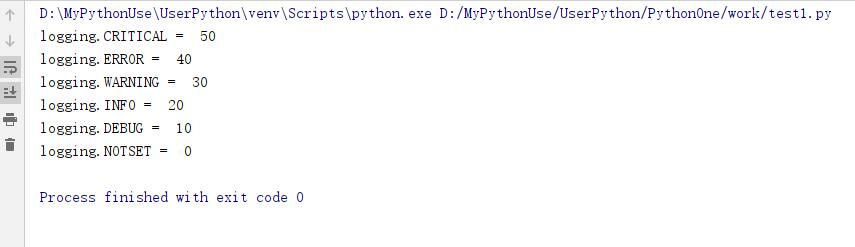  

日志级别指的是产生日志的事件的严重程度。  
设置一个级别后，严重程度低于设置的日志消息将被忽略。  
对应的打印方法有：debug()、info()、warning()、error()、和critical()方法  

## 常用的格式字符串

* 常用的格式字符串通常定义在Format里面。  

|属性名称|格式|描述|
|:-------|:--------|:-----------|
|日志消息内容|%(message)s|使用对应级别打印时传入的message变量值。<br/>可以使用Formatter.format()设置设置打印格式。
|asctime|%(asctime)s|创建LogRecord时的可读时间。默认情况下，它的格式为'2003-07-08 16:49:45,896'（逗号后面的数字是毫秒部分的时间）
|函数名|%(funcName)s|日志调用所在函数的函数名
|logger名称|%(name)s|logger的名字
|日志级别名称|%(levelname)s|消息的级别名称：<br/>"DEBUG","INFO","WARNING","ERROR","CRITICAL"
|日志级别数值|%(levelno)s|消息的级别数字，对应DEBUG,INFO,WARNING,ERROR,CRITICAL
|行号|%(lineno)d|日志调用所在的源码行号
|模块|%(module)d|模块(filename名字部分)
|进程ID|%(process)d|进程ID
|线程ID|%(thread)d|线程ID
|进程名称|%(processName)s|进程名称
|线程名称|%(threadName)s|线程名称
|logger名称|%(name)s|使用的logger对应名称
|pathname|%(pathname)s|输出日志调用的文件完整路径

注意：funcName,threadName,processName都是小驼峰。

## logging.basicConfig参数解析

* logging.basicConfig(**kwargs)  
* logging.basicConfig会初始化配置logging.root日志输出模块的配置信息。  

|关键字参数名称|意思|
|:------------|:-----------|
filename|类型(字符串)，定义模块输出的日志在指定文件中。不能与stream同时指定。<br/>如果不指定默认使用sys.stderr流对象输入，即标准错误输出。
filemode|如果指定了filename，那么打开文件的模式为filemode模式，默认为“a”模式打开。
stream|指定日志文件输出的流对象，默认为sys.stderr流对象，不能与filename同时存在，会触发ValueError异常。
format|为处理程序指定格式化字符串，默认为：`%(levelname)s:%(name)s:%(message)s`
datefmt|使用指定日期时间的格式time.strftime()
style|指定默认字符串使用的格式。注意：info等打印日志时传入的参数只能使用c风格，即“%”风格。可选择值如下：<br/>"%":表示使用c风格格式字符串,此时默认的format格式为："%(levelname)s:%(name)s:%(message)s"。<br/>"{"：表示使用format,此时format格式为："{levelname}:{name}:{message}"。<br/>"$":使用StringTemplateStyle风格。此时format格式为："{levelname}:${name}:${message}"
level|设置root日志输出的级别
handlers|添加其他输出日志方式，实际输出日志都是handler的作用。如果设置了handlers列表，那么同时不能使用filename和stream参数，否则会抛出ValueError异常。

## 举例

* 使用默认级别输出日志
    1. #初始化时，如果没指定level，那么level的默认级别为WARNING
    2. 低于默认级别(也就是小于默认级别值的)消息输出将不会被输出。

````python
import logging

FORMAT = "%(asctime)-15s Thread info: %(thread)d %(threadName)s %(message)s"
logging.basicConfig(format=FORMAT,level=logging.WARNING) #初始化时，如果没指定level，那么level的默认级别为WARNING

logging.info("打印测试 {}".format(1)) #info不显示
logging.warning("打印测试 {}".format(2)) #warning是默认级别
````

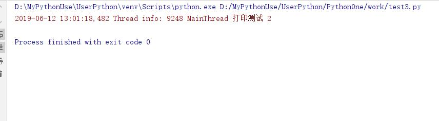  

* 构建消息

````python
import logging

FORMAT = "%(asctime)-15s Thread info: %(thread)d %(threadName)s %(message)s"
logging.basicConfig(format=FORMAT,level=logging.INFO) #初始化时，如果没指定level，那么level的默认级别为WARNING

logging.info("我是 {}".format(20)) #单一字符串输出
logging.info("我是 %d %s",20,"岁") #c风格输出
````

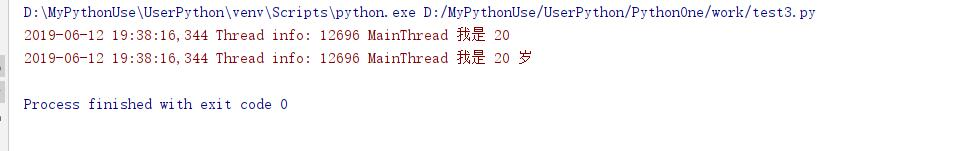  

* 如果需要使用自定义格式，可用在format字符串中指定，在打印字符串时传入extra字典对应即可

````python
import logging

FORMAT = "%(asctime)-15s Thread info: %(thread)d %(threadName)s %(message)s %(gdy)s %(xdd)s"
logging.basicConfig(format=FORMAT,level=logging.INFO) #初始化时，如果没指定level，那么level的默认级别为WARNING

logging.info("我是 {}".format(20),extra={"xdd":"我是xdd变量","gdy":"我是gdy变量"}) #单一字符串输出
logging.info("我是 %d %s",20,"岁",extra={"xdd":"我是xdd变量","gdy":"我是gdy变量"}) #c风格输出
````

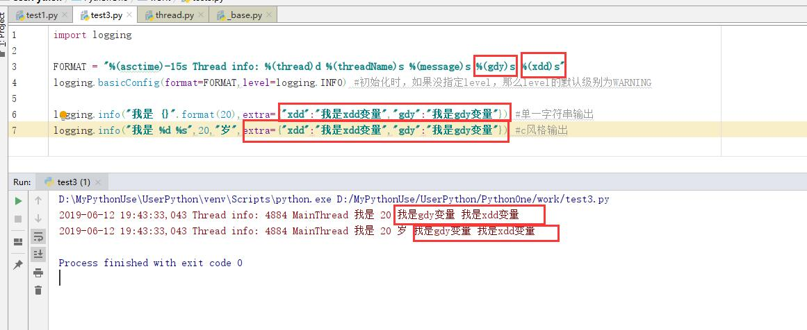  

* 如果输出日期需要了指定格式。可以在basicConfig中使用datefmt参数为日期指定格式

````python
import logging

logging.basicConfig(format="%(asctime)s %(message)s",datefmt="%Y%m%d %H:%M:%S")
logging.warning("你好")
````

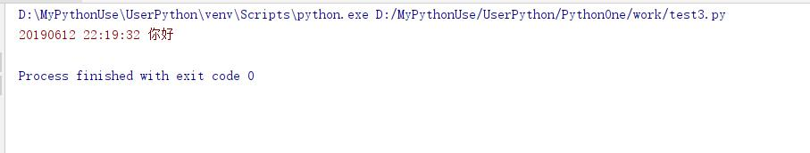  

* 如果需要将信息输出到文件可以定义filename选择，在basicConfig中

````python
import logging

logging.basicConfig(format="%(asctime)s %(message)s",datefmt="%Y%m%d %H:%M:%S",filename="D://test.log")

for i in range(5):
    logging.warning("你好 {}".format(i))
````

* 同时定义多个输出位置,设置handlers

````python
import logging
import sys

logging.basicConfig(style="{",
                    format="{asctime} {name} {message}",
                    datefmt="%Y-%m-%d %H:%M:%S",
                    # stream=sys.stdout,
                    handlers=[logging.StreamHandler(sys.stdout),logging.StreamHandler(sys.stdout),logging.FileHandler("D:/a.log")],
                    level=logging.INFO)
logging.info("aaa %d %s %d",1,"2",3)
````

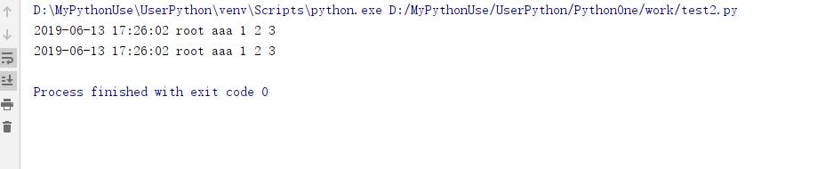  

## Logger类

在logging模块中，顶层代码中有  

````python
root = RootLogger(WARNING) #大约在1824行 指定根Logger对象的默认级别，就在basicConfig函数上面
Logger.root = root #为类Logger增加类属性root
Logger.manager = Manager(Logger.root)
````

* logging模块在加载的时候，就会创建一个全局对象root,它是一个RootLogger示例。根Logger对象的默认级别是WARNING.
* RootLogger类继承自Logger类
* 类Logger初始化方法签名是(name,level=0)
* 类RootLogger初始化方法签名是(name,level=0)
* 类RootLogger初始化方法签名(level),本质上调用的是`Logger.__init__(self,"root",WARNING)`
* 调用logging.basicConfig来调整级别，就是对这个根Logger的级别进行修改。

### 1. Logger.getLogger函数，构造一个log类

* Logger示例的构建，使用Logger类也行，但推荐使用getLogger函数

部分源码如下：  

````python

root = RootLogger(WARNING)  #大约在1824行
Logger.root = root
Logger.manager = Manager(Logger.root)

def getLogger(name=None):   #大约在1930行
    """
    Return a logger with the specified name, creating it if necessary.

    If no name is specified, return the root logger.
    """
    if name:
        return Logger.manager.getLogger(name)
    else:
        return root #如果没有指定名称，就返回根logger
````

* getLogger方法如果没有指定名称，使用工厂方法返回了同一个实例对象。
* 指定了name，返回一个名称为name的Logger实例，如果再次使用相同的名字，会返回同一个实例，不会重新创建新的实例。(背后使用了一个字典保证了同一名字返回同一个Logger实例，具体可继续阅读源码)  

* 简单验证

````python
import logging

log1 = logging.Logger("hello",20)
log2 = logging.Logger("hello",30)
print(log1,id(log1))
print(log2,id(log2))

log3 = logging.getLogger("hello")
log4 = logging.getLogger("hello")
print(log3,id(log3))
print(log4,id(log4))
````  

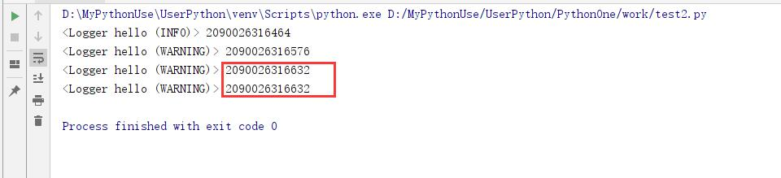  

### 2. 层次结构

* Logger是层次结构的，使用"."点号分割，例如：“a”,"a.b"或者“a.b.c.d”,a是a.b的父parent,a.b是a的子child。对于foo来说，名字为foo.bar、foo.bar.baz、foo.bam都是foo的后代

````python
import logging

# 父子层次关系
# 根logger
root = logging.root
print(root,id(root))
print(root.name,type(root),root.parent) #根logger没有父

log1 = logging.getLogger(__name__) #模块级别logger
print(log1.name,type(log1),id(log1),id(log1.parent),log1.parent.name)

log2 = logging.getLogger("{}.{}".format(__name__,"child")) #子logger
print(log2.name,type(log2),id(log2),id(log2.parent),log2.parent.name)
````

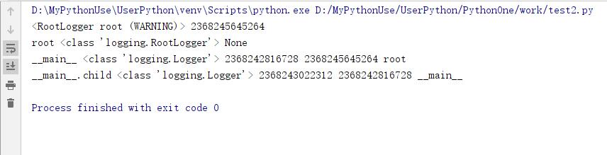  

### Level级别设置与level的继承

* 每一个logger实例都有级别，即每个logger实例都有一个等效的level.
* logger对象可以在创建后动态的修改自己的level。
* 等效level决定着logger实例能输出什么级别的信息。
* **如果logger没有设置自己的级别，会默认从依次从父类开始寻找对应的级别，找到后会记录当前级别的信息是否能输出，记录在`self._cache`字典中**

* INFO级别消息示例(部分源码解析)：

````python
    def info(self, msg, *args, **kwargs):
        if self.isEnabledFor(INFO): #先要判断当前级别是否能输出 大约在1373行
            self._log(INFO, msg, args, **kwargs)
#############################x下面大约在1619行#############################################
    def isEnabledFor(self, level):
        """
        Is this logger enabled for level 'level'?
        """
        try:
            return self._cache[level]
        except KeyError:
            _acquireLock()
            if self.manager.disable >= level: #注意self.manager记录的是root日志对象，通常情况下是0>=INFO
                is_enabled = self._cache[level] = False
            else: #getEffectiveLevel会获取最近父类的级别，判断是否大于当前INFO的级别如果大于就返回True表示可以输出
                is_enabled = self._cache[level] = level >= self.getEffectiveLevel()
            _releaseLock()

            return is_enabled
####################################下面大约在1605行##############################################
    def getEffectiveLevel(self):
        """
        Get the effective level for this logger.

        Loop through this logger and its parents in the logger hierarchy,
        looking for a non-zero logging level. Return the first one found.
        """
        logger = self
        while logger:
            if logger.level:
                return logger.level
            logger = logger.parent
        return NOTSET
````

* 如果不设置level，则初始level为0
* 如果设置了level，就有限使用自己的level，否则继承最近祖先的level
* 信息是否能通过该logger实例上输出，就是要看当前函数的level是否大于等于logger的有效level，否则输出不了。

* 简单示例：

````python
import logging
import sys

logging.basicConfig(level=logging.WARNING,
                    stream=sys.stdout,
                    format="%(asctime)s %(thread)d %(threadName)s %(name)s [%(message)s]")

logging.warning("warning->我是root")
logging.info("info->我是root") #不能被输出root默认级别是30，而info级别是20

log1 = logging.getLogger(__name__)
log1.level = logging.INFO
log1.info("info->我是log1")
log1.debug("debug->我是log1")

log2 = logging.getLogger("{}.{}".format(__name__,"log2"))
# log2.level = logging.DEBUG
log2.info("info->我是__main__.log2")
log2.debug("debug->我是__main__.log2") #不能输出，应为log1的级别为INFO=20而DEBUG的输出级别是10，没有达到输出级别
````

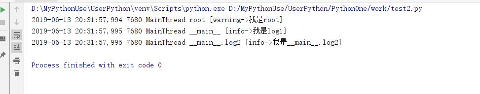  

### Handler负责输出信息

Handler控制日志信息的输出目的地，可以是控制台、文件。  **日志输出是Handler做的，也就是真正干活的是Handler。**

* 可以单独设置level
* 可以单独设置格式Formatter
* 可以设置过滤器Filter

1. Handler类的层次
    * Handler
        * StreamHandler #不指定使用sys.stderr
            * FileHandler 文件
            * _StderrHandler #标准输出
        * NullHandler #什么都不做

在logging.basicConfig函数中，如下：

````python
if handlers is None:
    filename = kwargs.pop("filename", None)
    mode = kwargs.pop("filemode", 'a')
    if filename:
        h = FileHandler(filename, mode)
    else:
        stream = kwargs.pop("stream", None)
        h = StreamHandler(stream)
    handlers = [h]
````  

* 如果设置文件名，则为根Logger加载一个输出到文件的FileHandler。  
* 如果没有设置文件名，则根Logger加载一个StreamHandler,默认输出到sys.stderr。  
也就是说根logger一定会至少有一个handler。

#### Formatter日志格式类

logging的Formatter类，它允许指定某个格式的字符串。如果提供None，那么"%(message)s"将会作为默认值。  

* Formatter是绑定在Handler上的  

* 综合示例

````python
import logging
import sys

logging.basicConfig(level=logging.WARNING,
                    stream=sys.stdout,
                    format="%(asctime)s %(thread)d %(threadName)s %(name)s [%(message)s]")

log1 = logging.getLogger("log1")
log1.setLevel(logging.INFO)
print(log1.name,type(log1))
log1.info("我是log1")

print(" -"* 30)
filehand = logging.FileHandler("D:/a.log","w") #输出到文件
log1.addHandler(filehand)
stdhand1 = logging.StreamHandler(sys.stdout) #输出到标准输出
fmt = logging.Formatter("%(asctime)s %(name)s [%(message)s]") #为stdhand1单独设置输出格式，如果不设置会默认使用"%(message)s"格式
stdhand1.setFormatter(fmt)
log1.addHandler(stdhand1)
log1.propagate = False #阻止传递
log1.info("你好")

print("- "*30)
log2 = logging.getLogger("log2")
log2.setLevel(logging.INFO)
print(log2.name,type(log2))
log2.addHandler(logging.StreamHandler(sys.stdout))
log2.addHandler(logging.StreamHandler(sys.stdout))
print(log2.propagate)
log2.info("我是log2") #不会阻止传播
````

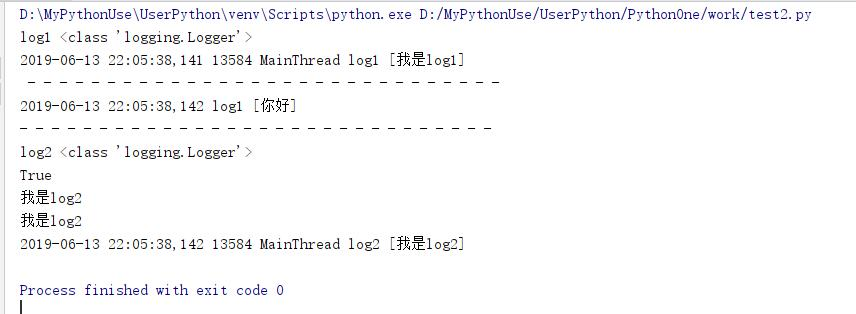  

### 继承关系及信息传递

* **注意**：本解释中忽略了过滤器的存在，即Formatter,实际上有些地方需要先过滤。

* 每一个Logger实例的level如同入口，让流水进来，如果这个门槛太高，信息就进不来。
    1. 例如：log3.warning("log3"),如果log3定义的level级别高于warning的级别，那么warning就无法输出信息。
* 如果level没有设置，就用父logger的，如果父logger的level没有设置，继续找父的父的，最终可以找到root上，如果root设置了就用它的，如果root没有设置，root的默认的level值是WARNING
* 消息传递流程
    1. 如果消息在某个logger对象上产生，这个logger就是**当前logger**,首先消息level要和当前logger的EffectiveLevel比较，如果低于当前logger的EffectiveLevel，则流程结束：否则生成log记录。
    2. 日志记录会提交给当前logger的所有handler处理，记录还要和每一个handler的级别分别比较(**注意：是输出消息的级别即：log.wrning("xx")中wrning的级别，不是log.level的级别**)，低的不处理，否则按照handler输出日志记录。
    3. **当前logger**的所有handler处理完毕后，就要看自己的propagate属性，如果是True表示向父logger传递这个日志记录，否则到此流程结束
    4. 如果日志记录传递到了父logger,**不需要和父logger的level比较，(需要与父log中的handler的级别进行比较)**，而是直接较低给父的所有handler,父logger成为**当前logger**。重复2，3步骤，直到当前logger的父logger是None退出，也就是说当前logger最后一般是root logger(是否能到root logger要看中间的logger是否允许propagate传播)。
* logger实例初始化的propagate属性为True,即允许向父logger传递消息
* logging.basicConfig函数
    1. 如果root没有handler，就默认创建一个StreamHandler,如果设置了filename,就创建一个fileHandler。
    2. 如果设置了format参数，就会用它生成一个Formatter对象，否则会生成缺省Formatter，并把这个formatter加入到刚才创建的handler上，然后把这些handler加入到root.handlers列表上。level是设置给root logger的。
    3. 如果root.handlers列表不为空。logging.basicConfig的调用什么都不做。
* 官方日志流转图  
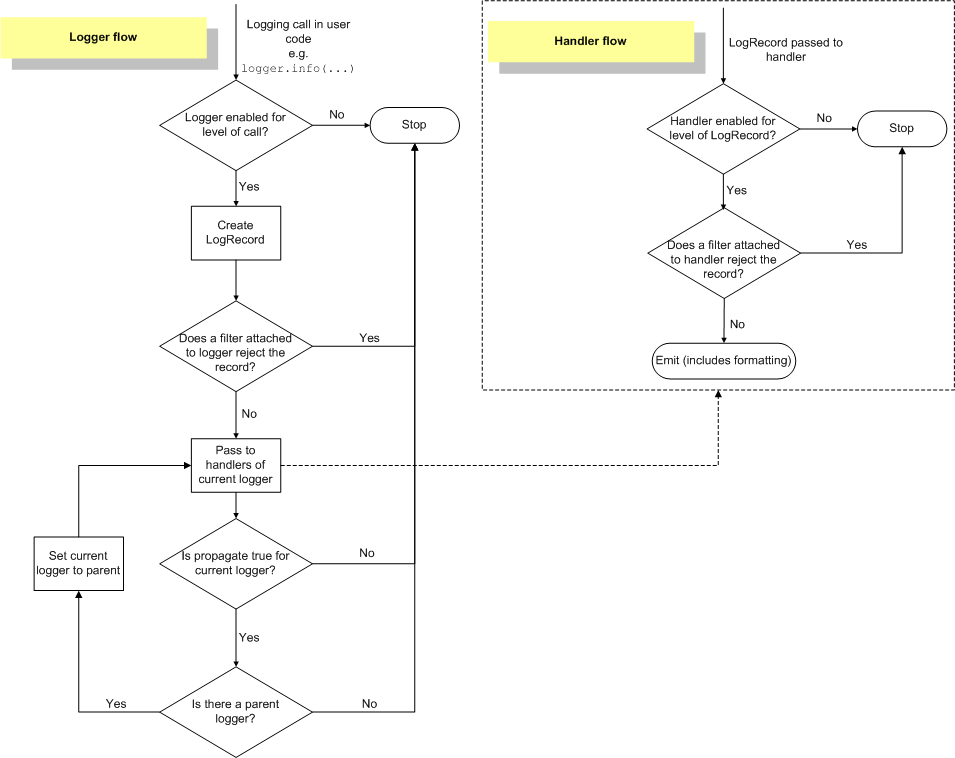  

### Filter过滤器

* Filter分为2种：
    1. 可以为Handler增加过滤器，所以这种过滤器只影响handler，不会影响整个处理流程
    2. 如果过滤器加到logger上，就会影响流程
* 如果过滤器设置在Handler上，那么只过滤满足条件的消息loggger通过当前handler输出
* 如果过滤器设置在logger上，那么过滤当前logger名称是否满足过滤需求，如果不满足，当前logger所有消息都不能打印。(即相当于控制当前logger是否放行和不放心，类似于设置logger的disabled属性。)

* 简单示例1  

````python
import logging
import sys

logging.basicConfig(level=logging.INFO,
                    stream=sys.stdout,
                    format="%(asctime)s %(thread)d %(threadName)s %(name)s [%(message)s]")

# logger log1
log1 = logging.getLogger("log1")
log1.setLevel(logging.WARNING)
h1 = logging.StreamHandler(sys.stdout)
h1.setLevel(logging.INFO)
f1 = logging.Formatter("我是log1-h1输出 %(name)s [%(message)s]")
h1.setFormatter(f1)
log1.addHandler(h1)

# logger log1.log2,即log2的父是log1
log2 = logging.getLogger("log1.log2")
print("- "*10,log2.getEffectiveLevel()) #继承父logger,就是log1的level
h2 = logging.StreamHandler()
h2.setLevel(logging.INFO)
h2.setFormatter(logging.Formatter("我是log2-h2输出 %(name)s [%(message)s]"))
#为h2加filter过滤器
# filter = logging.Filter("log1")
filter = logging.Filter("log1") #过滤器
h2.addFilter(filter) #在handler添加过滤器，只影响当前handler
print("- "*10,filter.name)
log2.addHandler(h2)

# log2.setLevel(logging.CRITICAL) #拦截后warning将无法输出
log2.warning("222222")

log3 = logging.getLogger("log1.log2.log3")
# log3.addFilter(logging.Filter("log1."))
log3.addFilter(logging.Filter("log1.log2.log")) #在log上添加过滤器，会影响整个输出
print("- "*10,log3.name,log3.getEffectiveLevel())
log3.warning("33333333333")

````  

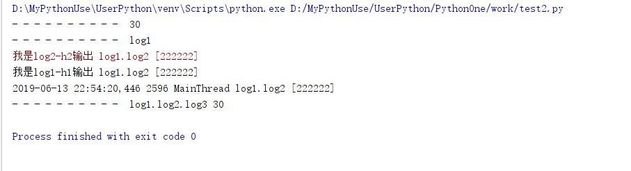  

* 消息log2的，他的名字是log1.log2,因此顾虑去名字设置为log1或log1.log2,消息就可以通过，但是如果是其他就不能通过，不设置过滤器名字，所有消息都能通过
* 过滤器核心代码如下：  

1. 设置在log上其影响的代码如下：  

    ````python
    ### 大约在1521行
    def handle(self, record):
        """
        Call the handlers for the specified record.

        This method is used for unpickled records received from a socket, as
        well as those created locally. Logger-level filtering is applied.
        """
        if (not self.disabled) and self.filter(record):
            self.callHandlers(record)
    ````

2. 设置在handler上影响代码如下：

    ````python
    ### 大约在892行
    def handle(self, record):
        """
        Conditionally emit the specified logging record.

        Emission depends on filters which may have been added to the handler.
        Wrap the actual emission of the record with acquisition/release of
        the I/O thread lock. Returns whether the filter passed the record for
        emission.
        """
        rv = self.filter(record)
        if rv:
            self.acquire()
            try:
                self.emit(record)
            finally:
                self.release()
        return rv
    ````  

3. filter核心代码：

    ````python
    ## 大约在707行
    def filter(self, record):
        if self.nlen == 0:
            return True
        elif self.name == record.name:
            return True
        elif record.name.find(self.name, 0, self.nlen) != 0:
            return False
        return (record.name[self.nlen] == ".")

    ## 大约在747行
    def filter(self, record):
        rv = True
        for f in self.filters:
            if hasattr(f, 'filter'):
                result = f.filter(record)
            else:
                result = f(record) # assume callable - will raise if not
            if not result:
                rv = False
                break
        return rv
    ````  

* 过滤器的最核心代码就是在logging.Filter类的filter方法中`record.name.find(self.name, 0, self.nlen) != 0`本质上等价于record.name.startswith(filter.name)  
* `return (record.name[self.nlen] == ".")`保证了过滤器能通过自己的情况下，也同样能通过他自己的子类。

## Logger类常用属性和方法

|属性和方法|含义|
|:----|:------|
Logger.disabled=False #是否关闭当前logger，默认为不关闭
Logger.propagate=True #是否向父类传递消息，默认为传递
Logger.level |当前logger的消息级别
Logger.parent|当前logger的父logger
Logger.handlers=[]|当前logger的handler集合
Logger.name|当前logger的名称
Logger.setLevel(level)|设置当前logger的登记
Logger.addFilter(filter:logging.Filter)|为当前loggeer添加过滤器
Logger.removeFilter(filter:logging.Filter)|移除指定过滤器
Logger.addHandler(hdlr:logging.Handler)|添加Handler,可以为logging.StreamHandler或logging.FileHandler
Logger.removeHandler(hdlr:logging.Handler)|移除Handler
Logger.debug(msg,*args,**kwargs)|使用debug打印日志
Logger.info(msg,*args,**kwargs)|使用info打印日志
Logger.warning(msg,*args,**kwargs)|使用warning打印日志
Logger.error(msg,*args,**kwargs)|使用error打印日志
Logger.critical(msg,*args,**kwargs)|使用critical打印日志
Logger.log(level,msg,*args,**kwargs)|使用指定等级打印消息。
Logger.exception(msg,*args,**kwargs)|在此日志记录器上记录带有级别错误的消息。参数被解释为debug()。异常信息被添加到日志消息中。此方法只能从异常处理程序调用


## Handler类常用属性和方法

|属性或方法|含义|
Handler.level|Handler的级别
Handler.formatter|Handler的打印格式类，是logging.Formatter类型
Handler.setLevel(self, level)|设置Handler的级别
Handler.setFormatter(self,fmt:logging.Formatter)|设置Handler的打印格式。是logging.Formatter类型
Handler.addFilter(filter:logging.Filter)|为Handler添加过滤器
Handler.removeFilter(filter:logging.Filter)|移除指定过滤器

* class logging.Formatter(fmt=None, datefmt=None, style='%')  构造方法

## Filter类常用属性

|属性|含义|
Filter.name|Filter过滤器名称
Filter.nlen|Filter过滤器名称的长度
Filter.filter(self,reacord)|判断record是否能过滤，返回True表示可以通过，返回False，表示不能通过。


