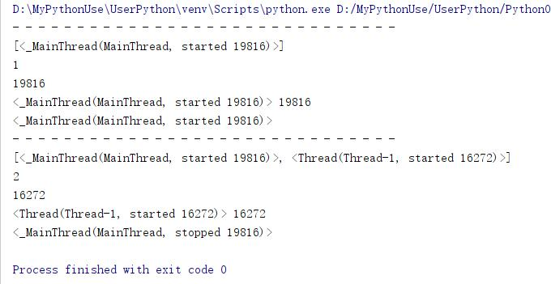

@[toc]

# Python中的线程Threading

Python的线程开发使用标准库threading  
进程靠线程执行代码，至少有一个主线程，其它线程是工作线程。  
主线程是第一个启动的线程。 
父线程：如果线程A中启动了一个线程B，A就是B的父线程。  
子线程：B就是A的子线程。  

## Thread类

class threading.Thread(group=None, target=None, name=None, args=(), kwargs={}, *, daemon=None) #线程

````python
# 签名 
def __init__(self, group=None, target=None, name=None,args=(), kwargs=None, *, daemon=None)
    pass
````

|参数名|含义|
|:---|:---|
target|线程调用的对象，就是目标函数
name|为线程起一个名字(线程的名字)
args|为目标函数传递实参，元组
kwargs|为目标函数传递关键字参数，字典

### 线程并启动与退出

* 通过threading.Thread创建一个线程对象，target是目标函数，可以使用name为线程指定名称。  
* 启动线程需要调用线程的start()方法才能启动  
* 线程之所以执行函数，是因为线程中就是要执行代码的，而简单的封装就是函数，所以还是函数调用  
* 线程执行完，线程就退出了  
* Python没有提供线程退出的方法，线程在下面情况时退出
    1. 线程函数内语句执行完毕
    2. 线程函数中抛出未处理的异常
* Python的线程没有优先级、没有线程组的概念，也不能被销毁、停止、挂起，那也就没有恢复、中断了。

````python
import threading

def worker():
    print("hello word")
    print("my name is xdd")

t = threading.Thread(target=worker,name="xdd") #创建一个线程对象
t.start() #启动线程

def add(x,y):
    print("{} + {} = {}".format(x,y,x+y),threading.current_thread().ident)

tt = threading.Thread(target=add,name="xddadd",args=(3,),kwargs={"y":15})
tt.start()
````

  

### threading的属性和方法

|名称|含义
|:---|:----|
threading.current_thread()|返回当前线程对象
threading.current_thread().ident|返回当前线程的id
threading.main_thread()|返回主线程(main线程)对象
threading.active_count()|返回当前处于active状态的线程个数。(活着的，还未运行结束的线程个数)
threading.enumerate()|返回所有活着的线程列表，不包括已经终止的线程和未开始的线程
threading.getident()|返回当前线程的ID,非0整数

* active_count，enumerate方法返回的值包含主线程。  

````python
import threading

def shothread():
    print("- "*30)
    print(threading.enumerate())
    print(threading.active_count())
    print(threading.get_ident())
    print(threading.current_thread(),threading.current_thread().ident)
    print(threading.main_thread())

shothread()
t = threading.Thread(target=shothread)
t.start()
````

  

### Thread线程的实例对象的属性和方法

|名称|含义|
|:---|:---|
Thread.name|线程的名字，一个标识符，线程的名称可以重名。getName(),setName()获取、设置这个名词
Thread.ident|线程ID,是个非0的整数。线程启动后才会有ID，否则为None。线程退出，此时Id依旧可以访问。此ID会被系统重复使用
Thread.is_alive()|返回线程是否或者

* 注意：线程的name这是一个名称，可以重复；ID必须唯一，但可以在线程退出后再利用。

````python
import threading
import time

def worker():
    for i in range(5):
        time.sleep(1)
        print("i am working")
    print("finished")

t = threading.Thread(target=worker,name="worker1")
print(t.name,t.ident,t.is_alive())
t.start()

while True:
    time.sleep(0.8)
    tbool = t.is_alive()
    if tbool:
        print("main print id = {},name = {},是否活着{}".format(t.ident,t.name,tbool))
    else:
        print(t.ident,t.is_alive())
        t.start() #不能重新启动，线程只能启动一次
````

  

### Thread线程对象的start方法和run方法

|名称|含义|
|:----|:----|
Thread.start()|启动线程。每一个线程必须且只能执行该方法一次(实质是调用操作系统接口构建一个线程)
Thread.run()|运行线程函数

* start()方法会调用run()方法，而run()方法来运行函数
    1. 使用start方法启动线程，会正真的启动一个新的线程。
    2. 使用run方法，会执行执行线程中的函数，不会出现新的线程
* 因此，启动线程请使用start方法，且对于这个线程来说，start方法只能调用一次。（设置_started属性实现）  

````python
import threading
import time

def worker():
    print("当前所有线程：{}".format(threading.enumerate()))
    for i in range(5):
        time.sleep(1)
        print("id={},name={}线程正在运行".format(threading.get_ident(),threading.current_thread().name))
    print("finished")

class Mythread(threading.Thread):
    def start(self) -> None:
        print("start~~~~~~~~~~~")
        super().start()

    def run(self):
        print("run~~~~~~~~~~")
        super().run()

t = Mythread(target=worker,name="worker1")
print("- "*30,"开始测试run")
t.run()
# 由于run函数执行完后会 删除del self._target, self._args, self._kwargs线程对象的这些属性，所以动态添加
t._target = worker
t._args = ()
t._kwargs = {}
print("- "*30,"开始测试start")
t.start()
````

  

## 多线程

顾名思义，多个线程，一个进程中如果有多个线程运行，就是多线程，实现一种并发。  
当使用start方法启动线程后，进程内有多个活动的线程并行的工作，就是多线程。  

* 一个进程中至少有一个线程，并作为程序的入口，这个线程就是**主线程**。  
* 一个进程至少有一个主线程。其他线程称为**工作线程**。  

````python
import threading
import time
import sys

def print(st):
    sys.stdout.write(st+"\n")

def worker():
    print("当前所有线程：{}".format(threading.enumerate()))
    for i in range(5):
        time.sleep(1)
        print("id={},name={}线程正在运行".format(threading.get_ident(),threading.current_thread().name))
    print("{}线程finished".format(threading.current_thread().name))

class Mythread(threading.Thread):
    def start(self) -> None:
        print("start~~~~~~~~~~~")
        super().start()

    def run(self):
        print("run~~~~~~~~~~")
        super().run()

t1 = Mythread(target=worker,name="t1")
t2 = Mythread(target=worker,name="t2")

t1.start()
t2.start()
````  

  
可以看到t1和t2交替执行

## 线程安全

上面多线程示例代码中如果不加如下代码：  

````python
def print(st):
    sys.stdout.write(st+"\n")
````  

多运行几次，有机会出现如下打印结果：  
  
在IPython中演示，会更加明显  

* 开图，打印结果应该是一行行，但是很多字符串乱打印在了一起。说明，print函数被打断了，被线程切换打断了。
    1. print函数分两步打印，第一步打印字符串，第二步打印换行符，就在这之间，发生了线程的切换。所以会产生上面的打印结果，说明print函数是**线程不安全**的
* **线程安全**：线程执行一段代码，不会产生不确定的结果，那这段代码就是线程安全的  
* 多线程编程时，防止print函数的打印错乱解决办法
    1. 不让print打印换行符，即end=""就可以了，在打印一个字符时，末尾加上换行符`\n`
    2. 使用sys.stdout.write()方法代替打印
    3. 使用loggin模块打印.`import logging`,logging.warning()
* loggin标准库里面的模块，日志处理模块，线程安全的，生成环境代码都使用logging

## daemon线程和non-daemon线程

注意：这里的daemon不是Linux中的守护进程  
Python中，构造线程的时候，可以设置daemon属性，这个属性必须在start方法前面设置好。  
在Thread类中设置daemon的源码如下：  

````python
# 源码Thread类中的__init__方法中
if daemon is not None:
    self._daemonic = daemon #用户设定的daemon值
else:
    self._daemonic = current_thread().daemon
````

* 主线程main中的`daemon = False`。所以主线程是non-daemon线程
* 如果子线程是daemon线程，即`daemon = True`,

