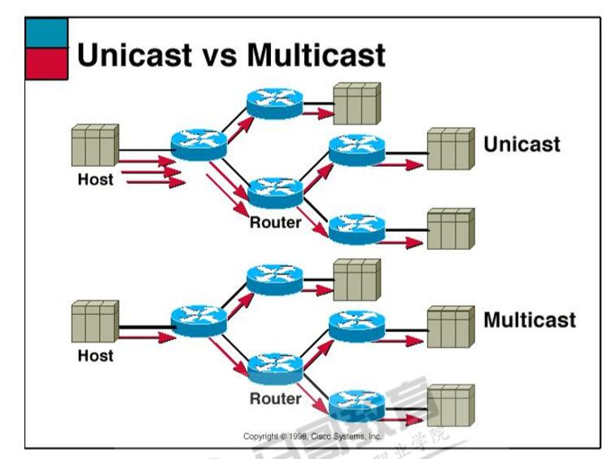

# 网络基础

@[toc]

## 网络概念

1. 什么是网络？
    * 网络是由结点和连线构成的**图**，表示诸多对象及其关系。
2. 什么是计算机网络
    * 计算机网络指的是将地理位置不同的具有独立功能的多台计算机及其外部设备，通过通信线路物理连接（包括有 线、无线连接），并在网络操作系统、网络管理软件和网络通信协议的管理和协调下，实现**资源共享**和**信息传递**的计算机系统。  
3. 带宽
    * 在数字设备中，指的是单位时间数据的传输量。
    * 网络传输习惯上使用比特率，即bps每秒传输的二进制位数。

## 拓扑

### 总线型  

  
所有设备都连接到公共总线上，结点间使用广播通信方式。一个结点发出的信息，总线上所有其他结点都可以接收 到。一段时间只允许一个结点独占总线。  
常见使用同轴电缆连接，总线两端需要终结器。  

1. 优点
    * 结构简单、易于实现
    * 易于扩充，增加或者移除结点比较灵活
    * 可靠性较高，个别结点发生故障时，不影响网络中其他结点的正常工作
2. 缺点
    * 网络传输能力低，安全性低，总线发生故障时，会导致全网瘫痪。
    * 所有数据都需要经过总线传输，总线是整个网络的瓶颈。结点数量的增多会影响网络性能。

### 环形结构

  
环形结构是将联网的计算机由通信线路连接成一个闭合的环，在环形结构网络中信息按照固定方向流动，或顺时针 方向，或逆时针方向。  

* 优点：令牌控制，没有线路竞争，实时性强，传输控制容易  
* 缺点：维护困难，可靠性不高。一个结点发生故障时，可能导致全网瘫痪。可以使用双环拓扑结构，但是复杂性提 升。

## 星型拓扑

  
每个结点都由一条单独的通信线路与中心结点连结。其他各结点都与该中心结点有着物理链路的直接互连，其他结 点直接不能直接通信，其他结点直接的通信需要该中心结点进行转发。因此中心结点必须有着较强的功能和较高的 可靠性。需要中心设备，例如hub、switch、router  

* 优点：可靠性高，方便管理，易于扩展，传输效率高
* 缺点：线路利用率低，中心节点需要很高的可靠性和冗余度
* **注意**，hub工作在一层，这种星型实际上就是芯片化的总线网络。只是物理拓扑结构上感觉像是星型。  

## OSI参考模型(网络七成协议)

OSI是Open System Interconnection的缩写，意为开放式系统互联。国际标准化组织（ISO）制定了OSI模型，该 模型定义了不同计算机互联的标准，是设计和描述计算机网络通信的基本框架。OSI模型把网络通信的工作分为7 层，分别是物理层、数据链路层、网络层、传输层、会话层、表示层和应用层。  
  
  

* **物理层(第一层)**：定义了电气规范，设备规范、物理接口等，电信号的变化，或数字信号变化，**比特**。
* **数据链路层(第二层)**:将**比特**组织成**帧**，即对字节进行定义，支持错误检查。使用物理地址、**MAC地址**。MAC有48位，前24位厂商编号由IEEE分配，后24位设备序号。
* **网络层(第三层)**：将**帧**组织成**包**，包传递的路径选择（路由），将包传输到目标地址。使用逻辑地址、**IP地址**。
* **传输层(第四层)**：解决传输的问题，确保数据传输的可靠性；建立、维护、终止虚拟电路；错误检测和恢复。
* **会话层(第五层)**：建立、管理、终止应用程序间的逻辑通路，即会话
* **表示层(第六层)**：对应用数据格式化、加密解密等。将上层数据转换为适合网络传输的格式，或将下层数据转化为上 层能够处理的数据。  
* **应用层(第七层)**：为应用程序提供网络服务接口，用户使用的时候并不关心会话如何建立保持，也不关心协议 的协商是否加密等。

### 数据传输

  

* 数据很大，在应用层切分，每一份数据都会在下一层被封装。  
* 在数据链路层会增加tail即校验位，后在物理层上都是电平信号0、1发送出去。  
* 到了对端设备，由下至上逐层解包组合。直到合成并还原应用层的一份数据。

## 通讯的三种模式

* **单播模式**：包在计算机网络传输中，目的地址为单一目标的传输方式。每次都是点对点的2个实体间相互通信。  
  

* **广播模式**：数据在网络中传输，目标地址是网络中所有设备的传输方式。所有设备是有范围的，这个范围称为广播域。 IP v6不支持广播，由组播替代。  
  

* **多播,组播模式**：把数据同时传递给一组目的地址。数据源只发出一份数据，会在尽可能远的的设备上复制和分发。  
  

  

### 冲突域，广播域

* **广播域**：广播是一种信息的传播方式，指网络中的某一设备同时向网络中所有的其它设备发送数据，这个数据所能广播到的范围即为广播域(Broadcast Domain)。
    1. 简单点说，广播域就是指网络中所有能接收到同样广播消息的设备的集合。
* **冲突域**：：网络中设备A发送数据时，设备B也发送数据，数据碰撞，发生了冲突，这两个设备就属于同一个冲突域。

1. 广播域：网络中能接收任一设备发出的广播帧的所有设备的集合
    * 广播域是基于第二层（链路层）
    * 广播域内所有的设备都必须监听所有的广播包，如果广播域太大了，用户的带宽就小了，并且需要处理更多的广播，网络响应时间将会长到让人无法容忍的地步。
2. 冲突域：在同一个冲突域中的每一个节点都能收到所有被发送的帧
    * 冲突域是基于第一层（物理层）
    * 冲突域：一个站点向另一个站点发出信号。除目的站点外，有多少站点能收到这个信号。这些站点就构成一个冲突域。

简单来说：冲突域，是电信号的相互干扰，构成的冲突域，所以冲突域发生在第一层(物理层)，而广播域，是设备广播时，在广播域中的所有设备都能收到这个广播。而数据的发送是一帧一帧发送的。(包的发送也会转换成一帧一帧)所以广播域发生在第二层(数据链路层)

**注意**：交换机可以隔离冲突域。路由器可以隔离广播域。  

## 网络设备

### 网络线缆

* 有线连接，需要使用网线，早使用同轴电缆，后来使用双绞线，现在高速网络布线可以采用光纤。  
* 常用的双绞线使用RJ45水晶头。  
* 直通采用两端T568B，互连使用一端T568A一端T568B的交叉线，不过目前新型网卡可以自适应，都使用直通线连 接即可。  
    1. T-568A:绿白:绿，橙白:蓝，蓝白:橙，棕白:棕。
    2. T-568B:橙白:橙，绿白:蓝，蓝白:绿，棕白:棕。（相当于T568-A的1和3对调，2和6对调）
  

### 集线器hub

* 工作在一层。使用HUB连接的设备看似是星型，实际是总线型。  
* 它是物理层设备，只认识电信号，所以根本不认识什么MAC地址之类的信息。早期用来多机互连，信号中继的作用。  
* 连入设备越多，广播信号，在一个冲突域，网络效率很低。
* 使用HUB连接的所有设备，都在同一个冲突域。  

### 交换机switch

* 工作在二层。内部记录着MAC表，通过自学习，建立交换机端口和MAC地址对应表。内部有电路交换数据，如同 信号立交桥。网桥也工作这一层。

### 路由器Router

* 工作在三层。内部记录路由表，记录着路由器的端口到 网络 对应关系。这个表可以静态配置，也可以动态更新。 功能：分割广播域；选择路由；维护和检查路由信息；连接广域网。

## 局域网LAN

  

* **局域网Local Area Network**：指的是某一个区域内，多台计算机互联的计算机组。  
常见组网设备，网线、有线网卡、无线网卡、集线器、交换机、路由器等  

## 广域网WAN

* 广域网，又称外网、公网。连接不同局域网或城域网的计算机通讯网络。  

## 物联网Internet

* 互联网Internet，也称因特网。前身是美国军用ARPA网，后来连入了很多的科研院校，并逐步商业化走向全球。
它连接了覆盖全球的网络，是众多的广域网互联的大型网络。
* 互联网使用了TCP/IP协议。  

## TCP/IP协议

* TCP/IP，Transmission Control Protocol/Internet Protocol ，传输控制协议/因特网互联协议。  
* 它是一个包含很多工作在不同层的协议的协议族，其中著名的2个协议分别是TCP和IP协议。
* 它早起源于美国国防部（缩写为DoD）的ARPA网项目，共定义了四层：网络访问层、Internet层、传输层、应用层。

* TCP/IP协议与OSI七层协议对应关系
  
TCP/IP协议是事实标准。目前局域网和广域网基本上也都用该协议。  

### 传输层协议对比(TCP与UDP)

|对比|TCP|UDP|
|:----|:----|:---|
链接类型|面向链接|无链接
可靠性|可靠|不可靠
有序|数据包有序号|没有包序
使用场景|大多数场合，数据不能出任何问题|视频、音频

1. 链接
    * TCP需要通讯双方预先建立连接，需要三次握手、四次断开  
    * UDP不需要预先建立连接
2. 可靠性
    * TCP需要确定每一个包是否收到，丢包重发，效率低一些
    * UDP尽大努力交付数据，不要要确认数据包，丢包无法知道，也不重复，效率高一些
3. 有序
    * TCP包有序号，可以进行顺序控制。第一个包序号随机生成，之后的序号都和它有关
    * UDP包无序，无法纠正，只能在应用层进行验证

### TCP的三次握手与四次挥手

* **三次握手**建立连接 Three-way Handshake  
  

1. Client端首先发送一个SYN包告诉Server端我的初始序列号是X  
2. Server端收到SYN包后回复给Client一个ACK确认包，告诉Client说我收到了。Server端也需要告诉Client端自 己的初始序列号，于是Server也发送一个SYN包告诉Client我的初始序列号是Y。这两个包一起发送  
3. Client收到后，回复Server一个ACK确认包说我知道了。server收到后，就证明链接已经建立完成。可以通讯了。

* **四次挥手**断开链接  
  

1. Client发送一个FIN包来告诉Server需要断开  
2. Server收到后回复一个ACK确认FIN包收到，告诉Client，我收到了你要断开的消息。
3. Server在自己也没数据发送给Client后，Server也发送一个FIN包给Client，表示也无数据发送了  
4. Client收到后，就会回复一个ACK确认Server的FIN包

* **注意**：主动发出Fin包就是主动关闭方，就会进入TIME_WAIT，原因是被动关闭方发来的FIN包需要确认，万一此包丢失， 被动关闭方未收到确认会超时重发FIN包，主动关闭方还在，可以重发ACK。  

### IP地址

* IP地址是IP协议提供的一种同一个地址格式，它为互联网上的网络设备分配一个用来通信的逻辑地址。  
* 目前分为IPv4和IPv6。  

#### IPV4

* IPv4 是一个32位二进制数，不便记忆，为了使用方便，使用“点分十进制”表示法，将这个二进制数每8位断开，每8位是一个字节，一个字节表示的十进制正整数范围是0~255。  
* IPv4地址早期比较充足，随着全球连入互联网，在2011年IP v4地址分配完毕。  
* IP地址分类  
    1. 共有地址：需向因特网信息中心申请，在互联网上可以直接使用的IP地址  
    2. 私有地址：不需要注册，可以组织内部网络使用的IP地址
* IP地址这个数被分成2部分，即网络位 + 主机位
    1. 网络位表示设备同属一个网络
    2. 主机位表示网络中不同的设备的唯一ID。
* **子网掩码**：子网掩码将IP地址划分为网络ID和主机ID。IP地址**位与**子网掩码就是网络ID  

* IPV4的地址被分为A,B,C,D,E五类地址  

|类别|固定最高位|子掩码|最大网络数(个数）|IP地址范围|单个网络段最大主机数|私有IP地址范围|
|:--------|:-----|:-----|:----------|:-------------|:--------------|:---------------|
A类|0|255.0.0.0|126=$2^7-2$|[1.0.0.0]~[127.255.255.255]|1677214=$2^24-2$|[A.0.0.0]~[A.255.255.255]
B类|10|255.255.0.0|16384=$2^14$|[128.0.0.0]~[191.255.255.255]|65534=$2^16-2$|[B.B.0.0]~[B.B.255.255]
C类|110|255.255.255.0|2097152=$2^21$|[192.0.0.0]~[223.255.255.255]|254=$2^8-2$|[C.C.C.0]~[c.c.c.255]
D类|1110|~~~~~|~~~~~|[224.0.0.0]~[239.255.255.255]|~~~~~~|~~~~~~~
E类|11110|~~~~~|~~~~|[240.0.0.0]~[255.255.255.254]|~~~~~~|~~~~~~~

* **特殊IP地址**  
    1. 全零(0.0.0.0)对应当前**主机**。是无效地址。用在当设备启动时，但又不知道自己的IP地址情况下。
        * 在服务器中，“0.0.0.0”指的是本机上的所有IPV4地址，如果一个主机有多个网卡，可以配置多个IP地址，例如：“192.168.1.1”和“10.1.2.1”并且该主机上一个服务监听地址是“0.0.0.0”那么通过两个ip地址都能够访问该服务。
        * 在路由中，“0.0.0.0”表示的是默认路由，即当路由表中没有找到完全匹配的路由时所对应的路由
    2. 全"1"(255.255.255.255)是**网络层**的**广播地址**
    3. IP地址中以127开头的地址称为Loopback回环地址。例如：127.0.0.1

1. **A类**
    * 最高**位**是0
    * **网络位**：第一个字节，即第一段。(最高字节，由8位2进制数组成)。剩下的3段位主机位。
        1. 第一个字节变化为：0~127即`00000000`到`01111111`,一共127个,减去回环地址。和无效地址，剩余126个网络。
        2. 由于A类网络数中0和127的位置被占用，所以A类网络数原本128个要减掉2个就剩下126个
    * 地址范围`1.0.0.0`到`127.255.255.255`。最后一个是广播地址
        1. `1.0.0.0`&emsp;--->&emsp;`00000001 00000000 00000000 00000000`
        2. `127.255.255.255`&emsp;--->&emsp;`01111111 11111111 11111111 11111111`
    * **子网掩码**是`255.0.0.0`
    * 每个网络中的主机个数等于1677214=$2^24-2$(为什么减掉2，在本网络中，需要去掉无效地址即A.0.0.0和本网络内的广播地址A.255.255.255)
2. **B类**
    * 最高**位**是10
    * **网络位**：前两个字节，即前两段。一共16个字节，剩下的2段为主机位
        1. 变化范围：`128.0`~`191.255`即：`100000000 00000000`~`10111111 11111111`
        2. 实际上就是后14位的变化，共16384=$2^14$个网络
    * 地址范围`128.0.0.0`~`191.255.255.255`。最后一个是广播地址
        1. `128.0.0.0`&emsp;--->&emsp;`10000000 00000000 00000000 00000000`
        2. `191.255.255.255`&emsp;--->&emsp;`10111111 11111111 11111111 11111111`
    * **子网掩码**是`255.255.0.0`
    * 每一个网络中主机个数等于65534=$2^16-2$(为什么减掉2，在本网络中，需要去掉无效地址即B.B.0.0和本网络内的广播地址B.B.255.255)
3. **C类**
    * 最高**位**是110
    * **网络位**：前3个字节，即前3段。一个24个字节，剩下1段位主机位
        1. 变化范围：`192.0.0.0`~`223.255.255.255`。最后一个是广播地址
        2. 实际上就是后21位的变化。共2097152=$2^21$个网络
    * 地址范围`192.0.0.0`~`223.255.255.255`。最后一个是广播地址
        1. `192.0.0.0`&emsp;--->&emsp;`11000000 00000000 00000000 00000000`
        2. `191.255.255.255`&emsp;--->&emsp;`11011111 11111111 11111111 11111111`
    * **子网掩码**：`255.255.255.0`
    * 每一个网络中主机个数等于65534=$2^8-2$(为什么减掉2，在本网络中，需要去掉无效地址即C.C.C.0和本网络内的广播地址C.C.C.255)
4. **D类**
    * 最高**位**是1110
    * D类地址用于**多点广播**(Multicast)。是一个专门保留的地址。它并不指向特定的网络，目前这一类地址被用在多点广播(Multicast)中。
        1. 多点**广播地址**用来一次寻址一组计算机，它标识共享同一协议的一组计算机。
    * 多播地址，或组播地址。
    * 范围：`224.0.0.0`~`239.255.255.255`。
    * `224.0.0.0`特指所有主机
5. **E类**
    * 最高**位**是11110
    * 实验用地址
    * 范围：[240.0.0.0]~[255.255.255.254]

#### IPV6

* 互联网上的公有地址在2011年分配完，而随着互联网的发展，接入设备越来越多，尤其是物联网的到来，此问题必须解决。由此，提出了IPv6。
* IP v6采用128位二进制数表示，基本解决IP地址短缺现象，同时，该协议还解决原有协议的诸多问题。

### 网关GATEWAY

* 网关(Gateway)又称网间连接器、协议转换器。网关在网络层以上实现网络互连，用于网络间互联。

1. 举例
    * IP地址192.168.3.200，要配合子网掩码使用，假设子网掩码为255.255.255.0，说明它是C类地址。
    * 网络ID为192.168.3.0，广播地址为192.168.3.255。
    * 剩余192.168.3.1~192.168.3.254能够分配给网络中其他设备
    * 网关地址配置一般习惯使用1、100、254等。本例使用192.168.3.1。
    * 其作用是连接不同的网络，也称为处在不同的网段。
2. 例如：
    * 又有一个IP地址为192.168.100.10/24，它也是C类地址，网络ID是192.168.100.0。
    * 注意：【/24】表示子掩码中最高位前24个位数为1其他为0则对应的子掩码为：`255.255.255.0`
    * 和上面的IP处在不同的网络，这两个地址的主机通信，就需要使用网关，由网关将数据包转发到另一个网络。

## 路由Routing

* 跨网络通信就需要使用路由，通过路由器将数据包从一个网络发往另一个网络。
* 路由器上维护着路由表，它知道如何将数据包发往另外的网络。
* windows使用 `route print` ， Linux使用 `route -n` 可以查看路由表。
* 路由器所有端口都有自己的IP地址，这些IP地址往往处在不同的网络，所以，路由器连接了不同了网络。 路由表中记录着路由设备所有端口对应的网络，分为静态、动态配置。

1. **静态路由**：由管理员手动配置的固定的路由信息
2. **动态路由**：网络中的路由器，根据实时网络拓扑变化，相互通信传递路由信息，利用这些路由信息通过路由选择协 议动态计算，并更新路由表。常见的协议有RIP、OSPF等等。  
  

* 网关：下一跳地址，就是到下一个网络，从哪个网关出去
* 到192.168.0.0/24和10.0.0.0/8网络，R1本身就直接连接着这些网络，所以网关为空，不需要。
* 到172.16.0.0/16网络需要找到R2，所以写R2的接口1地址即可。  

## DHCP

* DHCP:动态主机设置协议（Dynamic Host Configuration Protocol，DHCP）是一个局域网的网络协议，基于UDP协议工 作。  
* 主要用途就是用于内部网或网络服务供应商自动给网络中的主机分配IP地址。

