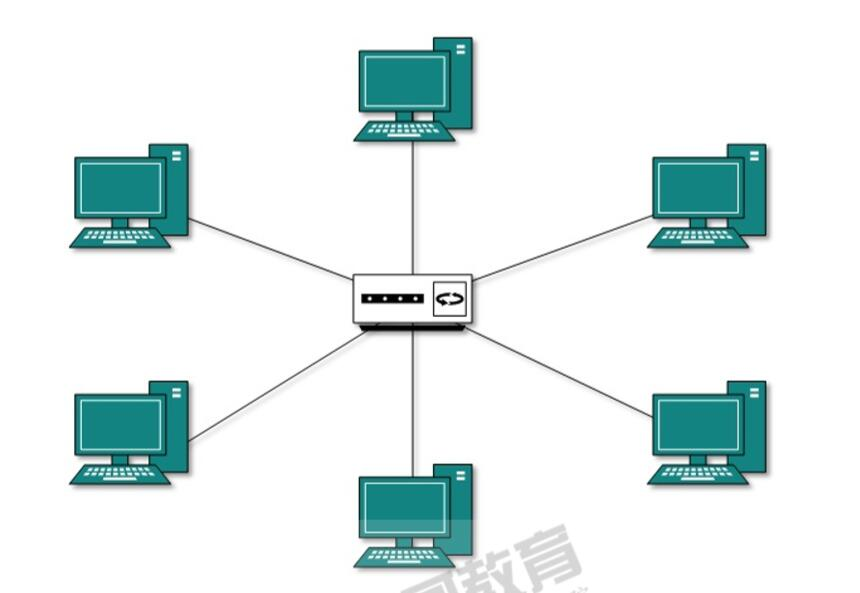

# 网络基础

@[toc]

## 网络概念

1. 什么是网络？
    * 网络是由结点和连线构成的**图**，表示诸多对象及其关系。
2. 什么是计算机网络
    * 计算机网络指的是将地理位置不同的具有独立功能的多台计算机及其外部设备，通过通信线路物理连接（包括有 线、无线连接），并在网络操作系统、网络管理软件和网络通信协议的管理和协调下，实现**资源共享**和**信息传递**的计算机系统。  
3. 带宽
    * 在数字设备中，指的是单位时间数据的传输量。
    * 网络传输习惯上使用比特率，即bps每秒传输的二进制位数。

## 拓扑

### 总线型  

  
所有设备都连接到公共总线上，结点间使用广播通信方式。一个结点发出的信息，总线上所有其他结点都可以接收 到。一段时间只允许一个结点独占总线。  
常见使用同轴电缆连接，总线两端需要终结器。  

1. 优点
    * 结构简单、易于实现
    * 易于扩充，增加或者移除结点比较灵活
    * 可靠性较高，个别结点发生故障时，不影响网络中其他结点的正常工作
2. 缺点
    * 网络传输能力低，安全性低，总线发生故障时，会导致全网瘫痪。
    * 所有数据都需要经过总线传输，总线是整个网络的瓶颈。结点数量的增多会影响网络性能。

### 环形结构

  
环形结构是将联网的计算机由通信线路连接成一个闭合的环，在环形结构网络中信息按照固定方向流动，或顺时针 方向，或逆时针方向。  

* 优点：令牌控制，没有线路竞争，实时性强，传输控制容易  
* 缺点：维护困难，可靠性不高。一个结点发生故障时，可能导致全网瘫痪。可以使用双环拓扑结构，但是复杂性提 升。

## 星型拓扑

  
每个结点都由一条单独的通信线路与中心结点连结。其他各结点都与该中心结点有着物理链路的直接互连，其他结 点直接不能直接通信，其他结点直接的通信需要该中心结点进行转发。因此中心结点必须有着较强的功能和较高的 可靠性。需要中心设备，例如hub、switch、router  

* 优点：可靠性高，方便管理，易于扩展，传输效率高
* 缺点：线路利用率低，中心节点需要很高的可靠性和冗余度
* **注意**，hub工作在一层，这种星型实际上就是芯片化的总线网络。只是物理拓扑结构上感觉像是星型。  

## OSI参考模型(网络七成协议)

OSI是Open System Interconnection的缩写，意为开放式系统互联。国际标准化组织（ISO）制定了OSI模型，该 模型定义了不同计算机互联的标准，是设计和描述计算机网络通信的基本框架。OSI模型把网络通信的工作分为7 层，分别是物理层、数据链路层、网络层、传输层、会话层、表示层和应用层。  
  
  

* **物理层(第一层)**：定义了电气规范，设备规范、物理接口等，电信号的变化，或数字信号变化，**比特**。
* **数据链路层(第二层)**:将**比特**组织成**帧**，即对字节进行定义，支持错误检查。使用物理地址、**MAC地址**。MAC有48位，前24位厂商编号由IEEE分配，后24位设备序号。
* **网络层(第三层)**：将**帧**组织成**包**，包传递的路径选择（路由），将包传输到目标地址。使用逻辑地址、**IP地址**。
* **传输层(第四层)**：解决传输的问题，确保数据传输的可靠性；建立、维护、终止虚拟电路；错误检测和恢复。
* **会话层(第五层)**：建立、管理、终止应用程序间的逻辑通路，即会话
* **表示层(第六层)**：对应用数据格式化、加密解密等。将上层数据转换为适合网络传输的格式，或将下层数据转化为上 层能够处理的数据。  
* **应用层(第七层)**：为应用程序提供网络服务接口，用户使用的时候并不关心会话如何建立保持，也不关心协议 的协商是否加密等。

### 数据传输

  

* 数据很大，在应用层切分，每一份数据都会在下一层被封装。  
* 在数据链路层会增加tail即校验位，后在物理层上都是电平信号0、1发送出去。  
* 到了对端设备，由下至上逐层解包组合。直到合成并还原应用层的一份数据。

