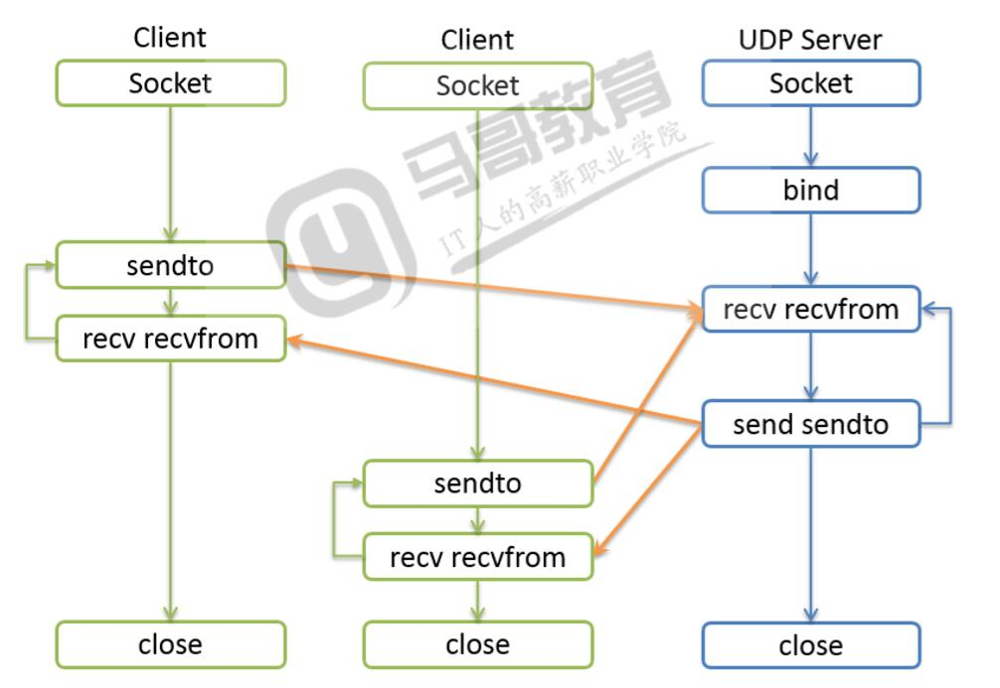
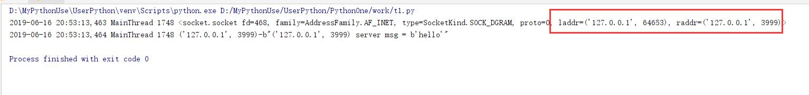
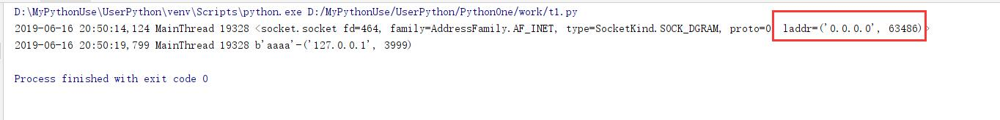

# UDP编程与Socket

@[toc]

* 相关测试命令
    1. windows查找udp是否启动端口：
        * `netstart -anp udp | find "9999"`
        * `netstart -anbp udp | findstr 9999`
    2. linux下发给服务端数据
        * `echo "123abc" | nc -u 172.0.0.1 9999`

## UDP服务端编程

* **UDP服务端编程流程**
  

1. 创建socket对象。socket.SOCK_DGRAM
2. 绑定IP和Port,bind()方法
3. 传输数据
    * 接收数据，socket.recvfrom(bufsize[,flags]),获得一个二元组(string,address)
    * 发送数据，socket.sendto(string,address)发给某地址某信息
4. 释放资源

````python
import logging
import sys
import socket

logging.basicConfig(format="%(asctime)s %(threadName)s %(thread)d %(message)s",stream=sys.stdout,level=logging.INFO)

server = socket.socket(type=socket.SOCK_DGRAM) #创建一个基于UDP的socket
server.bind(("127.0.0.1",3999)) #立即绑定一个udp端口
# data = server.recv(1024) #阻塞等待数据
data,radde = server.recvfrom(1024) #阻塞等待数据(value,(ip,port))
logging.info("{}-{}".format(radde,data))
server.sendto("{} server msg = {}".format(server.getsockname(),data).encode(),radde)
server.close()
````

* **UDP客户端编写流程**
    1. 创建socket对象。socket.SOCK_DGRAM
    2. 发送数据，socket_sendto(string,address)发给某地址信息
    3. 接收数据，socket.recvfrom(bufsize[,flags]),获得一个二元组(string,address)
    4. 释放资源

* 第一个版本

````python
import logging
import sys
import socket

logging.basicConfig(format="%(asctime)s %(threadName)s %(thread)d %(message)s",stream=sys.stdout,level=logging.INFO)

client = socket.socket(type=socket.SOCK_DGRAM)
raddr = "127.0.0.1",3999
client.connect(raddr) #connect方法会自动分配一个本地的UDP地址，和设置UDP的链接对象raddr地址
logging.info(client)
client.send(b"hello") #由于使用了connect方法，所以不指定终端也能发送
client.sendto(b"why",raddr) #也可以使用指定地址发送
data,radde = client.recvfrom(1024)
logging.info("{}-{}".format(radde,data))
client.close()
````

  

* 第二个版本，不使用connect指定目标

````python
import logging
import sys
import socket

logging.basicConfig(format="%(asctime)s %(threadName)s %(thread)d %(message)s",stream=sys.stdout,level=logging.INFO)

client = socket.socket(type=socket.SOCK_DGRAM)
raddr = "127.0.0.1",3999
client.sendto(b"hello",raddr)
logging.info(client)
data,laddr = client.recvfrom(1024)
logging.info("{}-{}".format(data,laddr))
client.close()
````

  

* **注意**：UDP是无链接协议，所以可以只有任何一端，例如客户端数据发往服务端，服务端存在与否无所谓。
* UDP编程中bind、connect、send、sendto、recv、recvfrom方法使用
* UDP的socket对象创建后，是没有占用本地地址和端口的。

|方法|说明|
|:----|:-----|
bind(laddr)|可以指定本地地址和端口laddr,会立即占用，laddr为一个元组，(ip,prot)
connect(raddr)|会随机分配一个本地的端口laddr,会绑定远端地址和端口raddr，raddr是个元组，(ip,prot)
sendto(msg,raddr)|可以立即占用本地地址和端口laddr,并把数据发往指定远端。只有有了本地绑定的端口，sendto就可以向任何远端发送数据<br/>msg #要发送的数据。bytes类型。<br/>raddr#远端地址和端口组成的一个元组(ip，prot)
send(msg)|需要和connect方法配合，可以使用已经从本地端口把数据发往**raddr**指定的远端<br/>msg#需要发送的消息bytes类型
recv(buffersize)|要求一定要在占用了本地端口后，返回接受的数据,buffersize指定一个缓冲区大小
recvfrom(buffersize)|要求一定要占用了本地端口后，返回接收的数据和对端地址的二元组(msg,raddr)<br/>buffersize指定一个缓冲区大小。


