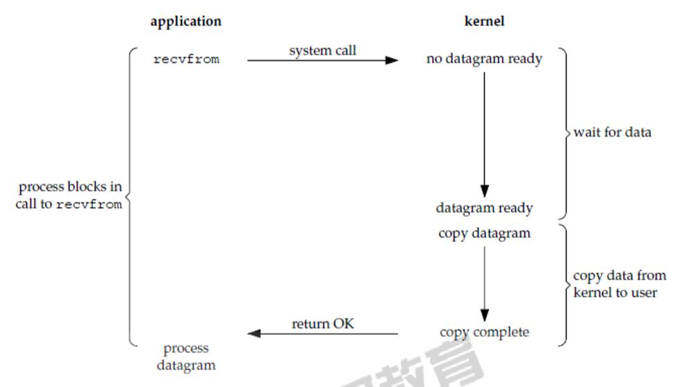
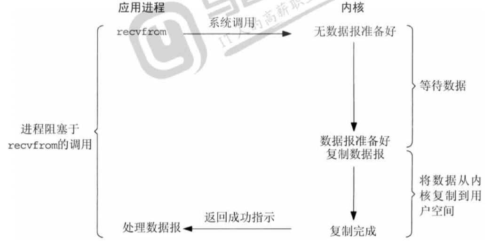

# IO多路复用

## 同步IO、异步IO、IO多路复用

### IO两个阶段

* IO过程分两阶段：
    1. 数据准备阶段。从设备读取数据到内核空间的缓冲区
    2. 内核空间复制回用户空间进程缓冲区阶段
* 发生IO的时候：
    1. 内核从IO设备读数据(例如：淘米，把米放在饭锅里煮饭)
    2. 进程从内核复制数据(盛饭，从内核这个饭锅里把饭装到碗里来)
* 系统调用----read函数

### IO模型

#### 同步IO

同步IO模型包括**阻塞IO**、**非阻塞IO**、**IO多路复用**

1. **阻塞IO**：进程等待(阻塞)，直到读写完成。(全程等待)  
      
    中文版  
      

