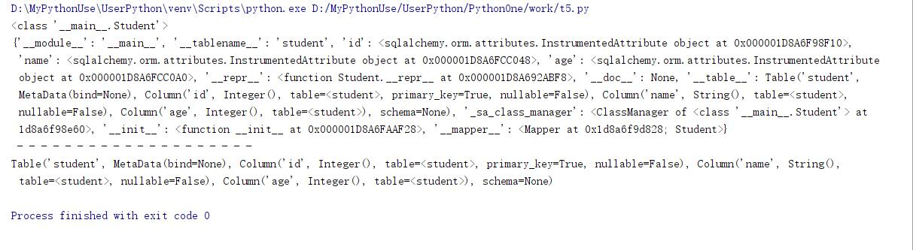

# SQLAlchemy框架的使用

## ORM

ORM,对象关系映射，对象和关系之间的映射，使用面向对象的凡是来操作数据库。

````txt
关系模型和Python对象之间的映射
table   =>  class       #表映射为类
row     =>  object      #行映射为示例
column  =>  property    #字段映射为属性
````  

举例  

1. 有表student，字段为id int，name varchar，age int 
2. 映射到Python为：

````python
class Student:
    id = ?某类型字段
    name = ?某类型字段
    age = ?某类型字段

# 最终得到的实例
class Student:
    def __init__(self):
        self.id = ?
        self.name = ?
        self.age = ?
````

## SQLAlchemy

* SQLAlchemy是一个ORM框架
* 安装 `pip install sqlalchemy`
* 官方文档 [https://docs.sqlalchemy.org/en/13/](https://docs.sqlalchemy.org/en/13/)  
* 查看当前版本

    ````python
    import sqlalchemy
    print(sqlalchemy.__version__)
    ````

* SQLAlchemy内部使用了连接池

### 1.创建连接

数据库连接的事情，交给引擎  

1. sqlalchemy.create_engine(sqlstr,echo=False) #创建连接数据库引擎
    * sqlstr #连接数据库字符串
        * 格式为：`pymysql的链接方式 mysql+pymysql://<username>:<password>@<host>[:<port>]/<dbname>[?<options>]`
    * echo 是否打印执行的sql语句，默认False,不打印
2. **注意**：engine是lazy  connecting。惰性连接。创建引擎并不会马上连接数据库，直到让数据库执行任务时才连接。

````python
import sqlalchemy

user = "xdd"
password = "xdd"
host = "127.0.0.1"
port = "3306"
dbname = "xdd"

# mysqldb连接 mysql+mysqldb://<user>:<password>@ <host>[:<port>]/<dbname>
mysqldb = "mysql+mysqldb://{user}:{password}@{host}:{port}/{dbname}".format(
    user = user,
    password = password,
    host=host,
    port= port,
    dbname = dbname
)
print(mysqldb)

# pymysql的链接方式 mysql+pymysql://<username>:<password>@<host>[:<port>]/<dbname>[?<options>]
pymysql = "mysql+pymysql://{}:{}@{}:{}/{}".format(user,password,host,port,dbname)
print(pymysql)
# sqlalchemy.create_engine(pymysql)
# echo表示引擎是否打印执行的SQl语句。方便调试
# engine = sqlalchemy.create_engine(mysqldb,echo=True)
engine = sqlalchemy.create_engine(pymysql,echo=True)
````

### 2.Declare a Mapping创建映射

#### 创建基类

````python
from sqlalchemy.ext.declarative import declarative_base
# 创建基类，便于实体类继承。SQLAlchem大量使用了元编程
Base = declarative_base()
````

#### 创建实体类

1. **student表对于的sql语句**

    ````sql
    CREATE TABLE student (
        `id` INTEGER NOT NULL AUTO_INCREMENT,
        `name` VARCHAR(64) NOT NULL,
        `age` INTEGER,
        PRIMARY KEY (`id`)
    )
    ````

2. **python中类的构建**
    * 必须继承`Base = declarative_base()`类
    * `__tablename__`指定表名
    * Column类指定对于的字段，必须指定

    ````python
    from sqlalchemy import Column,Integer,String
    from sqlalchemy.ext.declarative import declarative_base

    # 创建基类，便于实体类继承。SQLAlchem大量使用了元编程
    Base = declarative_base()

    # 创建实体类
    class Student(Base):
        # 指定表名
        __tablename__ = 'student'
        #定义类属性对应字段
        id = Column(Integer,primary_key=True,autoincrement=True)
        name = Column(String(64),nullable=False)
        age = Column(Integer)
        # 注意：Column中第一参数是字段名，如果和属性名不一致，一定要指定
        # age1 = Column("age",Integer)

        def __repr__(self):
            return "{} id={} name={} age={}".format(
                self.__class__.__name__,self.id,self.name,self.age
            )

    print(Student)
    print(Student.__dict__)
    print(" -"*20)
    print(repr(Student.__table__))
    ````

      
3. **实例化**
    * 实例化时，如果需要指定属性值，必须使用关键字传参

    ````python
    # 如果需要指定属性，必须使用关键字传参
    s = Student(name="tom")
    print(s.name)
    s.age = 20
    print(s.age)
    print(s)
    ````

      
4. **创建表**  
    * 可以使用SQLAlchemy来创建、删除表
    * 生产环境中很少这样创建表，都是系统上线的时候由脚本生成。
    * 生产环境很少删除表，宁可废弃都不能删除。

    ````python
    # 删除继承自Base的所有表
    Base.metadata.drop_all(engine)
    # 创建继承自Base的所有表
    Base.metadata.create_all(engine)
    ````

    * 创建删除表的完整代码

    ````python
    import sqlalchemy
    from sqlalchemy import Column,Integer,String
    from sqlalchemy.ext.declarative import declarative_base

    user = "xdd"
    password = "xdd"
    host = "127.0.0.1"
    port = "3306"
    dbname = "xdd"

    # 创建基类，便于实体类继承。SQLAlchem大量使用了元编程
    Base = declarative_base()

    # 创建实体类
    class Student(Base):
        # 指定表名
        __tablename__ = 'student'
        #定义类属性对应字段
        id = Column(Integer,primary_key=True,autoincrement=True)
        name = Column(String(64),nullable=False)
        age = Column(Integer)
        # 注意：Column中第一参数是字段名，如果和属性名不一致，一定要指定
        # age1 = Column("age",Integer)

        def __repr__(self):
            return "{} id={} name={} age={}".format(
                self.__class__.__name__,self.id,self.name,self.age
            )

    # pymysql的链接方式 mysql+pymysql://<username>:<password>@<host>[:<port>]/<dbname>[?<options>]
    pymysql = "mysql+pymysql://{}:{}@{}:{}/{}".format(user,password,host,port,dbname)
    engine = sqlalchemy.create_engine(pymysql,echo=True)

    # 删除继承自Base的所有表
    Base.metadata.drop_all(engine)
    # 创建继承自Base的所有表
    Base.metadata.create_all(engine)
    ````

      

#### 创建会话session

1. 在一个会话操作数据库，会话建立在链接上，链接被引擎管理。当第一次使用数据库时，从引擎维护的链接池中获取一个连接使用。
    * **session对象线程不安全，所以不同线程应该使用不同的session对象**
    * Session类和engine有一个就行了。

````python
# 导入sessionmaker模块
from sqlalchemy.orm import sessionmaker
# 创建session
Session = sessionmaker(bind = engine)
session = Session()
````

#### CRUD操作

1. **增加**
    * add():增加一个对象
    * add_all():可迭代对象，元素是对象

    ````python
    import sqlalchemy
    from sqlalchemy import Column,Integer,String
    from sqlalchemy.ext.declarative import declarative_base
    # 导入sessionmaker模块
    from sqlalchemy.orm import sessionmaker

    user = "xdd"
    password = "xdd"
    host = "127.0.0.1"
    port = "3306"
    dbname = "xdd"

    # 创建基类，便于实体类继承。SQLAlchem大量使用了元编程
    Base = declarative_base()

    # 创建实体类
    class Student(Base):
        # 指定表名
        __tablename__ = 'student'
        #定义类属性对应字段
        id = Column(Integer,primary_key=True,autoincrement=True)
        name = Column(String(64),nullable=False)
        age = Column(Integer)
        # 注意：Column中第一参数是字段名，如果和属性名不一致，一定要指定
        # age1 = Column("age",Integer)

        def __repr__(self):
            return "{} id={} name={} age={}".format(
                self.__class__.__name__,self.id,self.name,self.age
            )

    # pymysql的链接方式 mysql+pymysql://<username>:<password>@<host>[:<port>]/<dbname>[?<options>]
    pymysql = "mysql+pymysql://{}:{}@{}:{}/{}".format(user,password,host,port,dbname)
    engine = sqlalchemy.create_engine(pymysql,echo=True)
    # 创建session
    session = sessionmaker(bind = engine)()

    s = Student(name="tom")
    s.age = 20
    print(s)

    session.add(s)
    print(s)
    session.commit()
    print(s)
    print(" -"*30)

    try:
        session.add_all([s])
        print(s)
        session.commit()
        print("~ " * 30)
        print(s)
        print("~ " * 30)
    except:
        session.rollback()
        print("roll back")
        raise
    ````

      
    * add_all()方法不会提交成功的，不是因为它不对。而是s,s成功提交后，s的主键就有了值，所以，只要s没有修改过，就认为没有改动，如下,s变化了，就可以提交修改了。

    ````python
    s.name = 'jerry' #修改
    session.add_all([s])
    session.commit()
    ````

    * s主键没有值，就是新增；主键有值，就是找到主键对应的记录修改。

2. **简单查询**
    * 使用query()方法，返回一个Query对象
    * query方法将实体类传入，返回类的对象可迭代对象，这时候并不查询。迭代它就执行SQL来查询数据库，封装数据到指定类的实例。
    * get方法使用主键查询，返回一条传入类的一个实例。

    * 查询整个表

    ````python
    # 查询
    students = session.query(Student)
    print("- "*30)
    print(students) #无内容，惰性的
    print("- "*30)
    for student in students:
        print(student)
    print("- "*30)
    ````

      

    * 使用get方法查询，主键查询

    ````python
    # 创建session
    session = sessionmaker(bind = engine)()
    # 查询
    student = session.query(Student).get(8)
    print(student)
    ````

      

3. **改**
    * 先查回来，修改后，再提交更改

    ````python
    # 创建session
    session = sessionmaker(bind = engine)()
    # 查询
    student = session.query(Student).get(8)
    print(student)
    student.name = "sum"
    student.age = 30
    session.add(student)
    session.commit()
    print(student)
    ````

      

4. **删除**
    * 先查询后删除

    ````python
    # 创建session
    session = sessionmaker(bind = engine)()
    # 查询
    student = session.query(Student).get(3)
    print(student)
    session.delete(student)
    session.commit()
    student = session.query(Student).get(3)
    print(student)
    ````

#### 实体对象的状态

* 每一个实体，都有一个状态属性`_sa_instance_state`,其类型是sqlalchemy.orm.state.InstanceState,可以使用sqlalchemy.inspect(entity)函数查看状态。  
* 常见的状态值有transient、pending、persistent、deleted、detached。

|状态|说明|
|:--------|:-----------|
transient|实体类尚未加入到session中，同时并没有保存到数据库中
pending|transient的实体被add()到session中，状态切换到pending,但它还没有flush到数据库中
persistent|session中的实体对象对应着数据库中的真实记录。pending状态在提交成功后可以变成persistent状态，或者查询成功返回的实体也是persistent状态
deleted|实体被删除且已经flush但未commit完成。事务提交成功了，实体变成detached,事务失败，返回persistent状态
detached|删除成功的实体状态进入这个状态

* **新建实体**，状态是transient。临时的
* **add()**,添加后从transient状态变成pending状态
* **commit()**,提交后，从pending状态变成persistent(持久化)状态
* 成功查询返回的实体对象，也是persistent状态

* persistent状态的实体，修改依然是persistent状态。
* persistent状态的实体，删除后，flush后但没有commit，就变成deteled状态。
    1. 成功提交后，变为detached状态
    2. 提交失败后，还会还原到persistent状态。
* flush方法，主动把改变应用到数据库中去。
* **删除、修改**操作，需要对应一个真实的记录，所以要求实体对象是persistent状态。

* 综合示例

````python
import sqlalchemy
from sqlalchemy import Column,Integer,String
from sqlalchemy.ext.declarative import declarative_base
# 导入sessionmaker模块
from sqlalchemy.orm import sessionmaker
from sqlalchemy.orm.state import InstanceState

user = "xdd"
password = "xdd"
host = "127.0.0.1"
port = "3306"
dbname = "xdd"

# 创建基类，便于实体类继承。SQLAlchem大量使用了元编程
Base = declarative_base()

# 创建实体类
class Student(Base):
    # 指定表名
    __tablename__ = 'student'
    #定义类属性对应字段
    id = Column(Integer,primary_key=True,autoincrement=True)
    name = Column(String(64),nullable=False)
    age = Column(Integer)
    # 注意：Column中第一参数是字段名，如果和属性名不一致，一定要指定
    # age1 = Column("age",Integer)

    def __repr__(self):
        return "{} id={} name={} age={}".format(
            self.__class__.__name__,self.id,self.name,self.age
        )

# pymysql的链接方式 mysql+pymysql://<username>:<password>@<host>[:<port>]/<dbname>[?<options>]
pymysql = "mysql+pymysql://{}:{}@{}:{}/{}".format(user,password,host,port,dbname)
engine = sqlalchemy.create_engine(pymysql,echo=False)
# 创建session
session = sessionmaker(bind = engine)()

#显示每个实体的状态信息
def showstat(student,i):
    print("- "*40)
    print(student)
    stat:InstanceState = sqlalchemy.inspect(student)
    print("{}:key={}\nsid={},attached={},transient={},pending={}\npersistent={},deleted={},detached={}".format(
        i,stat.key,
        stat.session_id,stat._attached,stat.transient,stat.pending,
        stat.persistent,stat.deleted,stat.detached
    ))
    print("~ "*40)


student = session.query(Student).get(1)
showstat(student,"查询后的实体状态") # persistent

try:
    student = Student(id=1,name="jum",age=19)
    showstat(student,"实例化的实体状态") #transient,id会是指定的值

    student = Student(name="xdd",age=26)
    showstat(student,"实例化的实体状态") #transient

    session.add_all([student]) #add后变成pending
    showstat(student,"add后的状态") #pending
    # session.delete(student) #异常，删除的前提必须是persistent,也就是说先查询后删除
    # showstat(student,"删除后的状态")

    session.commit() #提交后变成persistent
    showstat(student,"commit提交后的状态") #persistent

except Exception as e:
    session.rollback()
    print(e,"~~~~~~~~~~~~~~~~")
````

  

* 只有提交过后，或者查询出来的实体对象才有key，实例化的未提交的对象key值为None

* 如果将上述核心代码改为如下：

````python
student = session.query(Student).get(1)
showstat(student,"查询后的实体状态") # persistent

try:
    session.delete(student) #删除的前提是persistent
    showstat(student,"删除后的状态") #persistent

    session.flush()
    showstat(student,"flush后的状态") #deleted

    session.commit()
    showstat(student,"commit后的状态") #detached 删除后没有了sid

except Exception as e:
    session.rollback()
    print(e,"~~~~~~~~~~~~~~~~")
````

  

### 复杂查询

* 数据库中sql脚本为：

````sql
CREATE TABLE `employees` (
    `emp_no` int(11) NOT NULL,
    `birth_date` date NOT NULL,
    `first_name` varchar(14) NOT NULL,
    `last_name` varchar(16) NOT NULL,
    `gender` enum('M','F') NOT NULL,
    `hire_date` date NOT NULL,
    PRIMARY KEY (`emp_no`)
) ENGINE=InnoDB DEFAULT charset = utf8;

INSERT INTO `xdd`.`employees`(`emp_no`, `birth_date`, `first_name`, `last_name`, `gender`, `hire_date`) VALUES (10001, '1953-09-02', 'Georgi', 'Facello', 'M', '1986-06-26');
INSERT INTO `xdd`.`employees`(`emp_no`, `birth_date`, `first_name`, `last_name`, `gender`, `hire_date`) VALUES (10002, '1964-06-02', 'Bezalel', 'Simmel', 'F', '1985-11-21');
INSERT INTO `xdd`.`employees`(`emp_no`, `birth_date`, `first_name`, `last_name`, `gender`, `hire_date`) VALUES (10003, '1959-12-03', 'Parto', 'Bamford', 'M', '1986-08-28');
INSERT INTO `xdd`.`employees`(`emp_no`, `birth_date`, `first_name`, `last_name`, `gender`, `hire_date`) VALUES (10004, '1954-05-01', 'Chirstian', 'Koblick', 'M', '1986-12-01');
INSERT INTO `xdd`.`employees`(`emp_no`, `birth_date`, `first_name`, `last_name`, `gender`, `hire_date`) VALUES (10005, '1955-01-21', 'Kyoichi', 'Maliniak', 'M', '1989-09-12');
INSERT INTO `xdd`.`employees`(`emp_no`, `birth_date`, `first_name`, `last_name`, `gender`, `hire_date`) VALUES (10006, '1953-04-20', 'Anneke', 'Preusig', 'F', '1989-06-02');
INSERT INTO `xdd`.`employees`(`emp_no`, `birth_date`, `first_name`, `last_name`, `gender`, `hire_date`) VALUES (10007, '1957-05-23', 'Tzvetan', 'Zielinski', 'F', '1989-02-10');
INSERT INTO `xdd`.`employees`(`emp_no`, `birth_date`, `first_name`, `last_name`, `gender`, `hire_date`) VALUES (10008, '1958-02-19', 'Saniya', 'Kalloufi', 'M', '1994-09-15');
INSERT INTO `xdd`.`employees`(`emp_no`, `birth_date`, `first_name`, `last_name`, `gender`, `hire_date`) VALUES (10009, '1952-04-19', 'Sumant', 'Peac', 'F', '1985-02-18');
INSERT INTO `xdd`.`employees`(`emp_no`, `birth_date`, `first_name`, `last_name`, `gender`, `hire_date`) VALUES (10010, '1963-06-01', 'Duangkaew', 'Piveteau', 'F', '1989-08-24');
INSERT INTO `xdd`.`employees`(`emp_no`, `birth_date`, `first_name`, `last_name`, `gender`, `hire_date`) VALUES (10011, '1953-11-07', 'Mary', 'Sluis', 'F', '1990-01-22');
INSERT INTO `xdd`.`employees`(`emp_no`, `birth_date`, `first_name`, `last_name`, `gender`, `hire_date`) VALUES (10012, '1960-10-04', 'Patricio', 'Bridgland', 'M', '1992-12-18');
INSERT INTO `xdd`.`employees`(`emp_no`, `birth_date`, `first_name`, `last_name`, `gender`, `hire_date`) VALUES (10013, '1963-06-07', 'Eberhardt', 'Terkki', 'M', '1985-10-20');
INSERT INTO `xdd`.`employees`(`emp_no`, `birth_date`, `first_name`, `last_name`, `gender`, `hire_date`) VALUES (10014, '1956-02-12', 'Berni', 'Genin', 'M', '1987-03-11');
INSERT INTO `xdd`.`employees`(`emp_no`, `birth_date`, `first_name`, `last_name`, `gender`, `hire_date`) VALUES (10015, '1959-08-19', 'Guoxiang', 'Nooteboom', 'M', '1987-07-02');
INSERT INTO `xdd`.`employees`(`emp_no`, `birth_date`, `first_name`, `last_name`, `gender`, `hire_date`) VALUES (10016, '1961-05-02', 'Kazuhito', 'Cappelletti', 'M', '1995-01-27');
INSERT INTO `xdd`.`employees`(`emp_no`, `birth_date`, `first_name`, `last_name`, `gender`, `hire_date`) VALUES (10017, '1958-07-06', 'Cristinel', 'Bouloucos', 'F', '1993-08-03');
INSERT INTO `xdd`.`employees`(`emp_no`, `birth_date`, `first_name`, `last_name`, `gender`, `hire_date`) VALUES (10018, '1954-06-19', 'Kazuhide', 'Peha', 'F', '1987-04-03');
INSERT INTO `xdd`.`employees`(`emp_no`, `birth_date`, `first_name`, `last_name`, `gender`, `hire_date`) VALUES (10019, '1953-01-23', 'Lillian', 'Haddadi', 'M', '1999-04-30');
INSERT INTO `xdd`.`employees`(`emp_no`, `birth_date`, `first_name`, `last_name`, `gender`, `hire_date`) VALUES (10020, '1952-12-24', 'Mayuko', 'Warwick', 'M', '1991-01-26');
````

1. **构建对应实体类**

    ````python
    import sqlalchemy
    from sqlalchemy import Column,Integer,String,DATE,Enum
    import enum
    from sqlalchemy.ext.declarative import declarative_base
    # 导入sessionmaker模块
    from sqlalchemy.orm import sessionmaker


    user = "xdd"
    password = "xdd"
    host = "127.0.0.1"
    port = "3306"
    dbname = "xdd"

    # 创建基类，便于实体类继承。SQLAlchem大量使用了元编程
    Base = declarative_base()

    class MyEnum(enum.Enum):
        M = 'M'
        F = 'F'

    class Employees(Base):
        __tablename__ = "employees"

        emp_no = Column(Integer,primary_key=True)
        birth_date = Column(DATE,nullable=False)
        first_name = Column(String(14),nullable=False)
        last_name = Column(String(16),nullable=False)
        gender = Column(Enum(MyEnum),nullable=False)
        hire_date = Column(DATE,nullable=False)

        def __repr__(self):
            ref = "{} no={} name={} {} gender={}".format(
                self.__class__.__name__,self.emp_no,self.first_name,self.last_name,self.gender.value
            )
            return ref

    # 打印函数
    def show(emps):
        for x in emps:
            print(x)
        print(" -"*30,"\n")

    # pymysql的链接方式 mysql+pymysql://<username>:<password>@<host>[:<port>]/<dbname>[?<options>]
    pymysql = "mysql+pymysql://{}:{}@{}:{}/{}".format(user,password,host,port,dbname)
    engine = sqlalchemy.create_engine(pymysql,echo=True)
    # 创建session
    session = sessionmaker(bind=engine)()
    ````

    **注意**：下面查询都会基于上面这段代码

2. **简单where条件查询**

    ````python
    # where 条件查询
    emps = session.query(Employees).filter(Employees.emp_no == 10001)
    # emps = session.query(Employees).filter(Employees.emp_no > 10015)
    show(emps)
    ````

      

3. **and条件**

    ````python
    # 与或非
    from sqlalchemy import and_

    # and 条件
    emps1 = session.query(Employees).filter(Employees.emp_no > 10015).filter(Employees.emp_no <10018)
    show(emps1)
    emps2 = session.query(Employees).filter(Employees.emp_no > 10015,Employees.emp_no <10018)
    show(emps2)
    emps3 = session.query(Employees).filter(and_(Employees.emp_no > 10015,Employees.emp_no <10018))
    show(emps3)
    emps4 = session.query(Employees).filter((Employees.emp_no > 10015) & (Employees.emp_no <10018))
    show(emps4) # & 一定要注意&符号两边的表达式都要加括号
    ````

      

4. **or条件**

    ````python
    from sqlalchemy import or_

    # or条件
    emps1 = session.query(Employees).filter(or_(Employees.emp_no > 10018,Employees.emp_no <10005))
    show(emps1)
    emps2 = session.query(Employees).filter((Employees.emp_no > 10018) | (Employees.emp_no <10005))
    show(emps2)
    ````

      

5. **not条件**

    ````python
    from sqlalchemy import not_

    # not条件
    emps1 = session.query(Employees).filter(not_(Employees.emp_no < 10018))
    show(emps1)
    # 注意：一定要加括号
    emps2 = session.query(Employees).filter(~(Employees.emp_no < 10018))
    show(emps2)
    # 总之，与或非的运算符&，|，~，一定要在表达式 上加上括号
    ````

      

6. **in条件**

    ````python
    # in条件
    emps1 = session.query(Employees).filter(Employees.emp_no.in_([10010,10011,10012]))
    show(emps1)
    ````

      

7. **not in 条件**

    ````python
    # not in条件
    from sqlalchemy import not_

    emplist = [10010,10011,10012,10013,10014,10015,10016,10017,10018,10019,10001,10002,10003,10004,10005,10006]
    emps1 = session.query(Employees).filter(Employees.emp_no.notin_(emplist))
    show(emps1)
    emps2 = session.query(Employees).filter(~Employees.emp_no.in_(emplist))
    show(emps2)
    emps3 = session.query(Employees).filter(not_(Employees.emp_no.in_(emplist)))
    show(emps3)
    ````

      

8. **like与not like条件**
    * **ilike**可以忽略大小写

    ````python
    # like与not like条件
    emps = session.query(Employees).filter(Employees.last_name.like("m%"))
    show(emps)
    emps = session.query(Employees).filter(Employees.last_name.notlike("m%"))
    show(emps)
    ````

      

9. **排序**

    ````pyton
    # 排序升序
    emps = session.query(Employees).filter(Employees.emp_no >10015).order_by(Employees.emp_no.asc())
    show(emps)
    # 排序降序
    emps = session.query(Employees).filter(Employees.emp_no >10015).order_by(Employees.emp_no.desc())
    show(emps)
    # 多列排序
    emps = session.query(Employees).filter(Employees.emp_no >10015).order_by(Employees.emp_no.desc()).order_by(Employees.last_name.desc())
    show(emps)
    emps = session.query(Employees).filter(Employees.emp_no >10015).order_by(Employees.emp_no.desc(),Employees.first_name.desc())
    show(emps)
    ````

      

10. **分页**

    ````python
    # 分页
    emps = session.query(Employees).filter(Employees.emp_no >10010).limit(4)
    show(emps)
    emps = session.query(Employees).filter(Employees.emp_no >10010).limit(4).offset(2)
    show(emps)
    ````

      

11. **消费者方法**
    * 消费者方法调用后，Query对象(可迭代)就转换成了一个容器

    ````python
    # 总行数
    emps = session.query(Employees)
    print(len(list(emps))) #查询得到结果集，转换成list,然后取长度
    print(emps.count()) #聚合函数count(*)的查询

    # 取所有数据
    print(emps.all()) #返回列表，查不到返回空列表

    # 取首行
    print(emps.first()) #返回首行，查不到返回None,等驾驭limit

    # 有且只能有一行
    # print(emps.one()) #如果查询结果是多行抛出异常
    print(emps.limit(1).one())

    # 删除 delete by query
    session.query(Employees).filter(Employees.emp_no > 10018).delete()
    # session.commit() # 提交删除
    ````

12. **聚合函数count,max,min,avg**
    * 需要使用模块func `from sqlalchemy import func`

    ````python
    # 聚合函数
    from sqlalchemy import func

    query = session.query(func.count(Employees.emp_no))
    print(query.all()) #列表中一个元素
    print(query.first()) #一个只能有一个元素的元组
    print(query.one()) #只能有一行返回，一个元组
    print(query.scalar()) #取one()的第一个元素

    print(session.query(func.max(Employees.emp_no)).scalar())
    print(session.query(func.min(Employees.emp_no)).scalar())
    print(session.query(func.avg(Employees.emp_no)).scalar())
    ````

      

13. **分组**

    ````python
    # 聚合函数
    from sqlalchemy import func
    query = session.query(Employees.gender,func.count(Employees.emp_no),
                        func.max(Employees.emp_no)).group_by(Employees.gender)

    for g,c,m in query.all():
        print(g.value,c,m)
    ````

      


