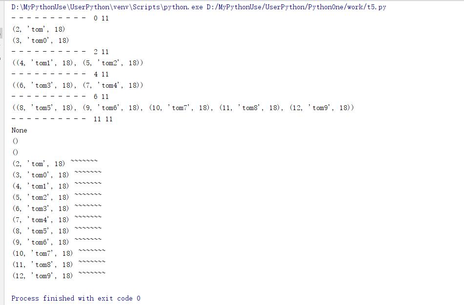
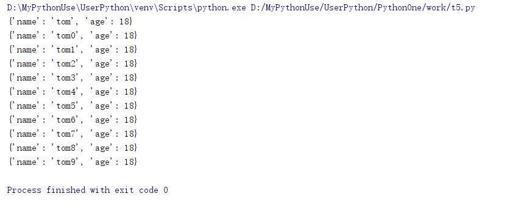
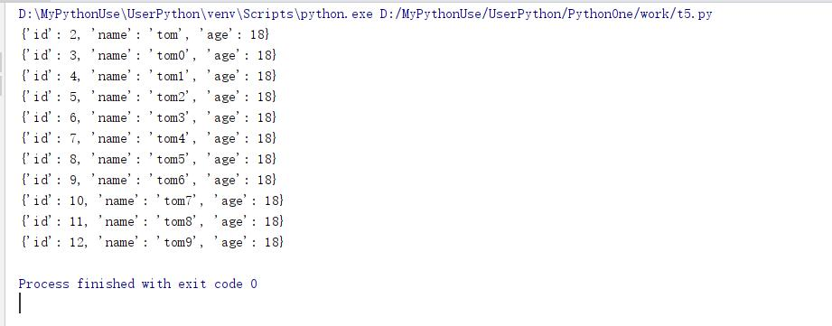
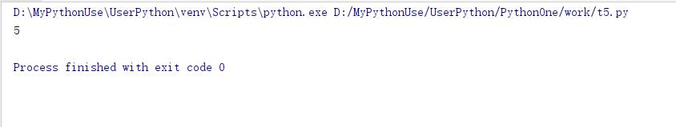

# pymysql模块的使用

@[toc]

## 数据库开发

* **驱动**  
Mysql基于TCP协议之上开发，但是网络连接后，传输的数据必须遵循MySQL的协议。封装好MySQL协议的包，就是驱动程序。

1. MySQL的驱动
    * MySQLdb:有名的库，对MySQL的client封装实现，支持Python2，不更新了，不支持Python3
    * MySQL官方Connector
        * Mysql官网[https://dev.mysql.com/downloads/connector/](https://dev.mysql.com/downloads/connector/)
    * pymysql:语法兼容MySQLdb,使用Python写的库，支持Python3

## pymysql的使用

**安装**: `pip install pymysql`  

* 创建数据库和表

````sql
CREATE DATABASE IF NOT EXISTS xdd;
USE xdd;

CREATE TABLE `student`(
    `id` int(11) not null AUTO_INCREMENT,
    `name` varchar(30) not null,
    `age` int(11) DEFAULT null,
    primary key (`id`)
) ENGINE=InnoDB DEFAULT CHARSET=utf8;
````

### 链接Connect

* 第一步：先建立连接数据的传输数据通道--链接
    1. pymysql.connect()方法返回的是Connections模块下的Connection类实例。
    2. connect方法传参就是给Connection类的__init__提供参数

|Connection初始化方法常用参数|说明|
|:--------------------|:--------|
host|主机，ip地址
user|用户名
password|密码
database|数据库名称
port|数据库端口

Connection.ping()方法，测试数据库服务器是否活着。有一个参数reconnect表示断开与服务器连接是否重连。连接关闭抛出异常。

````python
import pymysql

conn = None
try:
    ip = "127.0.0.1"
    username = "xdd"
    password = "xdd"
    database = "xdd"
    port = 3306
    conn = pymysql.connect(ip,username,password,database,port=port)
    conn.ping(False) #ping不通则抛出异常
finally:
    if conn:
        conn.close()
````

### 游标Cursor

* 操作数据库，必须使用游标，需要先获取一个游标对象。
* Connection.cursor(cursor=None)方法返回一个新的游标对象。
* 连接没有关闭，游标对象可以反复使用。
* cursor参数，可以指定一个Cursor类。如果为None，则使用默认Cursor类。

## 操作数据库

数据库操作需要使用Cursor类的实例，提供execute()方法，执行SQL语句，成功返回影响的行数。

### 新增记录

使用insert int 语句插入数据库。

* **事务管理**
    1. Connection类有三个方法：
        * begin 开始事务
        * commit将变更提交
        * rollback回滚事务

````python
import pymysql

conn = None
cursor = None
try:
    ip = "127.0.0.1"
    username = "xdd"
    password = "xdd"
    database = "xdd"
    port = 3306
    #创建数据库连接对象
    conn = pymysql.connect(ip,username,password,database,port=port)
    #连接数据库
    cursor = conn.cursor()

    insert_sql = "insert into student (name,age) value('tom',18)"
    # 执行sql语句
    print(cursor.execute(insert_sql))

    # 提交事务
    conn.commit()
except:
    conn.rollback() #如果提交失败回滚
finally:
    if conn:
        conn.close()
    if cursor:
        cursor.close()
````

### 查询

* 一般流程
    1. 建立连接
    2. 获取游标
    3. 执行SQL
    4. 提交事务
    5. 释放资源
* Cursor类的获取查询结果集的方法由
    1. fetchone() #获取当前游标所在行数据，使游标下移一位。如果已经是末尾，返回None
    2. fetchmany(size=None) #是游标向下移动size行，返回移动中所有行的数据。如果已经是末尾，返回空元组
    3. fetchall() #获取当前游标游标所在行，到最后一行数据。游标移动到末尾。如果已经是末尾，返回空元组

|名称|说明|
|:----|:-------|
fetchone()|获取结果集的下一行
fetchmany(size=None)|size指定返回的行数的行，None则返回空元组
fetchall()|返回剩余所有行，如果走到末尾，就返回空元组，否则返回一个元组，其元素是每一行的记录封装的一个元组
cursor.rownumber|返回当前行号。可以修改，支持负索引
cursor.rowcount|返回总行数

````python
import pymysql

conn = None
cursor = None
try:
    ip = "127.0.0.1"
    username = "xdd"
    password = "xdd"
    database = "xdd"
    port = 3306
    #创建数据库连接对象
    conn = pymysql.connect(ip,username,password,database,port=port)
    #连接数据库
    cursor = conn.cursor()

    insert_sql = "select * from student"
    # 执行sql语句
    rows = cursor.execute(insert_sql) #返回受影响的行
    print("- "*10,cursor.rownumber, cursor.rowcount)
    print(cursor.fetchone())
    print(cursor.fetchone())
    print("- "*10,cursor.rownumber, cursor.rowcount)
    print(cursor.fetchmany(2))
    print("- " * 10, cursor.rownumber, cursor.rowcount)
    print(cursor.fetchmany(2))
    print("- " * 10, cursor.rownumber, cursor.rowcount)
    print(cursor.fetchall())
    print("- " * 10, cursor.rownumber, cursor.rowcount)
    print(cursor.fetchone())
    print(cursor.fetchmany(1))
    print(cursor.fetchall())

    #修改游标索引
    cursor.rownumber = 0 #正负都支持
    for x in cursor.fetchall():
        print(x,"~~~~~~~")
except:
    conn.rollback() #如果提交失败回滚
finally:
    if conn:
        conn.close()
    if cursor:
        cursor.close()
````



### 带列名查询

* Cursor类有一个Mixin的子类DictCursor。只需要`cursor = conn.cursor(DictCursor)就可以了`
* 返回一行，是一个字典
* 返回多行，放在列表中，元素是字典，代表一行。

````text
# 返回结果
{'name': 'tom', 'age': 18}
{'name': 'tom0', 'age': 18}
````

* 简单示例

````python
import pymysql

conn = None
cursor = None
try:
    ip = "127.0.0.1"
    username = "xdd"
    password = "xdd"
    database = "xdd"
    port = 3306
    #创建数据库连接对象
    conn = pymysql.connect(ip,username,password,database,port=port)
    #连接数据库
    cursor = conn.cursor(pymysql.cursors.DictCursor)

    insert_sql = "select name,age from student"
    # 执行sql语句
    rows = cursor.execute(insert_sql) #返回受影响的行

    #修改游标索引
    cursor.rownumber = 0 #正负都支持
    for x in cursor.fetchall():
        print(x)
except:
    conn.rollback() #如果提交失败回滚
finally:
    if conn:
        conn.close()
    if cursor:
        cursor.close()
````



### SQL注入攻击

* SQL注入攻击：猜测后台数据的查询语句使用拼接字符串等方式，从而经过设计为服务端传参，令其拼接出特殊字符串的SQL语句，返回攻击者想要的结果。
* **永远不要相信客户端传来的数据是规范及安全的！！！**
* 解决SQL注入攻击，可以使用**参数化查询**，可以有效防止注入工具，并提高查询的效率。

* Cursor.excute(query,args=None)
    1. args:必须是元组、列表或字典，如果查询字符串使用%(name)s,就必须使用字典。

````python
import pymysql

ip = "127.0.0.1"
username = "xdd"
password = "xdd"
database = "xdd"
port = 3306
#创建数据库连接对象
conn = pymysql.connect(ip,username,password,database,port=port)

cursor = None
try:

    #连接数据库
    cursor = conn.cursor(pymysql.cursors.DictCursor)
    # insert_sql = "select * from student where name like %(name)s and age > %(age)s;"
    # # 执行sql语句
    # rows = cursor.execute(insert_sql,{"name":"tom%","age":17}) #返回受影响的行

    insert_sql = "select * from student where name like %s and age > %s;"
    rows = cursor.execute(insert_sql,("tom%",17))

    for x in cursor.fetchall():
        print(x)
except:
    conn.rollback() #如果提交失败回滚
finally:
    if conn:
        conn.close()
    if cursor:
        cursor.close()
````



* **参数化查询提高效率的原因：**
    1. **SQL语句缓存**：数据库服务器一般会对SQL语句编译和缓存，编译只对SQL语句部分，所以参数中就算有SQL指令也不会被当做指令执行。
    2. 编译过程，需要词法分析、语法分析、生成AST、优化、生成执行计划等过程，比较耗费资源。服务器端会先查找是否对同一条查询语句进行了缓存，如果缓存未失效，则不需要再次编译，从而降低了编译的成本，降低了内存消耗。
    3. 可以认为SQL语句字符串就是一个key，如果使用拼接方案，每次发过去的SQL语句都不一样，都需要编译并缓存。 大量查询的时候，首选使用参数化查询，以节省资源。
* 开发时，应该使用参数化查询。注意：这里说的是查询字符串的缓存，不是查询结果的缓存。

### 批量执行executemany()

* 需要批量执行可以使用executemany()

````python
import pymysql

ip = "127.0.0.1"
username = "xdd"
password = "xdd"
database = "xdd"
port = 3306
#创建数据库连接对象
conn = pymysql.connect(ip,username,password,database,port=port)
cursor = None
try:
    #连接数据库
    cursor = conn.cursor(pymysql.cursors.DictCursor)
    insert_sql = "insert into student (name,age) values (%s,%s);"
    rows = cursor.executemany(insert_sql,(("jerry{}".format(i),18+i) for i in range(5)))
    print(rows)

    conn.commit()
except:
    conn.rollback() #如果提交失败回滚
finally:
    if conn:
        conn.close()
    if cursor:
        cursor.close()
````



### 上下文支持

* 查看链接类和游标类的源码

````python

````


