# rest_framework简介

1. 安装  
    * `pip install djangorestframework`

## APIView  

    1. APIview 继承View
        * 属性：authentication_classes 放入类，可以在原码dispath里面的self.initial方法中会访问self.user属性，从而调用authentication_classes中对象的authenticate方法。可以用作认证。
            1. authenticate方法返回的是一个二元组。第一个值赋给request.user,第二个值赋给request.auth。如果返回为None，则表示让下一个认证器来处理。
            2. authenticate_header方法，当认证失败时，给浏览器返回的响应头

### rest_framework自带认证器  

#### 登录认证

    1. BaseAuthentication 基类未实现任何方法
    2. BasicAuthentication 基于浏览器自带的登录认证做认证。
    3. SessionAuthentication
    4. TokenAuthentication
    5. RemoteUserAuthentication

    * 全局认证：setting中
        ````config
        REST_FRAMEWORK = {
            # 全局使用的认证类
            "DEFAULT_AUTHENTICATION_CLASSES":["api.views.MyAuthenticate",], # 全局认证
            "UNAUTHENTICATED_USER":None, # 匿名用户
            "UNAUTHENTICATED_TOKEN":None, # 匿名token

        }
        ````

        1. 注意：如果全局认证后，某个类不需要做认证可以重写authentication_classes属性来实现
        2. 小bug:
            ````txt
            异常: API setting 'DEFAULT_AUTHENTICATION_CLASSES'. ImportError: cannot import name 'APIView'.

            解决: 在 Authenticate类中删去 from rest_framework.views import APIView
            ````

#### 权限管理

    1. 类继承BasePermission，实现has_permission方法

        ````py
        from rest_framework.permissions import BasePermission
        class MyPermission(BasePermission):

            message = "必须是SVIP才能访问"

            # True有权访问，False无权访问
            def has_permission(self, request, view):
                if request.user.user_type !=3:
                    return False
                return True
        ````
    
    2. 全局权限配置：

        ````py
        REST_FRAMEWORK = {
            "DEFAULT_PERMISSION_CLASSES":["api.config.MyPermission"], #权限配置

        }
        ````
    
    3. 局部配置修改属性：permission_classes

#### 访问频率控制

    1. 类继承BaseThrottle,实现allow_request和wait方法
        ````py
        import time
        VISIT_RECORD = {}
        class MyThrottle(BaseThrottle):

            def __init__(self):
                self.history = None

            # True表示可以继续访问，False表示访问频率太高，被限制
            def allow_request(self, request, view):
                #1. 获取用户IP
                remote_addr = request.META.get("PEMOTE_ADDR")
                ctime = time.time()
                if remote_addr not in VISIT_RECORD:
                    VISIT_RECORD[remote_addr] = [ctime,]
                    return True
                history = VISIT_RECORD.get(remote_addr)
                self.history = history

                while history and history[-1] <ctime -60:
                    history.pop()

                if len(history)<3:
                    history.insert(0,ctime)
                    return True
                return False

            def wait(self):
                """
                还需要等多少秒才能访问
                :return:
                """
                ctime = time.time()
                return 60 - (ctime-self.history[-1])
        ````

    2. 局部配置throttle_classes属性
    3. 全局配置

        ````py
        REST_FRAMEWORK = {
            "DEFAULT_THROTTLE_CLASSES":["api.config.MyThrottle"],# 访问频率控制
        }
        ````

    4. 内置访问频率控制类
        
        * SimpleRateThrottle类，继承后只需要实现get_cache_key方法
            ````py
            from rest_framework.throttling import SimpleRateThrottle
            class Mythrot(SimpleRateThrottle):
                scope = "xdd" #配置文件中的名称

                def get_cache_key(self, request, view):
                    return self.get_ident(request)

            
            # setting中修改
            REST_FRAMEWORK = {
                # 全局使用
                "DEFAULT_THROTTLE_CLASSES":["api.config.Mythrot"],# 访问频率控制
                "DEFAULT_THROTTLE_RATES":{
                    "xdd":"3/m" #每分钟最大访问3次，s秒，m分钟，h小时，d天
                }

            }
            ````

### rrest_framework其他组件(7个)

#### 版本

* request.version 表示获取到的是那个版本。
* request.versioning_scheme 记录的是处理版本用的是那个对象

1. 在url中通过URL参数传参(一般不使用这种方式)
    * 指定类属性：versioning_class = QueryParameterVersioning。可以通过request.version获取版本号
    * 如果需要全局配置使用

        ````py
        from rest_framework.versioning import QueryParameterVersioning

        class test(APIView):

            versioning_class = QueryParameterVersioning

            def get(self,request,*args,**kwargs):
                print(request.version) # 打印版本号
                return JsonResponse({"message":"ok"})

        # setting中配置为：
        REST_FRAMEWORK = {
            "DEFAULT_VERSION":"v1", #当前版本
            "ALLOWED_VERSIONS":["v1","v2"],#允许的版本
            "VERSION_PARAM":"xdd", #参数名称
        }

        # 全局配置为：
        REST_FRAMEWORK = {
            "DEFAULT_VERSIONING_CLASS":"rest_framework.versioning.QueryParameterVersioning", #版本全局配置
        }
        ````

        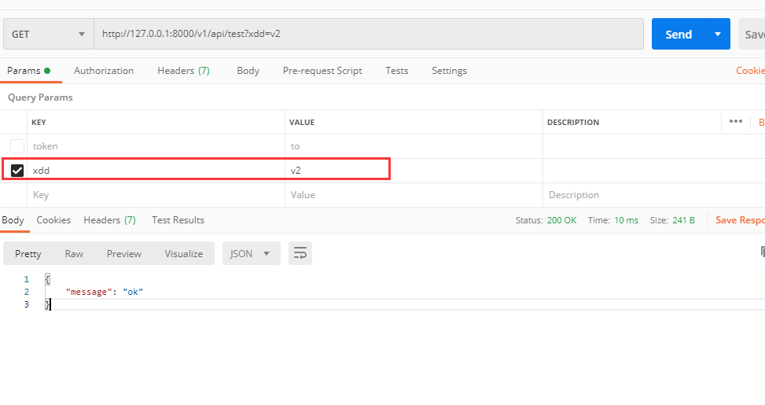  

2. 在url中通过路径传参

    * 使用类：URLPathVersioning
    *　全局配置如下　　

    ````py
    # url配置为：
    # /v1/api/+下面路径
    urlpatterns = [
        re_path(r"^(?P<xdd>v[1|2]+)/test$",test.as_view())
    ]

    #　视图文件为：
    class test(APIView):
        def get(self,request,*args,**kwargs):
            print(request.version)
            return JsonResponse({"message":"ok"})

    # 全局配置文件为：
    REST_FRAMEWORK = {
        "DEFAULT_VERSIONING_CLASS":"rest_framework.versioning.URLPathVersioning", #版本全局配置
        "DEFAULT_VERSION":"v1", #当前版本
        "ALLOWED_VERSIONS":["v1","v2"],#允许的版本
        "VERSION_PARAM":"xdd", #参数名称
    }
    ````

    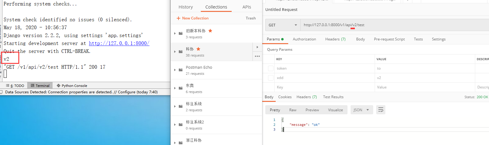  

* 类介绍 from rest_framework.versioning import *
    1. BaseVersioning基类，通常用于自定义
    2. AcceptHeaderVersioning # 基于请求头实现
    3. URLPathVersioning #基于url路径实现
    4. NamespaceVersioning #基于namespace实现，即路由分发时的名称
    5. HostNameVersioning #基于子域名实现
    6. QueryParameterVersioning #基于queryparamet传参实现

#### 解析器

*　对请求体进行解析

````py
from rest_framework.parsers import JSONParser,FormParser
class test(APIView):

    parser_classes = [JSONParser,FormParser] #解析器
    """
    JSONParser:表示只能解析content-type:application/json头。
    JSONParser:表示只能解析content-type:application/x-www-form-urlencoded头。
    1. 获取用户请求
    2. 获取用户请求体
    3. 根据用户请求头和parser_classes = [JSONParser,FormParser]中支持的请求头进行比较
    4. JSONParser对象去请求体
    5. request.data触发
    """

    def post(self,request:Request,*args,**kwargs):
        #获取解析后的结果
        print(request.data)
        return JsonResponse({"message":"ok"})
````

* 全局配置为：

    ````py
    REST_FRAMEWORK = {
        "DEFAULT_PARSER_CLASSES":["rest_framework.parsers.JSONParser","rest_framework.parsers.FormParser"], #默认解析器
    }
    ````

#### 序列化

1. Queryset进行序列化
    * serializers.Serializer类，序列化类
        * 简单序列化示例

        ````py
        from rest_framework import serializers

        class RolesSerializer(serializers.Serializer):
            id = serializers.IntegerField()
            title = serializers.CharField()
            name = serializers.CharField()


        class test(APIView):

            def get(self,request:Request,*args,**kwargs):
                # 方式一
                # roles = models.Role.objects.all().values("id","name","title")
                # # return JsonResponse({"message":list(roles)})
                # ret = json.dumps(list(roles),ensure_ascii=False)

                # 方式二 通过序列化方式获取
                roles = models.Role.objects.all()
                ser = RolesSerializer(instance=roles,many=True) # many=True表示有多条数据,False表示只有一条数据
                # ser.data已经是转换完成的结果
                ret = json.dumps(ser.data,ensure_ascii=False)
                return HttpResponse(ret)
        ````

        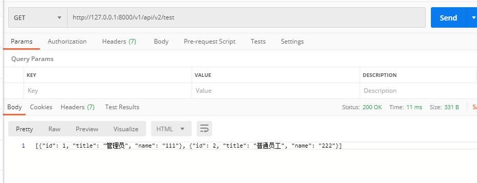  

        * 复杂示例

        ````py
        class UserInfoSerializer(serializers.Serializer):
            xxx = serializers.CharField(source="user_type") # 返回row.user_type
            oooo = serializers.CharField(source="get_user_type_display") # 会调用row.get_user_type_display()，source如果是可调用对象，会自动调用
            username = serializers.CharField()
            password = serializers.CharField()
            gp = serializers.CharField(source="group.title")
            rls = serializers.SerializerMethodField() #自定义显示,需要实现对应的get_rls方法

            def get_rls(self,row):
                return ["tt","bb"]
        ````

    * serializers.ModelSerializer类，可以根据模型定义。也可以和基类自定义的混合使用

        ````py

        class RolesSerializer2(serializers.ModelSerializer):

            class Meta:
                model = models.Role
                # fields = "__all__"
                fields = ("id","name") # 如果需要显示所有，则使用"__all__"
                depth = 1 #数据的响应程度。0~10之间 自动序列化链表操作

        class test(APIView):

            def get(self,request:Request,*args,**kwargs):
                roles = models.Role.objects.all()
                ser = RolesSerializer2(instance=roles,many=True) # many表示有多条数据
                # ser.data已经是转换完成的结果
                ret = json.dumps(ser.data,ensure_ascii=False)
                return HttpResponse(ret)
        ````

2. 请求数据进行校验

    * 简单示例

        ````py
        class xxvalidator():
            def __init__(self,base):
                self.base = str(base)

            def __call__(self, value):
                if not str.startswith(value,self.base):
                    message = "字段必须以【{}】开头".format(self.base)
                    raise serializers.ValidationError(message)


            def set_context(self,serializer_field):
                """
                执行验证之前调用，serializer_field是当前字段对象
                :param serializer_field:
                :return:
                """
                pass

        class textSerializer(serializers.Serializer):
            title = serializers.CharField(error_messages={"required":"标题不能为空"},validators=[xxvalidator("xdd")])

        class test(APIView):

            def post(self,request:Request,*args,**kwargs):
                ser = textSerializer(data=request.data)
                if ser.is_valid():
                    print(ser.validated_data["title"])
                else:
                    print(ser.errors)
                return HttpResponse("ok")
        ````

#### 分页

    1. PageNumberPagination分页器

        ````py
        from rest_framework import serializers
        from rest_framework.response import Response
        from rest_framework.pagination import PageNumberPagination
        class RolesSerializer2(serializers.ModelSerializer):

            class Meta:
                model = models.Role
                # fields = "__all__"
                fields = ("id","name") # 如果需要显示所有，则使用"__all__"

        class MyPageNumberPagination(PageNumberPagination):
            page_size = 2 # 默认每页显示2条数据
            page_size_query_param = "size" #客户端控制分页的每页显示数量参数为size
            max_page_size = 5 #分页最大，每页显示5条数据
            page_query_param = "page" # 页面参数为page

        class test(APIView):

            def get(self,request:Request,*args,**kwargs):
                # 获取所有数据
                role = models.Role.objects.all()
                # 创建分页对象
                pg = MyPageNumberPagination()
                # 在数据库中获取分页的数据
                pager_roles = pg.paginate_queryset(queryset=role,request=request,view=self)
                # 对数据进行序列化
                ser = RolesSerializer2(pager_roles, many=True)
                # return Response(ser.data) # 直接返回数据，只有数据
                return pg.get_paginated_response(ser.data) # 会附带分页信息
        
        #如果不使用自定义类，可以在setting里面定义全局的默认参数值
        REST_FRAMEWORK = {
            "PAGE_SIZE":2, # 分页配置，每页显示2个
        }
        ````

        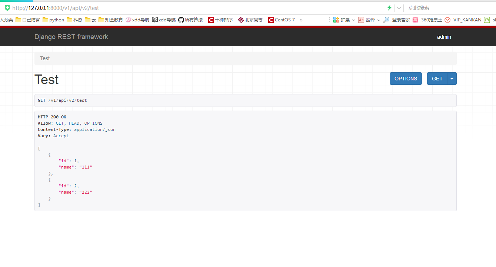  

    2. 分页器LimitOffsetPagination

        * 相对于PageNumberPagination分页器修改代码为：

        ````py
        from rest_framework.pagination import LimitOffsetPagination

        class MyLimitOffsetPagination(LimitOffsetPagination):
            default_limit = 2 # 默认显示几条
            limit_query_param = "limit" 
            offset_query_param = "offset" # 跳过多少条
            max_limit = 5 # 最大显示几条

        class test(APIView):

            def get(self,request:Request,*args,**kwargs):
                # 获取所有数据
                role = models.Role.objects.all()
                # 创建分页对象
                pg = MyLimitOffsetPagination()
                # 在数据库中获取分页的数据
                pager_roles = pg.paginate_queryset(queryset=role,request=request,view=self)
                # 对数据进行序列化
                ser = RolesSerializer2(pager_roles, many=True)
                # return Response(ser.data) # 直接返回数据，只有数据
                return pg.get_paginated_response(ser.data) # 会附带分页信息
        ````

        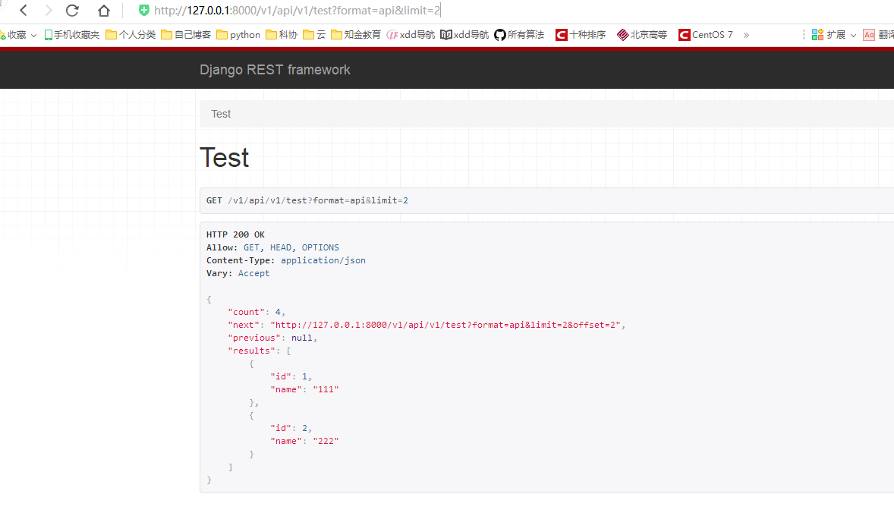  

    3. 分页器CursorPagination(加密分页器)

        ````py
        from rest_framework.pagination import CursorPagination

        class MyCursorPagination(CursorPagination):
            ordering = "id" # 排序字段
            cursor_query_param = "cursor" # 加密后的页码
            page_size = 2 # 每页显示数量
            ordering = "id" # 排序字段
            page_size_query_param = "size" #每页显示数量参数
            max_page_size = 5 # 每页最大显示数量

        class test(APIView):

            def get(self,request:Request,*args,**kwargs):
                # 获取所有数据
                role = models.Role.objects.all()
                # 创建分页对象
                pg = MyCursorPagination()
                # 在数据库中获取分页的数据
                pager_roles = pg.paginate_queryset(queryset=role,request=request,view=self)
                # 对数据进行序列化
                ser = RolesSerializer2(pager_roles, many=True)
                # return Response(ser.data) # 直接返回数据，只有数据
                return pg.get_paginated_response(ser.data) # 会附带分页信息

        ````

        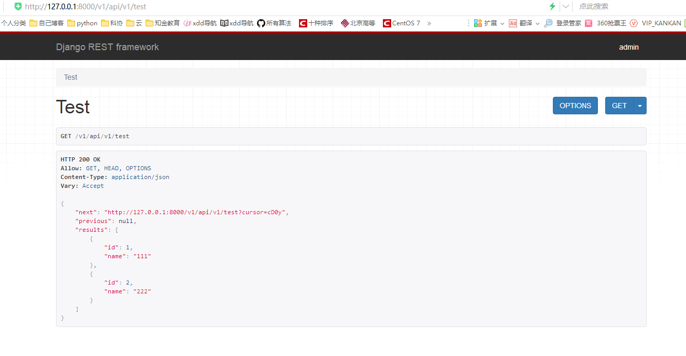  

#### 视图

    1. GenericAPIView视图，简单实现分页数据

        ````py
        from rest_framework.response import Response
        from rest_framework.pagination import PageNumberPagination
        from rest_framework.generics import GenericAPIView

        class RolesSerializer2(serializers.ModelSerializer):

            class Meta:
                model = models.Role
                # fields = "__all__"
                fields = ("id","name") # 如果需要显示所有，则使用"__all__"

        class MyPageNumberPagination(PageNumberPagination):
            page_size = 2 # 默认每页显示2条数据
            page_size_query_param = "size" #客户端控制分页的每页显示数量参数为size
            max_page_size = 5 #分页最大，每页显示5条数据
            page_query_param = "page" # 页面参数为page

        class test(GenericAPIView):

            queryset = models.Role.objects.all()
            serializer_class = RolesSerializer2
            pagination_class = MyPageNumberPagination

            def get(self,request:Request,*args,**kwargs):
                roles = self.get_queryset() # 获取数据集合
                page_roles = self.paginate_queryset(roles)
                ser = self.get_serializer(instance=page_roles,many=True)
                # return Response(ser.data)
                return self.get_paginated_response(ser.data)

        ````

        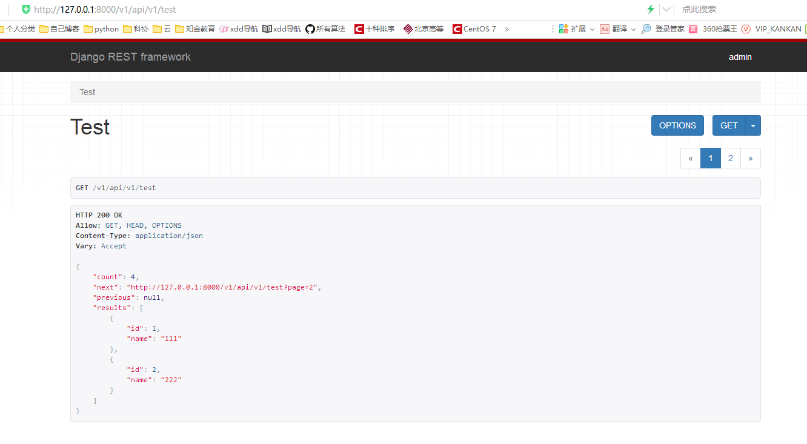  

    2. GenericViewSet视图类，
        * 继承ViewSetMixin, generics.GenericAPIView
        * 在ViewSetMixin中修改了as_view方法

        * 简单实现分页(相对于GenericAPIView实现分页的变化为)

        ````py
        # 路由变化为：
        re_path(r"^(?P<xdd>v[1|2]+)/test$",test.as_view({'get': 'list'})) # 即对get请求，执行list方法

        # 视图变化化为：
        from rest_framework.viewsets import GenericViewSet
        
        class test(GenericViewSet):
            queryset = models.Role.objects.all()
            serializer_class = RolesSerializer2
            pagination_class = MyPageNumberPagination

            def list(self,request:Request,*args,**kwargs):
                roles = self.get_queryset()
                page_roles = self.paginate_queryset(roles)
                ser = self.get_serializer(instance=page_roles,many=True)
                # return Response(ser.data)
                return self.get_paginated_response(ser.data)
        ````
    
    3. ModelViewSet类
        * `from rest_framework.viewsets import ModelViewSet`
            1. 继承类：
                * mixins.CreateModelMixin #创建方法(from rest_framework.mixins import CreateModelMixin)
                * mixins.RetrieveModelMixin # 提供根据pk查询方法
                * mixins.UpdateModelMixin　#提供更新方法，
                * mixins.DestroyModelMixin　 # 提供删除方法
                * mixins.ListModelMixin #分页查询
                * GenericViewSet #继承ViewSetMixin,修改了as_view方法，以及其他基本类
        
        * 基于ModelViewSet类实现增删改查

            ````py
            #视图
            from rest_framework.viewsets import ModelViewSet
            from rest_framework.pagination import PageNumberPagination
            from rest_framework import serializers

            class RolesSerializer2(serializers.ModelSerializer):

                class Meta:
                    model = models.Role
                    # fields = "__all__"
                    fields = ("id","name") # 如果需要显示所有，则使用"__all__"

            class MyPageNumberPagination(PageNumberPagination):
                page_size = 2 # 默认每页显示2条数据
                page_size_query_param = "size" #客户端控制分页的每页显示数量参数为size
                max_page_size = 5 #分页最大，每页显示5条数据
                page_query_param = "page" # 页面参数为page

            class test(ModelViewSet):
                queryset = models.Role.objects.all()
                serializer_class = RolesSerializer2
                pagination_class = MyPageNumberPagination

            #路由配置
            # /v1/api/+下面路径
            urlpatterns = [
                re_path(r"^(?P<xdd>v[1|2]+)/test$",test.as_view({'get': 'list',"post":"create"})),
                re_path(r"^(?P<xdd>v[1|2]+)/test/(?P<pk>\d+)$",test.as_view({
                    "get":"retrieve", # 根据id查询
                    "delete":"destroy", # 根据id删除
                    "put":"update",# 批量更新
                    "patch":"partial_update",#局部更新
                }))
            ]

            ````

#### 路由

* 在上面视图里面，已经涉及到了部分路由。如下接着修改路由

    ````py
    # /v1/api/+下面路径
    urlpatterns = [
        re_path(r"^(?P<xdd>v[1|2]+)/test$",test.as_view({'get': 'list',"post":"create"})),
        re_path(r"^(?P<xdd>v[1|2]+)/test\.(?P<format>\w+)$",test.as_view({'get': 'list',"post":"create"})),
        re_path(r"^(?P<xdd>v[1|2]+)/test/(?P<pk>\d+)$",test.as_view({
            "get":"retrieve", # 根据id查询
            "delete":"destroy", # 根据id删除
            "put":"update",# 更新
            "patch":"partial_update",#更新
        })),
        re_path(r"^(?P<xdd>v[1|2]+)/test/(?P<pk>\d+)\.(?P<format>\w+)$",test.as_view({
                "get":"retrieve", # 根据id查询
                "delete":"destroy", # 根据id删除
                "put":"update",# 更新
                "patch":"partial_update",#更新
            })) # 实现1.json的访问
    ]
    ````

* 如果上面路由通过配置format参数为json来访问。那么可以如下实现

    ````py
    from django.urls import re_path
    from .views import test
    from rest_framework import routers
    from django.conf.urls import include

    router = routers.DefaultRouter()
    router.register(r"^(?P<xdd>v[1|2]+)/test",test) # 这个会自动生成下面对应的4个url

    # /v1/api/+下面路径
    urlpatterns = [
        re_path(r"^",include(router.urls)), #注册
        # re_path(r"^(?P<xdd>v[1|2]+)/test$",test.as_view({'get': 'list',"post":"create"})),
        # re_path(r"^(?P<xdd>v[1|2]+)/test\.(?P<format>\w+)$",test.as_view({'get': 'list',"post":"create"})),
        # re_path(r"^(?P<xdd>v[1|2]+)/test/(?P<pk>\d+)$",test.as_view({
        #     "get":"retrieve", # 根据id查询
        #     "delete":"destroy", # 根据id删除
        #     "put":"update",# 更新
        #     "patch":"partial_update",#更新
        # })),
        # re_path(r"^(?P<xdd>v[1|2]+)/test/(?P<pk>\d+)\.(?P<format>\w+)$",test.as_view({
        #         "get":"retrieve", # 根据id查询
        #         "delete":"destroy", # 根据id删除
        #         "put":"update",# 更新
        #         "patch":"partial_update",#更新
        #     })) # 实现1.json的访问
    ]

    ````

#### 渲染器

* 在上述分页中，使用web访问时，页面都是属于渲染器的作用。

* 示例：只是用JSONRenderer渲染器

    ````py
    from rest_framework.renderers import JSONRenderer #json数据返回
    from rest_framework.renderers import BrowsableAPIRenderer # web页面好看的渲染器

    class RolesSerializer2(serializers.ModelSerializer):

        class Meta:
            model = models.Role
            # fields = "__all__"
            fields = ("id","name") # 如果需要显示所有，则使用"__all__"

    class MyPageNumberPagination(PageNumberPagination):
        page_size = 2 # 默认每页显示2条数据
        page_size_query_param = "size" #客户端控制分页的每页显示数量参数为size
        max_page_size = 5 #分页最大，每页显示5条数据
        page_query_param = "page" # 页面参数为page

    class Test2(APIView):

        renderer_classes = [JSONRenderer] #配置渲染器

        def get(self,request:Request,*args,**kwargs):
            # 获取数据
            roles = models.Role.objects.all()
            # 创建分页对象
            pg = MyPageNumberPagination()
            # 在数据库中获取分页数据
            pager_roles = pg.paginate_queryset(queryset=roles,request=request,view=self)
            # 对数据进行序列化
            ser = RolesSerializer2(instance=pager_roles,many=True)
            return Response(ser.data)
    
    #路由配置为：
    re_path(r"^test2$",Test2.as_view())
    ````  

    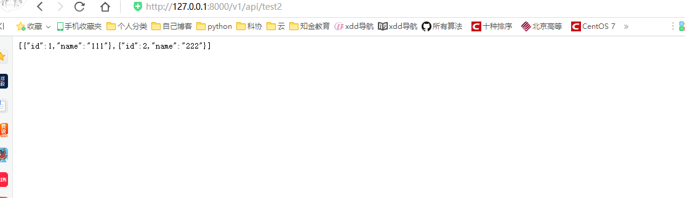  

* 如果在渲染器renderer_classes中加入BrowsableAPIRenderer，访问界面就换变成如下：

    ````py
    class Test2(APIView):

        renderer_classes = [JSONRenderer,BrowsableAPIRenderer] #配置渲染器

        def get(self,request:Request,*args,**kwargs):
            # 获取数据
            roles = models.Role.objects.all()
            # 创建分页对象
            pg = MyPageNumberPagination()
            # 在数据库中获取分页数据
            pager_roles = pg.paginate_queryset(queryset=roles,request=request,view=self)
            # 对数据进行序列化
            ser = RolesSerializer2(instance=pager_roles,many=True)
            return Response(ser.data)

    ````

    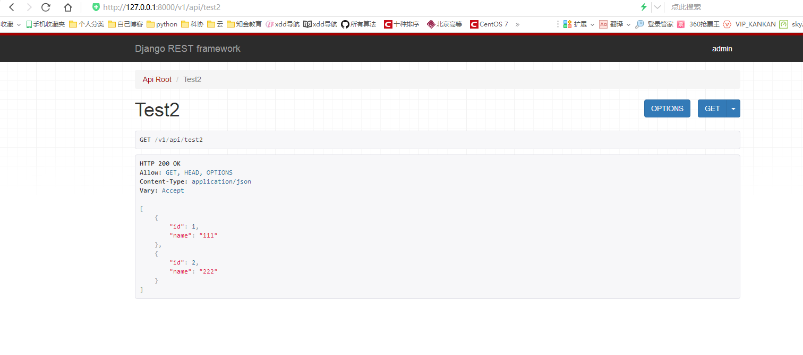  

* admin渲染器

    ````py
    from rest_framework.renderers import JSONRenderer #json数据返回
    from rest_framework.renderers import BrowsableAPIRenderer # web页面好看的渲染器
    from rest_framework.renderers import AdminRenderer #admin渲染器
    #视图
    class Test2(APIView):

        renderer_classes = [JSONRenderer,BrowsableAPIRenderer,AdminRenderer] #配置渲染器

        def get(self,request:Request,*args,**kwargs):
            # 获取数据
            roles = models.Role.objects.all()
            # 创建分页对象
            pg = MyPageNumberPagination()
            # 在数据库中获取分页数据
            pager_roles = pg.paginate_queryset(queryset=roles,request=request,view=self)
            # 对数据进行序列化
            ser = RolesSerializer2(instance=pager_roles,many=True)
            return Response(ser.data)
    # 路由配置
    re_path(r"^test2$",Test2.as_view()),
    re_path(r"^(?P<format>admin)/test2$",Test2.as_view())
    ````

    1. 第一种访问方式：[http://127.0.0.1:8000/v1/api/admin/test2](http://127.0.0.1:8000/v1/api/admin/test2)

        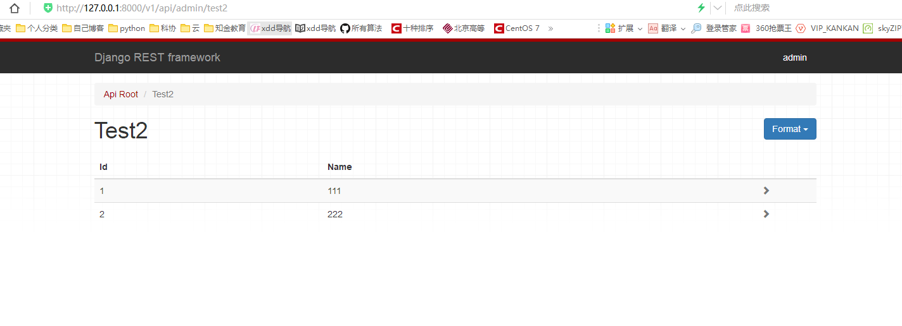  

    2. 第二种访问：[http://127.0.0.1:8000/v1/api/test2?format=admin](http://127.0.0.1:8000/v1/api/test2?format=admin)

        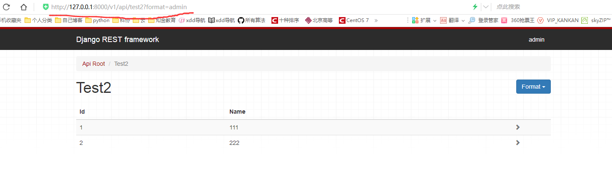