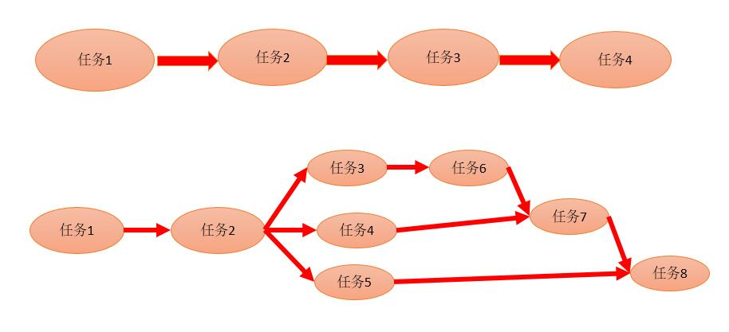
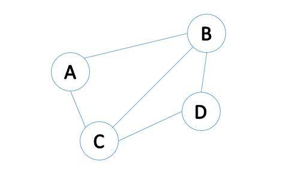
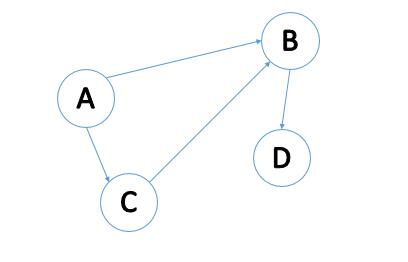

# 图

## 概述

某一个结点上有一批任务需要执行，如何执行？  
一个接一个排好队开始执行，但是这样的执行可能很没有效率，而且没有必要。举例，获取主机名和获取IP地址不需要严格的顺序，谁先执行都可以，同时执行也没有问题，这样的任务能并行就并行，不需要串行。  

  
看上面的任务并行图，不能使用“树”来描述任务的关系。这里需要使用“图”来描述。

## 图Graph

  

* **图的经典定义：**图Graph由**顶点**和**边**组成，顶点的有穷非空集合为V，边的集合为E,记作`G(V,E)`。
    1. 顶点Vertex,数据元素的集合，顶点的集合，有穷非空；
    2. 边Edge,数据元素关系的集合，顶点关系的集合，可以为空。
    3. 注意：图是有空间结构的。
* 边可以有方向。
    1. **无向边**记作`(A,B)`或者`(B,A)`,使用小括号。
    2. **有向边**记作`<A,B>`,即从顶点A指向顶点B。`<B,A>`表示顶点B指向顶点A。使用尖括号。
    3. 有向边也叫做弧，边表示为**弧尾指向弧头**

### 图的重要概念

1. **无向图(Undirected Graph)**
    * 无方向的边构成的图。
    * 如下图，**记作：`G=(V,E) V={A,B,C,D} E={(A,B),(A,C),(B,C),(B,D),(C,D)}`**  
      
2. **有向图(Directed Graph)**
    * 有方向的边构成的图。
    * 如下图。**记作：`G=(V,E) V={A,B,C,D} E={<A,B>,<A,C>,<C,B>,<B,D>}`**  
      
3. **稀疏图(Sparse Graph)**
    * 图中边很少。**最稀疏的情况，只有顶点没有边**，这就是数据结构Set。
4. **稠密图(Dense Graph)**
    * 图中边很多。**最稠密的情况，任意2个顶点之间都有关系。**
5. **完全图(Complete Graph)**
    * 包括了所有可能的边，达到了稠密图**最稠密**的情况，任意2个顶点之间都有边相连。
    * 有向边的完全图，叫做有向完全图。边数为`n(n-1)`。相当于排列组合中$A_n^{2}==A_n^{n-2}==n*(n-1)$
    * 无向边的完全图，叫做无向完全图。变数为`n(n-1)/2`。相当于排列组合中$C_n^2==C_n^{n-2}==n*(n-1)/2$

