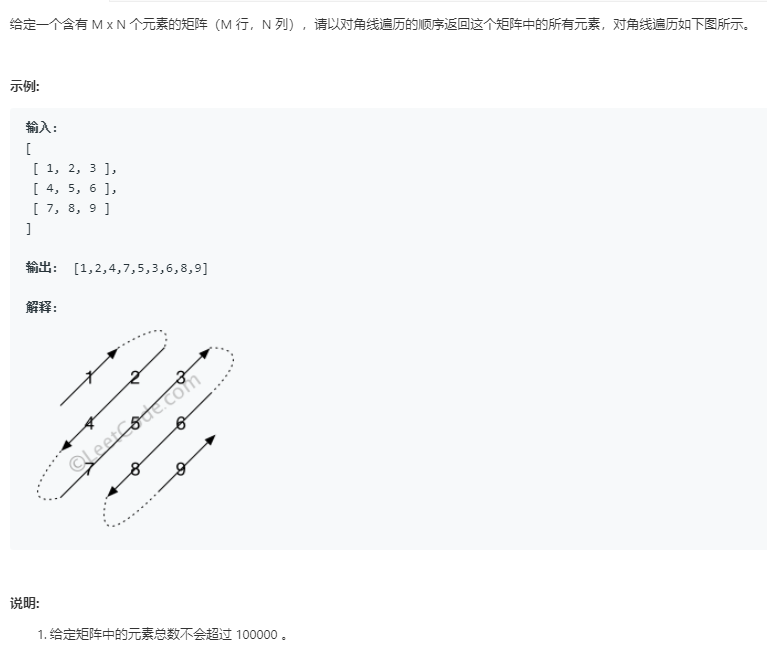
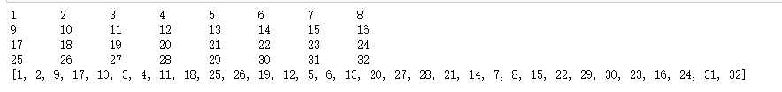

# 对角线遍历数组

1. 给定一个含有M*N个元素的矩阵(M行，N列)，请以对角线遍历的顺序返回这个矩阵中的所有元素，对角线遍历如下图所示。



* 解答：使用控制边界方法输出：

````python
n,m = 4,8
arr = [[ i*m+k+1 for k in  range(m)] for i in range(n)]
def show(arr):
    for i in arr:
        for k in i:
            print(k,"\t",end="")
        print()
show(arr)

x,y = 0,0
newarr = []
flag = True
k = m if m<n else n

while(True):
    newarr.append(arr[x][y])
    for i in range(k):
        if flag:
            x -= 1
            y += 1
            if x <0 or y>=m:
                x +=1
                y -= 1
                break
        else:
            x += 1
            y -= 1
            if y<0 or x>=n:
                x -=1
                y+=1
                break
        newarr.append(arr[x][y])
    #遇到边界，调整方向
    if flag:
        flag = False
        y += 1
        if y==m:
            y -= 1
            x += 1
            if x==n-1:
                newarr.append(arr[x][y])
                break
    else:
        flag = True
        x += 1
        if x == n:
            x -= 1
            y += 1
            if y==m-1:
                newarr.append(arr[x][y])
                break
print(newarr)
````




