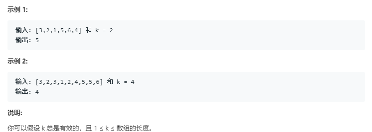

# 数组中的第k个最大元素

* 在未排序的数组中找到第 k 个最大的元素。请注意，你需要找的是数组排序后的第 k 个最大的元素，而不是第 k 个不同的元素。

  

* 第一种思路：

````python
class Solution(object):
    def findKthLargest(self, nums, k):
        """
        :type nums: List[int]
        :type k: int
        :rtype: int
        """
        if k==1:
            return max(nums)
        elif k==len(nums):
            return min(nums)
        nums.sort()
        return nums[k-1]
````


