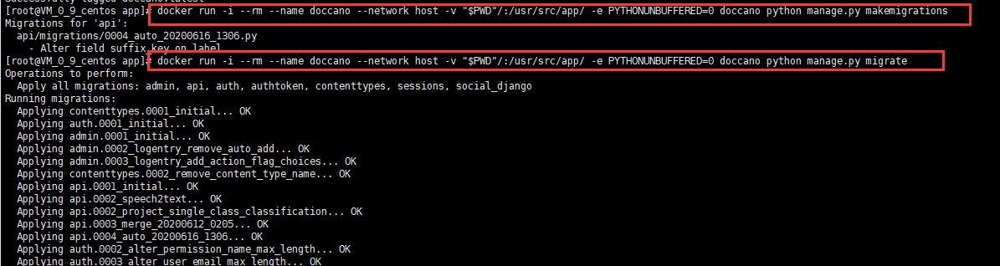

# Doccano标注系统安装与二次开发（机器学习从业开发者标注工具，支持多语言）

[toc]

  Doccano是面向机器学习专业人员的开源文本标注工具。  
  
    

## Doccano标注系统安装

* 项目git地址： [https://github.com/doccano/doccano](https://github.com/doccano/doccano)  

在doccano项目中，已经简单介绍过安装方法。项目实际文件时在app中。  
  1. git目录结构如下： 
      

### 1.1 linux上单独部署

````sh
git clone https://github.com/doccano/doccano.git
cd doccano/
````

  

* 修改docker-compose.prod.yml文件中的用户名和密码

````sh
ADMIN_USERNAME: "admin"
ADMIN_PASSWORD: "password"
````

* 运行项目

````sh
docker-compose -f docker-compose.dev.yml up
````

在doccano项目中，已经介绍了上面方法部署。这里不再做过多介绍。

### 1.1 linux上，前后端分离部署

  经过分析，doccano后端代码在app目录中，前端代码在app/server/static目录中。
  * 后端目录  
    
  * 前端目录  
    

1. 修改前端启动ip及其他
    * 本次使用域名"www.mumuxi.online"
    * `vim webpack.config.js`修改后的文件如下

    ````conf
    const fs = require('fs');
    const path = require('path');
    const process = require('process');
    const BundleTracker = require('webpack-bundle-tracker');
    const VueLoaderPlugin = require('vue-loader/lib/plugin')
    const { ContextReplacementPlugin } = require('webpack');
    const hljsLanguages = require('./components/hljsLanguages');

    const devMode = process.env.DEBUG !== 'False';
    const hotReload = process.env.HOT_RELOAD === '1';
    const webpackHost = process.env.WEBPACK_HOST || '0.0.0.0';
    const webpackPort = process.env.WEBPACK_PORT ? parseInt(process.env.WEBPACK_PORT, 10) : 8080;
    const pollMillis = process.env.WEBPACK_POLL_MILLIS ? parseInt(process.env.WEBPACK_POLL_MILLIS, 10) : false;
    const noSourceMap = process.env.SOURCE_MAP === 'False';

    const pagesRoot = path.join(__dirname, 'pages');
    const entryPoints = {};
    fs.readdirSync(pagesRoot).forEach((scriptName) => {
        const bundleName = path.parse(scriptName).name;
        const scriptPath = path.join(pagesRoot, scriptName)
        entryPoints[bundleName] = scriptPath;
    });

    module.exports = {
        mode: devMode ? 'development' : 'production',
        entry: entryPoints,
        output: {
            publicPath: hotReload ? `http://www.mumuxi.online:${webpackPort}/` : '',
            path: path.join(__dirname, 'bundle'),
            filename: '[name].js'
        },
        devtool: noSourceMap ? false : (devMode ? 'cheap-eval-source-map' : 'source-map'),
        devServer: {
            port: webpackPort,
            host: webpackHost,
            disableHostCheck: true,
            hot: true,
            quiet: false,
            headers: { 'Access-Control-Allow-Origin': '*' }
        },
        watchOptions: {
            poll: pollMillis,
        },
        module: {
            rules: [
                {
                    test: /\.pug$/,
                    loader: 'pug-plain-loader'
                },
                {
                    test: /\.css$/,
                    use: [
                        'vue-style-loader',
                        'css-loader'
                    ]
                },
                {
                    test: /\.vue$/,
                    loader: 'vue-loader'
                }
            ]
        },
        plugins: [
            new ContextReplacementPlugin(
                /highlight\.js\/lib\/languages$/,
                new RegExp(`^./(${hljsLanguages.join('|')})$`)
            ),
            new BundleTracker({ filename: './webpack-stats.json' }),
            new VueLoaderPlugin()
        ],
        resolve: {
            extensions: ['.js', '.vue'],
            alias: {
                vue$: 'vue/dist/vue.esm.js',
            },
        },
    }
    ````

      

2. 为前端创建Dockerfile文件，内容如下

    ````dockerfile
    FROM node

    WORKDIR /usr/src/app

    # 设置时区
    RUN ln -sf /usr/share/zoneinfo/Asia/Shanghai /etc/localtime
    RUN echo 'Asia/Shanghai' >/etc/timezone


    CMD [ "bash"]
    ````

3. 创建并运行前端容器

    ````sh
     # 构建镜像文件
     docker build -t doccanoweb .  

    #　初始化npm
     docker run -i --rm --name doccanoweb --network host -v "$PWD"/:/usr/src/app/ -e PYTHONUNBUFFERED=0 doccanoweb npm install

    # 使用npm编译项目
     docker run -i --rm --name doccanoweb --network host -v "$PWD"/:/usr/src/app/ -e PYTHONUNBUFFERED=0 doccanoweb npm run build

    # 启动项目
    docker run --name doccanoweb --restart=always --network host -v "$PWD"/:/usr/src/app/ -d doccanoweb npm start
    ````

      
      

4. 创建后端dockerfile文件  

    * 进入目录`/root/doccano001/doccano/app`目录。删除原来的Dockerfile文件，重新川剧新的Dockerfile文件，文件内容如下

    ````dockerfile
    FROM python:3.7

    WORKDIR /usr/src/app

    RUN apt-get update \
        && apt-get install --no-install-recommends -y python3-dev libpq-dev unixodbc-dev

    COPY requirements.txt ./

    RUN pip install --no-cache-dir -i https://mirrors.aliyun.com/pypi/simple/ -r requirements.txt

    # 设置时区
    RUN ln -sf /usr/share/zoneinfo/Asia/Shanghai /etc/localtime
    RUN echo 'Asia/Shanghai' >/etc/timezone


    CMD [ "bash"]

    ````

5. 创建后端镜像，启动后端。

  ````sh
  # 根据dockerfile文件，构建后端镜像doccano
  docker build -t doccano .
  # 初始化后端项目
  docker run -i --rm --name doccano --network host -v "$PWD"/:/usr/src/app/ -e PYTHONUNBUFFERED=0 doccano python manage.py makemigrations
  docker run -i --rm --name doccano --network host -v "$PWD"/:/usr/src/app/ -e PYTHONUNBUFFERED=0 doccano python manage.py migrate
  # 创建管理员账号密码
  docker run -i --rm --name doccano --network host -v "$PWD"/:/usr/src/app/ -e PYTHONUNBUFFERED=0 doccano python manage.py create_admin --noinput --username "admin" --email "admin@admin.com" --password "admin"
  # 项目初始化配置
  docker run -i --rm --name doccano --network host -v "$PWD"/:/usr/src/app/ -e PYTHONUNBUFFERED=0 doccano python manage.py create_roles
  # 启动项目
  docker run --name doccano --restart=always --network host -v "$PWD"/:/usr/src/app/ -d doccano gunicorn --bind 0.0.0.0:8000 app.wsgi -w 4 -k gthread --thread 16 --timeout 300
  ````  

    
    

* 现在访问：后端启动端口`127.0.0.1:8000`(注意，由于自己服务器定义了域名，所以下面自己直接使用域名www.mumuxi.online:8000访问)

      

* 使用admin用户登录后就可以创建项目了
      

### windows上二次开发环境部署

* 开发工具pycharm
* 前端启动所需工具node.js

  在git项目中下载zip文件，解压在windows目录中。
  下载地址：[https://codeload.github.com/doccano/doccano/zip/master](https://codeload.github.com/doccano/doccano/zip/master)

  或者使用git下载。  
  ```git clone https://github.com/doccano/doccano.git```  
    

1. 解压下载后的文件进入下项目目录`D:\MyPythonUse\doccano\doccano\app`
      

2. 使用pycharm代开次目录，并创建虚拟开发环境
    * 虚拟环境python版本：Python 3.6.8
      
3. 安装必要插件,及初始化项目。并启动
    ````py
    # 安装插件
    pip install -r requirements.txt
    #初始化项目
    python manage.py makemigrations
    python manage.py migrate
    # 创建管理员用户密码
    python manage.py create_admin --noinput --username "admin" --email "admin@admin.com" --password "admin"
    # 初始化项目角色
    python manage.py create_roles
    #启动项目（注意，现在启动后还不能访问，因为前段还没部署）
    python manage.py runserver
    `````

      

4. 使用cmd，进入前端目录，本地部署前端  
    * 前端目录：  `\MyPythonUse\doccano\doccano\app\server\static`
      

    * 初始化前端，并部署

    ````cmd
    # 初始化前端项目
    npm install
    #　编译前端项目
    npm run build
    #　启动前端项目
    npm start
    ````

      

5. 现在前后端都启动后，访问："http://127.0.0.1:8000"端口就可以看到项目已经部署成功。使用之前创建的用户admin/admin可以直接登录。
      

6. 创建一个简单的项目text

      

8. 导入标注测试文件

    ````txt
    11111111111111111111111111
    22222222222222222222222222
    444444444444444444
    3333333333333333333333333
    ````

      

## 基于doccano项目的二次开发，为不同用户平均分配标注任务

* 问题：  
    对于目前标注系统中，经过使用发现，当多用户同时操作时，标注文档是共享的。如果对于需要给每个参加标注的用户平均分配标注任务。目前系统无法做到。
* 解决：
    本次源码修改，完善对`sequence labeling`做到权限文档分配。
        1. admin管理员用户，可以预览和标注项目中所有文档
        2. 其他用户平均分配项目中所有文档，每个用户标注时，只能看见自己文档。

* 修改内容如下：

1. 修改app/api/models.py文件中Document模型。增加一个字段userid  

    ````py
    userid = models.IntegerField(null=True)
    ````  

      

2. 修改app/api/serializers.py中。对DocumentSerializer中的fields增加userid

      

3. 在app/api/views.py中添加如下函数

    ````py
    # 无线循环生成器(对列表中的值，依次循环返回)
    def getuserid(userids:list):
        nums = len(userids)
        def _getuserid():
            k = 0
            while True:
                if nums==0:
                    yield 0
                elif k<nums:
                    yield userids[k]
                    k+= 1
                else:
                    k = 0
        return _getuserid()
    ````

      

4. 修改app/api/views.py中TextUploadAPI类的的save_file方法如下：

    ````py
    @classmethod
    def save_file(cls, user, file, file_format, project_id):
        project = get_object_or_404(Project, pk=project_id)
        parser = cls.select_parser(file_format)
        data = parser.parse(file)
        storage = project.get_storage(data)
        # 动态注入属性。为id生成器
        storage.getuserid = getuserid([k.id for k in project.users.all() if k.username!="admin"])
        storage.save(user)
    ````

      

5. 修改app/api/utils.py中BaseStorage中save_doc方法

    ````py
    def save_doc(self, data):
        # 分配用户id
        for k in data:
            k["userid"] = next(self.getuserid)
        serializer = DocumentSerializer(data=data, many=True)
        serializer.is_valid(raise_exception=True)
        doc = serializer.save(project=self.project)
        return doc
    ````

      

6. 修改app/api/views.py中DocumentList类中get_queryset方法，根据用户id获取不同用户数据

    ````py
    def get_queryset(self):
        project = get_object_or_404(Project, pk=self.kwargs['project_id'])

        queryset = project.documents
        if self.request.user.username != "admin":
            queryset = queryset.filter(userid=self.request.user.id)
        if project.randomize_document_order:
            queryset = queryset.annotate(sort_id=F('id') % self.request.user.id).order_by('sort_id')
        else:
            queryset = queryset.order_by('id')

        return queryset
    ````

      

7. 修改app/api/views.py中StatisticsAPI中的progress方法。调整显示进度情况

    ````py
    # 修改用户显示总数情况
    def progress(self, project):
        docs = project.documents
        annotation_class = project.get_annotation_class()
        if self.request.user.username != "admin":
            docs = docs.filter(userid=self.request.user.id)
        total = docs.count()
        annotation_filter = Q(document_id__in=docs.all())
        user_data = self._get_user_completion_data(annotation_class, annotation_filter)
        if not project.collaborative_annotation:
            annotation_filter &= Q(user_id=self.request.user)
        done = annotation_class.objects.filter(annotation_filter)\
            .aggregate(Count('document', distinct=True))['document__count']
        remaining = total - done
        return {'total': total, 'remaining': remaining, 'user': user_data}
    ````

      

8. 重启项目

    ````py
    python manage.py makemigrations
    python manage.py migrate
    python manage.py runserver
    ````

      

9. 使用管理员用户登录，在users表中创建三个用户t1,t2,t3
    * 管理员页面:[http://127.0.0.1:8000/admin/](http://127.0.0.1:8000/admin/)


      
      

10. 使用admin登录web，创建项目tt,并添t1,t2,t3用户到项目中。
      

11. 导出如下测试文件后，分别使用admin,t1,t2,t3登录，可以看到，t1,t2,t3中的可标注数量已经平均分配。admin可以看到全部标注文档

    ````txt
    1111111111111111111111111111111
    22222222222222222222
    3333333333333333333333333
    44444444444444444444444
    5555555555555555
    666666666666666666666666666666666
    777777777777777777777777777
    8888888888888888888888888888
    9999999999999999999999999999999999999
    00000000000000000000000000000
    121212121212121212121212121
    1313131313131313131313131
    14141414141414141414
    1515151515151515151515
    16161616161616161616
    171717171717171717
    18181818181818
    1919191919191919191919191919
    2020202020202002020202020
    212121212121212121212121212121
    ````

    * admin用户可以看到20条数据
      
    * t1用户可以看到7条数据
      
    * t2用户可以看到7条数据
      
    * t3用户可以看到7条数据
      

*作者：木木夕，邮箱：1263351411@qq.com.正在python相关寻找工作。如有意向请联系*
