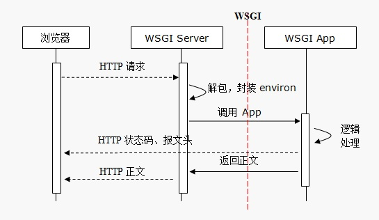

# WEB开发和WSGI

  

* CS即客户端、服务器编程。
    1. 客户端、服务端之间需要使用Socket，约定协议、版本(往往使用的协议是TCP或者UDP),指定地址和端口，就可以通信了。
    2. 客户端、服务端传输数据，数据可以有一定的格式，双方必须先约定好。

  

* BS编程，即Browser、Server开发
    1. Brower浏览器，一种特殊的客户端，支持HTTP(s)协议，能够通过URL向服务端发起请求，等待服务端返回HTML等数据，并在浏览器内可视化展示的程序。
    2. Server,支持HTTP(s)协议，能够接受众多客户端发起的HTTP协议请求，经过处理，将HTML等数据返回给浏览器。
* 本质上来说，BS是一种特殊的CS，即客户端必须是一种支持HTTP协议且能解析并渲染HTML的软件，服务端必须能够接收多客户端HTTP访问的服务器软件。
* HTTP协议底层基于TCP协议实现。

1. BS开发分为端开发
    * 客户端开发：或称前端开发。HTML、CSS、JavaScript等。
    * 服务端开发：Python有WSGI、Django、Flask、Tornado等。

## HTTP协议

### 安装httpd

* 可以安装httpd或nginx等服务端服务程序，通过浏览器访问，观察http协议

### 无状态，有链接和短连接

* **无状态**：指的是服务器无法知道2次请求之间的联系，即使是前后2次同一个浏览器也没有任何数据判断出时同一个浏览器的请求。后来可以通过cookie、session来判断。
* **有链接**：是因为它基于TCP协议，是面向链接的，需要3次握手、4次挥手。
* **短连接**：Http 1.1之前，都是一个请求一个连接，而TCP的链接创建销毁成本高，对服务器有很大影响。所以，自Http 1.1开始，支持keep-alive,默认也开启，一个连接打开后，会保持一段时间(可设置)，浏览器再访问该服务器就使用这个TCP链接，减轻了服务器压力，提高了效率。

### 协议

Http协议是无状态协议。  
同一个客户端的两次请求之间没有任何关系，从服务器端角度来说，它不知道这两个请求来自同一个客户端。

### URL组成

* URL可以说就是地址，uniform resource locator统一资源定位符，每一个连接指向一个资源供客户端访问。`schema://host[:port#]/path/.../[;url-params][?query-string][#anchor]`  

* 例如，通过`http://www.xdd.com/pathon/index.html?id=5&name=python`访问静态资源时，通过上面这个URL访问的是网站的某路径下的index.html文件，而这个文件对应磁盘上的真实的文件。就会从磁盘上读取这个文件，并把文件的内容发回浏览器端。

1. **scheme模式、协议**
    * http、ftp、https、mailto等等。
2. **host:port**
    * `www.xdd.com:80`,80端口是默认端口可以不写，域名会使用DNS解析，域名会解析成IP才能使用。实际上会对解析返回的IP的TCP的80端口发起访问。
3. **/path/to/resource**
    * path，指向资源的路径。
4. **?key1=value1&key2=value2**
    * query string,查询字符串，问号用来和路径分开，后面key=value形式，且使用&符号分割。

### HTTP消息

* **消息分为Request、Response**。
    1. Request:浏览器向服务器发起的请求
    2. Response:服务器对客户端请求的响应
        * 请求报文由Header消息报头、Body消息正文组成(可选)
            * 请求报文第一行称为请求行
        * 响应报文由Header消息报头、Body消息正文组成(可选)
            * 响应报头第一行称为状态行
        * 每一次使用回车和换行符作为结尾
        * 如果有Body部分，Header、Body之间留一行空行
* **请求报文**
    1. 请求消息行：请求放Method请求路径协议版本CRLF
      
    2. 请求方法Method

    |方法|说明|
    |:---------|:---------|
    |GET|请求获取URL对应的资源|
    |POST|请求数据至服务端|
    |HEAD|和GET类似，不过不返回响应报文的正文|

* **常见的消息传递方式**
    1. GET方法使用Query String。例如：`http://www.xdd.com/pathon/index.html?id=5&name=python&name=linux`通过查询字符串在URL中传递参数，而URL在请求报文的头部第一行
    2. POST方法提交数据

        ````txt
        请求消息如下
        POST /xxx/yyy?id=5&name=magedu HTTP/1.1
        HOST: 127.0.0.1:9999
        content-length: 26
        content-type: application/x-www-form-urlencoded

        age=5&weight=80&height=170
        ````  

        请求时提交的数据是在请求报文的正文Body部分。  
    3. URL中本身就包含信息
        `http://www.xdd.com/python/student/001`

* **响应报文**
    1. 响应消息行：协议版本 状态码 消息描述CRLF
      

* **status code状态码**
    1. 状态码在响应头第一行
        * `1xx` 提示信息，表示请求已被成功接收，继续处理
        * `2xx` 表示正常响应
            * `200` 表示返回了网页内容,即请求成功
        * `3xx` 重定向
            * `301` 页面永久性移走，永久重定向。返回新的URL，浏览器会根据返回的url发起新的request请求
            * `302` 临时重定向
            * `304` 资源未修改，浏览器使用本地缓存
        * `4xx` 客户端请求错误
            * `404` Not Found,问也找不到，客户端请求的资源有错
            * `400` 请求语法错误
            * `401` 请求要求身份验证
            8 `403` 服务器拒绝请求
        * `5xx` 服务器端错误
            * `500` 服务器内部错误
            * `502` 上游服务器错误，例如nginx反向代理的时候

### Cookie技术

* 键值对信息
* 是一种客户端、服务器端传递数据的技术
* 一般来说cookie信息时在服务器端生成，返回给浏览器端的
* 浏览器端可以保持这些值，浏览器对同一域发起每一请求时，都会吧Cookie信息发给服务器端
* 服务端收到浏览器端发过来的Cookie，处理这些信息，可以用来判断这次请求是否和之前的请求有关联  

曾经Cookie唯一在浏览器端存储数据的手段，目前浏览器端存储数据的方案很多，Cookie正在被淘汰。  
当服务器收到HTTP请求时，服务器可以在响应头里面添加一个Set-Cookie键值对。浏览器收到响应后通常会保存这些Cookie，之后对该服务器每一次请求中都通过Cookie请求头部将Cookie信息发送给服务器。  
另外，Cookie的过期时间、域、路径、有效期、适用站点都可以根据需要来指定。  
可以使用`Set－Cookie: NAME=VALUE；Expires=DATE；Path=PATH；Domain=DOMAIN_NAME；SECURE`  
例如：  

````txt
Set-Cookie:aliyungf_tc=AQAAAJDwJ3Bu8gkAHbrHb4zlNZGw4Y; Path=/; HttpOnly
set-cookie:test_cookie=CheckForPermission; expires=Tue, 19-Mar-2018 15:53:02 GMT; path=/;
domain=.doubleclick.net

Set-Cookie: BD_HOME=1; path=/
````

|key|value说明|
|:----|:------|
|Cookie过期|Cookie可以设定过期终止时间，过期后将被浏览器清除。<br /> 如果缺省，Cookie不会持久化，浏览器关闭Cookie消失，称为会话级Cookie
|Cookie域|域确定有哪些预可研存取这个Cookie.<br/>缺省设置属性值为当前主机，例如`www.xdd.com`。<br/>如果设置为`xdd.com`表示包含子域
|Path|确定哪些目录及子目录访问可以使用该Cookie
|Secure|表示Cookie随着HTTPS加密过的请求发送给服务端<br/>有些浏览器已经不允许`http://`协议使用`Secure`了<br/>这个Secure不能保证Cookie是安全的，Cookie中不要传输敏感信息
|HttpOnly|将Cookie设置此标记，就不能被JavaScript访问，只能发给服务器端

> set-Cookie: id=a3fWa; Expires=Wed, 21 Oct 2015 07:28:00 GMT; Secure; HttpOnly  
>告诉浏览器端设置这个Cookie的键值对，有过期时间，使用HTTPS加密传输到服务端，且不能被浏览器中JS脚本访问该Cookie  

* Cookie的作用域：Domain和Path定义Cookie的作用域

````txt
Domain
domain=www.xdd.com 表示只有该域的URL才能使用
domain=xdd.com 表示可以包含子域，例如www.xdd.com、python.xdd.com等

Path
path=/ 所有/的子路径可以使用
domain=www.xdd.com; path=/webapp 表示只有www.xdd.com/webapp下的URL匹配，例如http://www.xdd.com/webapp/a.html就可以
````

* **缺点**
    1. Cookie一般明文传输(Secure是加密传输),安全性极差，不要传输敏感数据
    2. 有4kB大小限制
    3. 每次请求中都会发生Cookie，增加流量。

### Session技术

WEB服务器端，尤其是动态网页服务端Server,有时需要知道浏览器方式谁？但是HTTP是无状态的。为了解决。可以如下：

* 服务器端会为每一次浏览器端第一次访问生成一个SessionID,用来唯一标识该浏览器，通过Set-Cookie发送到浏览器端。
* 浏览器端收到之后并不永久保持这个Cookie,只是会话级的。浏览器访问服务端时，会使用Cookie，也会带上这个SessionID的Cookie值。  

> Set-Cookie:JSESSIONID=741248A52EEB83DF182009912A4ABD86.Tomcat1; Path=/; HttpOnly  

* 服务端会位置这个SessionIDy一段时间，如果超时，会清理这些超时没有人访问的SessionID。如果浏览器端发来的SessionID无法在服务端找到，就会自动再分配新的SessionID,并通过Set-Cookie发送到浏览器端以覆盖原有的存在浏览器中 的会话级的SessionID。
* 推荐图书《HTTP权威指南》

## WSGI

  

* WSGI（Web Server Gateway Interface）主要规定了服务器端和应用程序间的接口。  

````python
# 启动一个WSGI服务器
wsgiref.simple_server.make_server(host,port,app,server_class=WSGIServer,handler_class=WSGIRequestHandler)

# 一个两参数函数，小巧完整的WSGI的应用程序的实现
wsgiref.simple_server.demo_app(eviron,start_response)

# 返回文本例子
from wsgiref.simple_server import make_server,demo_app

ip = '127.0.0.1'
port = 9999
server = make_server(ip,port,demo_app) # demo_app应用程序，可调用
server.serve_forever() # server.handle_request()执行一次
````

  

* WSGI服务器作用
    1. 监听HTTP服务端口(TCPServer,默认端口80)
    2. 接收浏览器端的HTTP请求并解析封装成environ环境数据
    3. 负责调用应用程序，将environ数据和start_response
    4. 将应用程序响应的正文封装成HTTP响应报文返回浏览器端

## WSGI APP应用程序端

1. 应用程序应该是一个可调用对象，在Python中应该是函数、类、实现了`__call__`方法的类的实例
2. 这个可调用对象应该接收两个参数

    ````python
    # 1. 函数实现
    def application(environ,start_response):
        pass

    # 2.类实现
    class Application:
        def __init__(self,environ,start_response):
            pass

    # 3. 类的实例实现
    class Application:
        def __call__(self,environ,start_response):
            pass
    ````

3. 以上的可调用对象实现，都必须返回一个可迭代对象

````python
from wsgiref.simple_server import make_server,demo_app

ip = '127.0.0.1'
port = 9999
res_str = b'www.xdd.com abc\n'

# 1.函数实现
def application(environ,start_response):
    start_response("200 OK", [('Content-Type', 'text/plain; charset=utf-8')])
    return [res_str]

# 2. 类实现
class Application:
    def __init__(self,environ,start_response):
        self.env = environ
        self.start_response = start_response

    def __iter__(self):
        self.start_response("200 OK", [('Content-Type', 'text/plain; charset=utf-8')])
        yield res_str

# 3. 类的对象，可调用对象
class Application2:
    def __call__(self, environ,start_response):
        start_response("200 OK", [('Content-Type', 'text/plain; charset=utf-8')])
        return [res_str]

# server = make_server(ip,port,application #函数实现
# server = make_server(ip,port,Application) # 类实现
server = make_server(ip,port,Application2()) # demo_app应用程序，可调用对象
server.serve_forever()
# server.handle_request() # 执行一次
````

* environ和start_response这两个参数名可以是任何合法名，但是一般默认都是这2个名字。
* 注意：第2、第3种实现调用时的不同

1. **environ参数**

    * environ包含HTTP请求信息的dict字典对象

    |名称|含义|
    |:---------|:------------|
    |**REQUEST_METHOD**|请求方法，GET、POST等|
    |**PATH_INFO**|URL中的路径部分|
    |**QUERY_STRING**|查询字符串|
    |SERVER_NAME,SERVER_PRORT|服务器名，端口|
    |HTTP_HOST|地址和端口|
    |SERVER_PROTOCOL|协议|
    |HTTP_USER_AGENT|UserAgent信息|

    ````txt
    CONTENT_TYPE = 'text/plain'
    HTTP_HOST = '127.0.0.1:9999'
    HTTP_USER_AGENT = 'Mozilla/5.0 (Windows; U; Windows NT 6.1; zh-CN) AppleWebKit/537.36 (KHTML, like Gecko) Version/5.0.1 Safari/537.36'
    PATH_INFO = '/'
    QUERY_STRING = ''
    REMOTE_ADDR = '127.0.0.1'
    REMOTE_HOST = ''
    REQUEST_METHOD = 'GET'
    SERVER_NAME = 'DESKTOP-D34H5HF'
    SERVER_PORT = '9999'
    SERVER_PROTOCOL = 'HTTP/1.1'
    SERVER_SOFTWARE = 'WSGIServer/0.2'
    ````

2. **start_response参数**
    * 它是一个可调用对象。有3个参数，定义如下：`start_response(status,response_headers,exc_info=None)`

    |参数名称|说明|
    |:-------------|:---------------|
    |status|状态码和状态描述，例如`200 ok`|
    |response_headers|一个元素为二元组的列表，例如`[('Content-Type','text/plain;charset=utf-8')]`|
    |exc_info|在错误处理的时候使用|

    * start_response应该在返回可迭代对象之前调用，因为它返回的是Response Header。返回的可迭代对象是Response Body。

### 服务器端

* 服务器程序需要调用复合上述定义的可调用对象APP，传入environ、start_response,APP处理后，返回响应头和可迭代对象的正文，由服务器封装返回浏览器端。

````python
import wsgiref.simple_server

def application(environ,start_response):
    status = '200 OK'
    headers = [('Content-Type','text/html;charset=utf-8')]
    start_response(status,headers)
    # 返回可迭代对象
    html = '<hq>xdd欢迎你</h1>'.encode('utf-8')
    return [html]

ip = '127.0.0.1'
port = 9999
server = wsgiref.simple_server.make_server(ip,port,application) # demo_app应用程序，可调用对象
server.serve_forever()
# server.handle_request() # 执行一次
````

* simple_server 只是参考用，不能用于生产环境。

1. 测试用命令

````shell
$ curl -I http://127.0.0.1:9999/xxx?id=5
$ curl -X POST http://127.0.0.1:9999/yyy -d '{"x":2}'
````

* `-I`使用HEAD方法
* `-X`指定方法，-d传输数据

1. **WSGI WEB服务器**
    * 本质上就是一个TCP服务器，监听在特定端口上
    * 支持HTTP协议，能够将HTTP请求报文进行解析，能够把响应数据进行HTTP协议的报文封装并返回浏览器端。
    * 实现了WSGI协议，该协议约定了和应用程序之间接口(参看PEP333,[https://www.python.org/dev/peps/pep-0333/](https://www.python.org/dev/peps/pep-0333/))
2. **WSGI APP应用程序**
    * 遵从WSGI协议
    * 本身是一个可调用对象
    * 调用start_response,返回响应头部
    * 返回包含正文的可迭代对象
3. WSGI框架库往往可以看做增强的更加复杂的Application。


