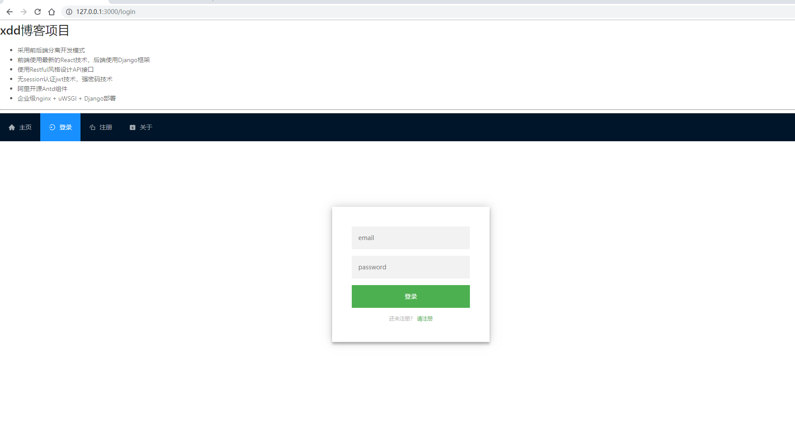
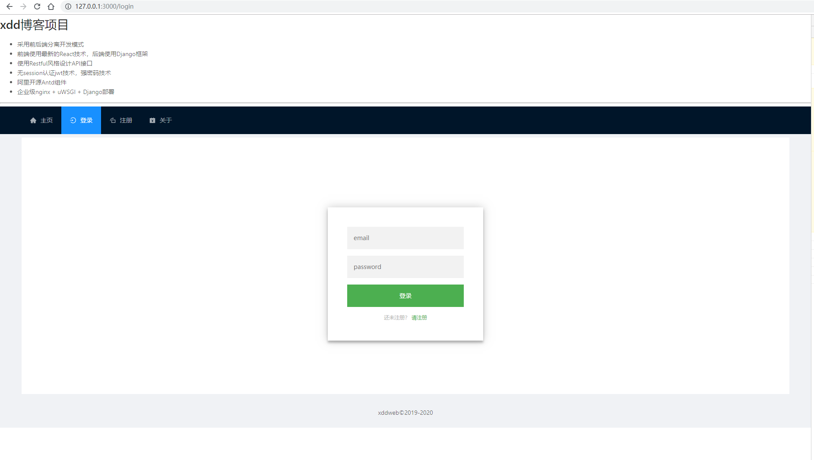
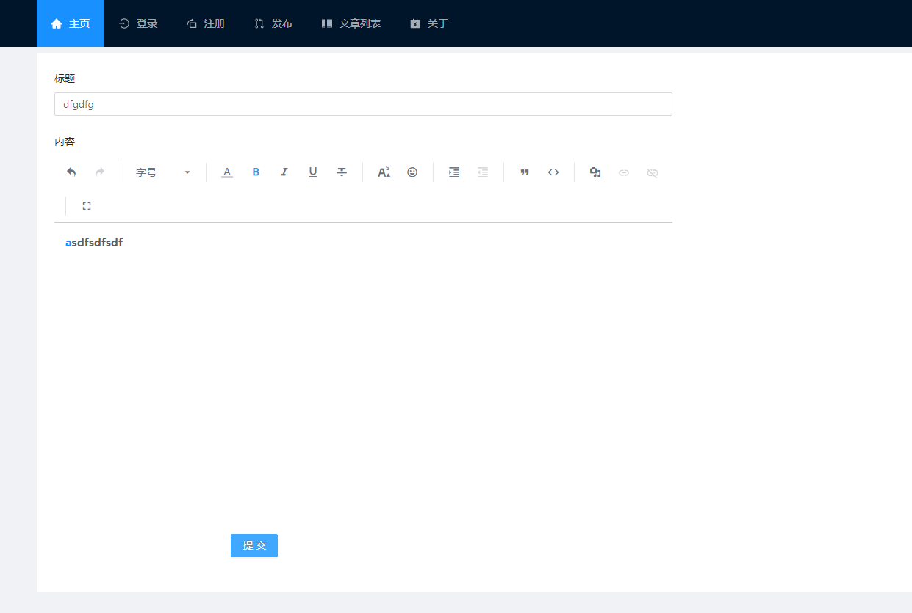
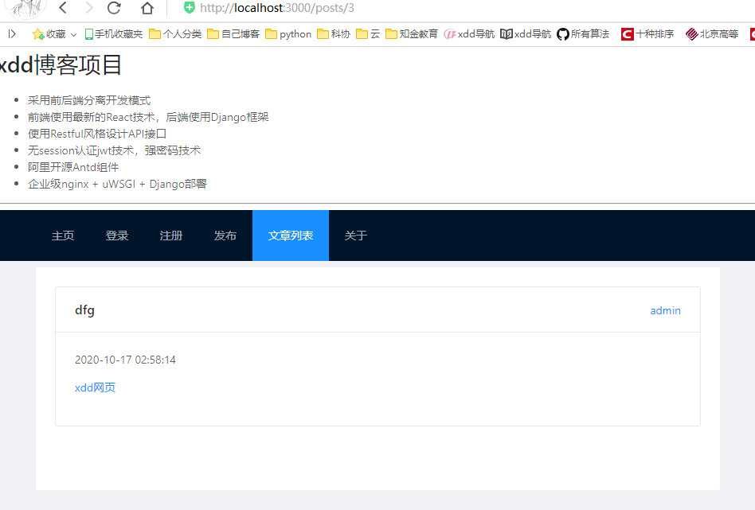
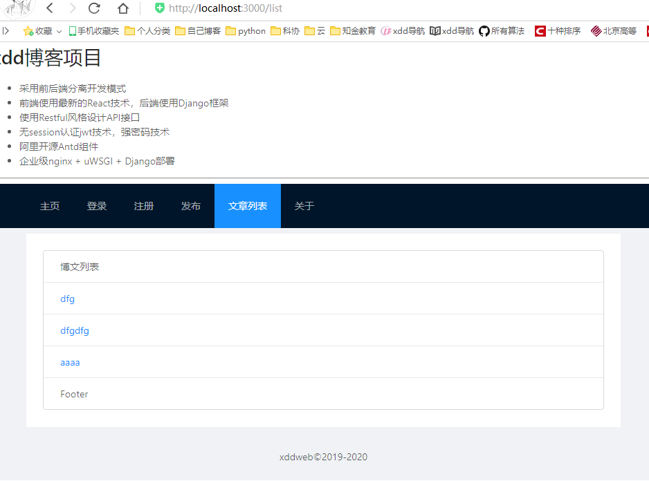
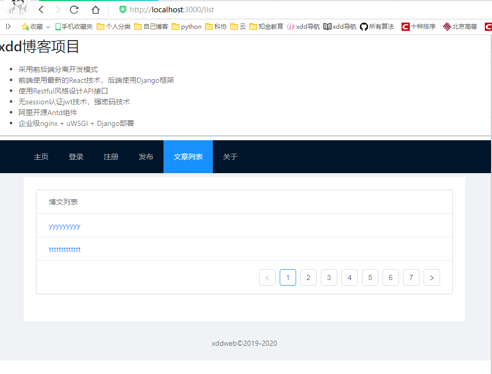

# 博文业务代码实现和Antd组件--Django播客系统(十一)

[toc]

## 导航菜单

* 菜单网址，[https://ant.design/components/menu-cn/](https://ant.design/components/menu-cn/)
* Menu 菜单组件
    1. mode有水平、垂直、内嵌
* Menu.Item 菜单项
    1. key菜单项item的唯一标识

* 修改src/index.js导航菜单

````js
import React from 'react';
import ReactDom from 'react-dom';
import {Route,Link,BrowserRouter as Router} from "react-router-dom";
import Login from "./component/login";
import Reg from "./component/reg";
import {Menu} from 'antd'; //加载antd的组件

import 'antd/lib/menu/style'; //加载组件的样式css
import { HomeFilled,LoginOutlined,RotateRightOutlined,AccountBookFilled } from '@ant-design/icons';


const App = () =>  (
    <Router>
        <div>
            <div>
                <Menu mode="horizontal" theme="dark"  style={{ lineHeight: '64px' }} defaultSelectedKeys= {['home']} >
                    <Menu.Item key="home" icon={<HomeFilled />} ><Link to="/">主页</Link></Menu.Item>
                    <Menu.Item key="login" icon={<LoginOutlined />}><Link to="/login">登录</Link></Menu.Item>
                    <Menu.Item key="reg" icon={<RotateRightOutlined />}><Link to="/reg">注册</Link></Menu.Item>
                    <Menu.Item key="about" icon={<AccountBookFilled />}><Link to="/about">关于</Link></Menu.Item>
                </Menu>
            </div>
            <div>
                <Route path="/about" component={About} />
                <Route path="/login" component={Login} />
                <Route path="/reg" component={Reg} />
                <Route exact path="/" component={Home} />
            </div>
        </div>
    </Router>
);

function Home() {
    return (
        <div>
        <h2>Home</h2>
        </div>
    );
}

function About() {
    return (
        <div>
        <h2>About</h2>
        </div>
    );
}


ReactDom.render(<App />, document.getElementById('root'));

````

  

## 页面布局

* 采用上中下布局，参考：[https://ant.design/components/layout-cn/](https://ant.design/components/layout-cn/)  

1. 修改src/index.js导航菜单

````js
import React from 'react';
import ReactDom from 'react-dom';
import {Route,Link,BrowserRouter as Router} from "react-router-dom";
import {Menu,Layout} from 'antd'; //加载antd的组件

import Login from "./component/login";
import Reg from "./component/reg";

import 'antd/lib/menu/style'; //加载组件的样式css
import 'antd/lib/layout/style';
import { HomeFilled,LoginOutlined,RotateRightOutlined,AccountBookFilled } from '@ant-design/icons';

const {Header,Content,Footer} = Layout; // 上中下

const App = () =>  (
	<Router>
		<Layout>
			<Header>
				<Menu mode="horizontal" theme="dark"  style={{ lineHeight: '64px' }} defaultSelectedKeys= {['home']} >
					<Menu.Item key="home" icon={<HomeFilled />} ><Link to="/">主页</Link></Menu.Item>
					<Menu.Item key="login" icon={<LoginOutlined />}><Link to="/login">登录</Link></Menu.Item>
					<Menu.Item key="reg" icon={<RotateRightOutlined />}><Link to="/reg">注册</Link></Menu.Item>
					<Menu.Item key="about" icon={<AccountBookFilled />}><Link to="/about">关于</Link></Menu.Item>
				</Menu>
			</Header>
			<Content style={{ padding: '8px 50px' }}>
				<div style={{ background: '#fff', padding: 24, minHeight: 280 }}>
					<Route path="/about" component={About} />
					<Route path="/login" component={Login} />
					<Route path="/reg" component={Reg} />
					<Route exact path="/" component={Home} />
				</div>
			</Content>
			<Footer style={{ textAlign: 'center' }}>xddweb©2019-2020 </Footer>
		</Layout>
  </Router>
);

function Home() {
  return (
    <div>
      <h2>Home</h2>
    </div>
  );
}

function About() {
  return (
    <div>
      <h2>About</h2>
    </div>
  );
}


ReactDom.render(<App />, document.getElementById('root'));

````

  

## 博文业务

|url|method|说明|
|:----:|:----:|:----|
|/posts/|POST|提交博文的title、content,成功返回json,包含post_id,title|
|/posts/id|GET|返回博文详情<br />返回json,id,title、author_id、postdate(时间戳)、content|
|/posts/|GET|返回博文标题列表，分页|

## 业务层

* 创建service/post.js文件，新建PostService类。

````js
import axios from 'axios';
import {observable} from 'mobx';

class PostService{
    @observable msg = '';

    pub(title,content){
        console.log(title);
        axios.post('/api/posts/',{
            title,content
        })/* dev server 会代理 */
        .then(
            response => {
                console.log(response.data);
                console.log(response.status);
                this.msg = '博文提交成功';
            }
        ).catch(
            error => {
                console.log(error);
                this.msg = '博文提交失败'; //+信息显示
            }
        )
    }
}

const postService = new PostService();
export {postService};
````

## 发布组件

* 使用Form组件，[https://ant.design/components/form-cn/](https://ant.design/components/form-cn/)

* 创建component/pub.js文件

````js
// component/pub.js
import React from 'react';
import {observer} from 'mobx-react';
import {Form,Icon,Input,Button,message} from 'antd';
import {inject} from '../utils';
import {postService as service} from '../service/post';

import 'antd/lib/form/style';
import 'antd/lib/icon/style';
import 'antd/lib/input/style';
import 'antd/lib/button/style';
import 'antd/lib/message/style';

const FormItem = Form.Item;
const { TextArea } = Input;

@inject({service})
@observer
export default class Pub extends React.Component {

    handleSubmit(event){
        event.preventDefault();
        const [ title,content ] = event.target;// event.target返回form,而form是表单控件的数组
        this.props.service.pub(title.value,content.value);
    }

    render(){
        let msg = this.props.service.msg;
        return (
            <Form layout="vertical" onSubmitCapture={this.handleSubmit.bind(this)}>
                <Form.Item label="标题" labelCol={{span:4}} wrapperCol={{span:14}} >
                    <Input placeholder="标题" />
                </Form.Item>

                <Form.Item label="内容" labelCol={{span:4}} wrapperCol={{span:14}}  >
                    <TextArea rows={10} />
                </Form.Item>
                <FormItem wrapperCol={{span:14,offset:4}}>
                    <Button type="primary" htmlType="submit" >提交</Button>
                </FormItem>
            </Form>
        )

    }

    componentDidUpdate(prevProps,prevState){ //+ 渲染后显示消息组件
        if (prevProps.service.msg){ 
            message.info(prevProps.service.msg,3,setTimeout(() => prevProps.service.msg = '',1000))
        }
    }

}

````

* Form 表单组件，layout是垂直，onSubmitCapture提交，注意这个提交的this就是表单自己
* FormItem表单项
    * label 设置控件前的标题
    * labelCol设置label的宽度，wrapperCol是label后占用的宽度，这些单位都是栅格系统的宽度
    * 参考Antd/Form表单/表单布局[https://ant.design/components/form-cn/#components-form-demo-layout](https://ant.design/components/form-cn/#components-form-demo-layout)
    * 栅格系统：AntD提供了一个类似于Bootstrap的栅格系统，她将页面分成了24等分的列
    * span代表占几个格子：offset表示左边空出多个格子
* Input输入框，placeholder提示字符
* TextArea文本框，rows行数
* Button按钮
    * type是按钮的类型，也决定它的颜色
    * htmlType使用HTML中的Type值，submit是提交按钮会触发提交行为，一定要写，但是handleSubmit中要阻止默认行为。

## 富文本编辑器

* [https://github.com/margox/braft-editor](https://github.com/margox/braft-editor)

* 安装插件

````sh
使用yarn安装最新版本
$ yarn add braft-editor
安装指定版本
$ yarn add braft-editor@2.3.1
安装2.x.x最高版本
$ yarn add braft-editor@^2.3.1
使用npm安装
$ npm install braft-editor --save

组件使用
import BraftEditor from 'braft-editor';
import 'braft-editor/dist/index.css';
````

* 参考[https://braft.margox.cn/demos/basic](https://braft.margox.cn/demos/basic)

* 修改component/pub.js文件

````js
import React from 'react';
import {observer} from 'mobx-react';
import {Form,Icon,Input,Button,message} from 'antd';
import {inject} from '../utils';
import {postService as service} from '../service/post';
import BraftEditor from 'braft-editor';

import 'braft-editor/dist/index.css'
import 'antd/lib/form/style';
import 'antd/lib/icon/style';
import 'antd/lib/input/style';
import 'antd/lib/button/style';
import 'antd/lib/message/style';

const FormItem = Form.Item;
const { TextArea } = Input;

@inject({service})
@observer
export default class Pub extends React.Component {

    //创建一个state，关联组件和组件输出的HTML内容
    state = {
        editorState : BraftEditor.createEditorState('<p><a href="">xdd网页</a></p>'),
        outputHTML : "<p></p>"
    }

    handleSubmit(event){
        event.preventDefault();
        const [ title,content ] = event.target;// event.target返回form,而form是表单控件的数组
        console.log(title,content);
        const {outputHTML = ''} = this.state;
        console.log(outputHTML);
        // this.props.service.pub(title.value,content.value);
        this.props.service.pub(title.value,outputHTML);
    }

    // 组件内容变化更新state,引发渲染
    handleChange = (editorState) =>{
        this.setState({
            editorState:editorState,
            outputHTML:editorState.toHTML()
        });
    }

    render(){
        let msg = this.props.service.msg;
        // 排除按钮
        const excludeControls = [
            'letter-spacing',
            'line-height',
            'clear',
            'headings',
            'list-ol',
            'list-ul',
            'remove-styles',
            'subscript',
            'hr',
            'text-align'
        ];

        const {editorState,outputHTML} = this.state;

        return (
            <Form layout="vertical" onSubmitCapture={this.handleSubmit.bind(this)}>
                <Form.Item label="标题" labelCol={{span:4}} wrapperCol={{span:14}} >
                    <Input placeholder="标题" />
                </Form.Item>

                <Form.Item label="内容" labelCol={{span:4}} wrapperCol={{span:14}}  >
                    <BraftEditor value={editorState} excludeControls={excludeControls}
                     onChange = {this.handleChange.bind(this)} contentStyle={{height:400}} />
                </Form.Item>
                <FormItem wrapperCol={{span:14,offset:4}}>
                    <Button type="primary" htmlType="submit" >提交</Button>
                </FormItem>
            </Form>
        )
    }

    componentDidUpdate(prevProps,prevState){ //+ 渲染后显示消息组件
        if (prevProps.service.msg){ 
            message.info(prevProps.service.msg,3,setTimeout(() => prevProps.service.msg = '',1000))
        }
    }

}

````

  

## 业务层改进

* header中的jwt，由于与后台Django Server通信，身份认证需要jwt,这个要放到request header中。使用axios的API `axios.post(url[data,config])`可以使用第三个参数config。config是一个对象，字典中设置headers字段，该字段的值依然是对象，都是键值对形式。

* 修改service/post.js文件

````js
// service/post.js
import axios from 'axios';
import {observable} from 'mobx';
import store from 'store';
import expire from 'store/plugins/expire';

store.addPlugin(expire)

class PostService{
    @observable msg = '';

    constructor(){
        this.axios = axios.create({
            baseURL: '/api/posts'
        })
    }

    getJwt(){
        return store.get("token",'')
    }

    pub(title,content){
        console.log(title);
        axios.post('/api/posts/',{
            title,content
        },{
            headers:{'jwt': this.getJwt()}
        })/* dev server 会代理 */
        .then(
            response => {
                console.log(response.data);
                console.log(response.status);
                this.msg = '博文提交成功';
            }
        ).catch(
            error => {
                console.log(error);
                this.msg = '博文提交失败'; //+信息显示
            }
        )
    }
}

const postService = new PostService();
export {postService};

````

## 详情页组件

* `index.jsp`中增加如下代码

````js
import Post from "./component/post"; //详情页

<Route path="/post/:id" component={Post} />
````

* 新建component/post.js,创建Post组件。使用antd Card布局。
* 安装日期处理库，`yarn add moment`。

````js
// component/post.js
import React from 'react';
import { observer } from 'mobx-react';
import {message,Card,Empty} from 'antd';
import {inject} from '../utils';
import {postService as service} from '../service/post';
import moment from 'moment';

import 'antd/lib/message/style';
import 'antd/lib/card/style';
import 'antd/lib/empty/style';

@inject({service})
@observer
export default class Post extends React.Component {
    constructor(props){
        super(props);
        let {id = -1} = props.match.params;
        console.log(id);
        this.props.service.getPost(id);
    }

    render(){
        let msg = this.props.service.msg;
        console.log(this.props.service.post);
        const {title = "", content = "",author,postdate} = this.props.service.post;

        if (title){
            return (
            <Card title={title} extra={<a href="#">{author}</a>} >
                <p>{moment(postdate * 1000).format("YYYY-MM-DD hh:mm:ss")}</p>
                <p dangerouslySetInnerHTML={{__html:content}}></p>
            </Card>
            );
        }
        else {
            return <Empty />;
        }

    }

    componentDidUpdate(prevProps,prevState){ //+ 渲染后显示消息组件
        if (prevProps.service.msg){
            message.info(prevProps.service.msg,3,()=> prevProps.service.msg = '');
        }

    }
}

````

* 如果使用了富文本编辑器，那么显示的时候，发现不能按照网页标签显示。原因是为了安全，防止xss攻击，React不允许直接按照HTML显示。
* 使用dangerouslySetInnerHTML属性，这个名字提醒使用者很危险。

    ````js
    <p>{content}</p>
    修改为
    <p dangerouslySetInnerHTML={{__html:content}}> </p>
    ````

* 修改service/post.js代码如下

````js
// service/post.js

import axios from 'axios';
import {observable} from 'mobx';
import store from 'store';
import expire from 'store/plugins/expire';

store.addPlugin(expire)

class PostService{
    @observable msg = '';
    @observable post = {}; //文章

    constructor(){
        this.axios = axios.create({
            baseURL: '/api/posts/'
        })
    }

    getJwt(){
        return store.get("token",'')
    }

    pub(title,content){
        console.log(title);
        axios.post('/api/posts/',{
            title,content
        },{
            headers:{'jwt': this.getJwt()}
        })/* dev server 会代理 */
        .then(
            response => {
                console.log(response.data);
                console.log(response.status);
                this.msg = '博文提交成功';
            }
        ).catch(
            error => {
                console.log(error);
                this.msg = '博文提交失败'; //+信息显示
            }
        )
    }

    getPost(id){
        this.axios.get(id).then(
            response => { //此函数要注意this的问题
                this.post = response.data.post;
            }
        ).catch(
            error => {
                console.log(error);
                this.post = {}
                this.msg = "文章加载失败"; //信息显示
            }
        )
    }
}

const postService = new PostService();
export {postService};
````

* 数据详情页，可参考[https://ant.design/components/descriptions-cn/](https://ant.design/components/descriptions-cn/)

  

## 文章列表页组件

* 创建component/list.js,创建List组件。在index.js中提交菜单项和路由。
* 使用L是为了避免和AntD的List冲突。
* 修改service/index.js文件

````js
// service/index.js
import React from 'react';
import ReactDom from 'react-dom';
import {Route,Link,BrowserRouter as Router} from "react-router-dom";
import {Menu,Layout} from 'antd'; //加载antd的组件

import Login from "./component/login";
import Reg from "./component/reg";
import Pub from "./component/pub"; // 发布页
import Post from "./component/post"; //详情页
import L from './component/list'; //列表页

import 'antd/lib/menu/style'; //加载组件的样式css
import 'antd/lib/layout/style';
import { HomeFilled,LoginOutlined,RotateRightOutlined,AccountBookFilled,BarcodeOutlined,PullRequestOutlined} from '@ant-design/icons';

const {Header,Content,Footer} = Layout; // 上中下

const App = () =>  (
	<Router>
		<Layout>
			<Header>
				<Menu mode="horizontal" theme="dark"  style={{ lineHeight: '64px' }} defaultSelectedKeys= {['home']} >
					<Menu.Item key="home" icon={<HomeFilled />} ><Link to="/">主页</Link></Menu.Item>
					<Menu.Item key="login" icon={<LoginOutlined />}><Link to="/login">登录</Link></Menu.Item>
					<Menu.Item key="reg" icon={<RotateRightOutlined />}><Link to="/reg">注册</Link></Menu.Item>
					<Menu.Item key="pub" icon={<PullRequestOutlined />}><Link to="/pub">发布</Link></Menu.Item>
					<Menu.Item key="bars" icon={<BarcodeOutlined />}><Link to="/list">文章列表</Link></Menu.Item>
					<Menu.Item key="about" icon={<AccountBookFilled />}><Link to="/about">关于</Link></Menu.Item>
				</Menu>
			</Header>
			<Content style={{ padding: '8px 50px' }}>
				<div style={{ background: '#fff', padding: 24, minHeight: 280 }}>
					<Route path="/about" component={About} />
					<Route path="/login" component={Login} />
					<Route path="/reg" component={Reg} />
					<Route path="/pub" component={Pub} />
					<Route path="/list" component={L} />
					<Route path="/posts/:id" component={Post} />
					<Route exact path="/" component={Home} />
				</div>
			</Content>
			<Footer style={{ textAlign: 'center' }}>xddweb©2019-2020 </Footer>
		</Layout>
  </Router>
);

function Home() {
  return (
    <div>
      <h2>Home</h2>
    </div>
  );
}

function About() {
  return (
    <div>
      <h2>About</h2>
    </div>
  );
}

ReactDom.render(<App />, document.getElementById('root'));

````

### List组件

* Ant design的List,需要使用3.x版本，修改package.json的版本信息`"antd":"^3.1.5"`。然后`$ npm update`,更新成功后，就可以使用List组件了。或者`$yarn upgrade antd@^3.1.5`.
* 新增component/list.js代码如下

````js
// component/list.js
import React from 'react';
import {observer} from 'mobx-react';
import {message,List,Empty} from 'antd';
import {inject} from '../utils';
import {postService as service} from '../service/post';
import {Link} from 'react-router-dom';

import 'antd/lib/message/style';
import 'antd/lib/list/style';

@inject({service})
@observer
export default class L extends React.Component{
    constructor(props) {
        super(props);
        props.service.list();
    }

    render() {
        const {posts:data=[],pagination} = this.props.service.posts;
        if (data.length){
            return (
                <List 
                    header={<div>博文列表</div>} 
                    footer={<div>Footer</div>} 
                    bordered 
                    dataSource = {data}
                    renderItem={item => (
                        <List.Item>
                            <Link to={'/posts/'+item.id}>{item.title}</Link>
                        </List.Item>
                    )}
                />
            )
        }

        return <Empty />;
    }
}
````

* List列表组件
    * bordered有边线
    * dataSource给定数据源
    * renderItem渲染每一行，给定一个一参函数迭代每一行
    * List.Item每一行的组件
* 使用Link组件增加链接

````js
<List bordered dataSource = {data} 
    renderItem={item => (
        <List.Item>
            <Link to={'/posts/'+item.id}>{item.title}</Link>
        </List.Item>
    )}
/>
````

* 如果需要根据复杂的效果可以使用List.Item.Meta。

````js
<Link to={'/post/' + item.id}>{item.title} </Link> 这是详情页的链接
````

* 修改service/post.js文件中的postService类，如下：

````js
import axios from 'axios';
import {observable} from 'mobx';
import store from 'store';
import expire from 'store/plugins/expire';

store.addPlugin(expire)

class PostService{
    @observable msg = '';
    @observable post = {}; //文章
    @observable posts = {'posts':[],'pagination':{page:1,size:20,pages:0,total:0}}; //列表

    constructor(){
        this.axios = axios.create({
            baseURL: '/api/posts/'
        })
    }

    getJwt(){
        return store.get("token",'')
    }

    pub(title,content){
        console.log(title);
        axios.post('/api/posts/',{
            title,content
        },{
            headers:{'jwt': this.getJwt()}
        })/* dev server 会代理 */
        .then(
            response => {
                console.log(response.data);
                console.log(response.status);
                this.msg = '博文提交成功';
            }
        ).catch(
            error => {
                console.log(error);
                this.msg = '博文提交失败'; //+信息显示
            }
        )
    }

    getPost(id){
        this.axios.get(id).then(
            response => { //此函数要注意this的问题
                this.post = response.data.post;
            }
        ).catch(
            error => {
                console.log(error);
                this.post = {}
                this.msg = "文章加载失败"; //信息显示
            }
        )
    }

    list(){
        this.axios.get().then(
            response => { //注意此函数的this问题
                this.posts = response.data;
            }
        ).catch(
            error =>{
                console.log(error);
                this.post = {}
                this.msg = '文章列表加载失败';// 信息显示
            }
        )
    }
}

const postService = new PostService();
export {postService};
````

* 测试http://localhost:3000/list

  

## 分页功能

* 分页使用了Pagination组件，在L组件的render函数的List组件中使用pagination属性，这个属性放入一个pagination对象，有如下属性
    * current，当前页
    * pageSize, 页面内行数
    * total,记录总数
    * onChange,页码切换时调用，回调函数为`(pageNo,pageSize)=>{}`,即切换是获得当前页码和页内行数。
* 可参考[https://ant.design/components/list-cn/#components-list-demo-vertical](https://ant.design/components/list-cn/#components-list-demo-vertical)

* 修改component/list.js代码如下：

````js
// component/list.js
import React from 'react';
import {observer} from 'mobx-react';
import {message,List,Empty} from 'antd';
import {inject} from '../utils';
import {postService as service} from '../service/post';
import {Link} from 'react-router-dom';

import 'antd/lib/message/style';
import 'antd/lib/list/style';

@inject({service})
@observer
export default class L extends React.Component{
    constructor(props) {
        super(props);
        props.service.list();
    }

    onChange(pageNumber){
        console.log(pageNumber);
        this.props.service.list(pageNumber);
    }

    render() {
        const {posts:data=[],pagination} = this.props.service.posts;
        if (data.length){
            const {page:current=1,total ,size:pageSize} = pagination;
            console.log(current,total,pageSize);
            return (
                <List 
                    header={<div>博文列表</div>} 
                    bordered 
                    dataSource = {data}
                    renderItem={item => (
                        <List.Item>
                            <Link to={'/posts/'+item.id}>{item.title}</Link>
                        </List.Item>
                    )}
                    pagination={{
                        current,
                        total,
                        pageSize,
                        onChange:this.onChange.bind(this)
                    }}
                />
            )
        }

        return <Empty />;
    }
}
````

* 修改service/post.js中的list方法

````js
import axios from 'axios';
import {observable} from 'mobx';
import store from 'store';
import expire from 'store/plugins/expire';

store.addPlugin(expire)

class PostService{
    @observable msg = '';
    @observable post = {}; //文章
    @observable posts = {'posts':[],'pagination':{page:1,size:5,pages:0,total:0}}; //列表

    constructor(){
        this.axios = axios.create({
            baseURL: '/api/posts/'
        })
    }

    getJwt(){
        return store.get("token",'')
    }

    pub(title,content){
        console.log(title);
        axios.post('/api/posts/',{
            title,content
        },{
            headers:{'jwt': this.getJwt()}
        })/* dev server 会代理 */
        .then(
            response => {
                console.log(response.data);
                console.log(response.status);
                this.msg = '博文提交成功';
            }
        ).catch(
            error => {
                console.log(error);
                this.msg = '博文提交失败'; //+信息显示
            }
        )
    }

    getPost(id){
        this.axios.get(id).then(
            response => { //此函数要注意this的问题
                this.post = response.data.post;
            }
        ).catch(
            error => {
                console.log(error);
                this.post = {}
                this.msg = "文章加载失败"; //信息显示
            }
        )
    }

    list(page=1,size=2){
        this.axios.get(`?page=${page}&size=${size}`).then(
            response => { //注意此函数的this问题
                this.posts = response.data;
            }
        ).catch(
            error =>{
                console.log(error);
                this.post = {}
                this.msg = '文章列表加载失败';// 信息显示
            }
        )
    }
}

const postService = new PostService();
export {postService};
````

  


### 国际化

* 上面分页中，当鼠标放在左右两端时发现上一页和下一页是英文。修改方法如下
* index.js修改如下(部分代码)

````js
import {LocaleProvider} from 'antd';
import moment from 'moment';
import zh_CN from 'antd/lib/locale-provider/zh_CN'
import 'moment/locale/zh-cn'

moment.locale('zh-cn')

ReactDom.render(<LocaleProvider locale={zh_CN}><App /></LocaleProvider>, document.getElementById('root'));
````


