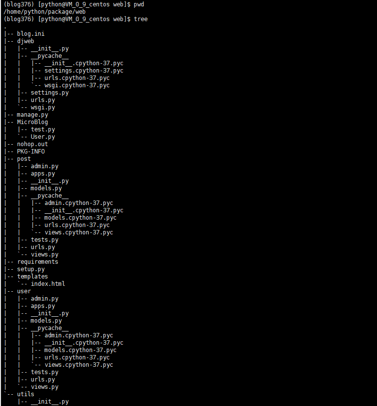
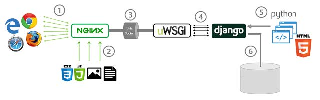
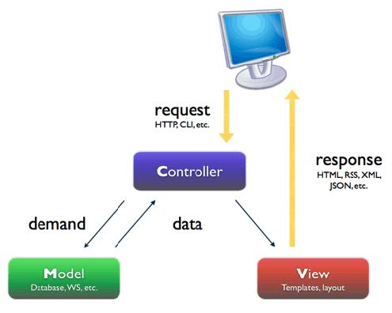
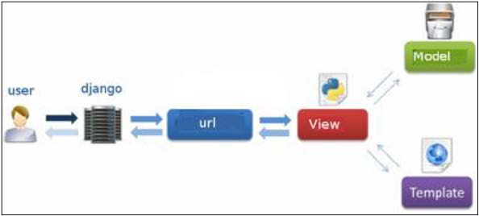
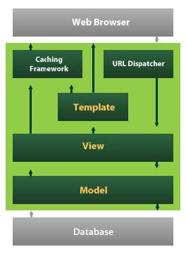

# 项目部署

[toc]

## Django 打包

* 生成项目依赖插件版本信息

````sh
## 应用程序的根目录下生成
$ pip freeze >requirements
````

* 构建setup.py文件(在应用程序根目录下面)

````py
from distutils.core import setup
import glob

setup(name='blog',
      version='1.0',
      description='www.mumuxi.online',
      author='mumuxi',
      author_email="mumuxi@qq.com",
      url='https://www.mumuxi.online',
      packages=["MicroBlog",'post','user','utils','djweb'],
      py_modules=["manage"],
      data_files=glob.glob("templates/*.html") + ["requirements"]
      )

````

````sh
## 应用程序的跟目录下打包
$ python setup.py sdist --formats=gztar #gz
````

* 在Linux系统中创建一个python虚拟环境目录，使用pyenv
* 安装pyenv

````sh
# yum install git python-devel mysql-devel 
# yum -y install gcc make patch gdbm-devel openssl-devel sqlite-devel readline-devel zlib-devel bzip2-devel

python依赖，mysqlclient依赖
# yum install python-devel mysql-devel

# useradd python
# echo python | passwd python --stdin
# su - python

进入python用户执行如下操作
$ curl -L https://github.com/pyenv/pyenv-installer/raw/master/bin/pyenv-installer | bash
$ vim ~/.bashrc
export PATH="/home/root/.pyenv/bin:$PATH"
eval "$(pyenv init -)"
eval "$(pyenv virtualenv-init -)"

$ pyenv install 3.6.6 -vv

准备pip配置文件
$ mkdir ~/.pip
$ vim ~/.pip/pip.conf
[global]
index-url = https://mirrors.aliyun.com/pypi/simple/

[install]
trusted-host=mirrors.aliyun.com

安装虚拟环境
$ pyenv virtualenv 3.6.6 blog366
$ mkdir -p projects
$ cd projects 
$ tar xf blog-1.0.tar.gz
$ ln -sv blog-1.0 web
"web" -> "blog-1.0"
$ cd web
$ pwd
/home/python/projects/web

$ pyenv local blog366
$ pip list
$ pip install -r requirements  #安装依赖包
$ sed -i -e 's/DEBUG.*/DEBUG = False/' -e 's/ALLOWED_HOSTS.*/ALLOWED_HOSTS = ["*"]/' djweb/setting.py # 修改Django配置
$ python manage.py runserver 0.0.0.0:9112 # 测试
````

* 使用`http://www.mumuxi.online:9112/posts/?page=2&size=2` 成功返回数据，说明Django应用成功。
* 至此，Django应用部署完成。Django带了个开发用Web Server. 生成环境不用，需要借助其他Server。
* 注意：ALLOWED_HOSTS=["*"] 这是所有都可以访问，生产环境应指定具体可以访问的IP，而不是所有。

## WSGI

* Web Server Gateway Interface,是Python中定义的WSGI Server与应用程序的接口定义。
* 应用程序符合WSGI规范的Django框架负责，

## uWSGI

* uWSGI是一个c语言的项目，提供一个WEB服务器，它支持WSGI协议，可以和Python的WGSI应用程序通信。
* 官方文档[https://uwsgi-docs.readthedocs.io/en/latest/](https://uwsgi-docs.readthedocs.io/en/latest/)  
* uWSGI可以直接启动HTTP服务，接收HTTP请求，并调用Django应用。
* 安装

````sh
$ pip install uwsgi
$ uwsgi --help
````

## uWSGI+Django部署

* 在Django项目根目录下，运行`$ uwsgi --http :8000 --wsgi-file djweb/wsgi.py --stats :8001 --stats-http`,使用下面链接测试

    1. [http://www.mumuxi.online:8000/](http://www.mumuxi.online:8000/)
    2. [http://www.mumuxi.online:8000/posts/?page=2&size=2](http://www.mumuxi.online:8000/posts/?page=2&size=2)
    * 运行正常。

* `stats`能够显示服务器状态值。 `--stats-http`选项可以使用http访问这个值。
* 安装uwsgitop获取这个stat值。注意使用这个命令不要使用`--stats-http`选项。

````js
$ pip install uwsgitop
$ uwsgitop --frequency www.mumuxi.online:8001
````

* 使用uwsgi启动项目(http协议启动)
`uwsgi --http 127.0.0.1:8889 --wsgi-file djweb/wsgi.py`
* 使用uwsgi启动项目(uwsgi协议启动,二进制通信协议。速度快)
`uwsgi --socket 127.0.0.1:8889 --wsgi-file djweb/wsgi.py`

### uwsgi配置文件

* 本次pyenv的虚拟目录是`/home/python/package/web`,将Django项目所有项目文件和目录放在这个目录下面。uwsgi的配置文件blog.ini也放在这个目录中(blog.ini文件配置后可以快捷启动服务)

  

* blog.ini配置如下：

````ini
[uwsgi]
socket = 127.0.0.1:8889
chdir = /home/python/package/web
wsgi-file = djweb/wsgi.py
````

|配置|说明|
|:---|:----|
|socket=127.0.0.1:8889|使用uwsgi协议通信|
|chdir = /home/python/package/web|Django项目的根目录|
|wsgi-file = djweb/wsgi.py|指定App文件，blog下wsgi.py|

* 使用配置文件blog.ini启动命令为(项目跟目录下启动)：
`uwsgi blog.ini`

## React项目打包

* rimraf递归删除文件，rem -rf

````sh
$ npm install rimraf --save-dev
或者
$ yarn add rimraf --dev

在package.json中替换
"build": "rimraf dist && webpack -p --config webpack.config.prod.js"

$ npm run build
或者
$ yarn run build 
编译成功。查看项目目录中的dist目录。
````

* 将编译成功后的静态文件放入对应的web静态文件中即可(即nginx相应的web目录)
  

## nginx uwsgi部署

### tengine安装

* 淘宝提供的nginx

````sh
# yum install gcc openssl-devel pcre-devel -y

# tar xf tengine-1.2.3
# cd tengine-1.2.3
# ./configure --help | grep wsgi

# ./configure # 第一步
# make && make install # 第二步、第三步
# cd /usr/local/nginx/ # 默认安装位置
````

### http部署

* nginx配置
    1. `^~ /api/`左前缀匹配
    2. `rewrite ^/api(/.*) $1 break;` 重写请求的path

````ini
server {
        listen       8888 ;
        listen       [::]:8888 ;
        server_name  0.0.0.0 ;

        location ^~ /api/ {
           rewrite ^/api(/.*) $1 break;
           proxy_pass http://127.0.0.1:8889;
        }

        location / {
           root /data/web;
           index index.html;
        }

        error_page 404 /404.html;
            location = /40x.html {
        }

        error_page 500 502 503 504 /50x.html;
            location = /50x.html {
        }
    }
````

* 修改后启动nginx。
  

### uwsgi部署

* 目前nginx和uwsgi直接使用的是HTTP通信，效率低。改为使用uwsgi通信。
* 使用uwsgi协议的命令行写法如下
    1. `uwsgi --socket 127.0.0.1:8889 --wsgi-file djweb/wsgi.py`
* 在nginx中配置uwsgi
    [http://nginx.org/en/docs/http/ngx_http_uwsgi_module.html](http://nginx.org/en/docs/http/ngx_http_uwsgi_module.html)

````ini
    server {
        listen       8888 ;
        listen       [::]:8888 ;
        server_name  0.0.0.0 ;

        location ^~ /api/ {
           rewrite ^/api(/.*) $1 break;
           #proxy_pass http://127.0.0.1:8889;
           include      uwsgi_params;
           uwsgi_pass   127.0.0.1:8889;
        }

        location / {
           root /data/web;
           index index.html;
        }

        error_page 404 /404.html;
            location = /40x.html {
        }

        error_page 500 502 503 504 /50x.html;
            location = /50x.html {
        }
    }
````

* 重新加载nginx配置文件，成功运行。至此，前后端分离的开发、动静分离的部署的播客项目大功告成！

* 参看 [https://uwsgi-docs.readthedocs.io/en/latest/WSGIquickstart.html](https://uwsgi-docs.readthedocs.io/en/latest/WSGIquickstart.html)
* uwsgi协议[https://uwsgi-docs.readthedocs.io/en/latest/Protocol.html](https://uwsgi-docs.readthedocs.io/en/latest/Protocol.html)

## 部署图

  

1. 浏览器通过互联网HTTP协议访问NGINX
2. 静态内容(图片、JS、CSS、文件)都是Nginx负者提供WEB服务
3. Nginx配置代理。可以死Http和Socket通信。本次使用uwsgi协议
4. uWSGI服务程序提供uwsgi协议的支持，将从Nginx发来的请求封装后调用WSGI的Application。这个Application可能很复杂，有可能是基于Django框架编写。这个程序将获得请求信息。
5. 通过Django的路由，将请求交给视图函数(类)处理，可能需要访问数据库数据，也可能使用了模板。最终数据返回给浏览器。

## MVC设计模式

  

* Controller控制器：负者接收用户请求，调用Model完成数据，调用view完成对用户的响应
* Model模型：负责业务数据的处理
* View视图：负责用户的交互界面

  
  

* Model层
    1. ORM建立对象关系映射，提供数据库操作
* Template层
    1. 负责数据的可视化，使用HTML、CSS等构成模板，将数据应用到模板中，并返回给浏览器。
* View层
    1. Django完成URL映射后，把请求交给View层的视图函数处理，调用Model层完成数据，如有必要调用Template层响应客户端，如果不需要，直接返回数据。
