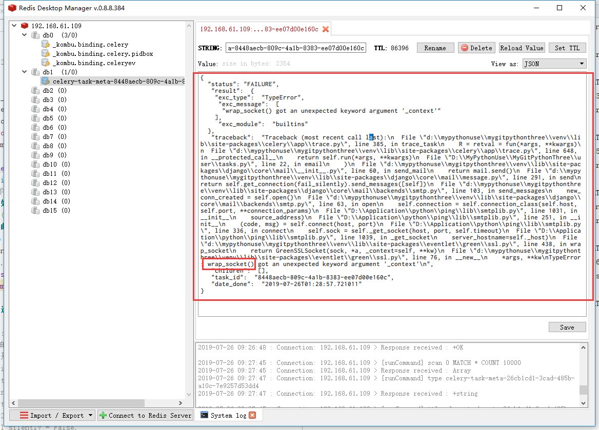

# Celery调度+Redis安装

Celery是一个使用Python开发的**分布式任务调度模块**，因此对于大量使用Python构建的系统,使用起来方便。  
Celery目前爸爸4.x,仅支持Django 1.8以上版本。 Celery 3.1只可以支持Django1.8一下版本。  

* Celery官网[http://www.celeryproject.org/](http://www.celeryproject.org/)  
* Celery帮助文档[http://www.celeryproject.org/docs-and-support/](http://www.celeryproject.org/docs-and-support/)

* 优点：
    1. 简单：调用接口简单易用
    2. 高可用：客户端、Worker之间连接自动重试，Broker自身支持HA
    3. 快速：单个Celery进程每分钟可用数以百万计的任务
    4. 灵活：Celery的每一个部分都能扩展，或直接使用，或用户自己定义。

## 常用应用

* Celery可用支持实时异步任务处理，也支持任务的定时调度。
    1. 异步发邮件
        * cleery执行队列
    2. 间隔半小时同步天气信息等
        * celery定时操作

## 角色

* 任务Task:对应一个Python函数
* 队列Queue:待执行任务的队列
* 工人Worker:一个新的进程，负者执行任务
* 代理Broker:负者调度，在任务环境中使用RabbitMQ、Redis等  

1. Celery需要依靠RabbitMQ等作为消息代理，同时也支持Redis甚至是Mysql、Mongo等，当然，官方默认推荐的是RabbitMQ,如果使用Redis需要配置。  
2. 本次采用Redis来作为Broker，也是Redis存储任务结果

## 安装

````shell
$ pip install celery==4.2.0

安装对redis的支持，并自动升级相关依赖
$ pip install -U "celery[redis]"
````

## 测试

Celery库使用前，必须初始化，所得示例叫做"应用application或app"。应用是线程安全的。不同应用在同一进程中，可以使用不同拍照、不同组件、不同结果

````python
from celery import Celery
app = Celery('mytask')
print(app)

@app.task
def add(x,y):
    return x+y

print(add.name) #mytask.add
print(add)

print(app.tasks)
print(app.conf)
print(*list(app.conf.items()),sep = '\n')
````

* 默认使用amqp链接到本地amqp://guest:**@localhost:5672//
* 本次使用Redis

### Redis安装配置 

* 使用Epel源的rpm安装

````shell
redis安装，使用提供的rpm安装，redis依赖jemalloc

# yum install jemalloc-3.6.0-1.el7.x86_64.rpm redis-3.2.12-2.el7.x86_64.rpm

# rpm -pql redis-3.2.12-2.el7.x86_64.rpm
/etc/logrotate.d/redis
/etc/redis-sentinel.conf
/etc/redis.conf
/usr/bin/redis-cli
/usr/bin/redis-sentinel
/usr/bin/redis-server
/usr/lib/systemd/system/redis-sentinel.service
/usr/lib/systemd/system/redis.service

# 编辑redis配置文件
# vi /ect/redis.conf
port 6379 #启动时的默认端口
bind 192.168.61.109  #redis启动时的主机
protected-mode no #是否开启保护模式
````

* 启动、停止redis服务

````shell
## 启动服务
# systemctl start redis 
## 停止服务
# systemctl stop redis
## 添加开机启动
# systemctl enable redis
````

### broker配置使用

* redis链接字符串格式`redis://password@hostname:port/db_number`

````sh
#指定服务器的redis端口6379，使用0号库
app.conf.broker_url = 'redis://192.168.61.109:6379/0'
````

### Celery使用

* 生成任务

````python
from celery import Celery
import time
app = Celery('mytask')
# print(app)
# print(add.name) #mytask.add
# print(add)
# print(app.tasks)
# print(app.conf)
#配置redis派发任务，任务存放地址
app.conf.broker_url = 'redis://192.168.61.109:6379/0'
#配置redis任务状态返回值数据库
app.conf.result_backend = 'redis://192.168.61.109:6379/1'
# 重复执行问题解决
# 如果超过visibility_timeout，Celery会认为此任务失败
# 会重分配其他worker执行该任务，这样会造成重复执行。visibility_timeout这个值大一些
# 注意，如果慢任务执行时长超过visibility_timeout依然会多执行
#配置任务超时时间12小时
app.conf.broker_transport_options = {"visibility_timeout":3600*12} #12 hours
app.conf.update(
    enable_utc = True,
    timezone = "Asia/Shanghai"
)

@app.task(name="my_add")
def add(x,y):
    print("start run add x={},y={}".format(x,y))
    ret = x+y
    time.sleep(5)
    print("end run ret = {}".format(ret))
    return ret

if __name__ == "__main__":
    add.delay(4,5) #下发一个任务到broker的queue
    add.apply_async((10,20),countdown=60) #派发一个任务，延迟60秒后执行
````

* 注意：上面代码执行，使用add.delay等加入任务到Redis中，在启动celery命令消费Redis的任务，执行并返回结果到Redis中。

* 添加任务的常用方法
    1. T.delay(arg,kwarg=value) #快捷添加任务的方法
        * T：被app.task装饰的函数
        * args :位置参数
        * kwargs：关键字参数
    2. T.apply_async((args,),{'kwarg':value},countdown=?,expires=?)
        * args 位置参数，是个元组
        * kwargs 关键字参数，是个字典
        * contdown 延迟多久执行，默认秒
        * expires 多久后过期，默认秒
* 执行任务：如果在Linux下能出现下面问题，可如下配置

````python
from celery import platforms

# Linux下，默认不允许root用户启动celery，可使用下面的配置
platforms.C_FORCE_ROOT = True
````

* 使用命令执行Redis中的任务(默认在pycharm控制台中使用)
* `$ celery -A test1 worker --loglevel=INFO --concurrency=5 -n worker1@%n`
    1. -A APP, --app App指定app名称，App是模块名
    2. --loglevel 指定日志级别
    3. -n 名称，%n指主机名
    4. --concurrency 指定并发多进程数，缺省值是CPU数

* windows下可能出现下面问题.

````txt
[2019-07-25 17:09:29,477: ERROR/MainProcess] Task handler raised error: ValueError('not enough values to unpack (expected 3, got 0)')
Traceback (most recent call last):
  File "d:\mypythonuse\mygitpythonthree\venv\lib\site-packages\billiard\pool.py", line 358, in workloop
    result = (True, prepare_result(fun(*args, **kwargs)))
  File "d:\mypythonuse\mygitpythonthree\venv\lib\site-packages\celery\app\trace.py", line 544, in _fast_trace_task
    tasks, accept, hostname = _loc
ValueError: not enough values to unpack (expected 3, got 0)
[2019-07-25 17:09:30,354: ERROR/MainProcess] Task handler raised error: ValueError('not enough values to unpack (expected 3, got 0)')
Traceback (most recent call last):
  File "d:\mypythonuse\mygitpythonthree\venv\lib\site-packages\billiard\pool.py", line 358, in workloop
    result = (True, prepare_result(fun(*args, **kwargs)))
  File "d:\mypythonuse\mygitpythonthree\venv\lib\site-packages\celery\app\trace.py", line 544, in _fast_trace_task
    tasks, accept, hostname = _loc
ValueError: not enough values to unpack (expected 3, got 0)
````

1. 安装eventlet解决问题  

> pip install eventlet  

包括win10,建议还是按照eventlet  
重新执行任务  

> celery -A test1 worker -p eventlet --loglevel=INFO --concurrency=5 -n worker1@%n  

* -P ,--pool 指定进程池实现，默认prefork,windows下使用eventlet
* 运行日志如下

````text
(venv) D:\MyPythonUse\MyGitPythonThree>celery -A text worker -P eventlet --loglevel=INFO --concurrency=4 -n worker1%n

 -------------- celery@worker1gdy v4.4.0rc2 (cliffs)
---- **** -----
--- * ***  * -- Windows-10-10.0.17134-SP0 2019-07-25 17:39:37
-- * - **** ---
- ** ---------- [config]
- ** ---------- .> app:         mytask:0x1a93ee6cc18
- ** ---------- .> transport:   redis://192.168.61.109:6379/0
- ** ---------- .> results:     redis://192.168.61.109:6379/1
- *** --- * --- .> concurrency: 4 (eventlet)
-- ******* ---- .> task events: OFF (enable -E to monitor tasks in this worker)
--- ***** -----
 -------------- [queues]
                .> celery           exchange=celery(direct) key=celery


[tasks]
  . my_add

[2019-07-25 17:39:37,834: INFO/MainProcess] Connected to redis://192.168.61.109:6379/0
[2019-07-25 17:39:37,859: INFO/MainProcess] mingle: searching for neighbors
[2019-07-25 17:39:38,909: INFO/MainProcess] mingle: all alone
[2019-07-25 17:39:38,963: INFO/MainProcess] celery@worker1gdy ready.
[2019-07-25 17:39:38,981: INFO/MainProcess] pidbox: Connected to redis://192.168.61.109:6379/0.
[2019-07-25 17:39:39,067: INFO/MainProcess] Received task: my_add[c3e8cfe7-e9d9-49c6-94ff-e6cf5f6a8d83]
[2019-07-25 17:39:39,069: WARNING/MainProcess] start run add x=4,y=5
[2019-07-25 17:39:39,076: INFO/MainProcess] Received task: my_add[ac9bd504-c027-4c9a-9ab2-13c4e5c791f1]  ETA:[2019-07-25 17:39:58.654164+08:00]
[2019-07-25 17:39:44,070: WARNING/MainProcess] end run ret = 9
[2019-07-25 17:39:44,077: INFO/MainProcess] Task my_add[c3e8cfe7-e9d9-49c6-94ff-e6cf5f6a8d83] succeeded in 5.0s: 9
[2019-07-25 17:39:58,663: WARNING/MainProcess] start run add x=10,y=20
[2019-07-25 17:40:03,669: WARNING/MainProcess] end run ret = 30
[2019-07-25 17:40:03,672: INFO/MainProcess] Task my_add[ac9bd504-c027-4c9a-9ab2-13c4e5c791f1] succeeded in 5.0s: 30
````

## 发邮件

* 在用户注册完激活时，或修改了用户信息，遇到故障等情况时，都会发送邮件或发送短信息，这些业务场景不需要一直阻塞等待这些发送任务完成，一般都会采用异步执行。也就是说，都会向队列中添加一个任务后，直接返回。  
* 发邮件帮助可以参考[https://docs.djangoproject.com/en/2.2/topics/email/](https://docs.djangoproject.com/en/2.2/topics/email/)
* Django中发送邮件需要在settings.py中配置如下

````python
# SMTP
EMAIL_BACKEND = 'django.core.mail.backends.smtp.EmailBackend'
EMAIL_HOST = "smtp.exmail.qq.com"
EMAIL_PORT = 465 #缺省25，SSL的异步465
EMAIL_USE_SSL = True #缺省False
EMAIL_HOST_USER = "magetest@magedu.com"
EMAIL_HOST_PASSWORD = "Python123"
EMAIL_USE_TLS = False #缺省值False

# ## qq邮件配置
# EMAIL_BACKEND = 'django.core.mail.backends.smtp.EmailBackend'
# EMAIL_HOST = "smtp.qq.com"
# EMAIL_PORT = 465 #缺省25，SSL的异步465
# EMAIL_USE_SSL = True #缺省False
# EMAIL_USE_TLS = False #缺省值False
# EMAIL_HOST_USER = "1263351411@qq.com"
# EMAIL_HOST_PASSWORD = "*************" #需要在qq邮箱设置红开通POP3/SMTP服务 服务
````

* 注意：不同邮箱服务器配置不太一样。
* 邮件发送测试代码如下：

````python
from django.core.mail import send_mail
from blog import settings

def email():
    """发送邮件"""
    print("开始发送")
    send_mail(
        "active_email",
        "Here is the message",
        settings.EMAIL_HOST_USER, #服务器的发件箱
        ["1263351411@qq.com"],#目标，收件箱
        fail_silently = False,
        html_message="点击此链接激活邮件<a href='{0}'>{0}</a>".format("www.baidu.com")
    )
    print("发送完成")

# 测试函数
def text(request):
    try:
        print("aa-------  --------")
        email()
        return HttpResponse("发送成功",status=201)
    except Exception as e:
        logging.info(e)
        return JsonResponse({"error":"邮件发送失败"},status=400)
````

### Celery在Django中的集成方法

* 新版本Celery集成到Django方式改变了。
* 目录结构

````txt
- proj/
  - manage.py
  - proj/ #Django全局目录
    - __init__.py
    - settings.py
    - celery.py
    - urls.py
  - app1 #应用程序目录
    - __init__.py
    - tasks.py
    - view.py
    - models.py
````

* 在Django全局目录中(settings.pys所在目录)
  1. 定义一个celery.py文件

      ````python
      """
      author:xdd
      date:2019-07-25 20:21
      """
      from __future__ import absolute_import, unicode_literals
      import os
      from celery import Celery

      os.environ.setdefault('DJANGO_SETTINGS_MODULE', 'blog.settings') #必须修改模块名
      app = Celery("xdd")
      app.config_from_object('django.conf:settings', namespace='CELERY')
      app.autodiscover_tasks()
      app.conf.update(
          enable_utc=True,
          timezone="Asia/Shanghai"
      )
      # 配置redis派发任务，任务存放地址
      app.conf.broker_url = 'redis://192.168.61.109:6379/0'
      # 配置redis任务状态返回值数据库
      app.conf.result_backend = 'redis://192.168.61.109:6379/1'
      # 如果超过visibility_timeout，Celery会认为此任务失败
      # 会重分配其他worker执行该任务，这样会造成重复执行。visibility_timeout这个值大一些
      # 注意，如果慢任务执行时长超过visibility_timeout依然会多执行
      app.conf.broker_transport_options = {"visibility_timeout": 3600 * 12}  # 12 hours
      ````

  2. 修改`__init__.py`文件

      ````python
      from __future__ import absolute_import, unicode_literals
      from .celery import app as celery_app

      __all__ = ('celery_app',)
      ````

* 在user应用下
  1. 新建文件`tasks.py`中新建任务

      ````python
      """
      author:xdd
      date:2019-07-25 20:32
      """

      from __future__ import absolute_import, unicode_literals
      from blog.celery import app
      from django.core.mail import send_mail
      from blog import settings
      import datetime

      @app.task(name="server_email")
      def email(active_url,email=[]):
          """发送邮件"""
          print("开始发送")
          send_mail(
              "激活邮件",
              "Here is the message",
              settings.EMAIL_HOST_USER, #服务器的发件箱
              email,#目标，收件箱
              fail_silently = False,
              html_message="点击此链接激活邮件<a href='{0}'>{0}</a> 时间：{1:%Y-%m-%d %H:%M:%S}".format(active_url,datetime.datetime.now())
          )
          print("发送完成")
      ````

  2. views.py视图函数中调用

      ````python
      from .tasks import email
      # 测试函数
      def text(request):
          try:
              print("aa-------  --------")
              email.delay("www.baidu.com",["1263351411@qq.com"])
              return HttpResponse("发送成功",status=201)
          except Exception as e:
              logging.info(e)
              return JsonResponse({"error":"邮件发送失败"},status=400)
      ````
  
  * 以后放在注册函数中发送邮件。
  * 注意：目前在Python3.7部署时，发邮件可能会报wrap_socket()错。可以使用python3.6版本
    

  * urls.py路由视图函数

    ````python
    """
    author:xdd
    date:2019-07-17 22:09
    """

    from django.conf.urls import url
    from .views import reg,login,text,logout
    from django.http import HttpResponse
    from user.models import User

    urlpatterns = [
        url(r'^$',reg), #用户注册
        url(r'^login$',login),  #用户登录
        url(r'^logout$',logout), #用户登出
        url(r'^text$',text),
    ]
    ````
  
  * 访问`http://127.0.0.1:8000/users/text`会调用text视图函数，执行email.delay()，会在redis中增加任务。
  * 执行任务，下面命令会从redis中拿任务执行  

  > celery -A blog -P eventlet worker --loglevel=INFO --concurrency=4 -n worker@%n

