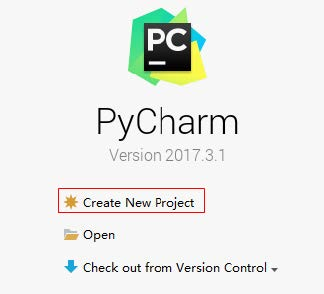
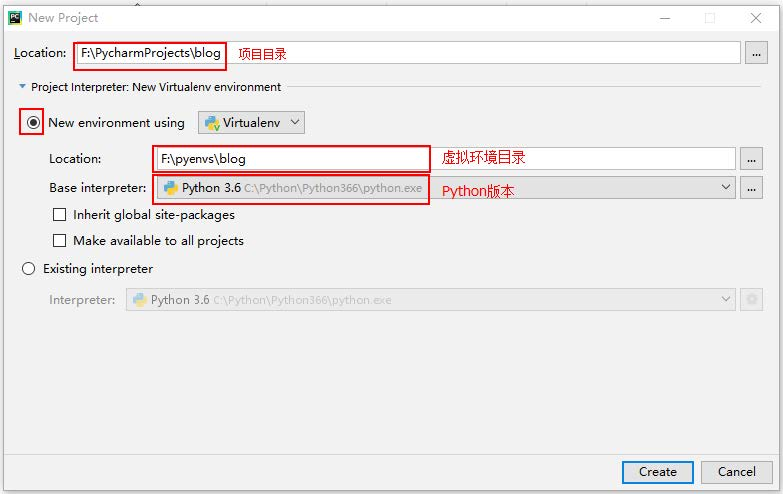
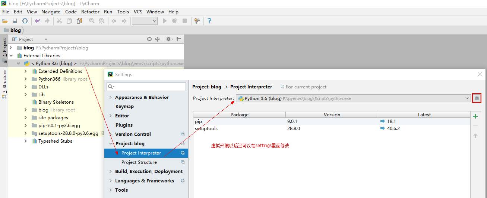

# 播客系统数据库模型设计--Django播客系统(二)

[toc]

## 分析

* 多人使用播客系统。采用BS架构实现。市面上多数某某系统归根结底都是这种设计。
* 播客系统，核心模块有：
    1. 用户管理
        * 注册、登录
        * 删除查用户
    2. 博文管理
        * 增删改查博文
* 需要数据库，本次使用Mysql5.5,InnoDB引擎。
* 需要支持多用户登录，各自可以管理自己的博文(增删改查)，管理是不公开的，但是博文是不需要登录就可以公开预览的。
* 先不要思考过多的功能，先完成最小的核心需求代码。

## 数据库设计

### 创建数据库

> CREATE DATABASE IF NOT EXISTS blog;  

需要用户表、文章表

### 用户表user

|字段|说明|
|:------|:--------|
|id|主键，唯一标识|
|name|用户姓名，描述性字段|
|email|电子邮箱，注册用信息，应该唯一。可用作登录名、可用于密码找回|
|password|密码存储。注意，不能明文存储密码。一般采用单向加密算法，如MD5

````sql
CREATE TABLE `user` (
    `id` INT ( 11 ) NOT NULL AUTO_INCREMENT,
    `name` VARCHAR ( 48 ) NOT NULL,
    `email` VARCHAR ( 64 ) NOT NULL,
    `password` VARCHAR ( 128 ) NOT NULL,
    PRIMARY KEY ( `id` ),
UNIQUE KEY `email` ( `email` )
) ENGINE = INNODB DEFAULT CHARSET = utf8;
````

### 文章表post

|字段|说明|
|:--------|:---------|
|id|主键，唯一标识|
|title|标题，描述性字段|
|author|博文作者要求必须是注册用户，这个字段应该存储userid|
|postdate|发布日期，日期类型|
|content|文章内容，博文内容可能很长，一般来说不会小于256个字符的

* 一对多关系：一篇博文属于一个作者，一个作者有多篇博文。

* **Content字段的设计**
    1. **字段类型**：博文一般很长，不可能只有几百个字符，需要大文本字段。MySQL中，选择TEXT类型，而不是char或者varchar类型。
    2. **大小**：text类型是65535个字符，如果不够用，选择longtext,有$2^{32}-1$个字符长度。足够使用了。  
    3. **图片存储**：博文就像HTML一样，图片是通过**路径信息**将图片是嵌入在内容中的，所以保存的内容还是字符串。图片来源有2中：
        1. 外联：通过URL链接访问，本站不用存储该图片，但容易引起盗链问题。
        2. 本站存储：需要提供博文的在线文本编辑器，提供图片上传到网站存储，并生成图片URL，这个URL嵌入播客正文中，不会有盗链问题，但要解决众多图片存储问题、水印问题、在线压缩问题、临时或垃圾图片清理等等难题。
        * 本播客项目不实现图片功能
    4. **字段考虑**
        * content字段存储文本类型大字段，一般不和数据频繁查询的字段放在一张表中，需要拆到另一张表中。

````sql
CREATE TABLE `post` (
    `id` BIGINT ( 20 ) NOT NULL AUTO_INCREMENT,
    `title` VARCHAR ( 256 ) NOT NULL,
    `author_id` INT ( 11 ) NOT NULL,
    `postdate` datetime NOT NULL,
    PRIMARY KEY ( `id` ),
    KEY `author_id` ( `author_id` ),
CONSTRAINT `fk_post_user` FOREIGN KEY ( `author_id` ) REFERENCES `user` ( `id` ) 
) ENGINE = INNODB DEFAULT CHARSET = utf8;
````

````sql
CREATE TABLE `content` (
    `id` BIGINT ( 20 ) NOT NULL AUTO_INCREMENT,
    `content` text NOT NULL,
    PRIMARY KEY ( `id` ),
CONSTRAINT `fk_content_post` FOREIGN KEY ( `id` ) REFERENCES `post` ( `id` ) 
) ENGINE = INNODB DEFAULT CHARSET = utf8;
````

* 注：这里的SQL脚本本次不要用来生成表，使用ORM库写代码来创建表，用来检查实体类构建是否正确。
* 用户完成的功能有登录、注册、登出等，user表基本满足。
* 播客功能有用户发文、文章列表、文章详情等，post、content表基本满足。

## 项目

### 项目构建

* 在Pycharm中创建一个项目，使用虚拟环境，Python使用版本是3.6
    
* 使用虚拟环境，Python挑选喜欢的版本(本次选用3.6)
    
* 注：Pycharm中可通过setting重新设置虚拟环境。
    
* 本次项目使用Django开发后台。


