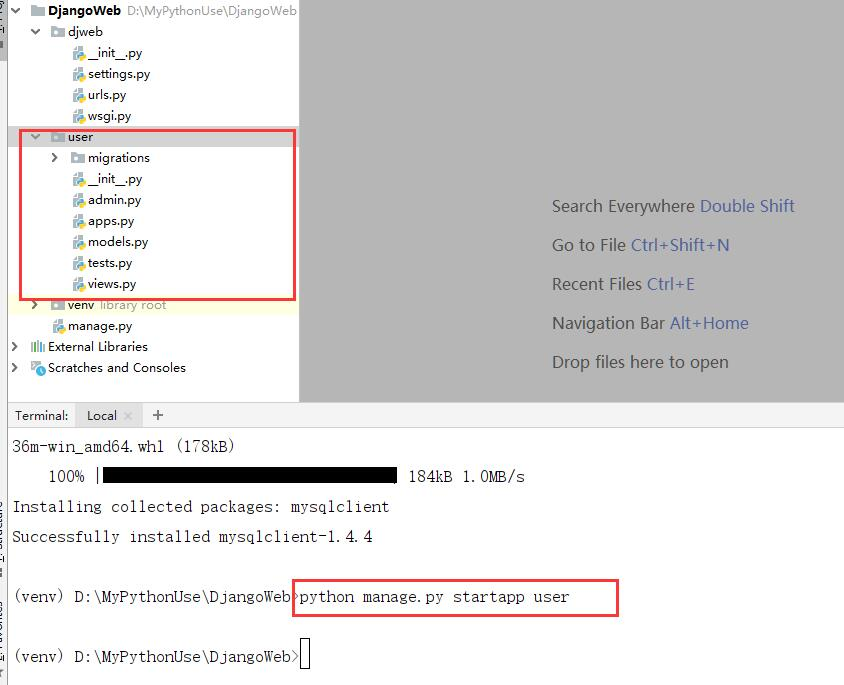
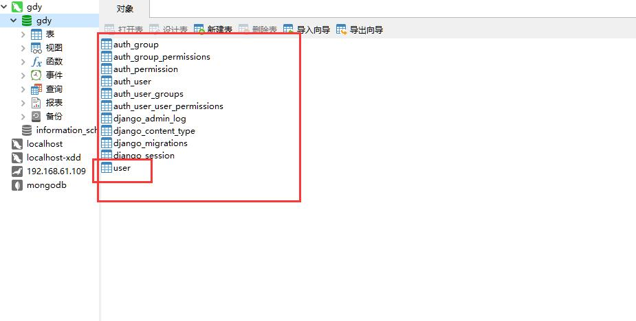
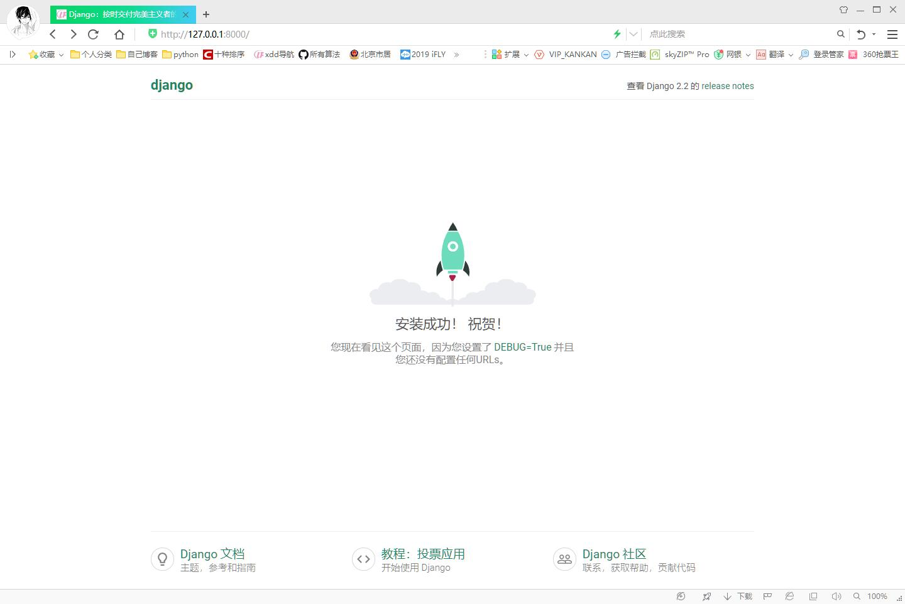
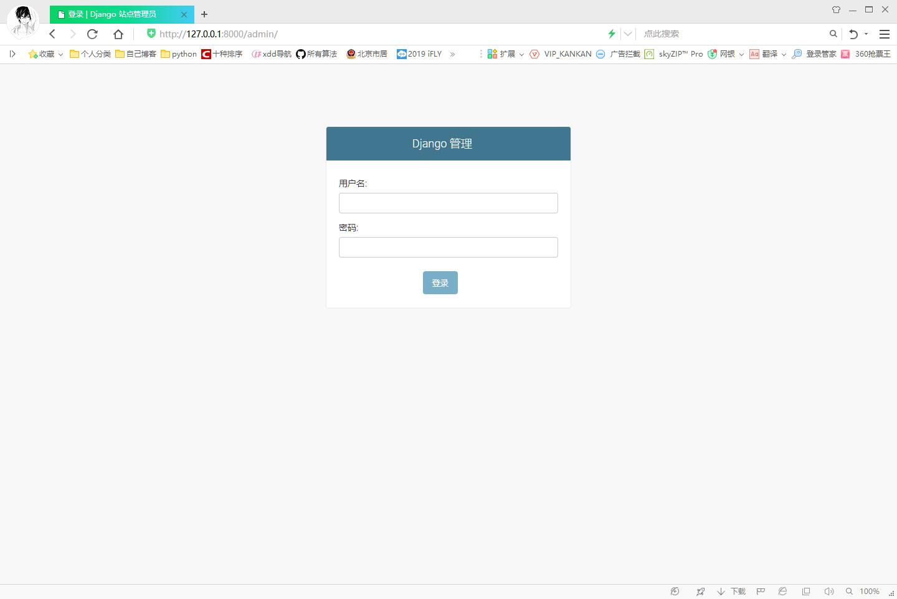
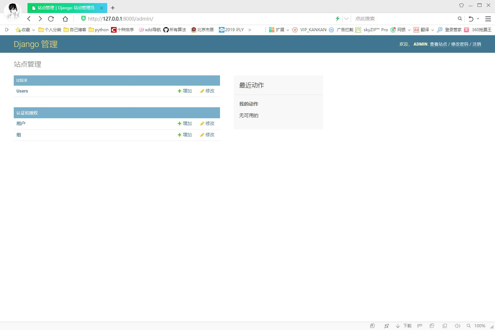

# 项目构建和基础知识--Django播客系统(三)

[toc]

## 概述

* Django采用MVC架构设计的开源的WEB快速开发框架。
* 优点：
    1. 能够快速开发，自带ORM、Template、Form、Auth核心组件
    2. MVC设计模式
    3. 实用的管理后台Admin
    4. 简洁的url设计
    5. 周边插件丰富
* 缺点：架构重、同步阻塞
* 所有Django的设计目标就是一款大而全，便于企业快速开发项目的框架，因此企业应用较广。

## 安装Django

* Python实用3.6.x
* Django的下载地址[https://www.djangoproject.com/download/](https://www.djangoproject.com/download/)
* Python版本依赖，参看[https://docs.djangoproject.com/en/1.11/faq/install/#faq-python-version-support](https://docs.djangoproject.com/en/1.11/faq/install/#faq-python-version-support)

|Django version|Python版本|
|:-----------|:---------------|
|1.8|2.7,3.2 (until the end of 2016), 3.3, 3.4, 3.5|
|1.9,1.10|2.7,3.4,3.5|
|1.11(LTS)|2.7,3.4,3.5,3.6,3.7(added in 1.11.17)|
|2.0|3.4,3.5,3.6,3.7|
|2.1,2.2(LTS)|3.5,3.6,3.7|

* 目前Django长期支持版本有1.11和2.2，这是企业的选择。
    1. `$ pip install django==2.2`
* 本次使用Django2.2版本，它也是长期支持版本LTS,请在虚拟环境中安装。
* 在虚拟环境路径中，`Lib/site-packeges/django/bin`下游一个django-admin.py,一起从它开始。

````cmd
# django-admin --version #查看当前django版本
# django-admin --help #查看使用帮助
# django-admin startproject --help #查看startproject命令帮助
````

````cmd
(venv) D:\MyPythonUse\DjangoWeb>django-admin

Type 'django-admin help <subcommand>' for help on a specific subcommand.

Available subcommands:

[django]
    check
    compilemessages
    createcachetable
    dbshell
    diffsettings
    dumpdata
    flush
    inspectdb
    loaddata
    makemessages
    makemigrations
    migrate
    runserver
    sendtestemail
    shell
    showmigrations
    sqlflush
    sqlmigrate
    sqlsequencereset
    squashmigrations
    startapp
    startproject
    test
    testserver
````

* 注意：**本文若未特殊声明，所有的命令操作都在项目的根目录下**

## 创建Django项目

* 创建名为blog的django项目`django-admin startproject djweb .`

* 上句命令就在当前项目根目录中构建了Django项目的初始文件。`.`点代表项目根目录。

````text
F:\CLASSES\TPROJECTS\BLOG10 
├─ manage.py
 └─ djweb
     ├─  settings.py
     ├─  urls.py
     ├─  wsgi.py
     └─  __init__.py
````

* 重要文件说明
    1. manage.py:本项目管理的命令行工具。应用创建、数据库迁移等都使用它完成
    2. dgweb/settings.py：本项目的核心配置文件。数据库、中间件、模板等
    3. dgweb/urls.py:URL路径映射配置。项目初始，只配置了/admin的路由。
    4. dgweb/wsgi:定义WSGI接口信息。部署用，一般无需改动。

### 数据库配置

使用数据库，需要修改默认的数据库配置。  
在主项目的settings.py下DATABASES。默认使用的sqlite，修改为mysql。  

````py
DATABASES = {
    'default': {
        'ENGINE': 'django.db.backends.mysql',
        'NAME': 'gdy',
        'USER': 'gdy',
        'PASSWORD': 'gdy',
        'HOST': '127.0.0.1',
        'PORT': '3306',
    }
}
````

|配置项|说明|
|:-----|:----|
|HOST|数据库主机。缺省是空字符串，代表localhost。如果是`/`开头表示使用UnixSocket链接|
|POST|端口|
|USER|用户名|
|PASSWORD|密码|
|NAME|库名|
|OPTIONS|选项、字典类型，参考MySQL文档|

1. 数据库引擎ENGINE
2. 内建引擎有
    * `django.db.backends.postgresql`
    * `django.db.backends.mysql`
    * `django.db.backends.sqlite3`
    * `django.db.backends.oracle`

### MySQL数据库驱动

[https://docs.djangoproject.com/en/1.11/ref/databases/#mysql-db-api-drivers](https://docs.djangoproject.com/en/1.11/ref/databases/#mysql-db-api-drivers)  

Django支持MySQL5.5+  
Django官方推荐使用本地驱动mysqlclient 1.3.7+

* 安装mysql驱动`pip install mysqlclient`

````txt
windows下可能发生安装错误 error: Microsoft Visual C++ 14.0 is required.解决方法  
1、下载Visual C++ Redistributable Packages 2015、2017安装，但是即使安装后，确实看到了V14库，也不保证 安装mysqlclient就成功  
2、直接安装编译好的wheel文件  
mysqlclient-1.3.13-cp35-cp35m-win_amd64.whl ，python 3.5使用  
mysqlclient-1.3.13-cp36-cp36m-win_amd64.whl ，python 3.6使用  
mysqlclient-1.4.2-cp37-cp37m-win_amd64.whl，  python 3.7使用  

$ pip install mysqlclient-1.3.13-cp35-cp35m-win_amd64.whl 
参考 https://stackoverflow.com/questions/29846087/microsoft-visual-c-14-0-is-required-unable-tofind-vcvarsall-bat

下载地址 https://www.lfd.uci.edu/~gohlke/pythonlibs/
--------------------------------------------------------------------------------
Linux、Mac请参照官网安装依赖库  
https://pypi.org/project/mysqlclient/
````

### 创建应用

* 创建用户应用`python manage.py startapp user`。创建应用后，项目根目录下产生一个user目录，有如下文件：
    1. `admin.py`:应用后台管理声明文件
    2. `models.py`:模型层Model类定义
    3. `views.py`:定义URL响应函数或类
    4. `migrations包`：数据迁移文件生成目录
    5. `apps.py`：应用的信息定义文件

      

    1. user应用创建后应该完成以下功能：
        1. 用户注册
        2. 用户登录

### 注册应用

在`settings.py`中，增加user应用。目的是为了**后台管理**admin使用，或**迁移**migrate使用

````python
#settings.py文件中
INSTALLED_APPS = [
    'django.contrib.admin',
    'django.contrib.auth',
    'django.contrib.contenttypes',
    'django.contrib.sessions',
    'django.contrib.messages',
    'django.contrib.staticfiles',
    'user'
]
````

### 模型Model

* **字段类型**

|字段类|说明|
|:-----|:----|
|AutoField|自增的整数字段。<br/>如果不指定，django会为模型类自动增加主键字段|
|BooleanField|布尔值字段，True和False <br/>对应表单控件CheckboxInput|
|NullBooleanField|比BooleanField多一个null值|
|CharField|字符串，max_length设定字符长度 <br/>对应表单控件TextInput|
|TextField|大文本字段，一般超过4000个字符串使用<br/>对应表单控件Textarea|
|IntegerField|整数字段|
|BigIntegerField|更大整数字段，8字节|
|DecimalField|使用Python的Decimal实例表示十进制浮点数。max_digits总位数。<br/>decimal_piaces小数点后的位数|
|FloatField|Python的Float实例表示的浮点数|
|DateFleld|使用Python的datetime.date实例表示的日期<br/>auto_now=False每次修改对象自动设置为当前时间。auto_now_add=False对象第一次创建时自动设置为当前时间。auto_now_add、auto_now、default互斥对应控件为TextInput,关联了一个js编写的日历控件|
|TimeField|使用Python的datetime.time实例表示时间，参数同上|
|DateTimeField|使用Python的tetime.datetime实例表示的时间，参数同上|
|FileField|一个上传文件的字段|
|ImageField|继承了FileField的所有属性和方法，但是对上传文件进行校验，确保是一个有效的图片|
|EmailField|能Email检验,基于CharField,默认max_length=245|
|GenericlPAddressField|支持IPv4,IPv6检验，缺省对应文本框输入|
|URLField|能做URL检验，基于基于CharField,默认max_length=200|

* **缺省主键**
    1. 缺省情况下，Django的每一个Model都有一个名为id的AutoField字段，如下
        * `id = models.AutoField(primary_key=True)`
    2. 如果显示定义了主键，这种缺省主键就不会被创建了。Python之禅中说“显示优于隐试”，所以，尽量使用自己定义的主键，哪怕该字段名就是id，也是一种不错的选择。
* **字段选项**
    1. 参考[https://docs.djangoproject.com/en/1.11/ref/models/fields/#field-options](https://docs.djangoproject.com/en/1.11/ref/models/fields/#field-options)  

    |值|说明|
    |:--------|:-------------|
    |db_column|表中字段的名称，如果未指定，则使用属性名|
    |**primary_key**|是否主键|
    |**unique**|是否是唯一键|
    |default|缺省值，这个缺省值不是数据库字段的缺省值，而新对象产生的时候被填入的缺省值|
    |**null**|表示字段是否可为null,默认为False|
    |blank|Django表单验证中，是否可以不填写，默认为False|
    |**db_index**|字段是否有索引|

    1. 关系类型字段类

    |类|说明|
    |:--------|:------------|
    |ForeignKey|外键,表示一对多<br/>`ForeignKey('production.Manufacturer')`<br/>自联`ForeignKey('self')`|
    |ManyToManyField|表示多对多|
    |OneToOneField|表示一对一|

    1. 一对多，自动创建会增加`_id`后缀。
        * 从一访问多，使用`对象.小写模型类_set`
        * 从一访问一，使用`对象.小写模型类`
    2. 访问id `对象.属性_id`

### 创建User的Model类

* 基类models.Model
* 表名不指定默认使用`<appname>_<model_name>`。使用Meta类修改表名

````python
#/user/models.py文件
from django.db import models

# user表模型
class User(models.Model):
    class Meta:
        db_table = "user"
    id = models.AutoField(primary_key=True)
    name = models.CharField(max_length=48,null=False)
    email = models.CharField(max_length=64,unique=True,null=False)
    password = models.CharField(max_length=128,null=False)

    def __repr__(self):
        return "<user {} {}>".format(self.id,self.name)

    __str__ = __repr__
````  

Meta类的使用，参考[https://docs.djangoproject.com/en/1.11/ref/models/options/#django.db.models.Options.db_table](https://docs.djangoproject.com/en/1.11/ref/models/options/#django.db.models.Options.db_table)  

1. **迁移Migration**
    * 迁移：从模型定义生成数据库的表
    1. 生成迁移文件。执行`python manage.py makemigrations`

        ````cmd
        (venv) D:\MyPythonUse\DjangoWeb>python manage.py makemigrations
        Migrations for 'user':
        user\migrations\0001_initial.py
            - Create model User

        生成如下文件
        user
        ├─ migrations
            ├─  0001_initial.py
            └─  __init__.py
        ````

        * 修改MOdel类，还需要调用`python manage.py makemigrations`，然后migrate，迁移文件的序号会增加。

        * 注意：
            1. 迁移的应用必须在settings.py的INSTALLED_APPS中注册。
            2. 不要谁便删除这些迁移文件，因为后面的改动都是要依据这些迁移文件的。
        * 生成的迁移文件`0001_initial.py`内容如下：

        ````python
        # Generated by Django 2.2 on 2019-09-06 00:09

        from django.db import migrations, models


        class Migration(migrations.Migration):

            initial = True

            dependencies = [
            ]

            operations = [
                migrations.CreateModel(
                    name='User',
                    fields=[
                        ('id', models.AutoField(primary_key=True, serialize=False)),
                        ('name', models.CharField(max_length=48)),
                        ('email', models.CharField(max_length=64, unique=True)),
                        ('password', models.CharField(max_length=128)),
                    ],
                    options={
                        'db_table': 'user',
                    },
                ),
            ]
        ````

    2. 执行迁移生成数据库的表`python manage.py migrate`
        * 执行了迁移，还同时生成了admin管理用的表。
        * 查看数据库，user表创建好了，字段设置完全正确。
          

## Django后台管理

1. **创建管理员**
    * 命令`python manage.py createsuperuser`
        * 管理会用户名admin
        * 密码adminadmin

    ````python
    venv) D:\MyPythonUse\DjangoWeb>python manage.py createsuperuser
    Username (leave blank to use 'gdy'): admin
    Email address: admin@admin
    Error: Enter a valid email address.
    Email address: admin@admin.com
    Password:
    Password (again):
    The password is too similar to the email address.
    ````

2. **本地化**
    * settings.py中可以设置语言、时区。语言名称可以查看`django\contrib\admin\locale`目录

    ````python
    # 修改djweb/settings.py文件中对应变量
    LANGUAGE_CODE = 'zh-Hans' #'en-us'

    TIME_ZONE = 'Asia/Shanghai' # 'UTC'

    USE_TZ = True
    ````

3. **启动WEB Server**
    * 命令`python manage.py runserver`默认启动端口在8000
    * 访问`http://127.0.0.1:8000/`看到服务启动正常
          
    * 访问`http://127.0.0.1:8000/admin/`可以登录后台管理界面
        * 注意：用户名密码为之前第一步创建管理员时设定的。  
        * 用户名：admin
        * 密码：adminadmin
          

4. **注册应用模块**
    * 注册后user可以被管理员用户在web界面进行增删改操作
    * 在user应用的admin.py添加

    ````py
    #/user/admin.py文件
    from django.contrib import admin
    from .models import User
    # Register your models here.

    #注册User应用模块
    admin.site.register(User)
    ````

    * 登录成功后，可以看到之前注册的user表
      

## 路由

* 路由功能就是实现URL模式匹配和处理函数之间的映射。
* 路由配置要在项目的urls.py中配置，也可以多级配置，在每一个应用中，建立一个urls.py文件配置路由映射。

1. url函数(1.1版本)
    * `url(regex,view,kwargs=None,name=None)`进行模式匹配
        1. `regex`:正则表达式，与之匹配的URL会执行对应的第二个参数view
        2. `view`:用于执行与正则表达式匹配的URL请求
        3. `kwargs`:视图使用的字典类型的参数
        4. `name`:用来反向获取URL
2. 在2.2版本中，url函数被替换成re_path函数，用法一致。同时2.2版本还支持path函数做映射

* 修改`djweb/urls.py`文件

````python
from django.contrib import admin
from django.urls import path
from django.urls import re_path
from django.http import HttpResponse,HttpRequest

def index(request:HttpRequest):
    """视图函数：请求进来返回响应"""
    res = HttpResponse(b"Hello word xdd")
    print(res.charset) #utf-8
    return res

urlpatterns = [
    path('admin/', admin.site.urls),
    re_path(r'^$',index),
    re_path(r'^index$',index) #不同路径可以指向同一个函数执行
]
````

* 启动web服务`python manage.py runserver`
    1. 访问`http://127.0.0.1:8000/index`和`http://127.0.0.1:8000/`可以看到访问界面
* url的定义与访问
    1. `url(r'^index/$',index)`
        * `http://127.0.0.1:8000/index/`可以访问
        * `http://127.0.0.1:8000/index`可以访问，但会自动补一个`/`
    2. `url(r'^index$',index)`
        * `http://127.0.0.1:8000/index`可以访问
        * `http://127.0.0.1:8000/index/`不可以访问

* 请求信息测试和JSON响应,修改上面index函数

````python
from django.http import HttpResponse,HttpRequest,JsonResponse

def index(request:HttpRequest):
    """视图函数：请求进来返回响应"""
    d = {}
    d["method"] = request.method
    d["path"] = request.path
    d["path_info"] = request.path_info
    d["GETparams"] = request.GET

    return JsonResponse(d)
````

* 在项目中首页数使用HTML显示，为了加载速度快，一般多使用静态页面。如果首页内容多，还有部分数据需要变化，将变化部分使用AJAX技术从后台获取数据。
* 本次，为了学习模板技术，只将首页采用Django的模板技术实现。


