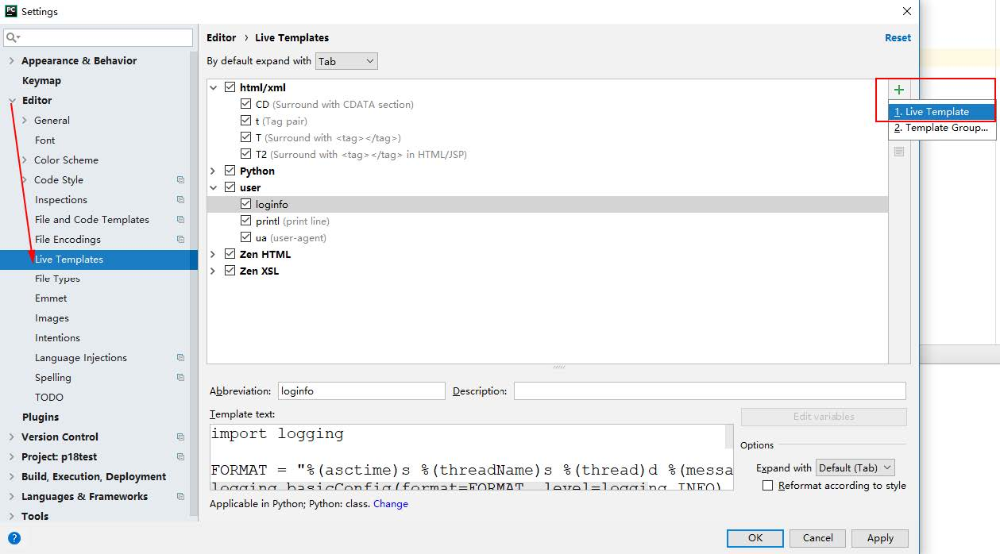

# Django模板技术--Django播客系统(四)

[toc]

如果使用react实现前端页面，其实Django就没有必须使用模板，它其实就是一个纯后台服务程序，接收请求，响应数据，前端接口设计就可以是纯粹的Restful风格。  

模板的目的就是为了可视化，将数据按照一定布局格式输出，而不是为了数据处理，所以一般不会有复杂的处理逻辑。模板的引入实现了业务逻辑和显示格式的分离。这样，在开发中，就可以分工协作，页面开发完成页面布局设计，后台开发完成数据处理逻辑实现。

* Python的模板引擎默认使用Django template language(DTL)构建

## 模板配置

* 在`djweb/settings.py`中，设置模板项目的路径

````python
BASE_DIR = os.path.dirname(os.path.dirname(os.path.abspath(__file__))) #这句话取项目根目录
TEMPLATES = [
    {
        'BACKEND': 'django.template.backends.django.DjangoTemplates',
        'DIRS': [os.path.abspath(os.path.join(BASE_DIR,'templates'))], #制定模板文件夹路径
        'APP_DIRS': True,
        'OPTIONS': {
            'context_processors': [
                'django.template.context_processors.debug',
                'django.template.context_processors.request',
                'django.contrib.auth.context_processors.auth',
                'django.contrib.messages.context_processors.messages',
            ],
        },
    },
]
````

* **DIRS**:列表，定义模板文件的搜索路径顺序。os.path.join(BASE_DIR,'templates')即项目根目录下templates目录，请构建这个目录。
    1. 项目根目录中构建templates文件夹。模板文件目录
      
* **APP_DIRS**:是否运行在每个已经安装的应用中查找模板。应用自己目录下游templates目录，例如：`django/contrilb/admin/templates`。如果应用需要可分离、可重用，建议吧模板放到应用目录下
* **BASE_DIR**是项目根目录，`os.path.join(BASE_DIR,'templates')`就是在manage.py这一层建立一个目录templates。这个路径就是以后默认找模板的地方。

## 模板渲染

* **模板页**
    1. 新建html文件，在`/templates/index.html`目录下

    ````html
    <!DOCTYPE html>
    <html lang="en">
    <head>
        <meta charset="UTF-8">
        <title>Django web 模板技术</title>
    </head>
    <body>
    我是模板，数据是{{content}}
    </body>
    </html>
    ````

* **模板处理**
    1. **加载模板**：模板是一个文件，需要从磁盘读取并加载。要将模板放置在指定的模板文件夹中
    2. **渲染**：模板需要使用内容数据渲染
    3. 测试：修改`djweb/urls.py`文件中的index函数。

    ````python
    from django.template import loader

    def index(request:HttpRequest):
        """视图函数：请求进来返回响应"""
        template = loader.get_template("index.html") #加载器模块搜索模板并加载它
        print(template.origin) #显示模板路径
        context = {"content":"www.xdd.com"} #字典数据
        return HttpResponse(template.render(context,request))
    ````

    1. 运行server `python manage.py runserver`
          
    2. 访问`http://127.0.0.1:8000/`界面如下：可以看到
          
* **render快捷渲染函数**
    1. 上面2个步骤代码编写繁琐，Django提供了对其的封装————快捷函数render。
    2. `render(request,template_name,context=None)` 返回HTTPResponse对象
        * template_name #模板名称
        * context 数据字典
        * render_to_string() 是其核心方法，其实就是拿数据替换HTML中的指定位置后返回一个字符串

    ````py
    from django.shortcuts import  render

    def index(request:HttpRequest):
        """视图函数：请求进来返回响应"""
        return render(request,"index.html",{"content":"www.xdd.com"})
    ````

## DTL语法(模板语法)

### 变量

* 语法：`{{ variable }}`
* 变量名由字母、数字、下划线、点号组成。
* 点号使用的时候，例如foo.bar,遵循以下顺序：
    1. 字典查找，例如`foo["bar"]`,把foo当做字典，bar当做key
    2. 属性或方法的查找，例如`foo.bar`,把foo当做对象，bar当做属性或方法
    3. 数字索引查找，例如`foo[1]`,把foo当做列表一样，使用索引访问
    4. 示例： 修改`djweb/urls.py`文件中的index函数

        ````python
        from django.shortcuts import  render
        import datetime

        def index(request:HttpRequest):
            """视图函数：请求进来返回响应"""
            my_dict = {
                "a":100,
                "b":0,
                "c":list(range(10,20)),
                "d":'abc',
                "date":datetime.datetime.now()
            }
            context = {"content":"www.xdd.com","my_dict":my_dict}
            return render(request,"index.html",context)
        ````

        * 如果**变量未能找到，则缺省插入空字符串**。
        * 在**模板中调用方法，不能加小括号**，自然也不能传递参数。
        * `{{my_dict.a}}`复合第一条，当做字典的key就可以访问了
        * `{{my_dict.keys}}`正确写法。符合第二条，当做my_dict对象的属性和方法。
        * 错误写法`{{my_dict.keys()}}`。

### 模板标签

1. **`if/else`标签**
    * 基本语法如下：

        ````html
        
            ... display
        
        ````

        

    * 条件也支持`and、or、not`
    * 注意,因为这些标签是断开的，所以不能像Python一样使用缩进就可以表示出来，必须有个结束标签，例如endif、endfor。
2. **`for`标签**
    * [https://docs.djangoproject.com/en/2.0/ref/templates/builtins/#for](https://docs.djangoproject.com/en/2.0/ref/templates/builtins/#for)

    ````html
    <!DOCTYPE html>
    <html lang="en">
    <head>
        <meta charset="UTF-8">
        <title>Django web 模板技术</title>
    </head>
    <body>
    我是模板，数据是{{content}}

    <ul>
    
        <li>{{ athlete.name }}</li>
    
    </ul>

    <ul>
    
        <li> {{ person.name }}</li>
    
    </ul>
    </body>
    </html>
    ````

    |变量|说明|
    |:--------|:--------|
    |`forloop.counter`|当前循环从1开始的计数|
    |`forloop.counter0`|当前循环从0开始的计数|
    |`forloop.revcounter`|从循环的末尾开始倒计数1|
    |`forloop.revcounter0`|从循环的末尾开始倒计数到0|
    |`forloop.first`|第一次进入循环|
    |`forloop.last`|最后一次进入循环|
    |`forloop.parentloop`|循环嵌套时，内层当前循环的外层循环|

    * 给标签增加一个reversed使得该列表被反向迭代:

    ````html
    
    ...
    
    ... 如果被迭代的列表是空的或者不存在，执行empty
    
    ````

    * 可以嵌套使用标签：

    ````html
    
        <h1>{{ athlete.name }}</h1>
        <ul>
        <% for sport in athlete.sports_played %>
            <li>{{ sport }}</li>
        <% endfor %>
        </ul>
    
    ````

3. **`ifequel/ifnotequal`标签**
    * ``标签比较两个值，当他们相等时，显示在``和``之中所有的值。下面的例子比较两个模板变量user和currentuser:

    ````html
    
        <h1>Welcome!</h1>
    
    ````

    * 和``类似，``支持可选的``标签：  

    ````html
    
        <h1>Site News</h1>
    
        <h1>No News Here</h1>
    
    ````

    * 其他标签
        1. **csrf_token**用于跨站请求伪造保护，防止跨站攻击的。``
4. **注释标签**
    * 单行注释`{# #}`
    * 多行注释`... `

    ````html
    {# 这是一个注释 #}
    
    这是多行注释
    
    ````

5. **过滤器**
    * 模板过滤器可以在遍历被显示前修改它。
    * 语法 `{{ 变量|过滤器}}`
        1. 过滤器使用管道字符`|`,例如`{{ name|lower}}`,`{{ name }}`变量被过滤器lower处理后，文档大写转换文本为小写。
        2. 过滤管道可以被**套接**，一个过滤器管道的输出又可以作为下一个管道的输入。
            * 例如`{{ my_list|first|upper }}`,将列表第一个元素并将其转化为大写。
        3. **过滤器传参**
            * 有些过滤器可以传递参数，过滤器的参数跟随冒号之后并且总是以双引号包含。
            * 例如:
                1. `{{bio|truncatewords:"30"}}`,截取显示变量bio的前30个词。
                2. `{{ my_list|join:"," }}`,将my_list的所有元素使用`,`逗号连接起来
    * 其他过滤器

    |过滤器|说明|举例|
    |:------|:-----|:------|
    |`cut`|切掉字符串中的指定字符|`{{ value|cut:"b"}}`|
    |`lower`|转换为小写|  |
    |`upper`|转换为大写||
    |`truncatewords`|指定的长度截取字符串|`{{ bio | truncatewords:"30"}}`|
    |`join`|对序列拼接|`{{ d.e|join:"//"}}`|
    |`first`取序列第一个元素| |
    |`last`|取序列最后元素| |
    |`yesno`|变量可以是True、False、None<br/>yesno的参数给定逗号分隔的三个值，返回3个值中的一个。<br/>True对应第一个<br/>False对应第二个<br/>None对应第三个<br/>如果参数只有2个，None等效False处理|`{{value | yesno:"yeah,no,maybe"}}`|
    |`add`|加法，参数是负数就是减法|数字加`{{value | add:"100"}}`<br/>列表合并`{{mylist|add:newlist}}`|
    |`divisibleby`|能否被整除|`{{value | divisibleby:"3" }}`能被3整除返回True|
    |`addslashes`|在反斜杠、单引号或者双引号前面加上反斜杠|`{{value | addslashes }}`|
    |`length`|返回变量的长度|``|
    |`default`|变量等价False则使用缺省值|`{{value | default:"nothing"}}`|
    |`default_if_none`|变量为None使用缺省值|`{{value|default_if_none:"nothing"}}`|
    |`date`|格式化date或者datetime对象|实例：`{{my_dict.date|date:'Y n j'}}`<br/>Y 2000年<br/>n 1-12月<br/>j 1-31日|

    * 时间的格式字符查看[https://docs.djangoproject.com/en/1.11/ref/templates/builtins/#date](https://docs.djangoproject.com/en/1.11/ref/templates/builtins/#date)
    * 过滤参考[https://docs.djangoproject.com/en/1.11/ref/templates/builtins/#join](https://docs.djangoproject.com/en/1.11/ref/templates/builtins/#join)  

### 模板实例

1. 奇偶行列表输出
    * 使用下面字典my_dict的c的列表，在模板网页中列表ul输出多行数据
        1. 要求奇偶行颜色不同
        2. 每行有行号(从1开始)
        3. 列表中所有数据都增大100

    ````py
    from django.http import HttpResponse,HttpRequest,JsonResponse
    from django.template import loader
    from django.shortcuts import  render
    import datetime

    def index(request:HttpRequest):
    """视图函数：请求进来返回响应"""
    my_dict = {
        "a":100,
        "b":0,
        "c":list(range(10,20)),
        "d":'abc',
        "date":datetime.datetime.now()
    }
    context = {"content":"www.xdd.com","my_dict":my_dict}
    return render(request,"index.html",context)
    ````

    * 模板页面

    ````html
    <!DOCTYPE html>
    <html lang="en">
    <head>
        <meta charset="UTF-8">
        <title>Django web 模板技术</title>
    </head>
    <body>
    我是模板，数据是{{content}}

    <ul>
    
        
            
                <li>{{ forloop.parentloop.counter }} | {{ forloop.counter }} | {{ athlete.0 }} -- {{ dt|add:"100" }}</li>
            
        
            
                <li>{{ forloop.counter }} | {{ athlete.0 }} -- {{ athlete.1|date:'Y-n-j' }}</li>
            
                <li>{{ forloop.counter }} | {{ athlete.0 }} </li>
            
        
    
    </ul>
    </body>
    </html>
    ````

      

### 附加--Pycharm模板自定义

1. 第一步：
      
2. 第二步
      
3. 第三步
      
