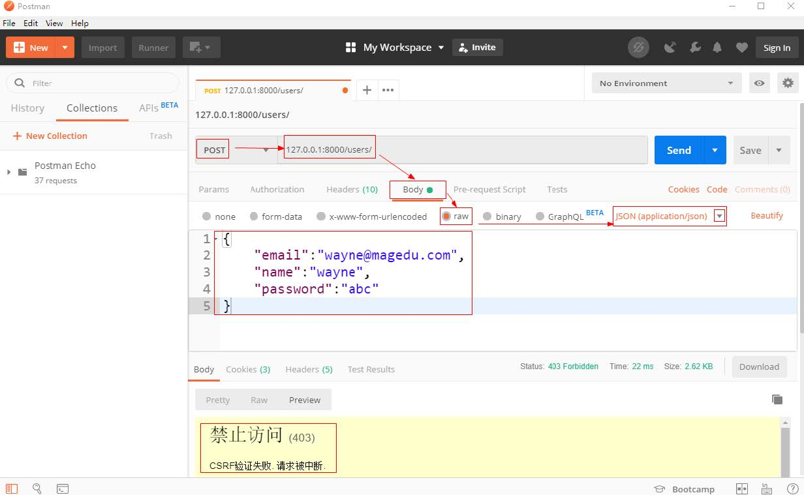
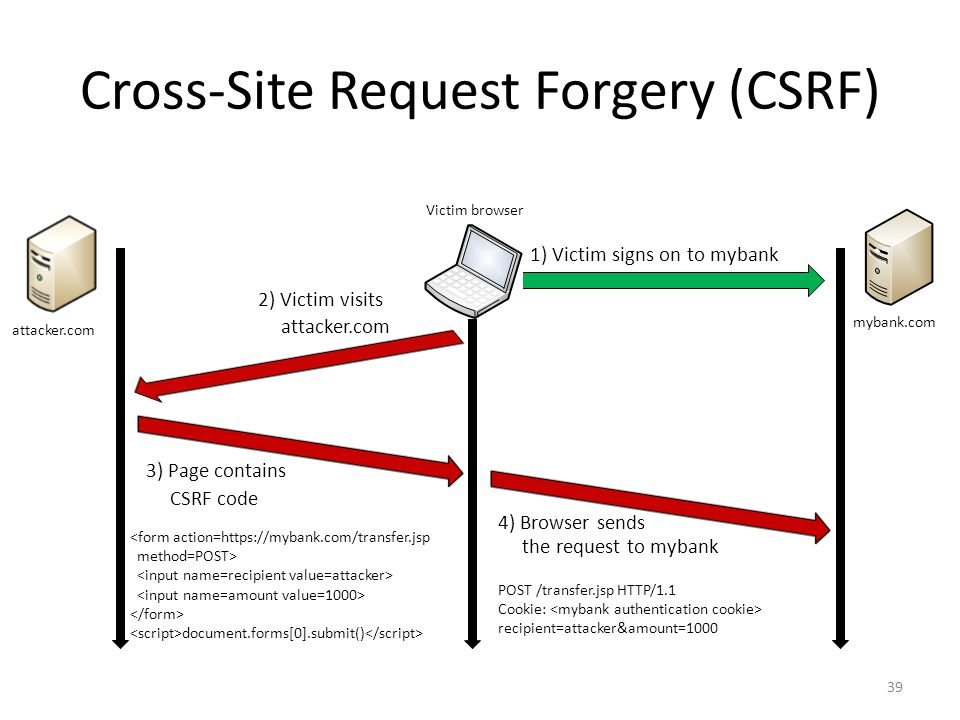
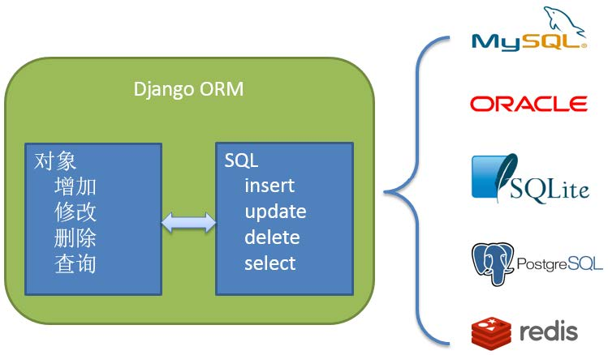

# 用户功能设计与实现--Django播客系统(六)

[toc]

* 提供用户注册处理
* 提供用户登录处理
* 提供路由配置

## 用户注册接口设计

* 接受用户通过Post方法提交的注册信息，提交的数据是JSON格式数据
* 检查email是否存在与数据库表中，如果存在返回错误状态码，例如4xx,如果不存在，将用户提交的数据存入表中
* 整个过程都采用AJAX异步过程，用户提交JSON数据，服务端获取数据后处理，返回JSON。

````text
POST /users/ 创建用户

请求体 application/json
{
    "password":"string",
    "name":"string",
    "email":"string"
}

响应
201 创建成功
400 请求数据错误
````

## 路由配置

* 为了避免项目中的urls.py条目过多，也为了让应用自己管理路由，采用多级路由

````py
# djweb/urls.py文件
from django.urls import include
urlpatterns = [
    path('admin/', admin.site.urls),
    re_path(r'^$',index),
    re_path(r'^index$',index),#不同路径可以指向同一个函数执行
    re_path(r'^users/',include("user.urls")),
]
````

* include函数参数写**应用.路由模块**,该函数就会动态导入指定的包的模块，从模块里面读取urlpatterns,返回三元组。
* url函数第二参数如果不是可调用对象，如果是元组或列表，则会从路径中除去已匹配的部分，将剩余部分与应用中的路由模块的urlpatterns进行匹配。

* 新建`user/uls.py`文件

````py
# user/uls.py
from django.conf.urls import re_path
from .views import reg

urlpatterns = [
    re_path(r'^$',reg), #/users/
]
````

* 在`user/views.py`文件中添加reg方法

````python
# user/views.py
from django.shortcuts import render
from django.http import HttpResponse,HttpRequest

def reg(request:HttpRequest):
    return HttpResponse("user.reg")
````

* 浏览器中输入`http://127.0.0.1:8000/users/`测试(这是GET请求),可以看到响应的数据。下面开始完善视图函数。
* 在`user/views.py`中编写**视图函数reg**

## 测试JSON数据

* 使用POST方法，提交数据类型为application/json，json字符串要使用**双引号**。
* 这个数据是注册用的，由客户端提交。
    1. 数据提交模板为：

    ````json
    {
        "password":"abc",
        "name":"xdd",
        "email":"xdd@xdd.com"
    }
    ````

    1. 可以使用Postman软件测试。  
      

## CSRF处理

* 在Post数据的时候，发现出现了下面的提示
      
    1. 原因：**默认Django CsrfViewMiddleware中间件会对所有POST方法提交的信息做CSRF校验**。
* CSRF或XSRF(Cross-site Request Forgery),即跨站请求伪造。它也被称为：one click attack/session riding。是一种对网站的恶意利用。它伪造成来自受信任用户发起的请求，难以防范。
* 原理：
      
    1. 用户登录某网站A完成登录认证，网站返回敏感信息的Cookie,即使是会话级的Cookie
    2. 用户没有关闭浏览器，或认证的Cookie一段时间内不过期还持久化了，用户就访问攻击网站B
    3. 攻击网站B看似一切正常，但是某些页面里面有一些隐藏运行的代码，或者诱骗用户操作的按钮等
    4. 这些代码一旦运行就是悄悄地向网站A发起特殊请求，由于网站A的Cookie还有效，且访问的是网站A，则其Cookie就可以一并发给网站A
    5. 网站A看到这些Cookie就只能认为是登录用户发起的合理合法请求，就会执行

* CSRF解决
    1. 关闭CSRF中间件(不推荐)

        ````py
        #djweb/settings.py
        MIDDLEWARE = [
            'django.middleware.security.SecurityMiddleware',
            'django.contrib.sessions.middleware.SessionMiddleware',
            'django.middleware.common.CommonMiddleware',
            # 'django.middleware.csrf.CsrfViewMiddleware', #注释掉
            'django.contrib.auth.middleware.AuthenticationMiddleware',
            'django.contrib.messages.middleware.MessageMiddleware',
            'django.middleware.clickjacking.XFrameOptionsMiddleware',
        ]
        ````

    2. csrftoken验证
        * 在表单POST提交时，需要发给服务器一个csrf_token
        * 模板中的表单Form中增加``，它返回到了浏览器端就会为cookie增加csrftoken字段，还会在表单中增加一个名为csrfiddlewaretoken隐藏控件`<input type='hidden' name='csrfmiddlewaretoken' value='jZTxU0v5mPoLvugcfLbS1B6vT8COYrKuxMzodWv8oNAr3a4ouWlb5AaYG2tQi3dD' />`
        * POST提交表单数据时，需要将csrfmiddlewaretoken一并提交，Cookie中的csrf_token也一并会提交，最终在中间件中比较，相符通过，不相符就看到上面的403提示
    3. 双cookie验证
        * 访问本站先获得csrftoken的cookie
        * 如果使用AJAX进行POST，需要在每一次请求Header中增加自定义字段X-CSRFTOKEN，其值来自cookie中获取的csrftoken值
        * 在服务端比较cookie和X-CSRFTOKEN中的csrftoken，相符通过
* 现在没有前端代码，为了测试方便，可以选择第一种方法先禁用中间件，测试完成后开启。

## JSON数据处理

* simplejson标准库方便好用，功能强大。
    1. `pip install simplejson`
* 浏览器端提交的数据放在了请求对象的body中，需要使用simplejson解析，解析的方式同Json模块，但是simplejson更方便。  

## 错误处理

* Django中有很多异常类，定义在django.http下，这些类都继承自HttpResponse。

````py
#user/views.py文件

from django.http import HttpResponse,HttpRequest,HttpResponseBadRequest,JsonResponse
import simplejson

def reg(request:HttpRequest):
    print(request.POST)
    print(request.body)
    # print("- " * 30)
    try:
        payload = simplejson.loads(request.body)
        email = payload['email']
        name = payload['name']
        password = payload["password"]
        print(email,name,password)
        return JsonResponse({},status=201) #创建成功返回201
    except Exception as e: #有任何异常，都返回
        print(e)
        return HttpResponseBadRequest() #这里返回实例，这不是异常类
````

* 将上面代码增加邮箱检查、用户信息保存功能，就要用到Django的模型操作。
* 本次采用Restful实践的设计，采用返回错误状态码+JSON错误信息方式。

## 注册代码 v1

````python
# user/views.py文件

from django.http import HttpResponse,HttpRequest,HttpResponseBadRequest,JsonResponse
import simplejson
from .models import User

def reg(request:HttpRequest):

    try:
        payload = simplejson.loads(request.body)
        email = payload['email']
        query = User.objects.filter(email=email)
        print(query)
        print(query.query) #查看sQL语句
        if query.first():
            return JsonResponse({"error":"用户已存在"},status=400);

        name = payload['name']
        password = payload["password"]
        print(email,name,password)

        user = User()
        user.email = email
        user.name = name
        user.password = password
        user.save()

        return JsonResponse({},status=201) #创建成功返回201
    except Exception as e: #有任何异常，都返回
        print(e)
        # 失败返回错误信息和400，所有其他错误一律用户名密码错误
        return JsonResponse({"error":"用户名或密码错误"},status=400)
````

1. **邮箱检查**
    * 邮箱检查需要查user表，需要使用filter方法。
    * email=email,前面是字段名email，后面是email变量。查询后返回结果，如果查询有结果，则说明该email已经存在，邮箱已经注册，返回400到前端
2. **用户信息存储**
    * 创建User类实例，属性存储数据，最后调用save方法。Django默认是在save()、delete()的时候事务**自动提交**。
    * 如果提交抛出任何错误，则捕获此异常做相应处理。
    * 如果没有异常，则返回201，不要返回任何用户信息。之后可能需要验证、用户登录等操作。  
3. **异常处理**
    * 出现获取输入框提交信息异常，就返回400
    * 查询邮箱存在，返回400
    * save()方法保存数据，有异常，则返回400
    * 注意一点，Django的异常类继承自HttpResponse类，所以不能raise,只能return
    * 前端通过状态码判断是否成功
    * 由于采用Restful实战，所有异常全部返回JSON的错误信息，所以一律使用了JsonResponse

## Django日志

* Django的日志配置在settings.py中
    1. 参考文档[https://docs.djangoproject.com/en/2.2/topics/logging/#configuring-logging](https://docs.djangoproject.com/en/2.2/topics/logging/#configuring-logging)

````py
LOGGING = {
    'version': 1,
    'disable_existing_loggers': False,
    'handlers': {
        'console': {
            'class': 'logging.StreamHandler',
        },
    },
    'loggers': {
        'django.db.backends': {
            'handlers': ['console'],
            'level': "DEBUG",
        },
    },
}
````

* 配置后，就可以在控制台看到执行的SQL语句。
* 注意，必须**DEBUG=True,同时level是DEBUG**,否则从控制台看不到SQL语句。  

## 模型操作

### 管理器对象

* Django会为模型类提供一个**objects对象**，它是django.db.models.manager.Manager类型，用于与数据库交互。当定义模型类的时候没有指定管理器，则Django会为模型类提供一个objects的管理器。
* 如果在模型类中手动指定管理器后，Django不再提供默认的objects的管理器了。
* 管理器是Django的模型进行数据库**查询**操作的接口，Django应用的每个模型都至少拥有一个管理器。

* **Django ORM**
    1. 数据的校验validation是在对象的Save、update方法上
          
    2. 对模型对象的CRUD,被Django ORM转换成相应的SQL语句操作不同的数据源。

### 查询

* **查询集**
    1. 查询会返回结果的集，它是django.db.models.query.QuerySet类型。
    2. 它是惰性求值，和sqlalchemy一样。结果就是查询的集。
    3. 它是可迭代对象。  

1. **惰性求值**
    * 创建查询集不会带来任何数据库的访问，直到调用方法使用数据时，才会访问数据库。在迭代、序列化、if语句中都会立即求值。
2. **缓存：**
    * 每一个查询集都包含一个缓存，来最小化对数据库的访问。
    * 新建查询集，缓存为空。首次对查询集求值时，会发生数据库查询，Django会把查询的结果存在这个缓存中，并返回请求的结果，接下来对查询集求值将使用缓存的结果。  
    * 观察下面的2个例子是要看真正生成的语句了
        1. 没有使用缓存，每次都要去查库，查了2次库

            ````py
            [user.name for user in User.objects.all()]
            [user.name for user in User.objects.all()]
            ````

        2. 下面的语句使用缓存，因为使用同一个结果集

            ````py
            qs = User.objects.all()
            [user.name for user in qs]
            [user.name for user in qs]
            ````

#### 限制查询集(切片)

* 查询集对象可以直接使用索引下标的方式(不支持负索引)，相当于SQL语句中的limit和offset子句。
* 注意使用索引返回的新的结果集，依然是惰性求值，不会立即查询。

````py
qs = User.objects.all()[20:40]
# LIMIT 20 OFFSET 20
qs = User.objects.all()[20:30]
# LIMIT 10 OFFSET 20
````

#### 过滤器

1. 返回**查询集**的方法，称为过滤器，如下：

|名称|说明|
|:----|:-----|
|all()| |
|filter()|过滤，返回满足条件的数据|
|exclude()|排除，排除满足条件的数据|
|order_by()|排序，注意参数是字符串|
|values()|返回一个对象字典的列表，列表的元素是字典，字典内是字段和值的键值对|

* `filter(k1=v1).filter(k2=v2)`等价于`filter(k1=v1,k2=v2)`
* `filter(pk=10)`这里pk指的就是主键，不用关心主键字段名，当然也可以使用主键名`filter(emp_no=10)`  

````py
mgr = User.objects
print(mgr.all())
print(mgr.values())
print(mgr.filter(pk=1).values())
print(mgr.exclude(pk=4))
print(mgr.exclude(id=1).values())
print(mgr.exclude(id=6).order_by("-id"))
print(mgr.exclude(id=6).order_by("-id").values())
print(mgr.exclude(id=6).values().order_by("-pk"))
````

* 返回**单个值**的方法

|名称|说明|
|:-------|:------------|
|get()|仅返回单个满足条件的对象<br/>如果未能返回对象则抛出DoesNotExist异常；如果能返回多条，抛出MultipleObjectsReturned异常|
|count()|返回当前查询的总条数|
|first()|返回第一个对象|
|last()|返回最后一个对象|
|exit()|判断查询集中是否有数据，如果有则返回True|

````py
email = "xdd@xdd.com"
mgr = User.objects
print(mgr.get(pk=4)) #使用主键查询
print(mgr.get(email=email)) #只能返回一个结果
print(mgr.filter(id=1).get())

print(mgr.first()) #使用limit 1查询，返回实例或None
print(mgr.filter(pk=4,email=email).first()) # and条件
````

#### 字段查询(Field Lookup)表达式

* 字段查询表达式可以作为filter(),exclude(),get()的参数，实现where子句。
* 语法：`属性名称__比较运算符=值`
* 注意：属性名和运算符之间使用**双下划线**
* 比较运算符如下

|名称|举例|说明|
|:----|:----|:----|
|`exact`|`filter(isdeleted=False)`<br/>`filter(isdeleted__exact=False)`|严格等于，可省略不写|
|`contains`|`exclude(title__contains="天")`|是否包含，大小写敏感，等价于`like '%天%'`|
|`statswith`<br/>`endswith`|`filter(title__startswith='天')`|以什么开头或结尾，大小写敏感|
|`isnull`<br/>`isnotnull`|`filter(title__isnull=False)`|是否为null|
|`iexact`<br/>`icontains`<br/>`istartswith`<br/>`iendswith`||i的意思是忽略大小写|
|`in`|`filter(pk__in=[1,2,3,100])`|是否在指定范围数据中|
|`gt`,`gte`,`lt`,`lte`|`filter(id__get=3)`<br/>`filter(pk__lte=6)`<br/>`filter(pub_date__get=date(2000,1,1))`|大于，小于等|
|`year、month、day`<br/>`week_day`<br/>`hour、minute`<br/>`second`|`filter(pub_date__year=2000)`|对日期类型属性处理|

````py
mgr = User.objects
print(mgr.filter(id__exact=4))
print(mgr.filter(email__contains='xdd'))
print(mgr.filter(email__istartswith='xdda'))
print(mgr.filter(id__in=[1,4]))
print(mgr.filter(id__gt=3))
````

#### Q对象

* 虽然Django提供传入条件的方式，但是不方便，它还提供了Q对象来解决。
* Q对象是django.db.models.Q,可以使用`&、|`操作符来组成逻辑表达式。`~`表示not。

````py
from django.db.models import Q
mgr = User.objects
print(mgr.filter(Q(pk__lt=6))) #不如直接写filter(pk__lt=6)

print(mgr.filter(pk__lt=6).filter(pk__gt=1)) #与
print(mgr.filter(Q(pk__lt=6) & Q(pk__gt=1))) #与
print(mgr.filter(Q(pk=4) | Q(pk=1))) #或
print(mgr.filter(~Q(pk__lt=6))) #非
````

* 可使用`&|`和Q对象来构造复杂的逻辑表达式
* 过滤器函数可以使用一个或多个Q对象
* 如果混用关键字参数和Q对象，那么Q对象必须位于关键字参数的面前。所有参数都将and和一起

#### 新增、更新、删除方法

* 更新数据

````py
user = User(email='test3',name='test3') #没有主键
user.save() #会新建一个数据

user = User(id=100,email='test4',name='test4') #有自增主键
````


