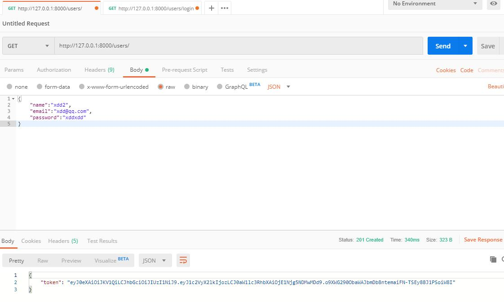
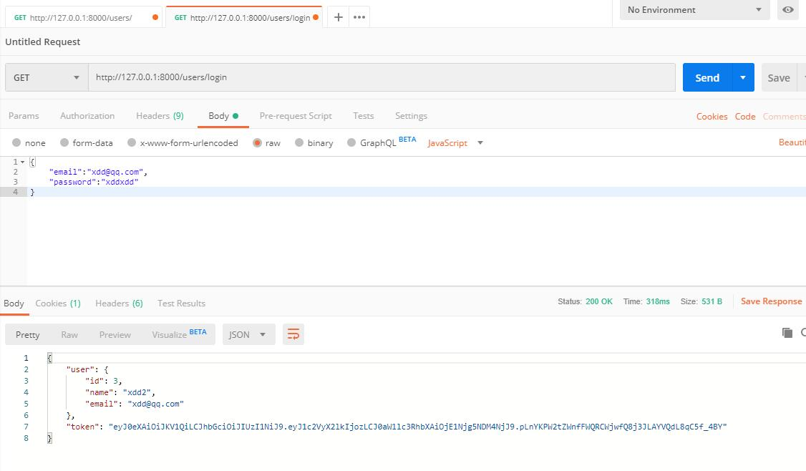
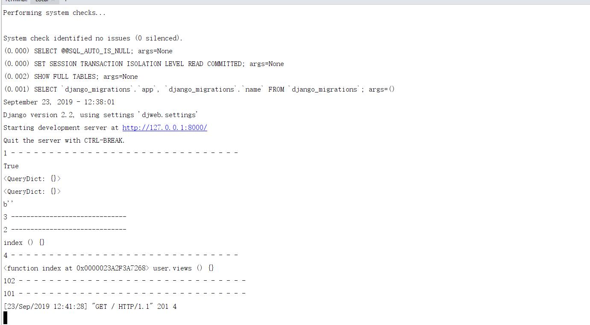
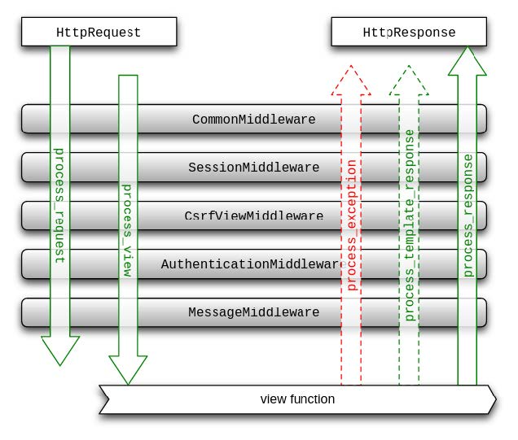
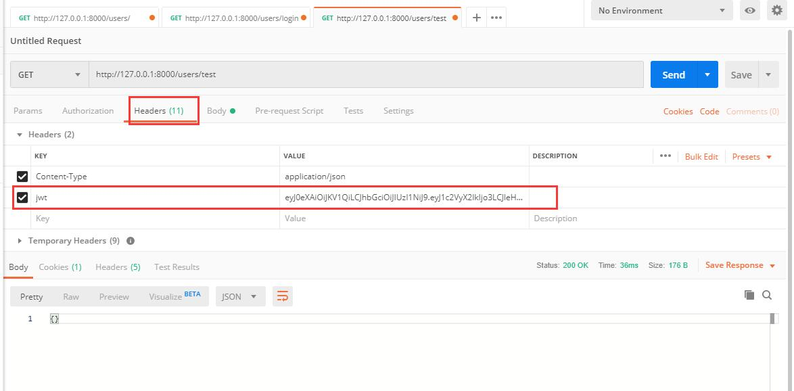
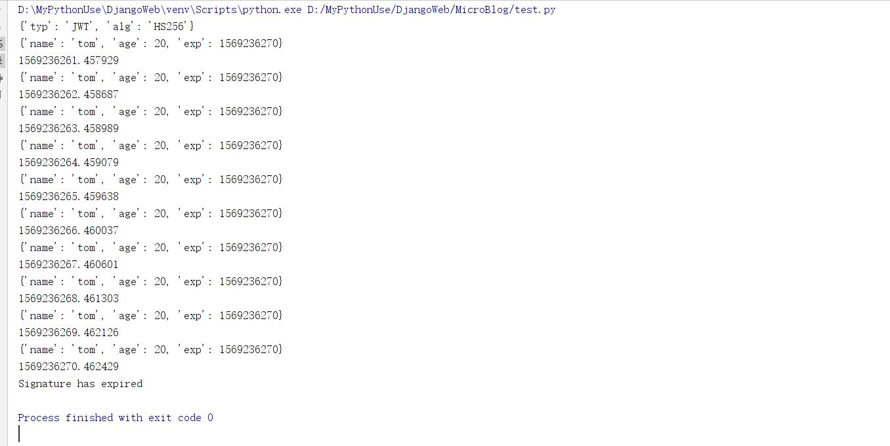

# 登录接口设计和实现--Django播客系统(七)

[toc]

* 提供用户注册处理
* 提供用户登录处理
* 提供路由配置

## 用户登录接口设计

````txt
POST /users/login 用户登录
请求体 application/json
{
    "password":"string",
    "email":"string"
}

响应
200 登录成功
400 用户名密码错误
````

* 接收用户通过POST方法提交的登录信息，提交的数据是JSON格式数据

````js
{
    "password":"abc",
    "email":"xdd@xdd.com"
}
````

* 从user表中email找出匹配的一条记录，验证密码是否正确
* 验证通过说明是合法用户登录，显示欢迎页面。
* 验证失败返回错误状态码，例如4xx
* 整个过程都采用AJAX异步过程，用户提交JSON数据，服务端获取数据后处理，返回JSON。

## 路由配置

````python
# 修改user/urls.py文件
from django.conf.urls import re_path
from .views import reg,login

urlpatterns = [
    re_path(r'^$',reg), #/users/
    re_path(r'^login$',login),
]
````

* 在user/views.py文件中实现登录代码

````python
# user/views.py文件中增加如下代码

import jwt
import datetime
import bcrypt
from django.conf import settings

# 筛选所需要的字段
def jsonify(instance,allow=None,exclude=[]):
    # allow优先，如果有，就使用allow指定的字段，这时候exclude无效
    # allow如果为空，就全体，但要看看有exclude中的要排除
    modelcls = type(instance)
    if allow:
        fn = (lambda x:x.name in allow)
    else:
        fn = (lambda x:x.name not in exclude)
    # from django.db.models.options import Options
    # m:Options = modelcls._meta
    # print(m.fields,m.pk)
    return {k.name:getattr(instance,k.name) for k in filter(fn,modelcls._meta.fields)}

# 登录接口
def login(request:HttpRequest):
    try:
        payload = simplejson.loads(request.body)
        print(payload)
        email = payload["email"]
        password = payload["password"]

        user = User.objects.get(email=email) # only one
        print(user.password)

        if bcrypt.checkpw(password,user.password.encode()):
            # 验证成功
            token = gen_token(user.id)

            res = JsonResponse({
                "user":jsonify(user,exclude=["password"]),
                "token":token
            }) #返回200
            res.set_cookie("jwt",token)
            return res
        else:
            return JsonResponse({"error":"用户名或密码错误"},status=400)
    except Exception as e:
        print(e)
        #失败返回错误信息和400，所有其他错误一律用户名密码错误
        return JsonResponse({"error":"用户名或密码错误"},status=400)
````

* 注册  
      
* 登录验证
      

## 认证接口

* 如何获取浏览器提交的token信息？
    1. 使用Header中的Authorization
        * 通过这个header增加token信息。
        * 通过header发送数据，方法可以是Post、Get
    2. 自定义header
        * 在Http请求头中使用X-JWT字段来发送token
* 本次选择第二种

### 认证流程

* 基本上所有的业务都有需要认证用户的信息。
* 在这里比较实际戳，如果过期，就直接抛未认证成功401，客户端收到后就改直接跳转到登录页。
* 如果没有提交user id，就直接重新登录。如果用户查到了，填充user对象。
* request->时间戳比较->user id比较->向后执行

### Django的认证

* django.contrilb。auth中提供了许多方法，这里主要介绍其中的三个：
    1. authenticate(**credentials)
        * 提供了用户认证，即验证用户名以及密码是否正确
        * user = authentica(username='someone',password='somepassword')
    2. login(HttpRequest,user,backend=None)
        * 该函数接受一个HttpRequest对象，以及一个认证了的User对象
        * 此函数使用django的session框架给某个已认证的用户附加上session id等信息。
    3. logout(request)
        * 注销用户
        * 该函数接受一个HttpRequest对象，无返回值。
        * 当调用该函数时，当前请求的session信息会全部清除
        * 该用户即使没有登录，使用该函数也不会报错
        * 还提供了一个装饰器来判断是否登录django.contrib.auth.decorators.login_required
        * 本项目使用了无session机制，且用户信息自己建表管理，所以，认证需要自己实现。

### 中间件技术Middleware

1. 官方定义，在Django的request和response处理过程中，由框架提供的hook钩子
2. 中间技术在1.10后发生了改变，我们当前使用1.11版本，可以使用新的方式定义。
3. 参考[https://docs.djangoproject.com/en/1.11/topics/http/middleware/#writing-your-own-middleware](https://docs.djangoproject.com/en/1.11/topics/http/middleware/#writing-your-own-middleware)  

* **原理**

````py
# 测试代码添加在user/views.py

class SimpleMiddleware1:
    def __init__(self,get_response):
        self.get_response = get_response
        # One-time configuration and initialization.

    def __call__(self,request):
        # Conde to be executed for each request before
        # the view (and later middleware) are called.
        print(1,'- '*30)
        print(isinstance(request,HttpRequest))
        print(request.GET)
        print(request.POST)
        print(request.body)

        # 之前相当于老板本的process_request
        #return HttpResponse(b'',status = 404)

        response = self.get_response(request)

        #Code to be executed for each request/response after
        #the view is called.
        print(101,'- '* 30)
        return  response

    def process_view(self,request,view_func,view_args,view_kwargs):
        print(2,"-" * 30)
        print(view_func.__name__,view_args,view_kwargs)
        # 观察view_func名字，说明在process_request之后,process_view之前已经做好了路径映射
        return  None # 继续执行其他的process_view或view
        # return HttpResponse("111",status=201)

class SimpleMiddleware2:
    def __init__(self,get_response):
        self.get_response = get_response
        # One-time configuration and initialization.

    def __call__(self, request):
        # Conde to be executed for each request before
        # the view (and later middleware) are called.
        print(3,"-" * 30)
        # return HttpResponse(b'',status=404)
        response = self.get_response(request)

        # Code to be executed for each request/response after
        # the view is called.
        print(102,"- "* 30)
        return response

    def process_view(self,request,view_func,view_args,view_kwargs):
        print(4,"- "* 30)
        print(view_func,__name__,view_args,view_kwargs)
        # return None #继续执行其他的process_view或view
        return HttpResponse("2222",status=201)
````

* 修改`djweb/settings.py`文件，添加消息中间件

````py
# 修改djweb/settings.py文件，添加消息中间件

MIDDLEWARE = [
    'django.middleware.security.SecurityMiddleware',
    'django.contrib.sessions.middleware.SessionMiddleware',
    'django.middleware.common.CommonMiddleware',
    # 'django.middleware.csrf.CsrfViewMiddleware', #注释掉
    'django.contrib.auth.middleware.AuthenticationMiddleware',
    'django.contrib.messages.middleware.MessageMiddleware',
    'django.middleware.clickjacking.XFrameOptionsMiddleware',
    'user.views.SimpleMiddleware1',
    'user.views.SimpleMiddleware2',
]
````

* 运行结果(使用浏览器访问web)  
      
* 流程图
      
* 结论
    1. Django中间件使用的洋葱式，但有特殊的地方
    2. 新版本中间件现在`__call__`中get_response(request)之前代码(相当于老版本中的process_request)
    3. settings中的顺序先后执行所有中间件的get_response(request)之前代码
    4. 全部执行完解析路径映射得到view_func
    5. settings中顺序先后执行process_view部分
        * return None 继续向后执行
        * return HttpResponse() 就不在执行其他函数的preview函数了，此函数返回值作为浏览器端的响应
    6. 执行view函数，前提是签名的所有中间件process_view都返回None
    7. 逆序执行所有中间件的get_response(request)之后代码
    8. 特别注意，如果get_response(request)之前代码中return HttpResponse(),将从当前中间件立即返回给浏览器端，从洋葱中依次反弹

#### 自定义中间件用户验证

````py
class BlogAuthMiddleware(object):
    """自定义中间件"""
    def __init__(self,get_response):
        self.get_response = get_response
        # 初始化执行一次

    def __call__(self,request):
        # 视图函数之前执行
        # 认证
        print(type(request),"++++++++++++++")
        print(request.GET)
        print(request.POST)
        print(request.body) #json数据
        print("- "* 30)
        response = self.get_response(request)
        #视图函数之后执行

        return response

# 要在setting的MIDDLEWARE中注册
````

1. 中间件拦截所有视图函数，但是只有一部分请求需要提供认证，所以考虑其他方法。
2. 如果绝大多数都需要拦截，个别例外，采用中间件比较合适。
3. 中间件有很多用户，适合拦截所有请求和响应。例如浏览器端的IP是否禁用、UserAgent分析、异常响应的统一处理。

* **用户验证装饰器**
    1. 在需要认证的view函数上增强认证功能，写一个装饰器函数。谁需要认证，就在这个view函数上应用这个装饰器。
    2. 定义常量，可以在当前模块中，也可以定义在settings.py中。本次在`djweb/setting.py`中添加

        ````py
        # 在`djweb/setting.py`中添加
        #自定义常量
        AUTH_EXPIRE = 8* 60 * 60 #8小时过期
        AUTH_HEADER = "HTTP_JWT" #浏览器端是jwt，服务器端被改写为全大写并加HTTP_前缀
        ````

    3. 用户验证装饰器代码

        ````py
        # 本次写在user、views.py
        # 登录验证装饰器
        def authenticate(viewfunc):
            def wrapper(request:HttpRequest):
                # 认证越早越好
                jwtheader  = request.META.get(settings.AUTH_HEADER,"")
                # print(request.META.keys())
                # print(request.META["HTTP_COOKIE"].get(settings.AUTH_HEADER,""))
                # print(request.META["HTTP_COOKIE"])
                print("-   ------------")
                if not jwtheader:
                    return HttpResponse(status=401)
                print(jwtheader)
                # 解码
                try:
                    payload = jwt.decode(jwtheader,settings.SECRET_KEY,algorithms=["HS256"])
                    # payload = "aa"
                    print(payload)
                except Exception as e: #解码有任何异常，都不能通过认证
                    print(e)
                    return HttpResponse(status=401)

                # 是否过期ToDO
                print("- "*30)
                try:
                    user_id = payload.get("user_id",0)
                    if user_id == 0:
                        return HttpResponse(status=401)
                    user = User.objects.get(pk=user_id)
                    request.user = user
                except Exception as e:
                    print(e)
                    return HttpResponse(status=401)
                response = viewfunc(request)
                return response
            return wrapper

        @authenticate #在有需要的视图函数上加上此装饰器
        def test(request):
            print("- "*30,"test")
            print(request.user)
            return JsonResponse({},status=200)

        # 修改原先gen_token(user_id)函数
        # 对id签名
        def gen_token(user_id):
            # 时间戳用来判断是否过期，以便重发token或重新登录
            return  jwt.encode({
                "user_id":user_id,
                "exp":int(datetime.datetime.now().timestamp()) + settings.AUTH_EXPIRE #取整
            },settings.SECRET_KEY,algorithm="HS256").decode()
        ````

        * 注册函数

        ````py
        from django.conf.urls import re_path
        from .views import reg,login,test

        urlpatterns = [
            re_path(r'^$',reg), #/users/
            re_path(r'^login$',login), #/users/login
            re_path(r"^test$",test), #/users/test
        ]
        ````

        * 测试方法(先登录后测试)
              

* **JWT过期问题**(pyjwt过期)
    1. 在decode的时候，默认开启过期验证，如果过期，则抛出异常
    2. 需要在payload中增加claim exp，也就是exp的键值对，记录过期的时间点
    3. exp要求是一个整数int的时间戳，或时间
    4. exp键值对存在，才会进行过期校验
    5. 测试

        ````py
        import jwt
        import datetime
        import threading

        event = threading.Event()
        key = "xdd"

        #在jwt的payload中增加exp claim
        exp = int(datetime.datetime.now().timestamp()+10)
        data = jwt.encode({"name":'tom',"age":20,'exp':exp},key)
        print(jwt.get_unverified_header(data)) #不校验签名提取header

        try:
            while not event.wait(1):
                print(jwt.decode(data,key)) #过期校验就会抛出异常
                print(datetime.datetime.now().timestamp())
        except jwt.ExpiredSignatureError as e:
            print(e)
        ````

          

#### view装饰器

* 注册、登录函数都是只支持POST方法，可以在试图函数内部自己判断，也可以使用官方提供的装饰器指定方法。

````py
from django.views.decorators.http import require_http_methods,require_POST,require_GET
@require_http_methods(["POST"])
````

## 代码参考

* `user/views.py`

````py
from django.http import HttpResponse,HttpRequest,HttpResponseBadRequest,JsonResponse
import simplejson
from .models import User
import jwt
import datetime
import bcrypt
from django.conf import settings
from django.views.decorators.http import require_http_methods,require_POST,require_GET

# 对id签名
def gen_token(user_id):
    # 时间戳用来判断是否过期，以便重发token或重新登录
    return  jwt.encode({
        "user_id":user_id,
        "exp":int(datetime.datetime.now().timestamp()) + settings.AUTH_EXPIRE #取整
    },settings.SECRET_KEY,algorithm="HS256").decode()

# 注册接口
@require_http_methods(["POST"])
def reg(request:HttpRequest):

    try:
        payload = simplejson.loads(request.body)
        email = payload['email']
        query = User.objects.filter(email=email)
        print(query)
        print(query.query) #查看sQL语句
        if query.first():
            return JsonResponse({"error":"用户已存在"},status=400)

        name = payload['name']
        password = payload["password"].encode()
        print(email,name,password)

        # 密码加密
        password = bcrypt.hashpw(password,bcrypt.gensalt()).decode()
        print(password)

        user = User()
        user.email = email
        user.name = name
        user.password = password
        user.save()

        return JsonResponse({"token":gen_token(user.id)},status=201) #创建成功返回201
    except Exception as e: #有任何异常，都返回
        print(e)
        # 失败返回错误信息和400，所有其他错误一律用户名密码错误
        return JsonResponse({"error":"用户名或密码错误"},status=400)

# 筛选所需要的字段
def jsonify(instance,allow=None,exclude=[]):
    # allow优先，如果有，就使用allow指定的字段，这时候exclude无效
    # allow如果为空，就全体，但要看看有exclude中的要排除
    modelcls = type(instance)
    if allow:
        fn = (lambda x:x.name in allow)
    else:
        fn = (lambda x:x.name not in exclude)
    # from django.db.models.options import Options
    # m:Options = modelcls._meta
    # print(m.fields,m.pk)
    # print("----------")
    return {k.name:getattr(instance,k.name) for k in filter(fn,modelcls._meta.fields)}

# 登录接口
@require_POST
def login(request:HttpRequest):
    try:
        payload = simplejson.loads(request.body)
        print(payload)
        email = payload["email"]
        password = payload["password"].encode()

        user = User.objects.get(email=email) # only one
        print(user.password)

        if bcrypt.checkpw(password,user.password.encode()):
            # 验证成功
            token = gen_token(user.id)

            res = JsonResponse({
                "user":jsonify(user,exclude=["password"]),
                "token":token
            }) #返回200
            res.set_cookie("jwt",token)
            return res
        else:
            return JsonResponse({"error":"用户名或密码错误"},status=400)
    except Exception as e:
        print(e)
        #失败返回错误信息和400，所有其他错误一律用户名密码错误
        return JsonResponse({"error":"用户名或密码错误"},status=400)

# 登录验证装饰器
def authenticate(viewfunc):
    def wrapper(request:HttpRequest):
        # 认证越早越好
        jwtheader  = request.META.get(settings.AUTH_HEADER,"")
        # print(request.META.keys())
        # print(request.META["HTTP_COOKIE"].get(settings.AUTH_HEADER,""))
        # print(request.META["HTTP_COOKIE"])
        print("-   ------------")
        if not jwtheader:
            return HttpResponse(status=401)
        print(jwtheader)
        # 解码
        try:
            payload = jwt.decode(jwtheader,settings.SECRET_KEY,algorithms=["HS256"])
            # payload = "aa"
            print(payload)
        except Exception as e: #解码有任何异常，都不能通过认证
            print(e)
            return HttpResponse(status=401)

        # 是否过期ToDO
        print("- "*30)
        try:
            user_id = payload.get("user_id",0)
            if user_id == 0:
                return HttpResponse(status=401)
            user = User.objects.get(pk=user_id)
            request.user = user
        except Exception as e:
            print(e)
            return HttpResponse(status=401)
        response = viewfunc(request)
        return response
    return wrapper

@require_POST
@authenticate #在有需要的视图函数上加上此装饰器
def test(request):
    print("- "*30,"test")
    print(request.user)
    return JsonResponse({},status=200)
````


