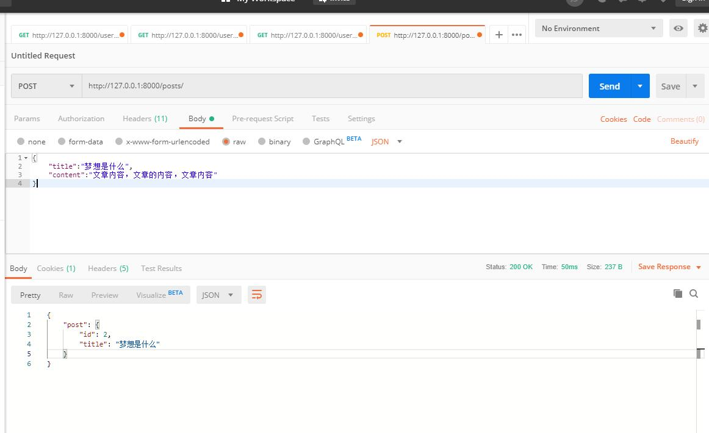
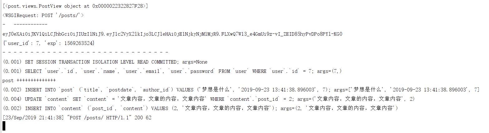
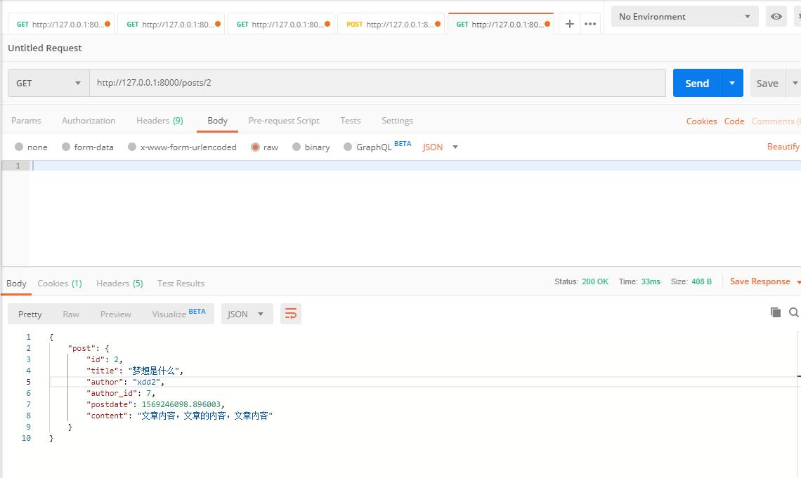

# 博文接口实现--Django播客系统(八)

[toc]

* 功能分析

````txt
POST /posts/ 文章发布，试图类PostView

请求体 application/json
{
    "title":"string",
    "content":"string"
}

响应
201 发布成功
400 请求数据错误
````

````txt
GET /posts/(\d+) 查看指定文章，试图函数getpost

响应
200 成功返回文章内容
404 文章不存在
````

````txt
GET /posts/ 文章列表页，视图类PostView

响应
200 成功返回文章列表
````

## 创建博文应用

* `python manage.py startapp post`
* 注意：**一定要把应用post加入到settings.py中**，否则不能迁移

    ````py
    # djweb/settings.py中修改
    INSTALLED_APPS = [
        'django.contrib.admin',
        'django.contrib.auth',
        'django.contrib.contenttypes',
        'django.contrib.sessions',
        'django.contrib.messages',
        'django.contrib.staticfiles',
        'user',
        "post"
    ]
    ````

* **添加对应路由**
    1. 修改djweb/urls.py文件

        ````py
        # 修改djweb/urls.py文件
        urlpatterns = [
            path('admin/', admin.site.urls),
            re_path(r'^$',index),
            re_path(r'^index$',index),#不同路径可以指向同一个函数执行
            re_path(r'^users/',include("user.urls")),
            re_path(r'^posts/',include("post.urls"))
        ]
        ````

    2. 新建post/urls.py文件

        ````py
        # 新建post/urls.py文件 配置路由信息
        from django.conf.urls import re_path
        from .views import PostView,getpost

        urlpatterns = [
            re_path(r'^$',PostView.as_view()), #/posts/  视图函数PostView
            re_path(r'^(\d+)$',getpost),
        ]
        ````

    3. 修改post/views.py文件

        ````py
        from django.http import HttpResponse,HttpRequest,JsonResponse
        from django.views.decorators.http import require_GET
        from django.views import View

        class PostView(View):
            pass

        def getpost(request:HttpRequest,id):
            print(id)
            return JsonResponse({},status=201)
        ````

* **构建数据库模型**
    1. 修改post/models.py文件

    ````py
    from django.db import models
    from user.models import User

    # post表
    class Post(models.Model):
        class Meta:
            db_table = "post"
        id = models.AutoField(primary_key=True)
        title = models.CharField(max_length=256,null=False)
        postdate = models.DateTimeField(null=False)
        # 从post查看作者，从post查看内容
        author = models.ForeignKey(User,on_delete=models.PROTECT) #指定外键，migrate会生成author_id字段
        # self.content可以访问Content实例，其内容是self.content.content

        def __repr__(self):
            return '<Post {} {} {} {} >'.format(
                self.id,self.title,self.author_id,self.content
            )

        __str__ = __repr__

    # content表
    class Content(models.Model):
        class Meta:
            db_table = "content"
        # 没有主键，会自动创建一个自增主键
        post = models.OneToOneField(Post,primary_key=True,on_delete=models.PROTECT) #一对一，这边会有一个外键post_id引用post.id
        content = models.TextField(null=False)

        def __repr__(self):
            return "<Content {} {} >".format(self.post.pk,self.content[:20])

        __str__ = __repr__
    ````

    1. 注意：on_delete在Django2.0开始，on_delete必须提供，参考[https://docs.djangoproject.com/en/1.11/ref/models/fields/#django.db.models.ForeignKey.on_delete](https://docs.djangoproject.com/en/1.11/ref/models/fields/#django.db.models.ForeignKey.on_delete)
        1. models.CASCADE 级联删除。Django在DELETE级联上模拟SOL约束的行为，并删除包含外键的对象。
        2. models.PROTECT 通过引发ProtectedError (django.db.IntegrityError的子类)防止删除引用的对象。
        3. models.SET_NULL 设置外键为空;这只有在null为真时才有可能。
        4. models.SET_DEFAULT 将外键设置为其默认值;必须为外键设置默认值。
        5. models.DO_NOTHING 不采取任何行动。如果数据库后端强制执行引用完整性，这将导致IntegrityError，除非手动向数据库字段添加一个SOL ON DELETE约束。

* **视图分类**
    1. function-based view 视图函数：视图功能有函数实现
    2. class-based view 视图类：视图功能有基于django.views.View类的子类实现

1. **django.views.View类原理**
    * django.views.View类本质就是一个对请求方法分发到与请求方法同名函数的调度器。
    * django.views.View类，定义了http的方法的小写名称列表，这些小写名称其实就是处理请求的方法名的小写。as_views()方法就是返回一个内建的`view(request,*args,**kwargs)`函数，本质上其实还是url映射到了函数上，只不过view函数内部会调用`dispatch(request,*args,**kwargs)`分发函数。
    * dispatch函数中使用request对象的请求方法小写和http_method_names中允许的HTTP方法匹配，匹配说明是正确的HTTP请求方法，然后尝试再View子类中找该方法，调用后返回结果。找不到该名称方法，就执行http_method_not_allowed方法返回405状态码
    * 看到了getattr等反射函数，说明基于反射实现的。
    * as_view()方法，用在url映射配置中
        1. 本质上，as_view()方法还是把一个类伪装成了一个视图函数。
        2. 这个视图函数，内部使用了一个分发函数，使用请求方法名称吧请求分发给存在的同名函数处理。

    ````py
    # 修改post/urls.py文件
    from django.conf.urls import re_path
    from .views import PostView,getpost
    from user.views import authenticate #登录验证装饰器

    urlpatterns = [
        # 路径/posts/
        # View类调用as_view()之后类等价一个视图函数，可以被装饰
        # 装饰器函数返回新函数
        re_path(r'^$',authenticate(PostView.as_view())), #/posts/  视图函数PostView
        re_path(r'^(\d+)$',getpost),
    ]
    ````

    * 但是这种方式适合吧PostView类所有方法都认证，但是实际上就post方法要认证。所以，authenticate还是需要加载到post方法上去。因此，要修改authenticate函数

    ````py
    # 修改user/views.py文件中对应内容
    # 登录验证装饰器
    def authenticate(viewfunc):
        def wrapper(*args):
            *s,request = args #保证最后一个取到request对象
            print(s)
            print(request)

            # 认证越早越好
            jwtheader  = request.META.get(settings.AUTH_HEADER,"")
            # print(request.META.keys())
            # print(request.META["HTTP_COOKIE"].get(settings.AUTH_HEADER,""))
            # print(request.META["HTTP_COOKIE"])
            print("-   ------------")
            if not jwtheader:
                return HttpResponse(status=401)
            print(jwtheader)
            # 解码
            try:
                payload = jwt.decode(jwtheader,settings.SECRET_KEY,algorithms=["HS256"])
                # payload = "aa"
                print(payload)
            except Exception as e: #解码有任何异常，都不能通过认证
                print(e)
                return HttpResponse(status=401)

            # 是否过期ToDO
            print("- "*30)
            try:
                user_id = payload.get("user_id",0)
                if user_id == 0:
                    return HttpResponse(status=401)
                user = User.objects.get(pk=user_id)
                request.user = user
            except Exception as e:
                print(e)
                return HttpResponse(status=401)

            response = viewfunc(*args) #参数解构
            return response
        return wrapper
    ````

    * 修改post/views.py文件

    ````py
    # post/views.py
    from django.http import HttpResponse,HttpRequest,JsonResponse
    from django.views.decorators.http import require_GET
    from django.views import View
    from user.views import authenticate

    class PostView(View): #不需要装饰器决定请求方法了
        def get(self,request:HttpRequest): #获取全体文章走这里
            print("get ~~~~~~~~~~~~~~~~~~")
            return JsonResponse({},status=200)

        # 注意：由于PostView类中并不是所有方法都需要登录认证，所有将urls路径映射中的登录认证去掉了，在这里加上。
        @authenticate
        def post(self,request:HttpRequest):#提交文章数据走这里
            print("post ++++++++++++++++++")
            return JsonResponse({}, status=200)

    @require_GET
    def getpost(request:HttpRequest,id):
        print(id)
        return JsonResponse({},status=201)
    ````

## 发布接口实现

* 用户从浏览器端提交json数据，包含title，content.
* 提交博文需要认证用户，从请求的header中验证jwt。
* `request:POST 标题、内容-》@authenticate ->视图 post -> json新文章对象`
* 新建工具包，调整jsonify函数,放入工具包内

    ````py
    # utils/__init__.py
    # 筛选所需要的字段
    def jsonify(instance,allow=None,exclude=[]):
        # allow优先，如果有，就使用allow指定的字段，这时候exclude无效
        # allow如果为空，就全体，但要看看有exclude中的要排除
        modelcls = type(instance)
        if allow:
            fn = (lambda x:x.name in allow)
        else:
            fn = (lambda x:x.name not in exclude)
        # from django.db.models.options import Options
        # m:Options = modelcls._meta
        # print(m.fields,m.pk)
        # print("----------")
        return {k.name:getattr(instance,k.name) for k in filter(fn,modelcls._meta.fields)}
    ````

### 显示事务处理

* Django中每一次save()调用就会自动提交，那么在第一次事务提交后如果第二次提交前出现异常，则post.save()不会回滚。为了解决，可以使用事务的原子方法：参考[https://docs.djangoproject.com/en/1.11/topics/db/transactions/#django.db.transaction.atomic](https://docs.djangoproject.com/en/1.11/topics/db/transactions/#django.db.transaction.atomic)
* 事务的使用方法
    1. 装饰器用法

        ````py
        @transaction.atomic #装饰器用法
        def viewfunc(request):
            # This code executes inside a transaction
            do_stuff()
        ````

    2. 上下文用法

        ````py
        def viewfunc(request):
             # This code executes in autocommit mode (Django's default).
            do_stuff()

            with transaction.atomic(): #上下文用法
                # This code executes inside a transaction.
                do_more_stuff()
        ````

* 修改`post/views.py`文件

    ````py
    # 修改`post/views.py`文件
    class PostView(View): #不需要装饰器决定请求方法了
        def get(self,request:HttpRequest): #获取全体文章走这里
            print("get ~~~~~~~~~~~~~~~~~~")
            return JsonResponse({},status=200)

        # 注意：由于PostView类中并不是所有方法都需要登录认证，所有将urls路径映射中的登录认证去掉了，在这里加上。
        @authenticate 
        def post(self,request:HttpRequest):#提交文章数据走这里
            print("post ++++++++++++++")
            post = Post()
            content = Content()

            try:
                payload = simplejson.loads(request.body)
                post.title = payload["title"]
                post.author = User(id=request.user.id)
                # post.author = request.user
                post.postdate = datetime.datetime.now(
                    datetime.timezone(datetime.timedelta(hours=8))
                )
                with transaction.atomic(): #原子操作
                    post.save()
                    content.post = post
                    content.content = payload["content"]
                    content.save()
                return JsonResponse({
                    "post":jsonify(post,allow=["id","title"])
                },status=200)
            except Exception as e:
                print(e)
                return HttpResponse(status=400)
    ````

* 启动后测试
    1. 带jwt访问`http://127.0.0.1:8000/posts/`需要先登录
      
      

## 文章接口实现

* 根据post_id查询博文并返回。
* 如果博文只能作者看到，就需要认证，本次是公开，即所有人都能看到，所以不需要认证。同样，下面的list接口也是不需要认证的。
* `request: GET post's id-> getpost 视图函数 -> Json post + content`

````py
# 修改`post/views.py`文件
@require_GET
def getpost(request:HttpRequest,id):
    try:
        id = int(id)
        post = Post.objects.get(pk=id) #only one
        return JsonResponse({
            "post":{
                "id":post.id,
                "title":post.title,
                "author":post.author.name,
                "author_id":post.author_id, #post.author.id
                "postdate":post.postdate.timestamp(),
                "content":post.content.content
            }
        })
    except Exception as e:
        print(e)
        return HttpResponse(status=404)
````

  

## 列表页接口实现

* 发起GET请求，通过查询字符串`http://url/posts/?page=2`查询第二页数据
* `request: GET ?pate=5&size=20 ->视图 get -> json文章列表`

````txt
GET /posts/?page=3&size=20 文章列表，视图类PostView

响应
200 成功返回文章列表
````

* 完善分页
    1. 分页信息，一般有：当前页/总页数、每页条数，记录总数。
        * **当前页**：page
        * **每页条数**：size ,每页最多多少行
        * **总页数**：pages = math.ceil(count/size)
        * **记录总数**：total,从select * from table来

````py
# 修改post/views.py文件
from django.http import HttpResponse,HttpRequest,JsonResponse
from django.views.decorators.http import require_GET
from django.views import View
from user.views import authenticate
from post.models import Post,Content
from user.models import User
import simplejson,datetime,math
from django.db import transaction
from utils import jsonify

class PostView(View): #不需要装饰器决定请求方法了
    def get(self,request:HttpRequest): #获取全体文章走这里
        print("get ~~~~~~~~~~~~~~~~~~")
        try: #页码
            page = int(request.GET.get("page",1))
            page = page if page >0 else 1
        except:
            page = 1

        try: #每页条数
            #注意，这个数据不要轻易让浏览器端改变，如果允许改变，一定要控制范围
            size = int(request.GET.get("size",20))
            size = size if size >0 and size <101 else 20
        except:
            size = 20

        try: #每页条目数
            start = (page - 1) * size
            posts = Post.objects.order_by("-pk")
            print(posts.query)
            total = posts.count()
            posts = posts[start:start + size]
            print(posts.query)
            return JsonResponse({
                "posts":[jsonify(post,allow=["id","title"]) for post in posts],
                "pagination":{
                    "page":page,
                    "size":size,
                    "total":total,
                    "pages":math.ceil(total / size)
                }
            })
        except Exception as e:
            print(e)
            return HttpResponse(status=400)
````

* 也可以使用Django提供的Paginator类来完成。
* Paginator文档[https://docs.djangoproject.com/en/1.11/topics/pagination/](https://docs.djangoproject.com/en/1.11/topics/pagination/)
* 但是，还是自己更加简单明了些。  

### 改写校验函数

* 修改post/views.py文件

````py
# 修改post/views.py文件
def validate(d:dict,name:str,type_func,default,validate_func):
    try:
        ret = type_func(d.get(name,default))
        ret = validate_func(ret,default)
    except:
        ret = default
    return ret

class PostView(View): #不需要装饰器决定请求方法了
    def get(self,request:HttpRequest): #获取全体文章走这里
        print("get ~~~~~~~~~~~~~~~~~~")
        # 页码
        page = validate(request.GET,"page",int,1,lambda x,y:x if x>0 else y)
        # 每页条数
        #注意，这个数据不要轻易让浏览器端改变，如果允许改变，一定要控制范围
        size = validate(request.GET,"page",int,20,lambda x,y:x if x>0 and x<101 else y)

        try: #每页条目数
            start = (page - 1) * size
            posts = Post.objects.order_by("-pk")
            print(posts.query)
            total = posts.count()

            posts = posts[start:start + size]
            print(posts.query)
            return JsonResponse({
                "posts":[jsonify(post,allow=["id","title"]) for post in posts],
                "pagination":{
                    "page":page,
                    "size":size,
                    "total":total,
                    "pages":math.ceil(total / size)
                }
            })
        except Exception as e:
            print(e)
            return HttpResponse(status=400)
````
