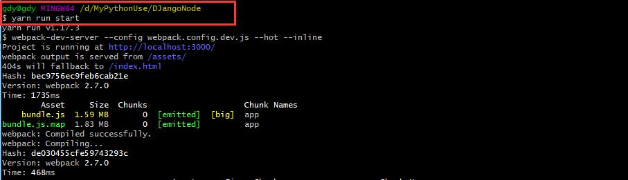
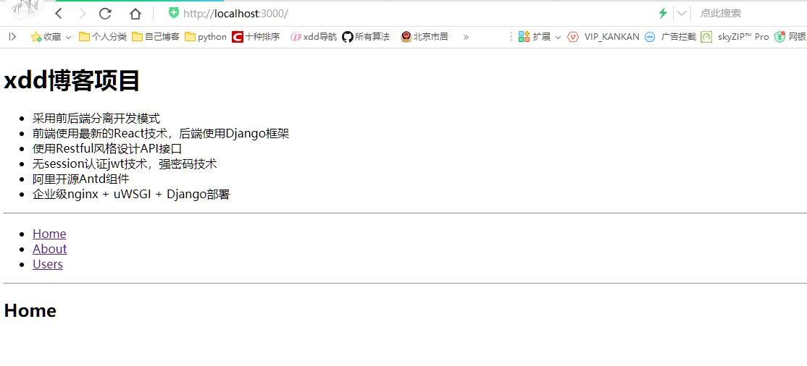
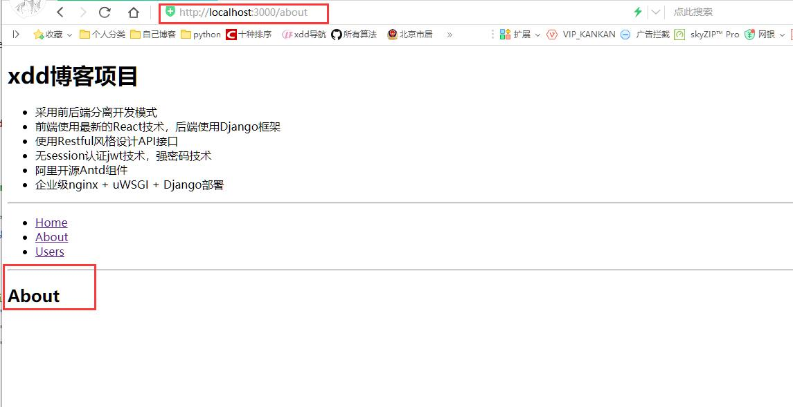
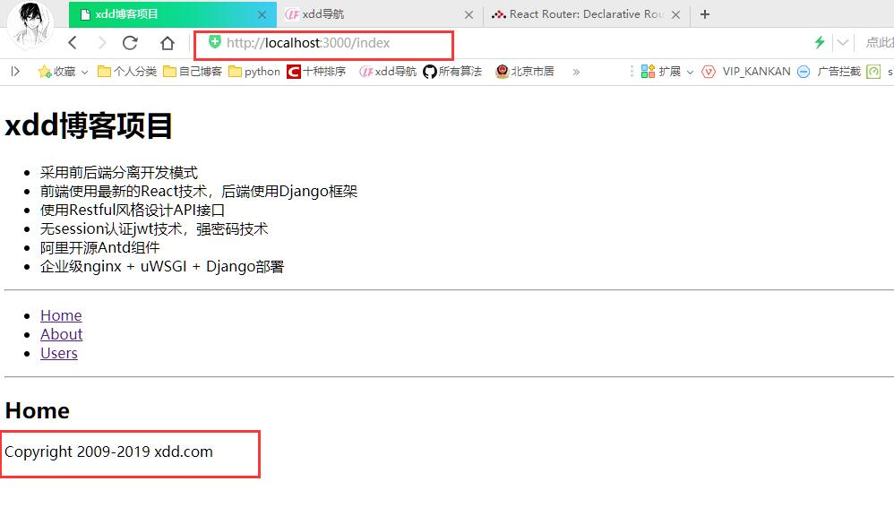
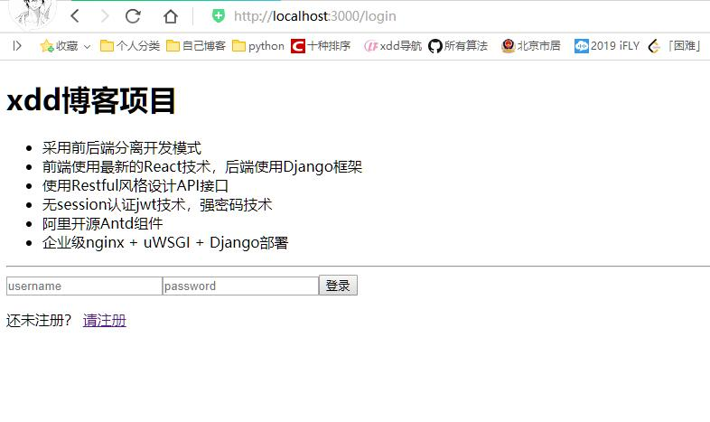
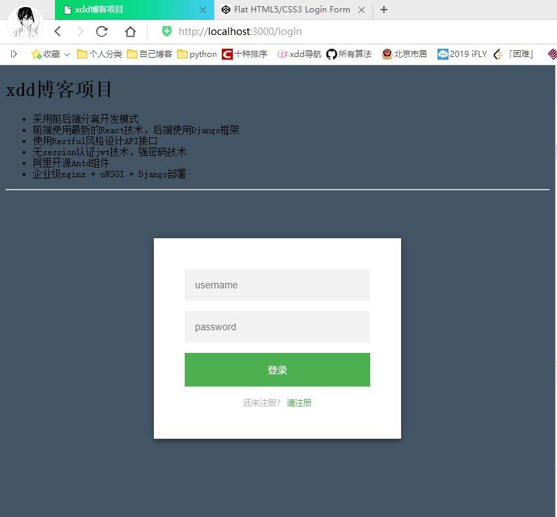
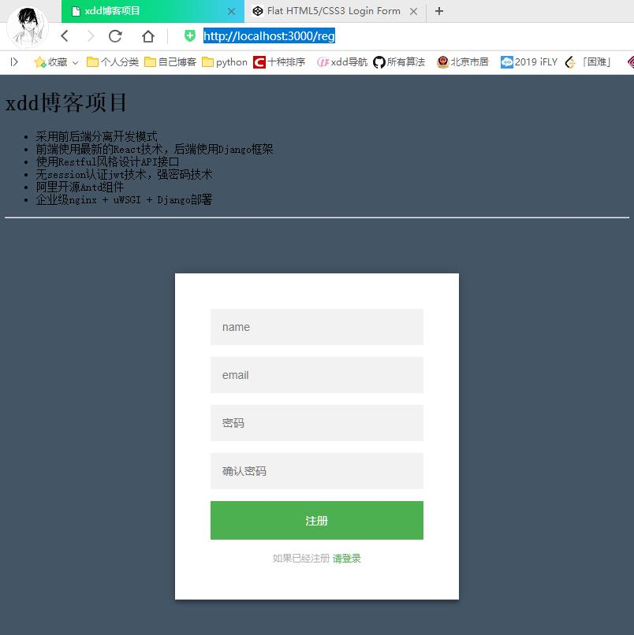

# 前端开发及登录功能实现--Django播客系统(九)

[toc]

## 开发环境设置

* 使用react-mobx-starter-master脚手架，解压更名为DjangoNode。
* 在src中新增component、service、css目录
* 注意：没有特别说明，js开发都在src目录下

* 目录结构

````js
DjangoNode/
    │-.babelrc
    │-.gitignore #git的忽略文件
    │-.npmrc    #npm的服务器配置，本次使用的是阿里
    │-index.html #dev server使用的首页
    │-jsconfig.json
    │-LICENSE
    │-package-lock.json
    │-package.json  #项目的根目录安装文件，使用npm install可以构建项目
    │-README.md
    │-webpack.config.dev.js #开发用的配置文件
    │-webpack.config.prod.js #生产环境，打包用的配置文件
    └─src/
        │- componet/ #自己组件文件夹
        │- service/  #服务程序
        │- css/  #样式表
        │- index.html #模板页面
        │- index.js
````

1. 修改项目信息`package.json`文件

    ````js
    {
        "name":"blog",
        "description":"blog project",
        "author":"xdd"
    }
    ````

2. 修改`webpack.config.dev.js`

    ````js
    devServer: {
            compress: true, /* gzip */
            //host:'192.168.61.109', /* 设置ip */
            port: 3000,
            publicPath: '/assets/', /* 设置bundled files浏览器端访问地址 */
            hot: true,  /* 开启HMR热模块替换 */
            inline: true, /* 控制浏览器控制台是否显示信息 */
            historyApiFallback: true,
            stats: {
                chunks: false
            },
            proxy: { //代理
                '/api': {
                    target: 'http://127.0.0.1:8000',
                    changeOrigin: true
                }
            }
        }
    ````

3. 安装依赖 `npm install`
    * npm会按照package.json中依赖的包。也可以使用新的包管理工具yarn安装模块
    * 使用yarn替换npm安装，速度会更快写，yarn是并行安装，npm是串行安装。

    ````txt
    yarn安装
    $ npm install -g yarn
    或者，去https://yarn.bootcss.com/docs/install/

    相当于npm install
    $ yarn

    * 如果想自己构建脚手架，可以使用如下命令
    $npm install  #构建脚手架
    相当于npm install react-router #添加react-router组件
    $ yarn add react-router # 安装路由，即项目前端web路由
    $ yarn add react-router-dom #
    ````

4. 相关命令

    |npm命令|Yarn命令|解释|
    |:----------|:-----------|:--------|
    |`npm install` | `yarn install`|安装|
    |`npm install [package] --save` |`yarn add [package]`|安装运行时依赖|
    |`npm install [package] --save-dev` | `yarn add [package] --dev`|安装开发时依赖|
    |`npm install [package] --global`|`yarn global add [package]`|全局安装|
    |`npm uninstall [package]`|`yarn remove [package]`|卸载|

## 开发

### 前端路由

* 前端路由使用react-router组件完成
* 官方文档[https://reacttraining.com/react-router/web/guides/quick-start](https://reacttraining.com/react-router/web/guides/quick-start)  
* 基本例子[https://reacttraining.com/react-router/web/example/basic](https://reacttraining.com/react-router/web/example/basic)  
* 使用react-route主键，更改src/index.js

````js
/* src/index.js文件 */
import React from 'react';
import ReactDom from 'react-dom';
import {Route,Link,BrowserRouter as Router,Switch} from "react-router-dom";

function App() {
  return (
    <Router>
      <div>
        <ul>
          <li>
            <Link to="/">Home</Link>
          </li>
          <li>
            <Link to="/about">About</Link>
          </li>
          <li>
            <Link to="/users">Users</Link>
          </li>
        </ul>

        <hr />

        <Route exact path="/" component={Home} />
        <Route path="/about" component={About} />
        <Route path="/users" component={Users} />
      </div>
    </Router>
  );
}

function Home() {
  return (
    <div>
      <h2>Home</h2>
    </div>
  );
}

function About() {
  return (
    <div>
      <h2>About</h2>
    </div>
  );
}

const Users = () => {
  return (
    <div>
      <h2>Users</h2>
    </div>
  )
}

ReactDom.render(<App />, document.getElementById('root'));

````

* 注意：
    1. **Link组件相当于a标签**
    2. **Route**组件不可见，用来做Router的路由定义。当网页中的地址栏中地址发生改变，会从Route中匹配对应的路径加载对应的组件。

* **启动项目**`yarn run start`
    1. start是在配置文件`dockerNode/package.json`中已经定义好了，如下：

    ````js
    {
        "scripts": {
            "test": "jest",
            "start": "webpack-dev-server --config webpack.config.dev.js --hot --inline",
            "build": "rimraf dist && webpack -p --config webpack.config.prod.js"
        },
    }
    ````

      

* 在地址栏中输入`http://127.0.0.1:3000/`或`http://127.0.0.1:3000/about`能够看到页面的变化。
* App中，使用了**Router路由组件，Router是根，且它只能有一个元素，所以添加了Div**
    1. 访问`http://127.0.0.1:3000/`
      
    2. 访问`http://127.0.0.1:3000/about`
      
* 前端路由：通过一个url加载一个组件，将原来的组件替换。

#### Route指令

* 它负责静态路由，只能和Route指定的path匹配，组件就可以显示。URL变化，将重新匹配路径
* component属性设置目标组件
* path是匹配路径，如果匹配则显示组件
    1. `exact`:布尔值
    2. `strict`:布尔值
* 没有path属性，组件将总是显示，例如`<Route component={Always} />`
* path属性还支持路径数组，意思是多个路径都可以匹配

````js
/* 修改src/index.js文件*/
function App() {
  return (
    <Router>
      <div>
        <ul>
          <li>
            <Link to="/">Home</Link>
          </li>
          <li>
            <Link to="/about">About</Link>
          </li>
          <li>
            <Link to="/users">Users</Link>
          </li>
        </ul>

        <hr />

        <Route exact path={["/","/index"]} component={Home} />
        <Route path="/about" component={About} />
        <Route path="/users" component={Users} />
        <Route component={Always} />
      </div>
    </Router>
  );
}

function Always(){
  return(
    <div id="footer">
      <span>Copyright 2009-2019 xdd.com</span>
    </div>
  )
}

ReactDom.render(<App />, document.getElementById('root'));
````

  

1. **路由配置**
    * **exact** 只能匹配本路径，不包含子路径
    * **strict** 路径尾部有`/`,则必须匹配这个`/`,也可以匹配子路径|
    * **exact strict** 一起用，表示严格的等于当前指定路径

    |路径|`/about`|`/about/`|`/about/123`|
    |:----|:------|:--------|:-----------|
    |`path="/about"`|√ |√ |√ |
    |`exact path="/about"`|√ |√ | |
    |`exact path="/about/"`|√ |√ | |
    |`strict path="/about"`|√ |√ |√ |
    |`exact strict path="/about"`|√ | | |
    |`strict path="/about/"`| |√ |√ |
    |`exact strict path="/about/"`| |√ | |

2. **Switch指令**
    * 也可以将Route组织到一个Switch中，一旦匹配Switch中的一个Route，就不再匹配其他。但是Route是匹配所有，如果匹配就会显示组件，无path的Route始终匹配。
    * 示例：

    ````js
    /* 修改src/index.js文件*/
    function App() {
    return (
        <Router>
        <div>
            <ul>
            <li>
                <Link to="/">Home</Link>
            </li>
            <li>
                <Link to="/about">About</Link>
            </li>
            <li>
                <Link to="/users">Users</Link>
            </li>
            </ul>

            <hr />
            <Switch>
            <Route path="/" component={Home} />
            <Route path="/about" component={About} />
            <Route path="/users" component={Users} />
            <Route component={Always} />
            </Switch>
        </div>
        </Router>
    );
    }
    ````

    * 注意这个时候Always组件，其实是404组件了，因为只有Switch中其上的Route没有匹配，才轮到它。

### 登录组件

* 在component目录下构建react组件
* 登录页面模板[https://codepen.io/colorlib/pen/rxddKy?q=login&limit=all&type=type-pens](https://codepen.io/colorlib/pen/rxddKy?q=login&limit=all&type=type-pens)  

````py
<div class="login-page">
<div class="form">
    <form class="register-form">
    <input type="text" placeholder="name"/>
    <input type="password" placeholder="password"/>
    <input type="text" placeholder="email address"/>
    <button>create</button>
    <p class="message">Already registered? <a href="#">Sign In</a></p>
    </form>
    <form class="login-form">
    <input type="text" placeholder="username"/>
    <input type="password" placeholder="password"/>
    <button>login</button>
    <p class="message">Not registered? <a href="#">Create an account</a></p>
    </form>
</div>
</div>
````

* 使用这个HTML模板来构建组件
* **特别注意**
    1. 搬到React组件中的时候，要**将class属性改为className**.
    2. 所有标签，需要闭合。

1. **login.js**
    1. 在component目录下新建login.js的登录组件。
    2. 使用上面的模板的HTML中的登录部分，挪到render函数中。
        * 修改**class为className**
        * **将`<a>`标签替换成`<Link to="?">`组件**
        * 注意标签闭合问题

    ````js
    /* 新建文件src/component/login.js */
    import React from "react";
    import {Link} from "react-router-dom";

    export default class Login extends React.Component {
        render() {
            return (
                <div className="login-page">
                <div className="form">
                    <form className="login-form">
                    <input type="text" placeholder="username"/>
                    <input type="password" placeholder="password"/>
                    <button>登录</button>
                    <p className="message">还未注册？ <Link to="#">请注册</Link></p>
                    </form>
                </div>
                </div>
            )
        }
    }
    ````

2. **在`src/index.js`路由中增加登录组件**

    ````js
    /* 修改src/index.js文件内容 */
    import React from 'react';
    import ReactDom from 'react-dom';
    import {Route,Link,BrowserRouter as Router,Switch} from "react-router-dom";
    import Login from "./component/login";

    function App() {
    return (
        <Router>
        <div>
            <Route path="/about" component={About} />
            <Route path="/login" component={Login} />
            <Route exact path="/" component={Home} />
        </div>
        </Router>
    );
    }

    function Home() {
    return (
        <div>
        <h2>Home</h2>
        </div>
    );
    }

    function About() {
    return (
        <div>
        <h2>About</h2>
        </div>
    );
    }


    ReactDom.render(<App />, document.getElementById('root'));
    ````

    * 访问`http://127.0.0.1:3000/login`就可以看到登录界面了，但是没有样式。
      

3. **样式表**
    * 在`src/css`中，创建login.css,放入以下内容，然后`src/component/login.js`中导入样式

    ````js
    /* src/component/login.js中导入样式表 */
    import React from "react";
    import {Link} from "react-router-dom";
    import "../css/login.css";
    ````

    ````css
    /* 新建src/css/login.css文件 */
    body {
    background: #456;
    font-family: SimSun;
    font-size: 14px;
    }

    .login-page {
    width: 360px;
    padding: 8% 0 0;
    margin: auto;
    }
    .form {
    font-family: "Microsoft YaHei", SimSun;
    position: relative;
    z-index: 1;
    background: #FFFFFF;
    max-width: 360px;
    margin: 0 auto 100px;
    padding: 45px;
    text-align: center;
    box-shadow: 0 0 20px 0 rgba(0, 0, 0, 0.2), 0 5px 5px 0 rgba(0, 0, 0, 0.24);
    }
    .form input {
    outline: 0;
    background: #f2f2f2;
    width: 100%;
    border: 0;
    margin: 0 0 15px;
    padding: 15px;
    box-sizing: border-box;
    font-size: 14px;
    }
    .form button {
    text-transform: uppercase;
    outline: 0;
    background: #4CAF50;
    width: 100%;
    border: 0;
    padding: 15px;
    color: #FFFFFF;
    font-size: 14px;
    cursor: pointer;
    }
    .form button:hover,.form button:active,.form button:focus {
    background: #43A047;
    }
    .form .message {
    margin: 15px 0 0;
    color: #b3b3b3;
    font-size: 12px;
    }
    .form .message a {
    color: #4CAF50;
    text-decoration: none;
    }
    ````

    * 访问`http://localhost:3000/login`可以看到如下界面
      

### 注册组件

* 与登录组件编写方式差不多，创建`src/component/reg.js`,使用login.css

````js
/*新建src/component/reg.js文件 */
import React from "react";
import {Link} from "react-router-dom";
import "../css/login.css"

export default class Reg extends React.Component {
    render(){
        return(
            <div className="login-page">
            <div className="form">
                <form className="register-form">
                <input type="text" placeholder="name"/>
                <input type="text" placeholder="email" />
                <input type="password" placeholder="密码"/>
                <input type="password" placeholder="确认密码"/>
                <button>注册</button>
                <p className="message">如果已经注册 <Link to="#">请登录</Link></p>
                </form>
            </div>
            </div>
        )
    }
}
````

* 在`src/index.js`中增加一条静态路由

````js
/* src/index.js中修改*/
import Reg from "./component/reg";

function App() {
  return (
    <Router>
      <div>
          <Route path="/about" component={About} />
          <Route path="/login" component={Login} />
          <Route path="/reg" component={Reg} />
          <Route exact path="/" component={Home} />
      </div>
    </Router>
  );
}
````

* 访问`http://localhost:3000/reg`可以看到如下界面
      

### 导航栏链接


