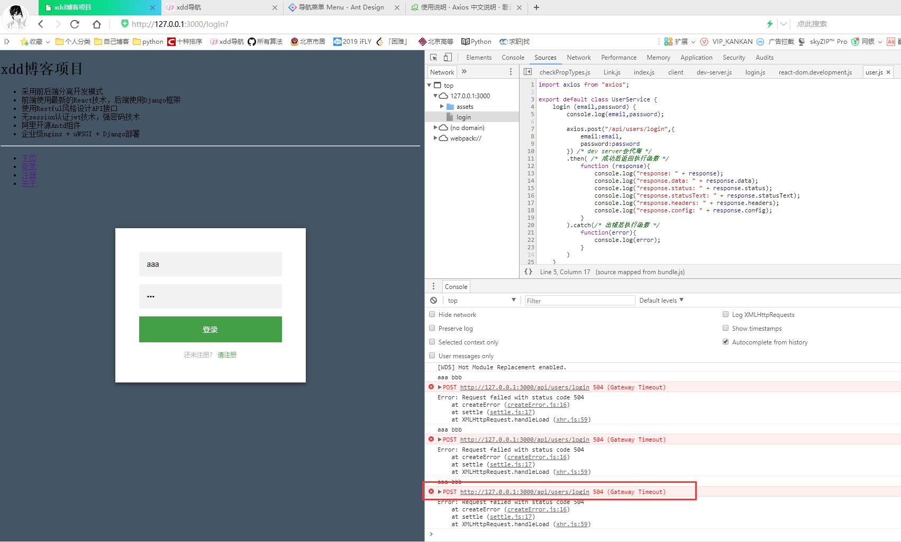

# 前端开发及登录功能实现--Django播客系统(九)

[toc]

## 开发环境设置

* 使用react-mobx-starter-master脚手架，解压更名为DjangoNode。
* 在src中新增component、service、css目录
* 注意：没有特别说明，js开发都在src目录下

* 目录结构

````js
DjangoNode/
    │-.babelrc
    │-.gitignore #git的忽略文件
    │-.npmrc    #npm的服务器配置，本次使用的是阿里
    │-index.html #dev server使用的首页
    │-jsconfig.json
    │-LICENSE
    │-package-lock.json
    │-package.json  #项目的根目录安装文件，使用npm install可以构建项目
    │-README.md
    │-webpack.config.dev.js #开发用的配置文件
    │-webpack.config.prod.js #生产环境，打包用的配置文件
    └─src/
        │- componet/ #自己组件文件夹
        │- service/  #服务程序
        │- css/  #样式表
        │- index.html #模板页面
        │- index.js
````

1. 修改项目信息`package.json`文件

    ````js
    {
        "name":"blog",
        "description":"blog project",
        "author":"xdd"
    }
    ````

2. 修改`webpack.config.dev.js`

    ````js
    devServer: {
            compress: true, /* gzip */
            //host:'192.168.61.109', /* 设置ip */
            port: 3000,
            publicPath: '/assets/', /* 设置bundled files浏览器端访问地址 */
            hot: true,  /* 开启HMR热模块替换 */
            inline: true, /* 控制浏览器控制台是否显示信息 */
            historyApiFallback: true,
            stats: {
                chunks: false
            },
            proxy: { //代理
                '/api': {
                    target: 'http://127.0.0.1:8000',
                    changeOrigin: true
                }
            }
        }
    ````

3. 安装依赖 `npm install`
    * npm会按照package.json中依赖的包。也可以使用新的包管理工具yarn安装模块
    * 使用yarn替换npm安装，速度会更快写，yarn是并行安装，npm是串行安装。

    ````txt
    yarn安装
    $ npm install -g yarn
    或者，去https://yarn.bootcss.com/docs/install/

    相当于npm install
    $ yarn

    * 如果想自己构建脚手架，可以使用如下命令
    $npm install  #构建脚手架
    相当于npm install react-router #添加react-router组件
    $ yarn add react-router # 安装路由，即项目前端web路由
    $ yarn add react-router-dom #
    ````

4. 相关命令

    |npm命令|Yarn命令|解释|
    |:----------|:-----------|:--------|
    |`npm install` | `yarn install`|安装|
    |`npm install [package] --save` |`yarn add [package]`|安装运行时依赖|
    |`npm install [package] --save-dev` | `yarn add [package] --dev`|安装开发时依赖|
    |`npm install [package] --global`|`yarn global add [package]`|全局安装|
    |`npm uninstall [package]`|`yarn remove [package]`|卸载|

## 开发

### 前端路由

* 前端路由使用react-router组件完成
* 官方文档[https://reacttraining.com/react-router/web/guides/quick-start](https://reacttraining.com/react-router/web/guides/quick-start)  
* 基本例子[https://reacttraining.com/react-router/web/example/basic](https://reacttraining.com/react-router/web/example/basic)  
* 使用react-route主键，更改src/index.js

````js
/* src/index.js文件 */
import React from 'react';
import ReactDom from 'react-dom';
import {Route,Link,BrowserRouter as Router,Switch} from "react-router-dom";

function App() {
  return (
    <Router>
      <div>
        <ul>
          <li>
            <Link to="/">Home</Link>
          </li>
          <li>
            <Link to="/about">About</Link>
          </li>
          <li>
            <Link to="/users">Users</Link>
          </li>
        </ul>

        <hr />

        <Route exact path="/" component={Home} />
        <Route path="/about" component={About} />
        <Route path="/users" component={Users} />
      </div>
    </Router>
  );
}

function Home() {
  return (
    <div>
      <h2>Home</h2>
    </div>
  );
}

function About() {
  return (
    <div>
      <h2>About</h2>
    </div>
  );
}

const Users = () => {
  return (
    <div>
      <h2>Users</h2>
    </div>
  )
}

ReactDom.render(<App />, document.getElementById('root'));

````

* 注意：
    1. **Link组件相当于a标签**
    2. **Route**组件不可见，用来做Router的路由定义。当网页中的地址栏中地址发生改变，会从Route中匹配对应的路径加载对应的组件。

* **启动项目**`yarn run start`
    1. start是在配置文件`dockerNode/package.json`中已经定义好了，如下：

    ````js
    {
        "scripts": {
            "test": "jest",
            "start": "webpack-dev-server --config webpack.config.dev.js --hot --inline",
            "build": "rimraf dist && webpack -p --config webpack.config.prod.js"
        },
    }
    ````

      

* 在地址栏中输入`http://127.0.0.1:3000/`或`http://127.0.0.1:3000/about`能够看到页面的变化。
* App中，使用了**Router路由组件，Router是根，且它只能有一个元素，所以添加了Div**
    1. 访问`http://127.0.0.1:3000/`
      
    2. 访问`http://127.0.0.1:3000/about`
      
* 前端路由：通过一个url加载一个组件，将原来的组件替换。

#### Route指令

* 它负责静态路由，只能和Route指定的path匹配，组件就可以显示。URL变化，将重新匹配路径
* component属性设置目标组件
* path是匹配路径，如果匹配则显示组件
    1. `exact`:布尔值
    2. `strict`:布尔值
* 没有path属性，组件将总是显示，例如`<Route component={Always} />`
* path属性还支持路径数组，意思是多个路径都可以匹配

````js
/* 修改src/index.js文件*/
function App() {
  return (
    <Router>
      <div>
        <ul>
          <li>
            <Link to="/">Home</Link>
          </li>
          <li>
            <Link to="/about">About</Link>
          </li>
          <li>
            <Link to="/users">Users</Link>
          </li>
        </ul>

        <hr />

        <Route exact path={["/","/index"]} component={Home} />
        <Route path="/about" component={About} />
        <Route path="/users" component={Users} />
        <Route component={Always} />
      </div>
    </Router>
  );
}

function Always(){
  return(
    <div id="footer">
      <span>Copyright 2009-2019 xdd.com</span>
    </div>
  )
}

ReactDom.render(<App />, document.getElementById('root'));
````

  

1. **路由配置**
    * **exact** 只能匹配本路径，不包含子路径
    * **strict** 路径尾部有`/`,则必须匹配这个`/`,也可以匹配子路径|
    * **exact strict** 一起用，表示严格的等于当前指定路径

    |路径|`/about`|`/about/`|`/about/123`|
    |:----|:------|:--------|:-----------|
    |`path="/about"`|√ |√ |√ |
    |`exact path="/about"`|√ |√ | |
    |`exact path="/about/"`|√ |√ | |
    |`strict path="/about"`|√ |√ |√ |
    |`exact strict path="/about"`|√ | | |
    |`strict path="/about/"`| |√ |√ |
    |`exact strict path="/about/"`| |√ | |

2. **Switch指令**
    * 也可以将Route组织到一个Switch中，一旦匹配Switch中的一个Route，就不再匹配其他。但是Route是匹配所有，如果匹配就会显示组件，无path的Route始终匹配。
    * 示例：

    ````js
    /* 修改src/index.js文件*/
    function App() {
    return (
        <Router>
        <div>
            <ul>
            <li>
                <Link to="/">Home</Link>
            </li>
            <li>
                <Link to="/about">About</Link>
            </li>
            <li>
                <Link to="/users">Users</Link>
            </li>
            </ul>

            <hr />
            <Switch>
            <Route path="/" component={Home} />
            <Route path="/about" component={About} />
            <Route path="/users" component={Users} />
            <Route component={Always} />
            </Switch>
        </div>
        </Router>
    );
    }
    ````

    * 注意这个时候Always组件，其实是404组件了，因为只有Switch中其上的Route没有匹配，才轮到它。

### 登录组件

* 在component目录下构建react组件
* 登录页面模板[https://codepen.io/colorlib/pen/rxddKy?q=login&limit=all&type=type-pens](https://codepen.io/colorlib/pen/rxddKy?q=login&limit=all&type=type-pens)  

````py
<div class="login-page">
<div class="form">
    <form class="register-form">
    <input type="text" placeholder="name"/>
    <input type="password" placeholder="password"/>
    <input type="text" placeholder="email address"/>
    <button>create</button>
    <p class="message">Already registered? <a href="#">Sign In</a></p>
    </form>
    <form class="login-form">
    <input type="text" placeholder="username"/>
    <input type="password" placeholder="password"/>
    <button>login</button>
    <p class="message">Not registered? <a href="#">Create an account</a></p>
    </form>
</div>
</div>
````

* 使用这个HTML模板来构建组件
* **特别注意**
    1. 搬到React组件中的时候，要**将class属性改为className**.
    2. 所有标签，需要闭合。

1. **login.js**
    1. 在component目录下新建login.js的登录组件。
    2. 使用上面的模板的HTML中的登录部分，挪到render函数中。
        * 修改**class为className**
        * **将`<a>`标签替换成`<Link to="?">`组件**
        * 注意标签闭合问题

    ````js
    /* 新建文件src/component/login.js */
    import React from "react";
    import {Link} from "react-router-dom";

    export default class Login extends React.Component {
        render() {
            return (
                <div className="login-page">
                <div className="form">
                    <form className="login-form">
                    <input type="text" placeholder="username"/>
                    <input type="password" placeholder="password"/>
                    <button>登录</button>
                    <p className="message">还未注册？ <Link to="#">请注册</Link></p>
                    </form>
                </div>
                </div>
            )
        }
    }
    ````

2. **在`src/index.js`路由中增加登录组件**

    ````js
    /* 修改src/index.js文件内容 */
    import React from 'react';
    import ReactDom from 'react-dom';
    import {Route,Link,BrowserRouter as Router,Switch} from "react-router-dom";
    import Login from "./component/login";

    function App() {
    return (
        <Router>
        <div>
            <Route path="/about" component={About} />
            <Route path="/login" component={Login} />
            <Route exact path="/" component={Home} />
        </div>
        </Router>
    );
    }

    function Home() {
    return (
        <div>
        <h2>Home</h2>
        </div>
    );
    }

    function About() {
    return (
        <div>
        <h2>About</h2>
        </div>
    );
    }


    ReactDom.render(<App />, document.getElementById('root'));
    ````

    * 访问`http://127.0.0.1:3000/login`就可以看到登录界面了，但是没有样式。
      

3. **样式表**
    * 在`src/css`中，创建login.css,放入以下内容，然后`src/component/login.js`中导入样式

    ````js
    /* src/component/login.js中导入样式表 */
    import React from "react";
    import {Link} from "react-router-dom";
    import "../css/login.css";
    ````

    ````css
    /* 新建src/css/login.css文件 */
    body {
    background: #456;
    font-family: SimSun;
    font-size: 14px;
    }

    .login-page {
    width: 360px;
    padding: 8% 0 0;
    margin: auto;
    }
    .form {
    font-family: "Microsoft YaHei", SimSun;
    position: relative;
    z-index: 1;
    background: #FFFFFF;
    max-width: 360px;
    margin: 0 auto 100px;
    padding: 45px;
    text-align: center;
    box-shadow: 0 0 20px 0 rgba(0, 0, 0, 0.2), 0 5px 5px 0 rgba(0, 0, 0, 0.24);
    }
    .form input {
    outline: 0;
    background: #f2f2f2;
    width: 100%;
    border: 0;
    margin: 0 0 15px;
    padding: 15px;
    box-sizing: border-box;
    font-size: 14px;
    }
    .form button {
    text-transform: uppercase;
    outline: 0;
    background: #4CAF50;
    width: 100%;
    border: 0;
    padding: 15px;
    color: #FFFFFF;
    font-size: 14px;
    cursor: pointer;
    }
    .form button:hover,.form button:active,.form button:focus {
    background: #43A047;
    }
    .form .message {
    margin: 15px 0 0;
    color: #b3b3b3;
    font-size: 12px;
    }
    .form .message a {
    color: #4CAF50;
    text-decoration: none;
    }
    ````

    * 访问`http://localhost:3000/login`可以看到如下界面
      

### 注册组件

* 与登录组件编写方式差不多，创建`src/component/reg.js`,使用login.css

````js
/*新建src/component/reg.js文件 */
import React from "react";
import {Link} from "react-router-dom";
import "../css/login.css"

export default class Reg extends React.Component {
    render(){
        return(
            <div className="login-page">
            <div className="form">
                <form className="register-form">
                <input type="text" placeholder="name"/>
                <input type="text" placeholder="email" />
                <input type="password" placeholder="密码"/>
                <input type="password" placeholder="确认密码"/>
                <button>注册</button>
                <p className="message">如果已经注册 <Link to="#">请登录</Link></p>
                </form>
            </div>
            </div>
        )
    }
}
````

* 在`src/index.js`中增加一条静态路由

````js
/* src/index.js中修改*/
import Reg from "./component/reg";

function App() {
  return (
    <Router>
      <div>
          <Route path="/about" component={About} />
          <Route path="/login" component={Login} />
          <Route path="/reg" component={Reg} />
          <Route exact path="/" component={Home} />
      </div>
    </Router>
  );
}
````

* 访问`http://localhost:3000/reg`可以看到如下界面
      

### 导航栏链接

* 在index.js中增加导航栏链接，方便页面切换

````js
/* 修改src/index.js文件*/
function App() {
  return (
    <Router>
      <div>
          <div>
            <ul>
              <li><Link to="/">主页</Link></li>
              <li><Link to="/login">登录</Link></li>
              <li><Link to="/reg">注册</Link></li>
              <li><Link to="/about">关于</Link></li>
            </ul>
          </div>
          <Route path="/about" component={About} />
          <Route path="/login" component={Login} />
          <Route path="/reg" component={Reg} />
          <Route exact path="/" component={Home} />
      </div>
    </Router>
  );
}
````

  

### 分层

|层次|作用|路径|
|:----|:----|:----|
|视图层|负责数据呈现，负责用户交互界面|`src/component/xxx.js`|
|服务层|负责业务逻辑处理|`src/service/xxx.js`|
|Model层|数据持久化||

### 登录功能实现

* view层，登录组件和用户交互。相当于button点击触发onclick,调用事件响应函数handleClick,handleClick中调用服务service层login函数。
* service层，负责业务逻辑处理。调用Model层数据操作函数
* 新建`src/service/user.js`处理调用逻辑

````js
/* 新建src/service/user.js逻辑 */
export default class UserService {
    login (email,password) {
        //Tood
    }
}
````

* 修改`src/component/login.js`文件

````js
/* 修改`src/component/login.js`文件 */
import React from "react";
import {Link} from "react-router-dom";
import "../css/login.css";

export default class Login extends React.Component {
    handleClick(event){
        console.log(event.target)
    }

    render() {
        return (
            <div className="login-page">
            <div className="form">
                <form className="login-form">
                <input type="text" placeholder="email"/>
                <input type="password" placeholder="password"/>
                <button onClick={this.handleClick.bind(this)}>登录</button>
                <p className="message">还未注册？ <Link to="#">请注册</Link></p>
                </form>
            </div>
            </div>
        )
    }
}
````

1. 问题：
    * 页面提交
      1. 这次发现有一些问题，按钮点击会提交，导致页面刷新了。要阻止页面刷新，其实就是阻止提交。使用event.preventDefault()。
    * 如何拿到邮箱和密码？
      1. `event.target.form`返回暗流所在表单，可以看做一个数组。
      2. `fm[0].value`和`fm[1].value`就是文本框的值。
    * 如何在Login组件中使用UserService实例呢？
      1. 使用全局变量，虽然可以，但不好。
      2. 可以在Login的构造器中通过属性注入。
      3. 也可以在外部使用props注入。使用这种方式。

* 修改，保证在login组件中使用UserService，使用属性注入

````js
/* 修改src/component/login.js文件 */
import React from "react";
import {Link} from "react-router-dom";
import "../css/login.css";
import UserService from "../service/user";

const serviec = new UserService();

export default class Login extends React.Component{
    render(){
        return <_Login service={serviec} />;
    }
}

class _Login extends React.Component {
    handleClick(event){
        event.preventDefault(); /* 阻止from表单提交 */
        let fm = event.target.form;
        this.props.service.login(fm[0].value,fm[1].value)
    }

    render() {
        return (
            <div className="login-page">
            <div className="form">
                <form className="login-form">
                <input type="text" placeholder="email"/>
                <input type="password" placeholder="password"/>
                <button onClick={this.handleClick.bind(this)}>登录</button>
                <p className="message">还未注册？ <Link to="#">请注册</Link></p>
                </form>
            </div>
            </div>
        )
    }
}
````

#### UserService的login方法实现

1. **代理配置**
    * 修改webpack.config.dev.jsw文件中proxy部分，保证proxy的target是后台服务的地址和端口，且要开启后台服务。
    * 注意：修改这个配置，需要重启dev server

    ````js
    /* 修改webpack.config.dev.jsw文件 */
    devServer: {
        compress: true, /* gzip */
        //host:'192.168.61.109', /* 设置ip */
        port: 3000,
        publicPath: '/assets/', /* 设置bundled files浏览器端访问地址 */
        hot: true,  /* 开启HMR热模块替换 */
        inline: true, /* 控制浏览器控制台是否显示信息 */
        historyApiFallback: true,
        stats: {
            chunks: false
        },
        proxy: { //代理
            '/api': {
                target: 'http://127.0.0.1:8000',
                changeOrigin: true
            }
        }
    }
    ````

2. **axios异步库**
    * axios是一个基于Promise的HTTP异步库，可以用在浏览器或nodejs中。
    * 使用axios发起异步调用，完成POST、GET方法的数据提交。可以查照官网的例子。中文说明[https://www.kancloud.cn/yunye/axios/234845](https://www.kancloud.cn/yunye/axios/234845)  

    1. **安装npm** `$ npm install axios`或`yarn add axios`
        * 注意：如果使用yarn安装，就不要再使用npm安装包了，以免出现问题。
    2. **导入** `import axios from 'axios'`;
        * 修改`service/user.js`如下

        ````js
        import axios from "axios";

        export default class UserService {
            login (email,password) {
                console.log(email,password);

                axios.post("/api/users/login",{
                    email:email,
                    password:password
                }) /* dev server会代理 */
                .then( /* 成功后返回执行函数 */
                    function (response){
                        console.log(response);
                        console.log(response.data)
                        console.log("response.status: " + response.status);
                        console.log(response.statusText);
                        console.log(response.headers);
                        console.log(response.config);
                    }
                ).catch(/* 出错后执行函数 */
                    function(error){
                        console.log(error);
                    }
                )
            }
        }
        ````

    3. 问题：
        1. 404 填入邮箱，密码，点击登录，返回404，查看发现访问的地址是`http://127.0.0.1:3000/api/users/login`,也就是多了`/api`。
              
        2. 解决：
            1. 修改blog server的代码的路由匹配规则(不建议这么做，影响比较大)
            2. **rewrite**,类似httpd,nginx等的rewrite功能。本次测试使用的是dev server，去官方看看。[https://webpack.js.org/configuration/dev-server/#devserver-proxy](https://webpack.js.org/configuration/dev-server/#devserver-proxy)可以看到pathRewrite可以完成路由重写。
        3. 修改`webpack.config.dev.js`文件

            ````js
            /* 修改webpack.config.dev.js文件中对应内容*/
            devServer: {
                compress: true, /* gzip */
                //host:'192.168.61.109', /* 设置ip */
                port: 3000,
                publicPath: '/assets/', /* 设置bundled files浏览器端访问地址 */
                hot: true,  /* 开启HMR热模块替换 */
                inline: true, /* 控制浏览器控制台是否显示信息 */
                historyApiFallback: true,
                stats: {
                    chunks: false
                },
                proxy: { //代理
                    '/api': {
                        target: 'http://127.0.0.1:8000',
                        pathRewrite: {"^/api" : ""}, //将所有代理亲戚中已/api开头的请求中对应字符替换成空
                        changeOrigin: true
                    }
                }
            }
            ````

            * 重启dev server.使用正确的邮箱，密码登录，返回了json数据，在response.data中可以看到token、user。
              

## token持久化--LocalStorage

* 使用LocalStorage来存储token。
* LocalStorage是HTML5标准增加的技术，是浏览器端持久化方案之一。
* LocalStorage是为了存储浏览器得到的数据，例如JSON。
* 数据存储时键值对。数据会存储在不同的域名下面。
* 不同浏览器对单个域名下存储的数据的长度支持不同,有的最多支持2MB。
* 在Charmo浏览器中查看，如下
      
* SessionStorage和LocalStorage功能差不多，只不过SessionStorage是会话级的，浏览器关闭，会话结束，数据清除。而LocalStorage可以持久保存。
* indexedDB
    1. 一个域一个datatable
    2. key-value检索方式
    3. 建立在关系型的数据模型之上，具有索引表、游标、事务等概念

* **store.js**
    1. store.js是一个兼容所有浏览器的LocalStorage包装器，不需要借助Cookie或者Flash。
    2. store.js会根据浏览器自动选择使用localStorage、globalStorage或者userData来实现本地存储功能。
* **安装**`npm i store`或`yarn add store`
* **测试代码**
    1. 编写一个test.js,使用node exec插件按F8执行

        ````js
        let store = require("store");

        store.set("user","xdd");
        console.log(store.get("user"));

        store.remove("user");
        console.log(store.get("user")); // undefined
        console.log(store.get("user","a")); //a

        store.set("user",{name:"xdd",age:30});
        console.log(store.get("user").name);

        store.set("school",{name:"magedu"});

        // 遍历所有键值对
        store.each(function(value,key){ //注意这里key，value是反的
            console.log(key,"-->",value)
        })

        //清除所有键值对
        store.clearAll()

        console.log(store.get("user"));// undefined
        ````

          
    2. 安装store的同时，也安装了expire过期插件，可以在把kv对存储到LS中的时候顺便加入过期时长。

        ````js
        let store = require("store");
        //一定要加载插件，否则key不会过期
        store.addPlugin(require("store/plugins/expire"));

        let d = new Date();
        store.set("user","xdd",(new Date()).getTime() + (5 * 1000)); //注意时间单位

        setInterval(() => console.log(store.get("user","abc")),1000);

        ````

          

    3. 下面是准备写在service中的代码

        ````js
        import store from "store";
        import expire from "store/plugins/expire";

        store.addPlugin(expire)
        //存储token
        store.set("token",res.data.token,(new Date()).getTime() + (8*3600*1000));
        ````

        ````js
        /* 修改对应的src/service/user.js文件 */
        import axios from "axios";
        import store from "store";
        import expire from "store/plugins/expire";

        // 过期插件
        store.addPlugin(expire)

        export default class UserService {
            login (email,password) {
                console.log(email,password);

                axios.post("/api/users/login",{
                    email:email,
                    password:password
                }) /* dev server会代理 */
                .then( /* 成功后返回执行函数 */
                    function (response){
                        console.log(response.data)
                        console.log("response.status: " + response.status);
                        // 存储token,注意需要重开一次chrome的调试窗口才能看到
                        store.set("token",response.data.token,(new Date()).getTime() + (8*3600*1000));
                    }
                ).catch(/* 出错后执行函数 */
                    function(error){
                        console.log(error);
                    }
                )
            }
        }

        ````

## Mobx状态管理

* **Redux和Mobx**
    1. 社区提供的状态管理库，有Redux和Mobx。
    2. Redux代码优秀，使用严格的函数式编程思想，学习曲线陡峭，小项目使用的优劣不明显。
    3. Mobx，非常优秀稳定的库，简单方便，适合中小项目使用。使用面向对象的方式，容易学习和接受。现在在中小项目中使用也非常广泛。Mobx和React也是一对强力组合。
        * Mobx官网[https://mobx.js.org/](https://mobx.js.org/)
        * Mobx中文网[https://cn.mobx.js.org/](https://cn.mobx.js.org/)  
        * Mobx是由Mendix、Coinbase、Facebook开源，它实现了观察者模式。
* **观察者模式**
    1. 观察者模式，也称为**发布订阅模式**。观察者观察某个目标，目标对象(Obserable)状态发生了变化，会通知自己内部注册了的观察者Observer。
* **状态管理**
    1. 需求：
        * 一个组件的onClick触发事件响应函数，此函数会调用后台服务。但是后台服务比较耗时，等处理完，需要引起组件的渲染操作。
        * 要组件渲染，就需要改变组件的props或state。
    2. **同步调用**
        * 同步调用中，实际上就是等着耗时的函数返回
    3. **异步调用**
        * 思路一,使用setTimeout问题
            1. 无法向内部的等待执行函数传入参数，比如Root实例。
            2. 延时执行的函数的返回值无法取到，所以无法通知Root
        * 思路二、Promise异步执行
            1. Promise异步执行，如果成功，将调用回调。  
            2. **不管render中是否显示state的值，只要state改变，都会触发render执行**

            ````js
            /* 可以在src/index.js中修改测试代码如下 */
            import React from 'react';
            import ReactDom from 'react-dom';

            class Service{
                handle(obj){
                    //Promise
                    new Promise((resolve,reject) => {
                        //定时器5秒后返回ok
                        setTimeout(() => resolve("ok"), 5000);
                    }).then(value => { //成功后执行
                    //使用obj
                    obj.setState({ret:(Math.random()*1000)});
                    }
                    )
                }
            }

            class Root extends React.Component{
                state = {ret:null}
                handleClick(event){
                    //异步不能直接使用返回值
                    this.props.service.handle(this);
                }

                render(){
                    console.log("*****************")
                    return (
                    <div>
                        <button onClick={this.handleClick.bind(this)}>触发handleClick函数</button>
                        <span style={{color:"red"}}> {new Date().getTime()} Service中修改state的值是{this.state.ret}</span>
                    </div>
                    )
                }
            }

            ReactDom.render(<Root service={new Service()} />, document.getElementById('root'));
            ````

              

    4. Mobx实现
        * **observable装饰器：设置被观察者**
        * **observer装饰器：设置观察者，将React组件转换为响应式组件**

        ````js
        /* 可以在src/index.js中修改测试代码如下 */
        import React from 'react';
        import ReactDom from 'react-dom';
        import {observable} from 'mobx';
        import {observer} from "mobx-react"

        class Service{
            @observable ret = -100;

            handle(obj){
                //Promise
                new Promise((resolve,reject) => {
                    //定时器5秒后返回ok
                    setTimeout(() => resolve("ok"), 5000);
                }).then(value => { //成功后执行
                    this.ret = Math.random()*1000;
                }
                )
            }
        }

        @observer //将react组件转换为响应式组件
        class Root extends React.Component{
            // state = {ret:null} //不使用state了
            handleClick(event){
                //异步不能直接使用返回值
                this.props.service.handle(this);
            }

            render(){
                console.log("*****************")
                return (
                <div>
                    <button onClick={this.handleClick.bind(this)}>触发handleClick函数</button>
                    <span style={{color:"red"}}> {new Date().getTime()} Service中修改state的值是{this.props.service.ret /* 如果不使用，当值改变render就不会被调用 */}</span>
                </div>
                )
            }
        }

        ReactDom.render(<Root service={new Service()} />, document.getElementById('root'));
        ````

        * Service中被观察者ret变化，导致了观察者调用render函数。
        * 被观察者变化不引起渲染的情况：
            1. 将root中的rander中`{this.props.service.ret}`注释`{/* this.props.service.ret */}`。可以看到，如果render中不使用这个被观察者，render函数就不会调用。
        * **注意：在观察者render函数中，一定要使用这个被观察对象。**  

## 跳转

* 如果service中ret发生了变化，观察者Login就会被通知到。一般来说，就会跳转到用户界面，需要使用Redirect组件。

````js
// 导入Redirect
import {Link,Redirect} from 'react-router-dom';

//render函数中return
return <Redirect to="/" />; //to表示跳转到哪里
````

## Login登录功能代码实现

1. `src/service/user.js`文件内容

    ````js
    /*`src/service/user.js`文件内容*/
    import axios from "axios";
    import store from "store";
    import expire from "store/plugins/expire";
    import {observable} from "mobx";

    // 过期插件
    store.addPlugin(expire)

    export default class UserService {
        @observable loggedin = false; //被观察者

        login (email,password) {
            console.log(email,password);

            axios.post("/api/users/login",{
                email:email,
                password:password
            }) /* dev server会代理 */
            .then( /* 成功后返回执行函数 */
                (function (response){
                    console.log(response.data)
                    console.log("response.status: " + response.status);
                    // 存储token,注意需要重开一次chrome的调试窗口才能看到
                    store.set("token",response.data.token,(new Date()).getTime() + (8*3600*1000));
                    this.loggedin = true; // 修改被观察者
                }).bind(this) /*注意绑定this,如果不想可以使用箭头函数*/
            ).catch(/* 出错后执行函数 */
                function(error){
                    console.log(error);
                }
            )
        }
    }
    ````

2. `src/component/login.js`文件内容

    ````js
    /* src/component/login.js文件内容 */
    import React from "react";
    import {Link,Redirect} from "react-router-dom";
    import "../css/login.css";
    import UserService from "../service/user";
    import {observer} from "mobx-react";

    const userService = new UserService();

    export default class Login extends React.Component{
        render(){
            return <_Login service={userService} />;
        }
    }

    @observer //将react组件转换为响应式组件
    class _Login extends React.Component {
        handleClick(event){
            event.preventDefault(); /* 阻止from表单提交 */
            let fm = event.target.form;
            this.props.service.login(fm[0].value,fm[1].value)
        }

        render() {
            console.log(this.props.service.loggedin)
            if (this.props.service.loggedin) {
                return <Redirect to="/" />; //已经登录，直接跳转
            }
            return (
                <div className="login-page">
                <div className="form">
                    <form className="login-form">
                    <input type="text" placeholder="email"/>
                    <input type="password" placeholder="password"/>
                    <button onClick={this.handleClick.bind(this)}>登录</button>
                    <p className="message">还未注册？ <Link to="#">请注册</Link></p>
                    </form>
                </div>
                </div>
            )
        }
    }
    ````

    * 注意：测试时，开启Django编写的后台服务程序
    * 测试成功，成功登录，写入Localstorage,也实现了跳转
      
      
