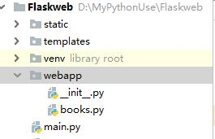
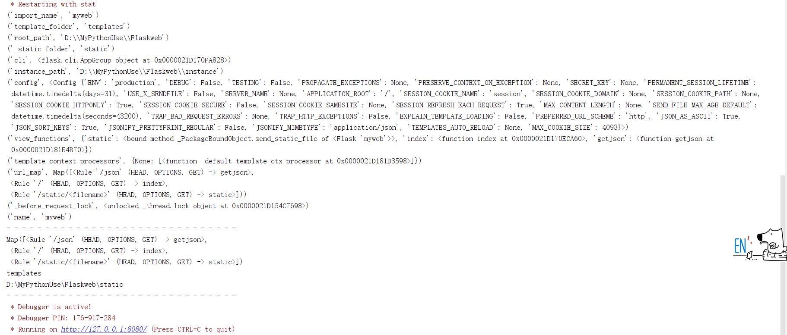

# Flask框架简单使用

[toc]

* 安装：`pip install flask`
* Flask快速入门：[http://docs.jinkan.org/docs/flask/quickstart.html#quickstart](http://docs.jinkan.org/docs/flask/quickstart.html#quickstart)

## 快速构建

1. 在项目根目录下构建：
    * webapp包目录，存放flask代码，包内有`__init__.py`文件
    * templates目录，存放模板文件
    * static目录，存放js,css等静态文件。其下建立js目录，放入jquery、echarts的js文件
    * app.py入口文件

* 基本组成
    1. 目录结构如下：
    

````python
# /webapp/__init__.py文件内容
from flask import Flask,jsonify

#创建应用
app = Flask("myweb")

#路由和视图函数
@app.route("/")
def index():
    return "hello flask"

@app.route("/json",methods=["GET"]) #列表中指定多个方法
def getjson():
    d = {"a":1,"b":2,"c":3}
    return jsonify(d) #Mime是application/json

#打印重要属性
print(*filter(lambda x: not x[0].startswith("__") and x[1],app.__dict__.items()),sep="\n")
print("- "*30)
print(app.url_map)
print(app.template_folder)
print(app.static_folder)
print("- "*30)
````

1. 应用：创建出来提供WEB服务的实例，也是wsgi的入口
2. 视图函数：执行内部代码输出响应的内容
3. 路由：通过route装饰器创建path到视图函数的映射关系

````python
#/main.py文件
from webapp import app

if __name__ == "__main__":
    app.run("127.0.0.1",port=8080,debug=True)
````

* 启动main.py文件


## 蓝图

Flask中，基本上都是route装饰器和视图函数的映射，如果函数很多，代码组织结构会非常乱。  
蓝图Blueprint,就是Flask中**模块化**技术

* 新建`/web/app/books.py`蓝图文件

````python
#/webapp/books.py文件

from flask import Blueprint,jsonify,render_template

bpbooks = Blueprint("booksapp",__name__,url_prefix="/books")
# bpbooks = Blueprint("booksapp",__name__)

@bpbooks.route("/",methods=["GET","POST"])
def getall():
    books = [
        (1,"java",20),
        (2,"python",40),
        (3,"linux",50)
    ]
    return jsonify(books)

# print("= "*30)
# for x in bpbooks.__dict__.items():
#     print(x)
````

* 修改`/webapp/__init__.py`文件如下：在app中注册新建的蓝图文件

````python
#/webapp/__init__.py
from flask import Flask,jsonify
from .books import bpbooks

#创建应用
app = Flask("myweb")

#路由和视图函数
@app.route("/")
def index():
    return "hello flask"

@app.route("/json",methods=["GET"]) #列表中指定多个方法
def getjson():
    d = {"a":1,"b":2,"c":3}
    return jsonify(d) #Mime是application/json

# 注册蓝图
# app.register_blueprint(bpbooks)
#如果在app中注册蓝图时，给定了url_prefix，那么蓝图内自定义的url_prefix将失效
app.register_blueprint(bpbooks,url_prefix="/bookss")

#打印重要属性
print(*filter(lambda x: not x[0].startswith("__") and x[1],app.__dict__.items()),sep="\n")
print("- "*30)
print(app.url_map)
print(app.template_folder)
print(app.static_folder)
print("- "*30)
````

* 注册完成后，启动`/main.py`文件

1. Blueprint构造参数
    * name,蓝图名称，注册在app的蓝图字典中用的key
    * import_name,用来计算蓝图模块所在路径，一般写`__name__`
    * root_path,指定蓝图模块所在路径，如果None，使用import_name计算得到
    * template_folder
    * url_prefix,指定本蓝图模块的路径前缀，app.register_blueprint注册蓝图时，也可以对当前蓝图指定url_prefix,将覆盖蓝图中的定义。

* 特别注意，输出的root_path路径，说明蓝图有自己一套路径。
* 最后app.register_blueprint(bpbooks,url_prefix="/bookss"),url_prefix一定要以`/`开始，否则报错，最后路径以注册的url_prefix为准

## 模板

Flask使用jinja2模板。  
对于应用app来说其模板是，根目录下的templates,其下新建index.html

* `/templates/index.html文件内容如下`

````html
<!DOCTYPE html>
<html lang="en">
<head>
    <meta charset="UTF-8">
    <title>xdd web</title>
</head>
<body>
<h2>欢迎使用flask框架</h2>
<hr>

{{x}}

</body>
</html>
````

* 修改`/webapp/__init__.py`文件中的index视图函数，使用模板渲染函数。

````python
from flask import Flask,jsonify,render_template

#创建应用
app = Flask("myweb")

#路由和视图函数
@app.route("/index.html")
def index():
    return render_template("index.html", userlist=[
        (1, "tom", 20),
        (1, "json", 30),
    ])
````

* jinja2和Django模板语法一致，这里不阐述
* 在app.jinja_loader属性中，有下面的语句

    ````python
    @locked_cached_property
    def jinja_loader(self):
        """The Jinja loader for this package bound object.

        .. versionadded:: 0.5
        """
        if self.template_folder is not None:
            return FileSystemLoader(os.path.join(self.root_path, self.template_folder))
    ````

    1. 说明：不管是app，还是bluepoint，都是使用自己的root_path和模板路径拼接成模板路径。
    2. 可以通过app或者bluepoint查看`app.jinja_loader.searchpath`模板搜索路径。


