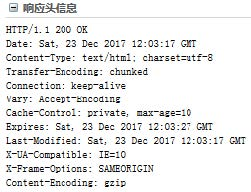

# WEB开发和WSGI

  

* CS即客户端、服务器编程。
    1. 客户端、服务端之间需要使用Socket，约定协议、版本(往往使用的协议是TCP或者UDP),指定地址和端口，就可以通信了。
    2. 客户端、服务端传输数据，数据可以有一定的格式，双方必须先约定好。

  

* BS编程，即Browser、Server开发
    1. Brower浏览器，一种特殊的客户端，支持HTTP(s)协议，能够通过URL向服务端发起请求，等待服务端返回HTML等数据，并在浏览器内可视化展示的程序。
    2. Server,支持HTTP(s)协议，能够接受众多客户端发起的HTTP协议请求，经过处理，将HTML等数据返回给浏览器。
* 本质上来说，BS是一种特殊的CS，即客户端必须是一种支持HTTP协议且能解析并渲染HTML的软件，服务端必须能够接收多客户端HTTP访问的服务器软件。
* HTTP协议底层基于TCP协议实现。

1. BS开发分为端开发
    * 客户端开发：或称前端开发。HTML、CSS、JavaScript等。
    * 服务端开发：Python有WSGI、Django、Flask、Tornado等。

## HTTP协议

### 安装httpd

* 可以安装httpd或nginx等服务端服务程序，通过浏览器访问，观察http协议

### 无状态，有链接和短连接

* **无状态**：指的是服务器无法知道2次请求之间的联系，即使是前后2次同一个浏览器也没有任何数据判断出时同一个浏览器的请求。后来可以通过cookie、session来判断。
* **有链接**：是因为它基于TCP协议，是面向链接的，需要3次握手、4次挥手。
* **短连接**：Http 1.1之前，都是一个请求一个连接，而TCP的链接创建销毁成本高，对服务器有很大影响。所以，自Http 1.1开始，支持keep-alive,默认也开启，一个连接打开后，会保持一段时间(可设置)，浏览器再访问该服务器就使用这个TCP链接，减轻了服务器压力，提高了效率。

### 协议

Http协议是无状态协议。  
同一个客户端的两次请求之间没有任何关系，从服务器端角度来说，它不知道这两个请求来自同一个客户端。

### URL组成

* URL可以说就是地址，uniform resource locator统一资源定位符，每一个连接指向一个资源供客户端访问。`schema://host[:port#]/path/.../[;url-params][?query-string][#anchor]`  

* 例如，通过`http://www.xdd.com/pathon/index.html?id=5&name=python`访问静态资源时，通过上面这个URL访问的是网站的某路径下的index.html文件，而这个文件对应磁盘上的真实的文件。就会从磁盘上读取这个文件，并把文件的内容发回浏览器端。

1. **scheme模式、协议**
    * http、ftp、https、mailto等等。
2. **host:port**
    * `www.xdd.com:80`,80端口是默认端口可以不写，域名会使用DNS解析，域名会解析成IP才能使用。实际上会对解析返回的IP的TCP的80端口发起访问。
3. **/path/to/resource**
    * path，指向资源的路径。
4. **?key1=value1&key2=value2**
    * query string,查询字符串，问号用来和路径分开，后面key=value形式，且使用&符号分割。

### HTTP消息

* **消息分为Request、Response**。
    1. Request:浏览器向服务器发起的请求
    2. Response:服务器对客户端请求的响应
        * 请求报文由Header消息报头、Body消息正文组成(可选)
            * 请求报文第一行称为请求行
        * 响应报文由Header消息报头、Body消息正文组成(可选)
            * 响应报头第一行称为状态行
        * 每一次使用回车和换行符作为结尾
        * 如果有Body部分，Header、Body之间留一行空行
* **请求报文**
    1. 请求消息行：请求放Method请求路径协议版本CRLF
      
    2. 请求方法Method

    |方法|说明|
    |:---------|:---------|
    |GET|请求获取URL对应的资源|
    |POST|请求数据至服务端|
    |HEAD|和GET类似，不过不返回响应报文的正文|

* **常见的消息传递方式**
    1. GET方法使用Query String。例如：`http://www.xdd.com/pathon/index.html?id=5&name=python&name=linux`通过查询字符串在URL中传递参数，而URL在请求报文的头部第一行
    2. POST方法提交数据

        ````txt
        请求消息如下
        POST /xxx/yyy?id=5&name=magedu HTTP/1.1
        HOST: 127.0.0.1:9999
        content-length: 26
        content-type: application/x-www-form-urlencoded

        age=5&weight=80&height=170
        ````  

        请求时提交的数据是在请求报文的正文Body部分。  
    3. URL中本身就包含信息
        `http://www.xdd.com/python/student/001`

* **响应报文**
    1. 响应消息行：协议版本 状态码 消息描述CRLF
      

* **status code状态码**
    1. 状态码在响应头第一行
        * `1xx` 提示信息，表示请求已被成功接收，继续处理
        * `2xx` 表示正常响应
            * `200` 表示返回了网页内容,即请求成功
        * `3xx` 重定向
            * `301` 页面永久性移走，永久重定向。返回新的URL，浏览器会根据返回的url发起新的request请求
            * `302` 临时重定向
            * `304` 资源未修改，浏览器使用本地缓存
        * `4xx` 客户端请求错误
            * `404` Not Found,问也找不到，客户端请求的资源有错
            * `400` 请求语法错误
            * `401` 请求要求身份验证
            8 `403` 服务器拒绝请求
        * `5xx` 服务器端错误
            * `500` 服务器内部错误
            * `502` 上游服务器错误，例如nginx反向代理的时候

### Cookie技术

* 键值对信息
* 是一种客户端、服务器端传递数据的技术
* 一般来说cookie信息时在服务器端生成，返回给浏览器端的
* 浏览器端可以保持这些值，浏览器对同一域发起每一请求时，都会吧Cookie信息发给服务器端
* 服务端收到浏览器端发过来的Cookie，处理这些信息，可以用来判断这次请求是否和之前的请求有关联  

曾经Cookie唯一在浏览器端存储数据的手段，目前浏览器端存储数据的方案很多，Cookie正在被淘汰。  
当服务器收到HTTP请求时，服务器可以在响应头里面添加一个Set-Cookie键值对。浏览器收到响应后通常会保存这些Cookie，之后对该服务器每一次请求中都通过Cookie请求头部将Cookie信息发送给服务器。  
另外，Cookie的过期时间、域、路径、有效期、适用站点都可以根据需要来指定。  
可以使用`Set－Cookie: NAME=VALUE；Expires=DATE；Path=PATH；Domain=DOMAIN_NAME；SECURE`  
例如：  

````txt
Set-Cookie:aliyungf_tc=AQAAAJDwJ3Bu8gkAHbrHb4zlNZGw4Y; Path=/; HttpOnly
set-cookie:test_cookie=CheckForPermission; expires=Tue, 19-Mar-2018 15:53:02 GMT; path=/;
domain=.doubleclick.net

Set-Cookie: BD_HOME=1; path=/
````


