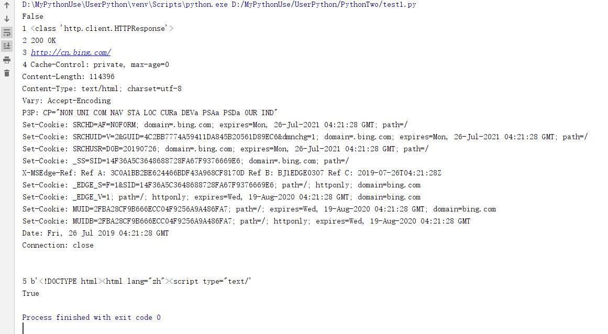
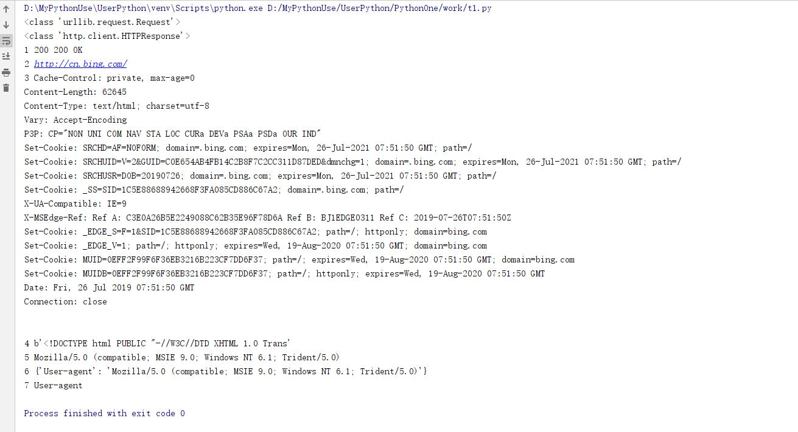
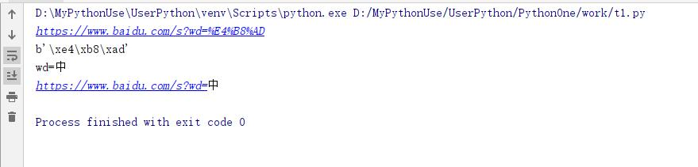
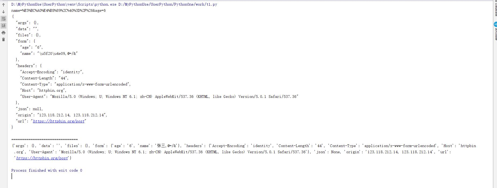
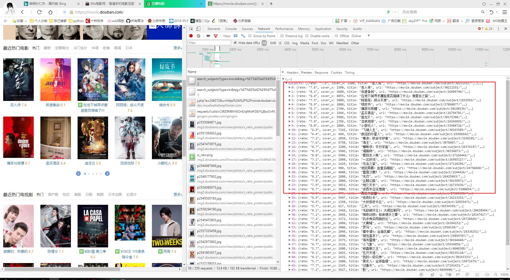
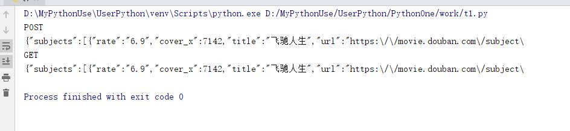
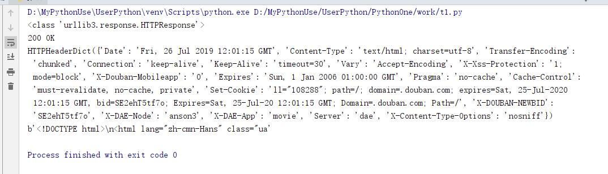
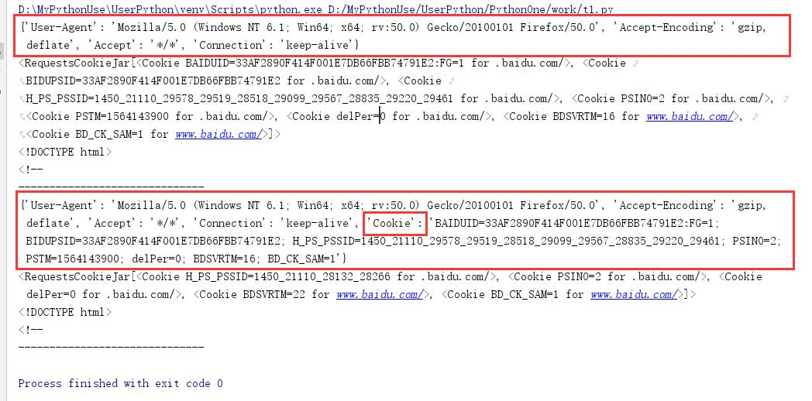

# 概述和HTTP请求与响应处理

## 概述

* 爬虫，应该称为网络爬虫，也叫网页蜘蛛、网络机器人、网络蚂蚁等。
* 搜索引擎，就是网络爬虫的应用者。
* 大数据时代的到来，所有企业都希望通过海量数据发现其中的价值。所以需要爬取对特定网站、特顶类别的数据，而搜索引擎不能提供这样的功能，因此需要自己开发爬虫来解决。

## 爬虫分类

### 1.通用爬虫

常见就是搜索引擎，无差别的搜集数据、存储、提取关键字、构建索引库，给用户提供搜索接口。  

* 爬取一般流程  
    1. 初始化一批URL,将这些URL放到带爬队列
    2. 从队列取出这些URL，通过DNS解析IP，对IP对应的站点下载HTML页面，保存到本地服务器中，爬取完的URL放到已爬取队列。
    3. 分析这些网页内容，找出网页里面的其他关心的URL链接，继续执行第2步，直到爬取条件结束。
* 搜索引擎如何获取一个网站的URL
    1. 新网站主动提交给搜索引擎
    2. 通过其他网站页面中设置的外链接
    3. 搜索引擎和DNS服务商合作，获取最新收录的网站

### 2. 聚焦爬虫

* 有针对性的编写特定领域数据的爬取程序，针对 某些类别数据采集的爬虫，是面向主题的爬虫

## Robots协议

指定一个robots.txt文件，告诉爬虫引擎什么可以爬取  

* `/`表示网站根目录，表示网站所有目录。
* `Allow`允许爬取的目录
* `Disallow`禁止爬取的目录
* 可以使用通配符  

robots是一个君子协定，"爬亦有道"  
这个协议为了让搜索引擎更有效率搜索自己内容，提供了Sitemap这样的文件。Sitemap往往是一个XML文件，提供了网站想让大家爬取的内容的更新信息。  
这个文件禁止爬取的往往又是可能我们感兴趣的内容，反而泄露了这些地址。

1. 示例：淘宝的robots[http://www.taobao.com/robots.txt](http://www.taobao.com/robots.txt)

    ````txt
    User-agent:  Baiduspider
    Allow:  /article
    Allow:  /oshtml
    Allow:  /ershou
    Allow: /$
    Disallow:  /product/
    Disallow:  /

    User-Agent:  Googlebot
    Allow:  /article
    Allow:  /oshtml
    Allow:  /product
    Allow:  /spu
    Allow:  /dianpu
    Allow:  /oversea
    Allow:  /list
    Allow:  /ershou
    Allow: /$
    Disallow:  /

    User-agent:  Bingbot
    Allow:  /article
    Allow:  /oshtml
    Allow:  /product
    Allow:  /spu
    Allow:  /dianpu
    Allow:  /oversea
    Allow:  /list
    Allow:  /ershou
    Allow: /$
    Disallow:  /

    User-Agent:  360Spider
    Allow:  /article
    Allow:  /oshtml
    Allow:  /ershou
    Disallow:  /

    User-Agent:  Yisouspider
    Allow:  /article
    Allow:  /oshtml
    Allow:  /ershou
    Disallow:  /

    User-Agent:  Sogouspider
    Allow:  /article
    Allow:  /oshtml
    Allow:  /product
    Allow:  /ershou
    Disallow:  /

    User-Agent:  Yahoo!  Slurp
    Allow:  /product
    Allow:  /spu
    Allow:  /dianpu
    Allow:  /oversea
    Allow:  /list
    Allow:  /ershou
    Allow: /$
    Disallow:  /

    User-Agent:  *
    Disallow:  /
    ````

2. 示例马蜂窝tobots[http://www.mafengwo.cn/robots.txt](http://www.mafengwo.cn/robots.txt)

    ````txt
    User-agent: *
    Disallow: /
    Disallow: /poi/detail.php

    Sitemap: http://www.mafengwo.cn/sitemapIndex.xml
    ````

## HTTP请求和响应处理

其实爬取网页就是通过HTTP协议访问网页，不过通过浏览器反问往往是人的行为，把这种行为变成使用程序来访问。  

### urllib包

urllib是标准库，它一个工具包模块，包含下面模块来处理url:
    * urllib.request 用于打开和读写url
    * urllib.error 包含了由urllib.request引起的异常
    * urllib.parse 用于解析url
    * urllib.robotparser 分析robots.txt文件  

Python2中提供了urllib和urllib2。urllib提供较为底层的接口，urllib2对urllib进行了进一步封装。Python3中将urllib合并到了urllib2中，并更名为标准库urllib包。  

### urllib.request模块

定义了在基本和摘要式身份验证、重定向、cookies等应用中打开Url(主要是HTTP)的函数和类。  

* **urlopen方法**
    1. `urlopen(url,data=None)`
        * url是链接地址字符串，或请求类的实例
        * data提交的数据，如果data为Non发起的**GET**请求，否则发起**POST**请求。见`urllib.request.Request#get_method`返回http.client.HTTPResponse类的相遇对象，这是一个类文件对象。

    ````python
    from urllib.request import urlopen

    # 打开一个url返回一个相应对象，类文件对象
    # 下面链接访问后会有跳转
    responses = urlopen("http://www.bing.com") #默认GET方法
    print(responses.closed)
    with responses:
        print(1, type(responses)) # http.client.HTTPResponse类文件对象
        print(2,responses.status,responses.reason) #状态
        print(3,responses.geturl()) #返回真正的URL
        print(4,responses.info()) #headers
        print(5,responses.read()[:50]) #读取返回的内容

    print(responses.closed)
    ````

      

    1. 上例，通过urllib.request.urlopen方法，发起一个HTTP的GET请求，WEB服务器返回了网页内容。响应的数据被封装到类文件对象中，可以通过read方法、readline方法、readlines方法获取数据，status和reason属性表示返回的状态码，info方法返回头信息，等等。

* **User-Agent问题**
    1. 上例代码非常精简，即可以获得网站的响应数据。但目前urlopen方法通过url字符串和data发起HTTP的请求。如果想修改HTTP头，例如useragent,就的借助其他方式。
        * 原码中构造的useragen如下：

        ````python
        # urllib.request.OpenerDirector
        class OpenerDirector:
            def __init__(self):
                client_version = "Python-urllib/%s" % __version__
                self.addheaders = [('User-agent', client_version)]
        ```
        * 当前显示为Python-urlib/3.7
        * 有些网站是反爬虫的，所以要把爬虫伪装成浏览器。顺便打开一个浏览器，复制李立群的UA值，用来伪装。

* **Request类**  
`Request(url,data=None,headers={})`  
初始化方法，构造一个请求对象。可添加一个header的字典。data参数决定是GET还是POST请求。  
`obj.add_header(key,val)`为header增加一个键值对。

````python
from urllib.request import Request,urlopen
import random

# 打开一个url返回一个Request请求对象
# url = "https://movie.douban.com/" #注意尾部的斜杠一定要有
url = "http://www.bing.com/"

ua_list = [
    "Mozilla/5.0 (Windows NT 6.1; Win64; x64) AppleWebKit/537.36 (KHTML, like Gecko) Chrome/57.0.2987.133 Safari/537.36", # chrome
    "Mozilla/5.0 (Windows; U; Windows NT 6.1; zh-CN) AppleWebKit/537.36 (KHTML, like Gecko) Version/5.0.1 Safari/537.36", # safafi
    "Mozilla/5.0 (Windows NT 6.1; Win64; x64; rv:50.0) Gecko/20100101 Firefox/50.0", # Firefox
    "Mozilla/5.0 (compatible; MSIE 9.0; Windows NT 6.1; Trident/5.0)" # IE
]

ua = random.choice(ua_list)
request = Request(url)
request.add_header("User-Agent",ua)
print(type(request))

response = urlopen(request,timeout=20) #request对象或者url都可以
print(type(response))

with response:
    print(1,response.status,response.getcode(),response.reason) #状态，getcode本质上就是返回status
    print(2,response.geturl()) #返回数据的url。如果重定向，这个url和原始url不一样
    # 例如：原始url是http://www.bing.com/,返回http://cn.bing.com/
    print(3,response.info()) #返回响应头headers
    print(4,response.read()[:50]) #读取返回的内容

print(5,request.get_header("User-agent"))
print(6,request.headers)
print(7,"user-agent".capitalize())
````

  

### urllib.parse模块

该模块可以完成对url的编解码  

1. parse.urlencode({key:value}) #对查询字符串进行编码

````python
from urllib import parse

u = parse.urlencode({
    "url":"http://www.xdd.com/python",
    "p_url":"http://www.xdd.com/python?id=1&name=张三"
})
print(u)

# 运行结果
url=http%3A%2F%2Fwww.xdd.com%2Fpython&p_url=http%3A%2F%2Fwww.xdd.com%2Fpython%3Fid%3D1%26name%3D%E5%BC%A0%E4%B8%89
````  

从运行结果来看冒号、斜杠、&、等号、问号等符号全部被编码了，%之后实际上是单字节十六进制表示的值。  
一般来说url中的地址部分，一般不需要使用中文路径，但是参数部分，不管GET还是POST方法，提交的数据中， 可能有斜杆、等号、问号等符号，这样这些字符表示数据，不表示元字符。如果直接发给服务器端，就会导致接收 方无法判断谁是元字符，谁是数据了。为了安全，一般会将数据部分的字符做url编码，这样就不会有歧义了。 后来可以传送中文，同样会做编码，一般先按照字符集的encoding要求转换成字节序列，每一个字节对应的十六 进制字符串前加上百分号即可。

````python
from urllib import parse

u = parse.urlencode({"wd":"中"}) #编码查询字符串
url= "https://www.baidu.com/s?{}".format(u)
print(url)

print("中".encode("utf-8")) # b'xe4\xb8\xad'
print(parse.unquote(u)) #解码
print(parse.unquote(url))
````

  

## 提交方法method

* 常用的HTTP交互数据的方法是GET、POST
    1. GET方法，数据是通过URL传递的，也就是说数据是在HTTP报文的header部分。
    2. POST方法，数据是放在HTTP报文的body部分提交的。
    3. 数据是键值对形式，多个参数质检使用&符号链接。例如a=1&b=abc

### GET方法

* 链接`必应`搜索引擎官网，获取一个搜索的URL`http://cn.bing.com/search?q=神探狄仁杰`

````python
from urllib.request import urlopen,Request
from urllib.parse import urlencode

data = urlencode({"q":"神探狄仁杰"})
base_url = "http://cn.bing.com/search"
url = "{}?{}".format(base_url,data)
safafi = "Mozilla/5.0 (Windows; U; Windows NT 6.1; zh-CN) AppleWebKit/537.36 (KHTML, like Gecko) Version/5.0.1 Safari/537.36" # safafi

request = Request(url,headers={"User-agent":safafi})
repost = urlopen(request)
with repost:
    with open("d:/abc.html","wb") as f:
        f.write(repost.read())
print("ok")
````

### POST方法

* [http://httpbin.org/](http://httpbin.org/)测试网站

````python
from urllib.request import Request,urlopen
from urllib.parse import urlencode
import simplejson

request = Request("http://httpbin.org/post")
request.add_header("User-agent","Mozilla/5.0 (Windows; U; Windows NT 6.1; zh-CN) AppleWebKit/537.36 (KHTML, like Gecko) Version/5.0.1 Safari/537.36")
data = urlencode({"name":"张三,@=/&","age":"6"})
print(data)

res = urlopen(request,data.encode()) #POST方法，Form提价数据，如果Data的值不是None就使用Post方法，否则Get方法
with res:
    j = res.read().decode() #json
    print(j)
    print("===============================")
    print(simplejson.loads(j))
````

  

### 处理JSON数据

  

* 查看“豆瓣电影”,中的热门电影，通过分析，我们知道这部分内容，是通过AJAX从后台拿到的JSON数据。
* 访问URL是`https://movie.douban.com/j/search_subjects?type=movie&tag=%E7%83%AD%E9%97%A8&page_limit=50&page_start=0`
    1. `%E7%83%AD%E9%97%A8`是utf-8编码的中文"热门"
    2. tag 标签"热门"，表示热门电影
    3. type 数据类型，movie是电影
    4. page_limit表示返回数据的总数
    5. page_start 表示数据偏移
* 服务器返回json数据如下：(轮播组件，共50条数据)
  

````python
from urllib.request import Request,urlopen
from urllib.parse import urlencode

base_url = "https://movie.douban.com/j/search_subjects"
data = urlencode({
    "tag":"热门",
    "type":"movie",
    "page_limit":10,
    "page_start":10
})
request = Request(base_url)

# POST方法
repost = urlopen(request,data=data.encode())
with repost:
    print(repost._method)
    print(repost.read().decode()[:100])

# GET方法
with urlopen("{}?{}".format(base_url,data)) as res:
    print(res._method)
    print(res.read().decode()[:100])
````

  

## HTTPS证书忽略

* HTTPS使用SSL安全套层协议，在传输层对网络数据进行加密。HTTPS使用的时候需要证书，而证书需要CA认证。
* CA(Certificate Authority)是数字证书认证中心的简称，是指发放、管理、废除数字证书的机构。
* CA是受信任的第三方，有CA签发的证书具有可信任。如果用户由于信任了CA签发的证书导致的损失，可以追究CA的法律责任。
* CA是层级结构，下级CA信任上级CA,且有上级CA颁发给下级CA证书并认证。
* 一些网站，例如淘宝，使用HTTPS加密数据更加安全。

* 以前旧版本12306网站需要下载证书

````python
from urllib.request import Request,urlopen

# request = Request("http://www.12306.cn/mormhweb/") #可以访问
# request = Request("https://www.baidu.com/") #可以访问

request = Request("https://www.12306.cn/mormhweb/") #旧版本报SSL认证异常
request.add_header(
    "User-agent",
    "Mozilla/5.0 (Windows; U; Windows NT 6.1; zh-CN) AppleWebKit/537.36 (KHTML, like Gecko) Version/5.0.1 Safari/537.36"
)

# ssl.CertificateError: hostname 'www.12306.cn' doesn't match either of ......
with urlopen(request) as res:
    print(res._method)
    print(res.read())
````

* 注意：一下说明都是针对旧版本的12306网站，来讲解，现在实在无法找打第二个自己给自己发证书的。
* 通过HTTPS访问12306的时候，失败的原因在于12306的证书未通过CA认证，它是自己生产的证书，不可信。而其它网站访问，如`https://www.baidu.com/`并没有提示的原因，它的证书的发行者受信任，且早就存储在当前系统中。
* 遇到这种问题，解决思路：忽略证书不安全信息

````python
from urllib.request import Request,urlopen
import ssl #导入ssl模块


# request = Request("http://www.12306.cn/mormhweb/") #可以访问
# request = Request("https://www.baidu.com/") #可以访问

request = Request("https://www.12306.cn/mormhweb/") #旧版本报SSL认证异常
request.add_header(
    "User-agent",
    "Mozilla/5.0 (Windows; U; Windows NT 6.1; zh-CN) AppleWebKit/537.36 (KHTML, like Gecko) Version/5.0.1 Safari/537.36"
)

# 忽略不信任的证书
context = ssl._create_unverified_context()
res = urlopen(request,context=context)

# ssl.CertificateError: hostname 'www.12306.cn' doesn't match either of ......
with res:
    print(res._method)
    print(res.geturl())
    print(res.read().decode())
````

## urllib3库

[https://urllib3.readthedocs.io/en/latest/](https://urllib3.readthedocs.io/en/latest/)  
标准库urlib缺少了一些关键的功能，非标准库的第三方库urllib3提供了，比如说连接池管理。

* 安装 `pip install urlib3`

````python
import urllib3
from urllib3.response import HTTPResponse

url = "https://movie.douban.com"
ua = "Mozilla/5.0 (Windows; U; Windows NT 6.1; zh-CN) AppleWebKit/537.36 (KHTML, like Gecko) Version/5.0.1 Safari/537.36"

# 链接池管理
with urllib3.PoolManager() as http:
    response:HTTPResponse = http.request("GET",url,headers={"User-Agent":ua})
    print(type(response))
    print(response.status,response.reason)
    print(response.headers)
    print(response.data[:50])
````

  

## requests库

* requests使用了urllib3,但是API更加友好，推荐使用。
* 安装`pip install requests`

````python
import requests

ua = "Mozilla/5.0 (Windows NT 6.1; Win64; x64) AppleWebKit/537.36 (KHTML, like Gecko) Chrome/57.0.2987.133 Safari/537.36"
url = "https://movie.douban.com/"

response = requests.request("GET",url,headers={"User-Agent":ua})

with response:
    print(type(response))
    print(response.url)
    print(response.status_code)
    print(response.request.headers) #请求头
    print(response.headers) #响应头
    response.encoding = "utf-8"
    print(response.text[:200]) #HTML的内容
    with open('d:/movie.html',"w",encoding='utf-8') as f:
        f.write(response.text)
````

* requests默认使用Session对象，是为了多次和服务器端交互中保留会话的信息，例如：cookie。

````python
#直接使用Session
import requests

ua = "Mozilla/5.0 (Windows NT 6.1; Win64; x64; rv:50.0) Gecko/20100101 Firefox/50.0"
urls = ["https://www.baidu.com/s?wd=xdd","https://www.baidu.com/s?wd=xdd"]

session = requests.Session()
with session:
    for url in urls:
        response = session.get(url,headers = {"User-Agent":ua})
        # response = requests.request("GET",url,headers={"User-Agent":ua}) #观察两种方式区别
        with response:
            print(response.request.headers) #请求头
            print(response.cookies) #响应的cookie
            print(response.text[:20]) #HTML的内容
            print("-"*30)
````

* 使用session访问，第二次带上了cookie

  


