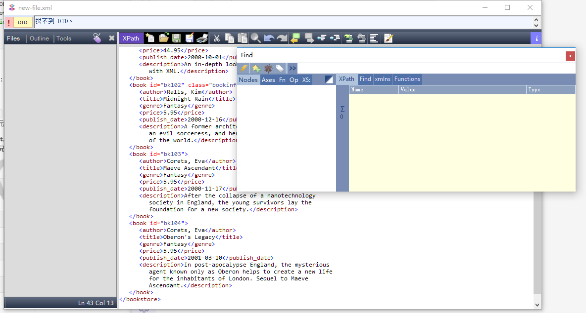
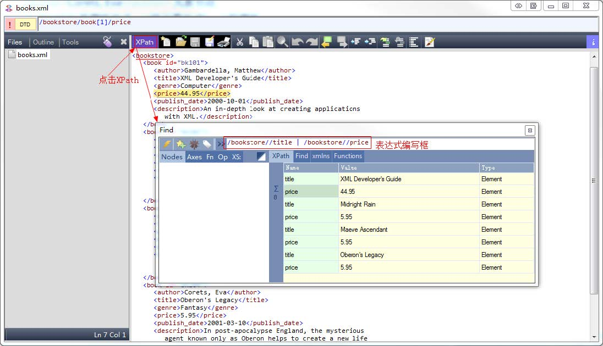
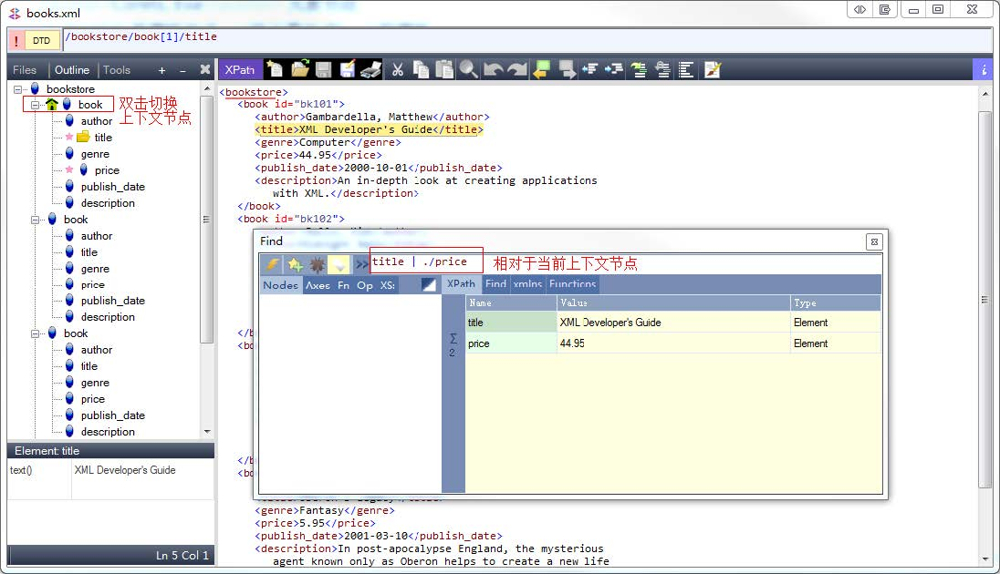
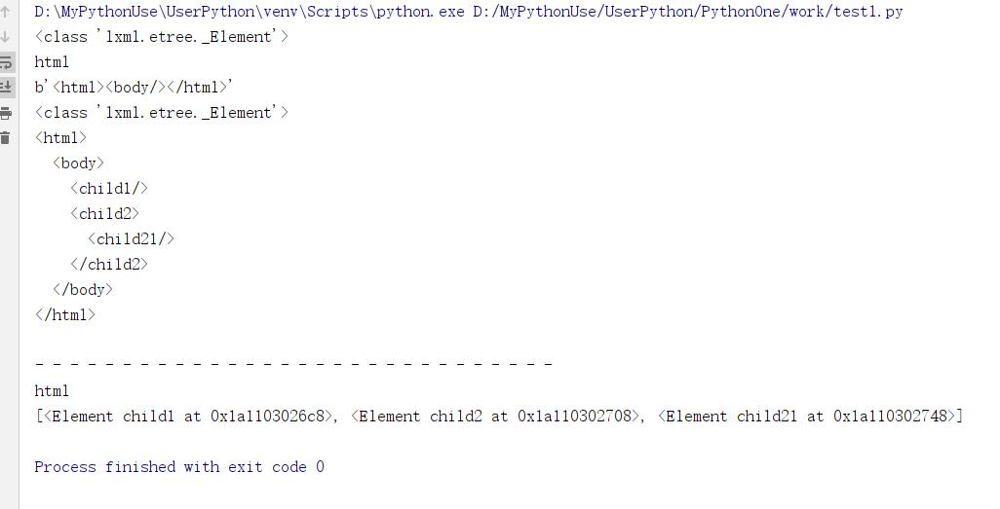
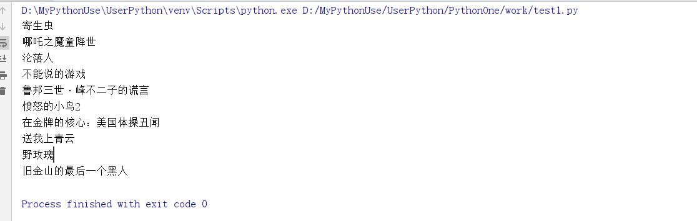

# HTML解析-Xpath

[toc]

HTML的内容返回给浏览器，浏览器就会解析它，并对它渲染。  

HTML超文本表示语言，设计的初衷就是为了超越普通文本，让文本表现力更强。  
XML扩展标记语言，不是为了替代HTML，而是觉得HTML的设计中包含了过多的格式，承担了一部分数据之外的任务，所以才设计了XML只用来描述数据。  

HTML和XML都有结构，使用标记形成树型的嵌套结构。DOM(Document Object Model)来解析这种嵌套树型结构，浏览器往往都提供了对DOM操作的API，可以用面向对象的方式来操作DOM。  

## XPath

* [http://www.w3school.com.cn/xpath/index.asp](http://www.w3school.com.cn/xpath/index.asp)中文教程
* XPath是一门在XML文档中查找信息的语言。XPath可用来在XML文档中对元素和属性进行遍历。

* 测试工具：XMLQuire win7+需要.net框架4.0-4.5。
* 测试XML、XPath

    1. 测试文档  

        ````xml
        <?xml version="1.0" encoding="utf-8"?>
        <bookstore>
        <book id="bk101">
            <author>Gambardella, Matthew</author>
            <title>XML Developer's Guide</title>
            <genre>Computer</genre>
            <price>44.95</price>
            <publish_date>2000-10-01</publish_date>
            <description>An in-depth look at creating applications 
            with XML.</description>
        </book>
        <book id="bk102" class="bookinfo even">
            <author>Ralls, Kim</author>
            <title>Midnight Rain</title>
            <genre>Fantasy</genre>
            <price>5.95</price>
            <publish_date>2000-12-16</publish_date>
            <description>A former architect battles corporate zombies, 
            an evil sorceress, and her own childhood to become queen 
            of the world.</description>
        </book>
        <book id="bk103">
            <author>Corets, Eva</author>
            <title>Maeve Ascendant</title>
            <genre>Fantasy</genre>
            <price>5.95</price>
            <publish_date>2000-11-17</publish_date>
            <description>After the collapse of a nanotechnology 
            society in England, the young survivors lay the 
            foundation for a new society.</description>
        </book>
        <book id="bk104">
            <author>Corets, Eva</author>
            <title>Oberon's Legacy</title>
            <genre>Fantasy</genre>
            <price>5.95</price>
            <publish_date>2001-03-10</publish_date>
            <description>In post-apocalypse England, the mysterious 
            agent known only as Oberon helps to create a new life 
            for the inhabitants of London. Sequel to Maeve 
            Ascendant.</description>
        </book>
        </bookstore>
        ````

    2. 测试工具:XMLQuire win7+需要.NET框架4.0-4.5。  
      

### 节点

* 在XPath中，有七种类型的节点：**元素、属性、文本、命名空间、处理指令、注释以及文档(根)节点。**
    1. `/`根节点
    2. `<bookstore>`元素节点
    3. `<author>Corets,Eva</author>`元素节点。
    4. `id="bk104"`是属性节点，id是元素节点book的属性
* 节点之间的嵌套形成**父子(parent,children)关系**。
* 具有统一个父结点的不同节点是**兄弟(sibling)关系**。  

* **节点选择**

|操作符或表达式|含义|
|:------------|:------|
|`/`|从根节点开始找|
|`//`|从当前节点开始的任意层找|
|`.`|当前节点|
|`..`|当前结点的父节点|
|`@`|选择属性|
|`节点名`|选取所有这个节点名的节点|
|`*`|匹配任意元素节点|
|`@*`|匹配任意属性节点|
|`node()`|匹配任意类型的节点|
|`text()`|匹配text类型节点|

* **谓语(Predicates)**

1. 谓语用来查找某个特定的节点或者包含某个指定的值的节点。
2. **谓语被嵌在方括号中**。
3. 谓语就是查询的条件。
4. 即在路径选择时，在中括号内指定查询条件。  

* **XPath轴(Axes)**

1. 轴的意思是相对于当前结点的节点集

|轴名称|结果|
|:--------|:----------|
|ancestor|选取当前结点的所有先辈(父、祖父等)|
|ancestor-or-self|选取当前节点的所有先辈(父、祖父等)以及当前节点本身|
|attribute|选取当前节点的所有属性。@id等价于attribute::id|
|child|选取当前节点的所有子元素，title等价于child:title|
|descendant|选取当前节点的所有后代元素(子、孙等)|
|descendant-or-self|选取当前节点的所有后代运算(子、孙等)以及当前节点本身|
|following|选取文档中当前节点的结束标签之后的所有结点|
|namespace|选取当前节点的所有命名空间节点|
|parent|选取当前节点的父节点|
|preceding|选取当前节点的父节点|
|preceding-sibling|选取当前节点之前的所有同级节点|
|self|选取当前节点。等驾驭self::node()|

* **步Step**

1. 步的语法`轴名称：节点测试[谓语]`

|例子|结果|
|:-----|:----|
|`child::book`|选取所有属于当前节点的只元素的book节点|
|`attribute::lang`|选取当前节点的lang属性|
|`child::*`|选取当前节点的所有只元素|
|`attribute::*`|选取当前节点的所有属性|
|`child::text()`|选取当前节点的所有文本子节点|
|`child::node()`|选取当前节点的所有子节点|
|`descendant::book`|选取当前节点的所有book后代|
|`ancestor:book`|选择当前节点的所有book先辈|
|`ancestor-or-self::book`|选取当前节点的所有book先辈以及当前节点(如果此节点是book节点)
|`child::*/child::price`|选取当前节点的所有price孙节点|

  

  

* **XPATH示例**

1. 以斜杠开始的称为绝对路径，表示从根开始。
2. 不以斜杠开始的称为相对路径，一般都是依照当前节点来计算。当前节点在上下文环境中，当前节点很可能已经补是根节点了。
3. 一般为了方便，往往xml如果层次很深，都会使用`//`来查找节点。

|路径表达式|含义|
|:---------------|:---------------|
|`title`|选取当前节点下所有title子节点|
|`/book`|从根节点找子节点是book的，找不到|
|`book/title`|当前节点下所有子节点book下的title节点|
|`//title`|从根节点向下找任意层中title的结点|
|`book//title`|当前节点下所有book子节点下任意层次的title节点|
|`//@id`|任意层次下含有id的**属性，取回的是属性**|
|`//book[@id]`|任意层次下含有id属性的book节点|
|`//*[@id]`|任意层下含有id属性的节点|
|`//book[@id="bk102"]`|任意层次下book节点，且含有id属性为bk102的节点。|
|`/bookstore/book[1]`|根节点bookstore下第一个book节点，**从1开始**|
|`/bookstore/book[1]/@id`|根节点bookstore下的第一个book节点的id属性|
|`/bookstore/book[last()-1]`|根节点bookstore下**倒数**第二个book节点,<br/>函数last()返回最后一个元素索引|
|`/bookstore/*`|匹配根节点bookstore的所有子节点，不递归|
|`//*`|匹配所有子孙节点|
|`//*[@*]`|匹配所有有属性的节点|
|`//book/title | //price`|匹配任意层下的book下节点是title节点，或者任意层下的price|
|`//book[position()=2]`|匹配book节点，取第二个
|`//book[position()<last()-1]`|匹配book节点，取位置小于倒数第二个|
|`//book[price>40]`|匹配book节点，取**节点值**大于40的book节点|
|`//book[2]/node()`|匹配位置为2的book节点下的所有类型的节点|
|`//book[1]/text()`|匹配第一个book节点下的所有文本子节点|
|`//book[1]/text()`|匹配第一个book节点下的所有文本节点|
|`//*[local-name()="book"]`|匹配所有节点且不带限定名的节点名称为book的所有节点。<br/>local-name函数取不带限定名的名称。相当于指定**标签元素**为<book>...</book>的节点|
|下面这三种表达式等价<br/>`//book[price<6]/price`<br/>`//book/price[text()<6]`<br/>`//book/child::node()[local-name()="price" and text()<6]`|获取book节点下的price节点，且price中内容小于6的节点|
|`//book//*[self::title or self::price]`<br/>等价于`//book//title | //book/price`<br/>也等价于`//book//*[local-name()="title" or local-name()="price"]`|所有book节点下子孙节点，且这些节点是title或者price。|
|`//*[@class]`|所有有class属性的节点|
|`//*[@class="bookinfo even"]`|所有属性为“bookinfo even”的节点|
|`//*[contains(@class,'even')`|获取所有属性class中包含even字符串的节点|
|`//*[contains(local-name(),'book')`|标签名包含book的节点|

* 函数总结

|函数|含义|
|:----------|:----------|
|`local-name()`|获取不带限定名的名称。相当于指定**标签元素**|
|`text()`|获取标签之间的文本内容|
|`node()`|所有节点。|
|`contains(@class,str)`|包含|
|`starts-with(local-name(),"book")`|以book开头|
|`last()`|最后一个元素索引|
|`position()`|元素索引|

## lxml

* lxml是Python下功能丰富的XML、HTML解析库，性能非常好，是对libxml2和libxslt的封装。
* 最新版本支持Python 2.6+,python3支持3.6.

1. 在CentOS编译安装需要

> #yum install libxml2-devel libxslt-devel

* 注意,不同平台不一样，参看[https://lxml.de/installation.html](https://lxml.de/installation.html)

* lxml安装`$ pip install lxml`

````python
from lxml import etree

# 使用etree构建HTML
root = etree.Element("html")
print(type(root))
print(root.tag)

body = etree.Element("body")
root.append(body)
print(etree.tostring(root))

#增加子节点
sub = etree.SubElement(body,"child1")
print(type(sub))
sub = etree.SubElement(body,"child2").append(etree.Element("child21"))
html = etree.tostring(root,pretty_print=True).decode()
print(html)
print("- "*30)

r = etree.HTML(html) #返回根节点
print(r.tag)
print(r.xpath("//*[contains(local-name(),'child')]"))
````

  

1. etree还提供了2个有用的函数
2. etree.HTML(text)解析HTML文档，返回根节点
3. **anode.xpath('xpath路径')对节点使用xpath语法**

* **练习：爬取“口碑榜”**
    1. 从豆瓣电影中获取"本周口碑榜"

````python
from lxml import etree
import requests

url = "https://movie.douban.com/"
ua = "Mozilla/5.0 (Windows; U; Windows NT 6.1; zh-CN) AppleWebKit/537.36 (KHTML, like Gecko) Version/5.0.1 Safari/537.36"

with requests.get(url,headers={"User-agent":ua}) as response:
    if response.status_code==200:
        content = response.text #html内容
        html = etree.HTML(content) #分析html，返回DOM根节点
        titles = html.xpath("//div[@class='billboard-bd']//tr/td/a/text()") #返回文本列表
        for i in titles: #豆瓣电影之本周排行榜
            print(i)
    else:
        print("访问错误")
````

  
