# BeautifulSoup4和JsonPath

[toc]

## BeautifulSoup4

* BeautifulSoup可以从HTML、XML中提取数据，目前BS4在持续开发。
* 官方中文文档[https://www.crummy.com/software/BeautifulSoup/bs4/doc.zh/](https://www.crummy.com/software/BeautifulSoup/bs4/doc.zh/)  

* **安装**
    1. `pip install beautifulsoup4`
* 导入：`from bs4 import BuautifulSoup`
* 初始化：
    1. BeautifulSoup(markup="",features=None)
        * markup,被解析对象，可以是文件对象或者html字符串
        * feature指定解析器
        * return:返回一个文档对象

````python
from bs4 import BeautifulSoup

#文件对象
soup = BeautifulSoup(open("test.html"))
# 标记字符串
soup = BeautifulSoup("<html>data</html>")
````

* 可以不指定解析器，就依赖系统已经安装的解析器库了。

|解析器|使用方法|优势|劣势|
|:-----|:-----|:----|:-----|
|Python标准库|BeautifulSoup(markup,"html.parser")|Python的内置标准库<br/>执行速度适中<br/>文档容错能力强|Python 2.7.3、3.2.2前 的版本中文档容错能力差|
|lxml HTML 解析器|BeautifulSoup(markup,"lxml")|速度快<br/>文档容错能力强|需要安装C语言库|
|lxml XML 解析器|BeautifulSoup(markup,["lxml","xml"])<br/>BeautifulSoup(markup,"xml")|速度快<br/>唯一支持XML的解析器|需要安装C语言库|
|html5lib|BeautifulSoup(markup,"html5lib")|最好的容错性<br/>以浏览器的方式解析文档<br/>生成HTML5格式的文档|速度慢<br/>不依赖外部扩展|

* BeautifulSoup(markup,"html.parser")使用Python标准库，容错差且性能一般。
* BeautifulSoup(markup,"lxml")容错能力强，速度快。需要安装系统C库。
* 推荐使用lxml作为解析器，效率高。
* 需要手动指定解析器，以保证代码在所有运行环境中解析器一致。

1. 使用下面内容构建test.html使用bs4解析它

````html
<!DOCTYPE html>
<html lang="en">
<head>
    <meta charset="UTF-8">
    <title>首页</title>
</head>
<body>
<h1>xdd欢迎您</h1>
<div id="main">
    <h3 class="title highlight"><a href="http://www.python.org">python</a>高级班</h3>
    <div class="content">
        <p id="first">字典</p>
        <p id="second">列表</p>
        <input type="hidden" name="_csrf" value="absdoia23lkso234r23oslfn">
        <!-- comment -->
        
        
    </div>
</div>
<p>bottom</p>
</body>
````

* **四种对象**

1. BeautifulSoup将HTML文档解析成复杂的树型结构，每个节点都是Python的对象，可分为4种：
    * BeautifulSoup、Tag、NavigableString、Comment
    1. **BeautifulSoup对象**：代表整个文档。
    2. **Tag对象**：对应着HTML中的标签。有2个常用的属性：
        1. name:Tag对象的名称，就是标签名称
        2. attrs:标签的属性字典
            * 多值属性，对于class属性可能是下面的形式，`<h3 class="title highlight">python高级班</h3>`这个属性就是多值({"class":["title","highlight"]})
            * 属性可以被修改、删除

* BeautifulSoup.prettify() #带格式输出解析的文档对象(即有缩进的输出)，注意：直接输出BeautifulSoup会直接输出解析的文档对象，没有格式。
* BeautifulSoup.div #输出匹配到的第一个div对象中的内容，返回对象是bs4.element.Tag类型
* BeautifulSoup.h3.get("class") #获取文档中第一个标签为h3对象中class属性值

````python
from bs4 import BeautifulSoup

with open("d://xdd.html",encoding="utf-8") as f:
    soup = BeautifulSoup(f,"lxml")
    print(soup.builder)
    # print(0,soup) #输出整个解析的文档对象(不带格式）
    # print(1,soup.prettify()) #按照格式输出文档内容
    print("- "*30)
    # print(2,soup.div,type(soup.div)) #类型bs4.element.Tag，Tag对象
    # print(3,soup.div["class"]) #会报错，keyError，div没有class属性
    print(3,soup.div.get("class")) #获取div的class属性，没有返回None

    print(4,soup.div.h3["class"]) #多值属性
    print(4,soup.h3.get("class")) #多值属性,获取文档中第一h3标签中的class属性
    print(4,soup.h3.attrs.get("class")) #多值属性

    print(5,soup.img.get("src")) #获取img中src属性值
    soup.img["src"] = "http://www.xddupdate.com" #修改值
    print(5,soup.img["src"])

    print(6,soup.a) #找不到返回None
    del soup.h3["class"] #删除属性
    print(4,soup.h3.get("class"))
````

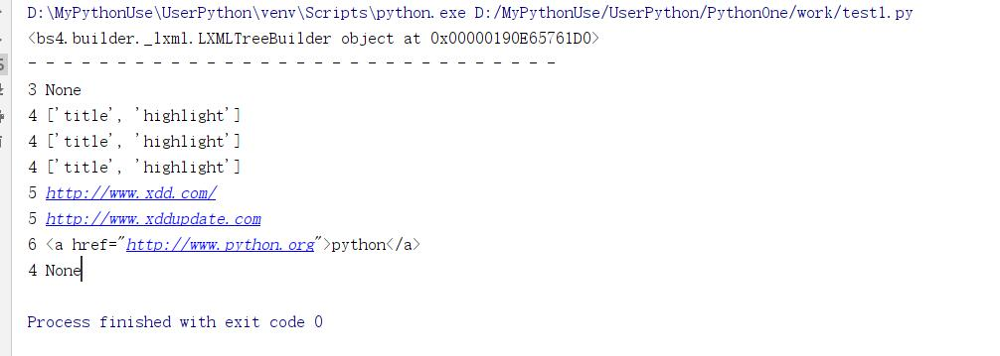  

* 注意：我们一般不使用声明这种方式来操作HTML，此代码时为了熟悉对象类型

* **NavigableString**

1. 如果只想输出标记的文本，而不关心标记的话，就要使用NavigableString.

````python
print(soup.div.p.string) #第一个div下第一个p的字符串
print(soup.p.string) #同上
````

* **注释对象**：这就是HTML中的注释，它被BeautifulSoup解析后对应Comment对象。

### 遍历文档树

* 在文档树中找到关心的内容才是日常的工资，也就是说如何遍历树中的节点。使用上面的test.html来测试

1. **使用Tag**
    * soup.div可以找到从根节点开始查找第一个div节点,返回一个Tag对象
    * soup.div.p说明从根节点开始找到第一个div后返回一个Tag对象，这个Tag对象下继续找第一个p，找到返回Tag对象
    * soup.p返回了文字“字典”，而不是文字“bottom"说明遍历时**深度优先**，返回也是Tag对象
2. **遍历直接子节点**
    * Tag.contents #将对象的所有类型直接子节点以列表方式输出
    * Tag.children #返回子节点的迭代器
        * Tag.children #等价于Tag.contents
3. **遍历所有子孙节点**
    * Tag.descendants #返回节点的所有类型子孙节点，可以看出迭代次序是深度优先

    ````python
    from bs4 import BeautifulSoup
    from bs4.element import Tag

    with open("d://xdd.html",encoding="utf-8") as f:
        soup = BeautifulSoup(f,"lxml")
        print(soup.p.string)
        print(soup.div.contents) #直接子标签列表
        print("- "*30)

        for i in soup.div.children: #直接子标签可迭代对象
            print(i.name)
        print("- "*30)
        print(list(map(
            lambda x:x.name if x.name else x,
            soup.div.descendants #所有子孙
        )))
    ````

    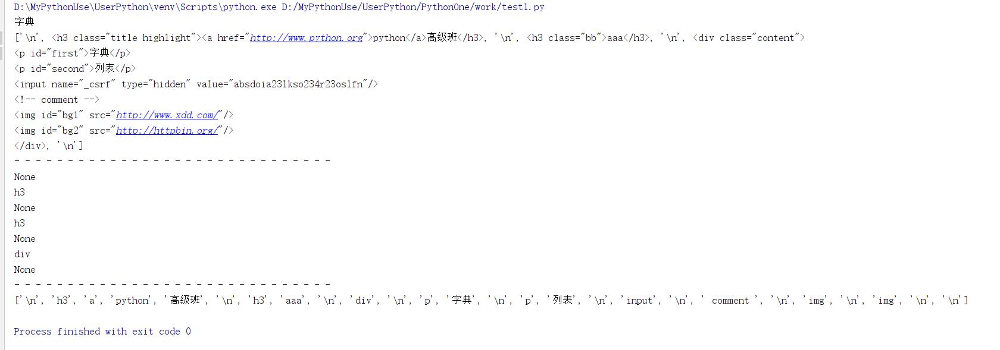  
4. **遍历字符串**
    * 在前面的例子中，soup.div.string返回None，是因为string要求soup.div只能有一个NavigableString类型子节点，也就是这样`<div>only string</div>`。
    * Tag.string #获取Tag下的string对象，如果多余1个结点返回None
    * Tag.strings #返回迭代器，带多余的空白字符。所有的string对象
    * Tag.stripped_strings #返回，会去除多余空白字符

    ````python
    from bs4 import BeautifulSoup
    from bs4.element import Tag

    with open("d://xdd.html",encoding="utf-8") as f:
        soup = BeautifulSoup(f,"lxml")
        print(soup.div.string) #返回None，因为多余1个子节点
        print("- "*30)
        print("".join(soup.div.strings).strip()) #返回迭代器，带多余的空白字符
        print("- "*30)
        print("".join(soup.div.stripped_strings)) #返回迭代器，去除多余空白字符
    ````

    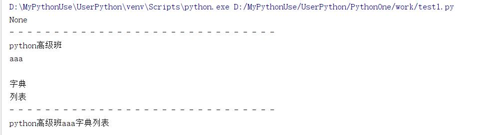
5. **遍历祖先节点**
    * BeautifulSoup.parent #获取根节点的父结点，必定返回None,根节点没有父结点
    * Tag.parent #获取第一个Tag的父结点
    * Tag.parent.parent.get("id") #获取第一个tag的父结点的父结点的id属性
    * Tag.parents #获取Tag节点的所有父结点，由近及远

    ````python
    from bs4 import BeautifulSoup
    from bs4.element import Tag

    with open("d://xdd.html",encoding="utf-8") as f:
        soup = BeautifulSoup(f,"lxml")
        print(type(soup))
        print(soup.parent)
        print(soup.div.parent.name) #body ,第一个div的父节点
        print(soup.p.parent.parent.get("id")) #取id属性， main
        print("- "*30)
        print(list(map(lambda x:x.name,soup.p.parents))) #父迭代器，由近及远
    ````

    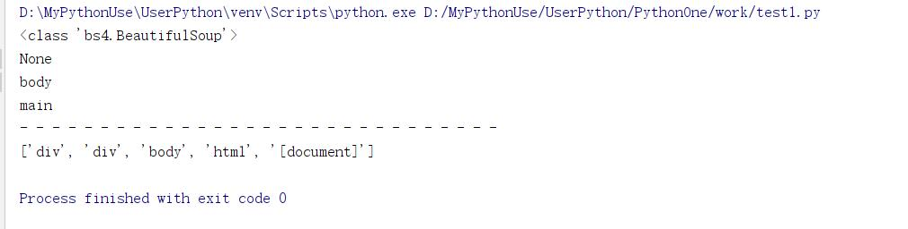  
6. **遍历兄弟节点**
    * Tag.next_sibling #第一个Tag元素的下一个(下面)兄弟节点，注意：可能是一个文本节点
    * Tag.previous_sibling #第一个Tag元素之前的兄弟节点(上面)，注意：可能是一个文本节点
    * Tag.next_siblings #获取Tag元素的下面的所有兄弟节点

    ````python
    from bs4 import BeautifulSoup
    from bs4.element import Tag

    with open("d://xdd.html",encoding="utf-8") as f:
        soup = BeautifulSoup(f,"lxml")
        print(type(soup),type(soup.p))
        print("{} [{}]".format(1,soup.p.next_sibling.encode()))
        print("{} [{}]".format(2,soup.p.previous_sibling.encode()))
        print(soup.p.previous_sibling.next_sibling) #等价于soup.p
        print(soup.p.next_sibling.previous_sibling)  # 等价于soup.p
        print(soup.p)
        print(list(soup.p.next_siblings))
    ````

    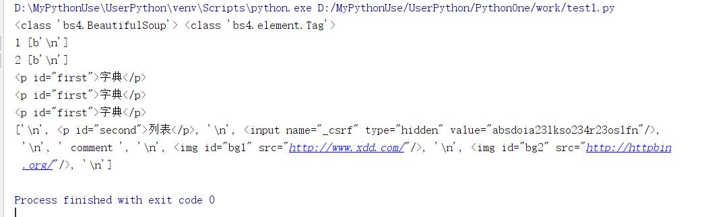  
7. **遍历其他元素**
    * Tag.next_element #是下一个可被解析的对象(字符串或tag),和下一个兄弟节点next_sibling不一样
    * Tag.next_elements #返回所有下一个可被解析的对象，是个可迭代对象。

    ````python
    from bs4 import BeautifulSoup

    with open("d://xdd.html",encoding="utf-8") as f:
        soup = BeautifulSoup(f,"lxml")
        print(type(soup),type(soup.p))
        print(soup.p.next_element) #返回"字典"2个字
        print(soup.p.next_element.next_element.encode())
        print(soup.p.next_element.next_element.next_element)
        print(list(soup.p.next_elements))

        print("- "*30)
        #对比差异
        print(list(soup.p.next_elements))
        print(list(soup.p.next_siblings))
    ````

    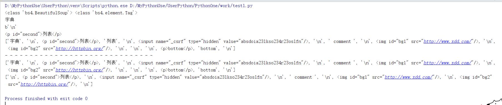  

### 搜索文档树

* find系有很多分发，请执行查询帮助[https://www.crummy.com/software/BeautifulSoup/bs4/doc.zh/#id25](https://www.crummy.com/software/BeautifulSoup/bs4/doc.zh/#id25)  

* `find_all(name=None,attrs={},recursive=True,text=None,limit=None,**kwargs)`#立即返回一个列表

1. **name参数**:官方称为**fiter过滤器**，这个参数可以是一下
    1. **字符串**：一个标签名称的字符串，会按照这个字符串全长匹配标签名
        `print(soup.find_all('p'))`#返回文档中所有p标签
    2. **正则表达式对象**:按照"正则表达式对象"的模式匹配标签名

        ````python
        import re
        print(soup.find_all(re.compile("^h\d"))) #标签名以h开头后接数字
        ````

    3. **列表**：或关系查找列表中的每个字符串

        ````python
        print(soup.find_all(["p","h1","h3"])) #或关系，找出列表所有的标签
        print(soup.find_all(re.compile(r"^p|h|\d$"))) #使用正则表达式完成
        ````

    4. **True或None**,则find_all返回全部非字符串节点、非注释节点，就是Tag标签类型

        ````python
        from bs4 import BeautifulSoup

        with open("d://xdd.html",encoding="utf-8") as f:
            soup = BeautifulSoup(f,"lxml")
            print(list(map(lambda x: x.name, soup.find_all(True))))
            print(list(map(lambda x: x.name, soup.find_all(None))))
            print(list(map(lambda x: x.name, soup.find_all())))
        ````

        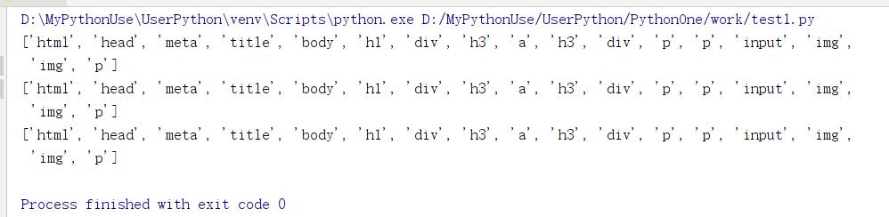  

        ````python
        from bs4 import BeautifulSoup
        from bs4.element import Tag

        with open("d://xdd.html",encoding="utf-8") as f:
            soup = BeautifulSoup(f,"lxml")
            values = [True,None,False]
            for value in values:
                all = soup.find_all(value)
                print(type(all[0]))
                print(len(all))

            print("- "*30)
            count = 0
            for i,t in enumerate(soup.descendants): #遍历所有类型的子孙节点
                print(i,type(t),t.name)
                if isinstance(t,Tag): #只对Tag类型计数
                    count += 1
            print(count)
        # 数目一致，所以返回的是Tag类型的节点，源码中确实返回的Tag类型
        ````

        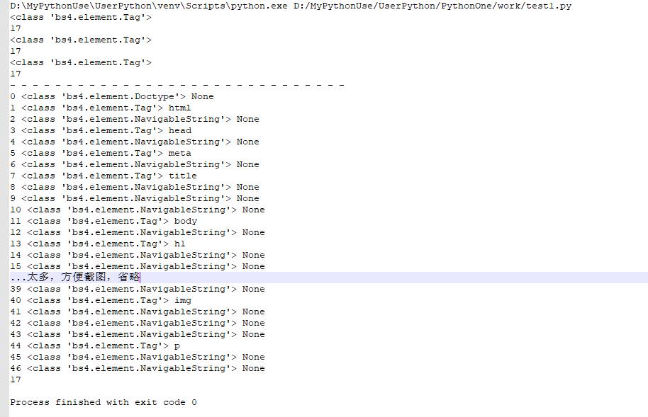  
    5. **函数**
        * 如果使用以上过滤器还不能提取想要的节点，可以使用函数，此函数仅只能**接收一个参数**。
        * 如果这个函数返回True,表示当前节点配置；返回False则是不匹配。

        1. 示例：找出所有class属性且有多个值的节点(测试html中符合这个条件只有h3标签)

        ````python
        from bs4 import BeautifulSoup
        from bs4.element import Tag

        def many_classes(tag:Tag):
            # print(type(tag))
            # print(type(tag.attrs))
            return len(tag.attrs.get("class",[])) > 1

        with open("d://xdd.html",encoding="utf-8") as f:
            soup = BeautifulSoup(f,"lxml")
            print(soup.find_all(many_classes))
        ````

        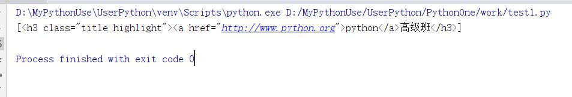  
2. **keyword传参**
    1. 使用关键字传参，如果参数名不是find系函数已定义的位置参数名，参数会被kwargs收集并被**当做标签的属性**来搜索。
    2. 属性的传参可以是字符串、正则表达式对象、True、列表。

    ````python
    from bs4 import BeautifulSoup
    import re

    with open("d://xdd.html",encoding="utf-8") as f:
        soup = BeautifulSoup(f,"lxml")
        print(soup.find_all(id="first")) #id为first的所有结点列表
        print(1,"- "*30)
        print(soup.find_all(id=re.compile("\w+"))) #相当于找有di的所有节点
        print(2,"- " * 30)
        print(soup.find_all(id=True)) #所有有id的节点

        print(3,"- " * 30)
        print(list(map(lambda x:x["id"],soup.find_all(id=True))))
        print(4,"- " * 30)
        print(soup.find_all(id=["first",re.compile(r"^sec")])) #指定id的名称列表
        print(5,"- " * 30)
        print(soup.find_all(id=True,src=True)) #相当于条件and,既有id又有src属性的节点列表
    ````

    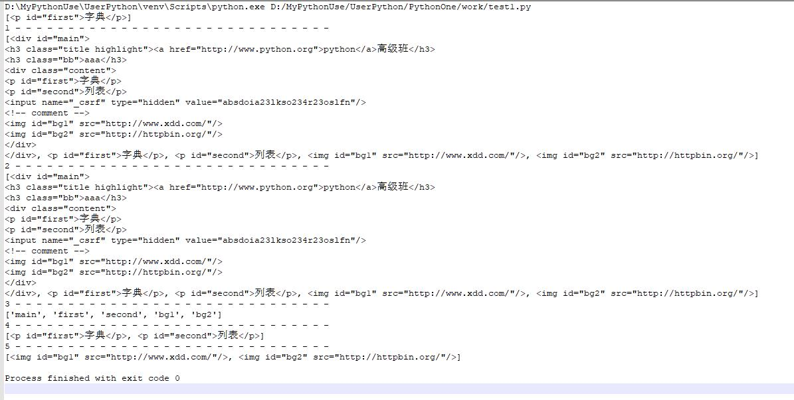  

3. **css的class的特殊处理**
    1. class是Python关键字，所以使用`class_`。class是多值属性，可以匹配其中任意一个，也可以完全匹配。

    ````python
    print(soup.find_all(class_="content"))
    print(soup.find_all(class_="title")) #可以使用任意一个css类
    print(soup.find_all(class_="highlight")) #可以使用任意一个css类
    print(soup.find_all(class_="highlight title")) #顺序错了，找不到
    print(soup.find_all(class_="title highlight")) #顺序一致，找到。就是字符串完全匹配
    ````

4. **attrs参数**
    * attrs接收一个字典，字典的key为属性名，value可以是字符串、正则表达式对象、True、列表。可以多个属性

    ````python
    print(soup.find_all(attrs={"class":"title"}))
    print(soup.find_all(attrs={"class":"highlight"}))
    print(soup.find_all(attrs={"class":"title highlight"}))
    print(soup.find_all(attrs={"id":True}))
    print(soup.find_all(attrs={"id":re.compile(r"\d$")}))
    print(list(map(lambda x:x.name,soup.find_all(attrs={"id":True,"src":True}))))
    ````

5. **text参数**
    * 可以通过text参数搜索文档中的字符串内容，接受字符串、正则表达式对象、True、列表

    ````python
    from bs4 import BeautifulSoup
    import re

    with open("d://xdd.html",encoding="utf-8") as f:
        soup = BeautifulSoup(f,"lxml")
        print(list(map(lambda x:(type(x),x),soup.find_all(text=re.compile("\w+"))))) #返回文本类节点
        print("- "*30)
        print(list(map(lambda x:(type(x),x),soup.find_all(text=re.compile("[a-z]+")))))
        print("- "*30)
        print(soup.find_all(re.compile(r"^(h|p)"),text=re.compile("[a-z]+"))) #相当于过滤Tag对象，并看它的string是否符合text参数要求，返回Tag对象
    ````

    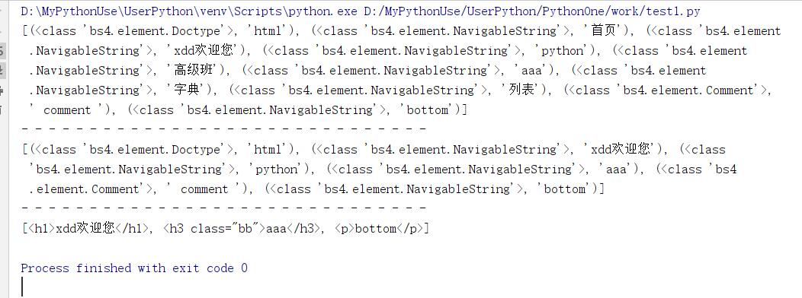  
6. **limit参数**：显示返回结果的数量

    ````python
    print(soup.find_all(id=True,limit=3)) #返回列表中有3个结果
    ````

7. **recursive参数**
    * 默认是递归搜索所有子孙节点，如果不需要请设置为False

* **简化写法**
    1. find_all()是非常常用的方法，可以简化省略掉

    ````python
    from bs4 import BeautifulSoup
    import re

    with open("d://xdd.html",encoding="utf-8") as f:
        soup = BeautifulSoup(f,"lxml")
        print(soup("img")) #所有img标签对象的列表，等价于soup.find_all("img")
        print(soup.img) #深度优先第一个img

        print(soup.a.find_all(text=True)) #返回文本
        print(soup.a(text=True)) #返回文本，和上面等价
        print(soup("a",text=True)) #返回a标签对象

        print(soup.find_all("img",attrs={"id":"bg1"}))
        print(soup("img",attrs={"id":"bg1"})) #find_all的省略
        print(soup("img",attrs={"id":re.compile("1")}))
    ````

    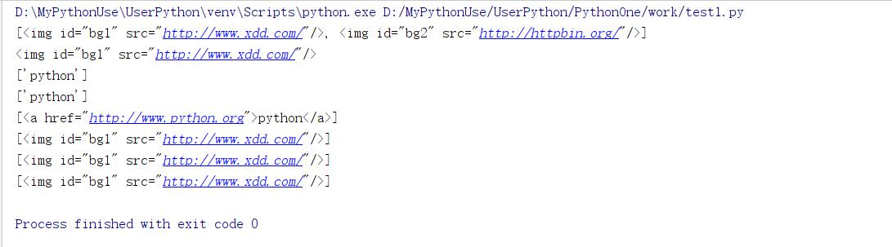  

* **find方法**
    1. `find(name,attrs,recursive,text,**kwargs)`
        * 参数几乎和find_all一样。
        * 找到了，find_all返回一个列表，而find返回一个单值，元素对象。
        * 找不到，find_all返回一个空列表，而find返回一个None。

    ````python
    from bs4 import BeautifulSoup

    with open("d://xdd.html",encoding="utf-8") as f:
        soup = BeautifulSoup(f,"lxml")
        print(soup.find("img",attrs={"id":"bg1"}).attrs.get("src","xdd"))
        print(soup.find("img",attrs={"id":"bg1"}).get("src")) #简化了attrs
        print(soup.find("img",attrs={"id":"bg1"})["src"])
    ````

    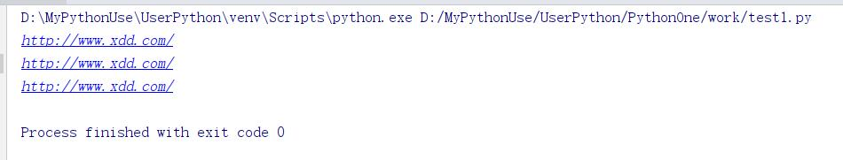  

### CSS选择器

* 和JQuery一样，可以使用CSS选择器来 查找节点
* 使用soup.select()方法，select方法支持大部分CSS选择器，返回列表。
* CSS中，标签名直接使用，类名前加`.`点号,id名前加`#`井号。

1. BeautifulSoup.select("css选择器")

````python
from bs4 import BeautifulSoup

with open("d://xdd.html",encoding="utf-8") as f:
    soup = BeautifulSoup(f,"lxml")
    #元素选择器
    print(1,soup.select("p")) #所有的p标签

    #类选择器
    print(2,soup.select(".title"))

    #使用了伪类
    #直接子标签是p的同类型的所有p标签中的第二个
    #(同类型)同标签名p的第2个，伪类只实现了nth-of-type，且要求是数字
    print(3,soup.select("div.content >p:nth-of-type(2)"))

    # id选择器
    print(4,soup.select("p#second"))
    print(5,soup.select("#bg1"))

    #后代选择器
    print(6,soup.select("div p")) # div下逐层找p
    print(7,soup.select("div div p")) #div下逐层找div下逐层找p

    #子选择器，直接后代
    print(8,soup.select("div > p")) #div下直接子标签的p，有2个

    #相邻兄弟选择器
    print(9, soup.select("div p:nth-of-type(1) + [src]")) #返回[]
    print(9, soup.select("div p:nth-of-type(1) + p"))  # 返回p标签
    print(9, soup.select("div > p:nth-of-type(2) + input"))  # 返回input Tag
    print(9, soup.select("div > p:nth-of-type(2) + [type]"))  # 同上

    #普通兄弟选择器
    print(10, soup.select("div p:nth-of-type(1) ~ [src]")) #返回2个img

    #属性选择器
    print(11,soup.select("[src]")) #有属性src
    print(12,soup.select("[src='/']")) #属性src等于/
    print(13,soup.select("[src='http://www.xdd.com/']")) #完全匹配
    print(14,soup.select("[src^='http://www']")) #以http://www开头
    print(15,soup.select("[src$='com/']")) #以com/结尾
    print(16,soup.select("img[src*='xdd']")) #包含xdd
    print(17,soup.select("img[src*='.com']")) #包含.com
    print(18,soup.select("[class='title highlight']")) #完全匹配calss等于'title highlight'
    print(19,soup.select("[class~=title]")) #多值属性中有一个title
````

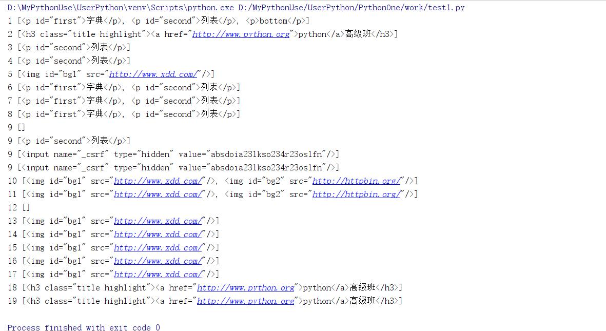  

* **获取文本内容**

1. 搜索节点的目的往往是为了提取该节点的文本内容，一般不需要HTML标记，只需要文字

````python
from bs4 import BeautifulSoup

with open("d://xdd.html",encoding="utf-8") as f:
    soup = BeautifulSoup(f,"lxml")
    # 元素选择器
    ele = soup.select("div") #所有的div标签
    print(type(ele))
    print(ele[0].string) #内容仅仅只能是文本类型，否则返回None
    print(list(ele[0].strings)) #迭代保留空白字符
    print(list(ele[0].stripped_strings)) #迭代不保留空白字符

    print("- "*30)
    print(ele[0])
    print("- " * 30)

    print(list(ele[0].text))#本质上就是get_text(),保留空白字符的strings
    print(list(ele[0].get_text())) #迭代并join，保留空白字符，strip默认为False
    print(list(ele[0].get_text(strip=True))) #迭代并join，不保留空白字符
````

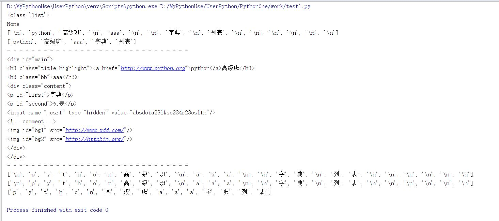  

* bs4.element.Tag#string源码

````python
class Tag(PageElement):
@property
    def string(self):
        if len(self.contents) != 1:
            return None
        child = self.contents[0]
        if isinstance(child, NavigableString):
            return child
        return child.string

    @string.setter
    def string(self, string):
        self.clear()
        self.append(string.__class__(string))

    def _all_strings(self, strip=False, types=(NavigableString, CData)):
        for descendant in self.descendants:
            if (
                (types is None and not isinstance(descendant, NavigableString))
                or
                (types is not None and type(descendant) not in types)):
                continue
            if strip:
                descendant = descendant.strip()
                if len(descendant) == 0:
                    continue
            yield descendant

    strings = property(_all_strings)

    @property
    def stripped_strings(self):
        for string in self._all_strings(True):
            yield string

    def get_text(self, separator="", strip=False,
                 types=(NavigableString, CData)):
        return separator.join([s for s in self._all_strings(
                    strip, types=types)])
    getText = get_text
    text = property(get_text)
````

## Json解析

* 拿到一个Json字符串，如果想提取其中的部分内容，就需要遍历了。在遍历过程中进行判断。
* 还有一种方式，类似于XPath,叫做jsonPath。
* 安装`pip install jsonpath`
* 官网[https://goessner.net/articles/JsonPath/](https://goessner.net/articles/JsonPath/)

|XPath|JsonPath|说明|
|:-----|:------|:----|
|`/`|`$`|根元素|
|`.`|`@`|当前节点|
|`/`|`.`或者`[]`|获取子节点|
|`..`|不支持|父节点|
|`//`|`..`|任意层次|
|`*`|`*`|通配符，匹配任意节点|
|`@`|不支持|json中没有属性|
|`[]`|`[]`|下标操作|
|`|`|`[,]`|XPath是或操作，JSONPath allows alternate names or array indices as a set.|
|不支持|`[start:stop:step]`|切片|
|`[]`|`?()`|过滤操作|
|不支持|`()`|表达式计算|
|`()`|不支持|分组|

* 综合示例，使用豆瓣电影的热门电影的Json[https://movie.douban.com/j/search_subjects?type=movie&tag=%E7%83%AD%E9%97%A8&page_limit=10&page_start=0](https://movie.douban.com/j/search_subjects?type=movie&tag=%E7%83%AD%E9%97%A8&page_limit=10&page_start=0)

````json
{
    "subjects":[
        {
            "rate":"8.8",
            "cover_x":1500,
            "title":"寄生虫",
            "url":"https://movie.douban.com/subject/27010768/",
            "playable":false,
            "cover":"https://img3.doubanio.com/view/photo/s_ratio_poster/public/p2561439800.jpg",
            "id":"27010768",
            "cover_y":2138,
            "is_new":false
        },
        {
            "rate":"7.7",
            "cover_x":1500,
            "title":"恶人传",
            "url":"https://movie.douban.com/subject/30211551/",
            "playable":false,
            "cover":"https://img3.doubanio.com/view/photo/s_ratio_poster/public/p2555084871.jpg",
            "id":"30211551",
            "cover_y":2145,
            "is_new":false
        },
        {
            "rate":"6.6",
            "cover_x":1500,
            "title":"异地母子情",
            "url":"https://movie.douban.com/subject/26261189/",
            "playable":false,
            "cover":"https://img3.doubanio.com/view/photo/s_ratio_poster/public/p2562107493.jpg",
            "id":"26261189",
            "cover_y":2222,
            "is_new":true
        },
        {
            "rate":"6.7",
            "cover_x":2025,
            "title":"我的生命之光",
            "url":"https://movie.douban.com/subject/26962841/",
            "playable":false,
            "cover":"https://img3.doubanio.com/view/photo/s_ratio_poster/public/p2563625370.jpg",
            "id":"26962841",
            "cover_y":3000,
            "is_new":true
        },
        {
            "rate":"7.3",
            "cover_x":2025,
            "title":"皮肤",
            "url":"https://movie.douban.com/subject/27041467/",
            "playable":false,
            "cover":"https://img1.doubanio.com/view/photo/s_ratio_poster/public/p2559479239.jpg",
            "id":"27041467",
            "cover_y":3000,
            "is_new":true
        },
        {
            "rate":"8.9",
            "cover_x":2000,
            "title":"绿皮书",
            "url":"https://movie.douban.com/subject/27060077/",
            "playable":true,
            "cover":"https://img3.doubanio.com/view/photo/s_ratio_poster/public/p2549177902.jpg",
            "id":"27060077",
            "cover_y":3167,
            "is_new":false
        },
        {
            "rate":"8.0",
            "cover_x":3600,
            "title":"疾速备战",
            "url":"https://movie.douban.com/subject/26909790/",
            "playable":false,
            "cover":"https://img3.doubanio.com/view/photo/s_ratio_poster/public/p2551393832.jpg",
            "id":"26909790",
            "cover_y":5550,
            "is_new":false
        },
        {
            "rate":"7.9",
            "cover_x":1786,
            "title":"流浪地球",
            "url":"https://movie.douban.com/subject/26266893/",
            "playable":true,
            "cover":"https://img3.doubanio.com/view/photo/s_ratio_poster/public/p2545472803.jpg",
            "id":"26266893",
            "cover_y":2500,
            "is_new":false
        },
        {
            "rate":"8.2",
            "cover_x":684,
            "title":"沦落人",
            "url":"https://movie.douban.com/subject/30140231/",
            "playable":false,
            "cover":"https://img3.doubanio.com/view/photo/s_ratio_poster/public/p2555952192.jpg",
            "id":"30140231",
            "cover_y":960,
            "is_new":false
        },
        {
            "rate":"6.4",
            "cover_x":960,
            "title":"疯狂的外星人",
            "url":"https://movie.douban.com/subject/25986662/",
            "playable":true,
            "cover":"https://img1.doubanio.com/view/photo/s_ratio_poster/public/p2541901817.jpg",
            "id":"25986662",
            "cover_y":1359,
            "is_new":false
        }
    ]
}
````

````python
from jsonpath import jsonpath
import requests
import json

ua = "Mozilla/5.0 (Windows; U; Windows NT 6.1; zh-CN) AppleWebKit/537.36 (KHTML, like Gecko) Version/5.0.1 Safari/537.36"
url = "https://movie.douban.com/j/search_subjects?type=movie&tag=%E7%83%AD%E9%97%A8&page_limit=10&page_start=0"

with requests.get(url,headers={"User-agent":ua}) as response:
    if response.status_code==200:
        text = response.text
        print(text[:100])
        js = json.loads(text)
        print(str(js)[:100]) #json转换为Python数据结构

        #知道所有电影的名称
        rs1 = jsonpath(js,"$..title") #从根目录开始，任意层次的title属性
        print(rs1)

        #找到所有subjects
        rs2 = jsonpath(js,"$..subjects")
        print(len(rs2),str(rs2[0])[:100]) #由于太长，取前100个字符

        print("- " * 30)
        # 找到所有得分高于8分的电影名称
        # 根下任意层的subjects的子节点rate大于字符串8
        rs3 = jsonpath(js,'$..subjects[?(@.rate > "8")]') #？()是过滤器
        print(rs3)

        print("- "*30)
        #根下任意层的subjects的子节点rate大于字符串8的节点的子节点title
        rs4 = jsonpath(js,'$..subjects[?(@.rate > "8")].title')
        print(rs4)
        print("- " * 30)

        #切片
        rs5 = jsonpath(js,"$..subjects[?(@.rate > '6')].title")
        print(rs5[:2])
````

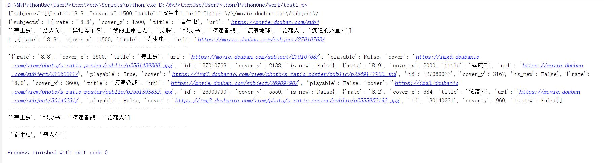  
