# docker容器技术

[toc]

* Container容器：
    1. 容器是一种基础工具；泛指任何可以用于容纳其它物品的工具，可以部分或完全封闭，被用于容纳、存储、运输物品；物体可以被放置在容器中，而容器则可以保护内容物；
* OCI:Open Container Initiative
    1. 由Linux基金会主导于2015年6月创立
    2. 只在围绕容器格式和运行时制定一个开放的工业化标准

1. 容器技术，实现的前提。
    * `kernel namespaces` 内核名称空间
        * linux内核中支持的内核名称空间有：
            1. Mount 实现root根目录的虚拟化隔离
            2. PID  实现进程pid的虚拟化隔离
            3. Network 实现网络的虚拟化隔离
            4. IPC 信号量、消息队列和共享内存
            5. UTS  主进程和域名的虚拟化隔离
            6. User 实现用户的虚拟化隔离

        |namespace|系统调用参数|隔离内容|内核版本|
        |:-------|:-----------|:-------|:------|
        |UTS|CLONE_NEWUTS|主机名和域名|2.6.19|
        |IPC|CLONE_NEWIPC|信号量、消息队列和共享内存|2.6.19|
        |PID|CLONE_NEWPID|进程编号|2.6.24|
        |Network|CLONE_NEWNET|网络设备、网络栈、端口等|2.6.29|
        |Mount|CLONE_NEWNS|挂载点(文件系统)|2.4.19|
        |User|CLONE_NEWUSER|用户和用户组|3.8|

    * `CGoups` 控制组，用于计算资源的隔离
        * CPU,Memroy,BLKIO等计算资源的分配(分配给不同容器)
        * blkio：快设备IO
        * cpu:CPU
        * cpuacct:CPU资源使用报告
        * cpuset:多处理器平台是那个的CPU集合
        * devices:设备访问
        * freezer:挂起或恢复任务
        * memory:内存用量及 报告
        * perf_event:对cgroup中的任务进行统一性能测试
        * net_cls:cgroup中的任务创建的数据报文的类别
    * `Kernel Gapabilities` 内核功能，能力。
2. `LXC`, 镜像，没有解决容器的迁移和分发等问题，后来被Docker替代
    * docker容器镜像下载[https://hub.docker.com](https://hub.docker.com)
3. `Docker`通过引入Image镜像，帮助简化容器，推动了容器的发展
    1. `Registry` #docker的仓库服务器，docker的注册表服务，托管运行镜像仓库的服务器。同时为仓库镜像提供对应的索引，和认证用户实现对应存储功能和用户名称空间分派的功能。
    2. `Docker Daemon` #docker的运行时环境，即docker镜像
    3. `Docker Client` #docker的客户端
    * 注意：上面三者之前都可以完全运行在不同的主机之上，本身都通过http或https通讯。

* Docker重要的Object
    1. Container 容器，运行时的表现
    2. Image 镜像
    3. Network 网络
    4. Volume 存储卷
    5. Plugin 插件
    6. ...等等

* Docker的容器管理常用命令
    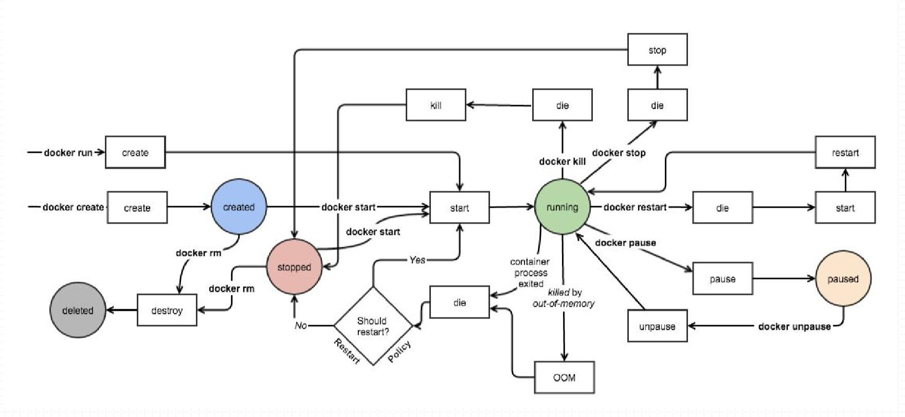

## docker的安装

* 依赖的基础环境
    1. 64 bits CPU
    2. Linux Kernel 3.10+
    3. Linux Kernel cgroups and namespaces
* CentOS 7
    1. "Extras" repository 查看可以如下所示：
    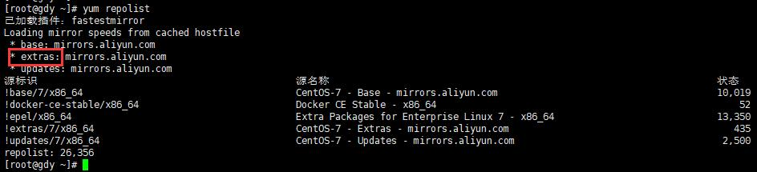  
* docker程序环境：
    1.环境配置文件：
        * `/etc/sysconfig/docker-network`
        * `/etc/sysconfig/docker-storage`
        * `/etc/sysconfig/docker`
    2. Unit File:
        * `/usr/lib/systemd/system/docker.service`
    3. Docker Registry配置文件：
        * `/etc/containers/registries.conf`
    4. docker-ce配置文件：
        * `/etc/docker/daemon.json`

* 配置docker的yum源
    1. `wget https://mirrors.aliyun.com/docker-ce/linux/centos/docker-ce.repo -o /etc/yum.repos.d/docker-ce.repo`
* 安装docker `yum install docker-ce`
    1. 安装完成后可以使用`rpm -ql docker-ce`看安装情况
* docker镜像加速器(可以在[https://cr.console.aliyun.com/](https://cr.console.aliyun.com/)中找到自己的镜像加速)

    ````shell
    sudo mkdir -p /etc/docker
    sudo tee /etc/docker/daemon.json <<-'EOF'
    {
    "registry-mirrors": ["https://4mii0wlb.mirror.aliyuncs.com"]
    }
    EOF
    sudo systemctl daemon-reload
    sudo systemctl restart docker
    `````

* 使用iptables -vnL可以查看docker自动生成的规则
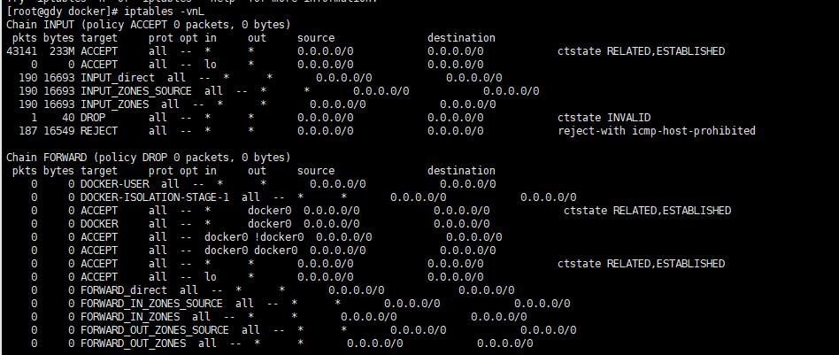  

* 修改`vim /usr/lib/systemd/system/docker.service`文件
    1. 添加`ExecStartPost=/usr/sbin/iptables -P FORWARD ACCEPT`
    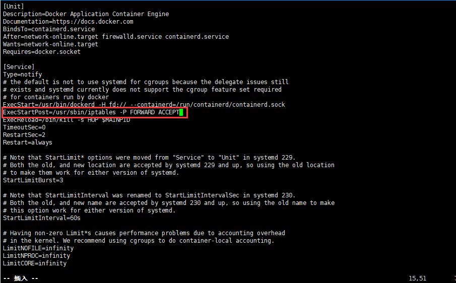  
    2. 修改完成后需要重新执行如下命令

        ````shell
        systemctl daemon-reload
        systemctl restart docker
        ````

    3. 再次使用`iptables -vnL`查看可以看到FORWARD已经修改为ACCEPT
    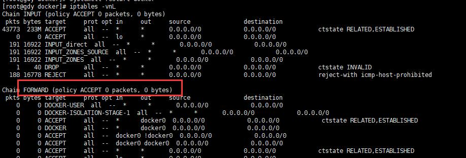  

## docker的使用

1. 常用操作：
    * `docker search:`搜索镜像Search the Docker Hub for images
        1. `docker search nginx` #搜索nginx镜像
            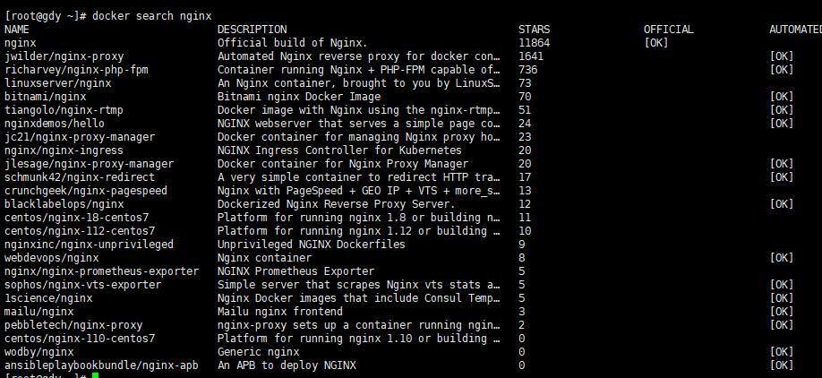  
    * `docker pull` 下载镜像Pull an image or a repository from a registry
    * `docker images` 查看镜像List images
    * `docker create` 创建容器Create a new container
    * `docker start` 启动容器Start one or more stopped containers
    * `docker run` 在容器中运行命令Run a command in a new container
    * `docker attach` Attach to a running container
    * `docker ps` 查看正在运行的容器List containers
        1. `docker ps -a` #查看所有容器
        2. `docker ps 等价于docker container ls`
    * `docker logs` 查看容器日志Fetch the logs of a container
    * `docker restart` 重启一个容器Restart a container
    * `docker stop` 停止容器Stop one or more running containers
    * `docker kill` 杀死正在运行的容器Kill one or more running containers
    * `docker rm` 删除容器Remove one or more containers
    * `docker port CONTAINER [PRIVATE_PORT[/PROTO]]` #查看指定容器上的映射端口
        1. `docker port web1` #查看web1容器上的映射端口

* `docker version` #查看docker的版本信息,（可以看到客户端程序版本，和服务端程序版本）
* `docker info` #查看docker的详细信息

    ````text
    [root@gdy docker]# docker info
    Client:
    Debug Mode: false

    Server:
    Containers: 0  #当前容器数量
     Running: 0      #运行状态的容器数量
     Paused: 0       #暂停状态的容器数量
     Stopped: 0      #停止状态的容器数量
    Images: 0       #当前主机上有多少个镜像
    Server Version: 19.03.1         #服务器端版本
    Storage Driver: overlay2        #存储后端驱动
     Backing Filesystem: xfs         #在overlay2上建构的本地文件系统是xfs
     Supports d_type: true
    Native Overlay Diff: true
    Logging Driver: json-file       #日志驱动
    Cgroup Driver: cgroupfs         #控制组的驱动
    Plugins:                        #其他插件
     Volume: local                  #存储卷，支持本地
     Network: bridge host ipvlan macvlan null overlay       #网络，支持桥接(bridge host),overlay(叠加网络) 等
     Log: awslogs fluentd gcplogs gelf journald json-file local logentries splunk syslog #日志
    Swarm: inactive         #支持Swarm，docker内部的容器编排，容器集群工具
    Runtimes: runc          #运行时环境runc
    Default Runtime: runc
    Init Binary: docker-init
    containerd version: 894b81a4b802e4eb2a91d1ce216b8817763c29fb
    runc version: 425e105d5a03fabd737a126ad93d62a9eeede87f
    init version: fec3683
    Security Options:
    seccomp
    Profile: default
    Kernel Version: 3.10.0-957.el7.x86_64
    Operating System: CentOS Linux 7 (Core)
    OSType: linux
    Architecture: x86_64
    CPUs: 4
    Total Memory: 1.777GiB
    Name: gdy.gdy
    ID: LQG7:RAZT:CIRG:XDUP:WVIY:DZY2:PTMM:G7GG:BZF2:6OLB:EBLT:JYNW
    Docker Root Dir: /var/lib/docker
    Debug Mode: false
    Registry: https://index.docker.io/v1/
    Labels:
    Experimental: false
    Insecure Registries:        #非安全的仓库
    127.0.0.0/8
    Registry Mirrors:           #配置的容器加速，
    https://qx4pe1od.mirror.aliyuncs.com/
    Live Restore Enabled: false

    [root@gdy docker]#
    ````

* `docker --help` #查看docker帮助，客户端命令
    1. `Management Commands:`系列的命令可以单独查看帮助

        ````text
        Management Commands:
        builder     Manage builds
        config      Manage Docker configs
        container   Manage containers #管理容器的命令
        context     Manage contexts
        engine      Manage the docker engine
        image       Manage images
        network     Manage networks
        node        Manage Swarm nodes
        plugin      Manage plugins
        secret      Manage Docker secrets
        service     Manage services
        stack       Manage Docker stacks
        swarm       Manage Swarm
        system      Manage Docker
        trust       Manage trust on Docker images
        volume      Manage volume
        ````

* `docker container --help` #查看docker管理容器的命令
    1. `docker container ls` #查看正在运行的容器
        * 等价于`docker ps`
        * `docker -H 192.168.61.109:8888 ps` #查看指定服务器下的容器信息
    2. `docker container ls -a` #详细查看容器信息
        * 等价于`docker ps -a`
    3. `docker container start xdd` #启动xdd容器
    4. `docker container attach xdd` #开启容器为xdd的终端
        * 按ctrl+p+q剥离终端，而不关闭终端
    5. `docker container run --help` #查看run 系列命令帮助
        1. `-t` 开启一个终端
        2. `-i -t` 进入交互式接口
        3. `-d` 后台运行容器
        4. `--name` 指定容器名
            * `docker container run --name xdd -it alpine:3.8` #开启一个alpine3.8镜像，并同时启动交互式界面，为新启动的这个镜像命名为xdd
            * `docker run --name xddbox -it busybox:latest` #开启一个busybox中标签为latest(即：最新版)的镜像，并同时开启交互式界面，将新启动的这个镜像命名为xddbox
            * `docker run --name web1 -d nginx:1.14-alpine` #开启一个nginx:1.14镜像，`-d`表示在后台运行容器,将这个新启动的镜像命令为web1
            * `docker run --name kvstor1 -d redis:4-alpine` #后台启动一个容器，运行redis,tag标签为4-alpine,并将这个新启动的容器名为：kvstor1
            1. **注意**：使用run命令启动镜像时，镜像不一定需要预先下载，可以在启动时会自动下载。
        5. `--rm` 停止后自动删除容器
            * `docker run --name t1 -it --rm busybox:latest`#创建容器，关闭后容器会被自动删除
        6. `--network` #为创建的容器指定网络，如果不指定，默认为桥接模式bridge
            * `docker run --name t1 -it --network bridge --rm busybox:latest`
            * `docker run --name b2 -it --network  container:b1 --rm busybox` #新运行的容器b2和b1共享同一网络同一iP
            * `docker run --name b2 -it --network host --rm busybox` #新运行的容器b2和宿主机共享同一网络和ip
        7. `-h --hostname` #为容器创建的容器指定主机名,如果不指定，默认为容器id
            * `docker run --name t1 -it --network bridge -h t1.xdd.com --rm busybox:latest` #同上面例子，指定了主机名为t1.xdd.com
        8. `--dns` #为创建的容器指定dns服务器地址
            * `docker run --name t1 -it --network bridge -h t1.xdd.com --dns 114.114.114.114 --rm busybox:latest` #指定创建的容器dns为114.114.114.114
        9. `--dns-search` 指定搜索域
            * `docker run --name t1 -it --network bridge -h t1.xdd.com --dns 114.114.114.114 --dns-search ilinux.io --rm busybox:latest` #指定创建的容器dns-search搜索域为：ilinux.io
        10. `--add-host`添加指定的容器本地主机名解析
            * `docker run --name t1 -it --network bridge -h t1.xdd.com --dns 114.114.114.114 --dns-search ilinux.io --add-host www.xdd.com:1.1.1.1 --rm busybox:latest` #为新创建的主机添加www.xdd.com域名指定到1.1.1.1主机上
        11 `-p，--publish-all`选项的使用格式(注意-p选项可以多次使用)
            * `-p <containerPort>` #将指定的容器端口映射至主机所有地址的一个动态端口
            * `-p <hostPort>:<containerPort>` #将容器端口`<containerPort>`映射到指定的主机端口`<hostPort>`
            * `-p <ip>::<containerPort>` #将指定的容器端口`<containerPort>`映射至主机指定`<ip>`的动态端口
            * `-p <ip>:<hostPort>:<containerPort>` #将指定的容器端口`<containerPort>`映射至主机指定的`<ip>`的端口`<hostPort>`
            1. "动态端口"指随机端口，具体的映射结果可使用docker port命令查看
    6. `docker container port CONTAINER [PRIVATE_PORT[/PROTO]]`等价于`docker port ...`#查看指定容器上的端口映射
        * `docker port web1` #查看web1上的端口映射
* `docker image --help` #查看docker管理镜像的命令  
    1. `pull` #手动下载镜像
        * `docker image pull nginx:1.14-alpine`下载nginx镜像
        * `docker pull busybox` 下载busybox
            1. busybox像一个盒子，使用链接链接成ls，或者cat等命令，他就可以当做linux上相应的命令使用。非常方便。android系统上就局域busybox做成的。
    2. `rm` 删除镜像
        * `docker image rm xdd/httpd:latest`删除标记为“xdd/httpd:latest”的标记
    3. `ls` 列出镜像
        * `docker image ls --digests` 显示镜像的完整信息
        * `docker image ls --no-trunc`  不按照缩略的方式输出
    4. `inspect` 查看镜像的详细信息
        * `docker image inspect alpine:3.8` #查看alpine中Tag为3.8的镜像详细信息
            1. 其中“Cmd”节点信息表上，当前镜像启动为容器时，默认运行的是什么进程
    5. `tag` 管理镜像标签
        * `docker tag SOURCE_IMAGE[:TAG] TARGET_IMAGE[:TAG]` #根据镜像指定标签
            1. `docker tag 7e0338fff785 xdd/httpd:v0.1-1` #将“7e0338fff785”为ID的镜像指定厂库为xdd下的httpd，标签为v0.1-1
            2. `docker tag xdd/httpd:v0.1-1 xdd/httpd:latest` #将标记为“xdd/httpd:v0.1-1”的镜像再创建一个标记为“xdd/httpd:latest”
    6. `push` 推送一个镜像
* `docker search alpine` #查看alpine下的docker版本 [https://hub.docker.com/_/alpine?tab=tags](https://hub.docker.com/_/alpine?tab=tags)
    1. `docker image pull alpine`下载apline，默认从alpine:laest中下载
        * alpine：是程序镜像的微型版本，能提供基础运行的最小文件大小的版本。(生产环境中 不建议使用alpine版本的镜像)

* `docker network --help` #网络相关命令
    1. `ls` #显示本地可用网络
        * `docker network ls` #显示本地可用网络
    2. `create [OPTIONS] NETWORK` #创建网络
        * `-d,--driver string` #指定网络类型，可选[bridge(桥接) host ipvlan macvlan null overlay],如果不指定，默认为bridge
        * `--subnet` #指定网络的子网络
        * `--gateway` #指定默认网关,如不指定，默认为子网络的第一个地址
            1. `docker network create -d bridge --subnet "172.26.0.0/16" --gateway "172.26.0.1" mybr0` #创建一个mybr0的网络，网络模式为bridge桥接模式，子网络为`172.26.0.0/16`,网关为`172.26.0.1`
                * 相关命令：`ip link set dev br-05c9d6fcc73b name docker1` #修改网络名称为docker1
    3. `inspect [OPTIONS] NETWORK [NETWORK...]` #查看网络详细信息
        * `docker network inspect none` #查看none网络详细信息
    4. `rm` #删除一个网络
    

* `docker exec --help`查看在容器中执行命令的帮助
    1. `docker exec -it kvstor1 /bin/sh`#在kvstor1容器中运行/bin/sh程序，并开启一个交互式界面

## Docker Images镜像管理

* Docker镜像含有 启动容器所需要的文件系统及其内容，因此，其用于创建并启动docker容器
    1. 采用分层构建机制，最低层为bootfs,其之为rootfs
        * **bootfs**:用于系统引导的文件系统，包括bootloader和kernel,容器启动完成会被卸载以节约内存资源；
        * **rootfs**:位于bootfs之上，表现为docker容器的根文件系统；
            1. 传统模式中，系统启动之时，内核挂载rootfs时会首先将其挂载为“只读”模式，完整性自检完成后将其重新挂载为读写模式;
            2. docker中，rootfs由内核挂载为“只读”模式，而后通过“联合挂载”技术额外挂载一个“可写”层；
          

* **Docker Image Layer**(docker的镜像层级)

1. 位于下层的镜像称为父镜像(parent image),最底层的称为基础镜像(base image)
2. 最上层为"可读写"层，其下的均为"只读"层
    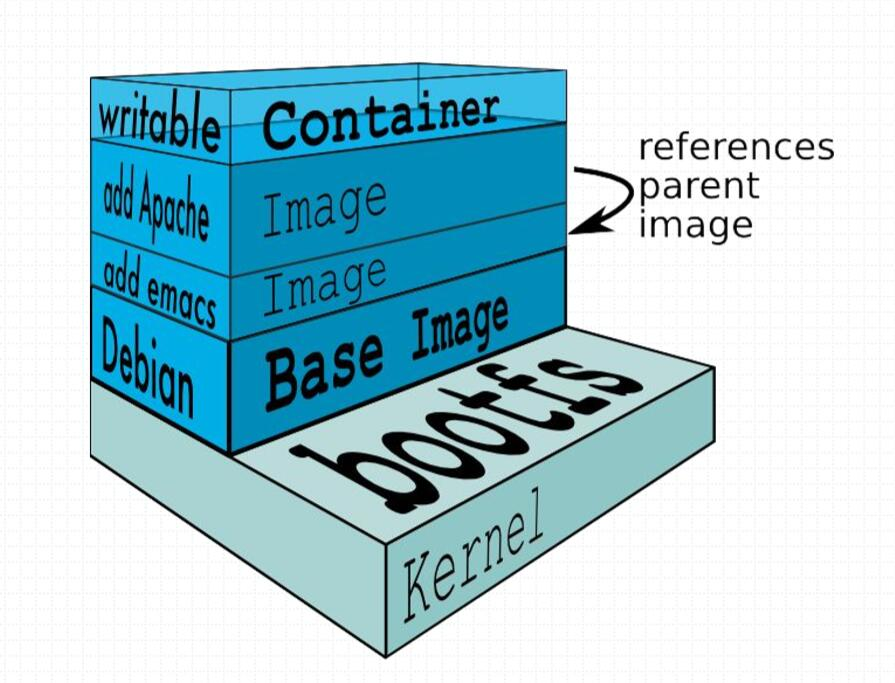  

* **Aufs**高级多层统一文件系统

1. `advanced multi-layered unification filesystem`:高级多层统一文件系统
2. 用于为Linux文件系统实现“联合挂载”
3. aufs是之前的UnionFS的重新实现，2006年由Junjiro Okajima开发；
4. Docker最初使用aufs作为容器文件系统层，它目前仍作为存储后端之一来支持；
5. aufs竞争产品是overlayfs,后者从3.18版本开始被合并到Linux内核；
6. docker的分层镜像，除了aufs,docker还支持btrfs,devicemapper和vfs等
    * 在Ubuntu系统下，docker默认ubuntu的aufs;而在CentOS7上，用的是devicemapper;

* **Docker Registry**镜像的统一存储位置Registry

1. 启动容器时，docker daemon会 试图从本地获取相关的镜像；本地 镜像不存在时，将其从Registry中下载该镜像并保存到本地；
    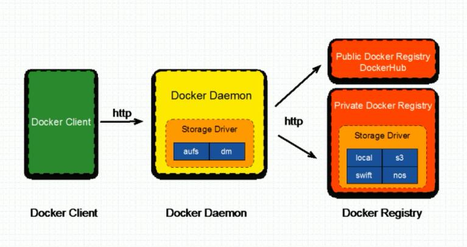  
2. Docker Registry分类
    * Registry用于保存docker镜像，包括镜像的层次结构和元数据
    * 用户可自建 Registry，也可使用官方的Docker Hub
    * 分类
        1. Sponsor Registry:第三方的registry，供客户和Docker社区使用
        2. Mirror Registry:第三方的registry，只让客户使用
        3. Vendor Registry:由发布Docker镜像的供应商提供的registry
        4. Private Registry:通过设有防火墙的额外的安全层的私有实体提供的registry
3. Registry(repository and index)
    * Repository
        1. 由某特定的docker镜像的所有 迭代版本组成的镜像厂库
        2. 一个Registry中可以存在多个Repository
            * Repository可分为“顶层仓库”和“用户创库”
            * 用户仓库名称格式为“用户名/仓库名”
        3. 每个厂库可以包含多个Tag(标签)，每个标签对应一个镜像
    * Index
        1. 维护用户账户、镜像的校验以及公共命名空间的信息
        2. 相当于为Registry提供另一个完成用户认证等功能的检索接口
4. Docker Registry
    * Docker Registry中的镜像通常有开发人员制作，而后推送至“公共”或“私有”Registry上保存，供其他人员使用，例如：“部署”到生产环境；
    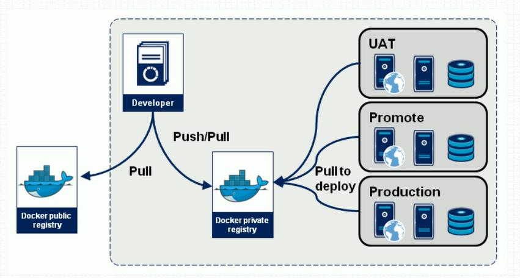  

* **常用的镜像厂库**
    1. [https://hub.docker.com/](https://hub.docker.com/)
    2. [https://quay.io/](https://quay.io/)
        * 获取命令`docker pull quay.io/coreos/flannel:v0.10.0-amd64` #获取flannel仓库中的镜像,Tag标签为v0.10.0-amd64

### 镜像相关操作

* 镜像的生成途径(制作镜像)
    1. Dockerfile
    2. 基于容器制作
    3. Docker Hub automated builds
    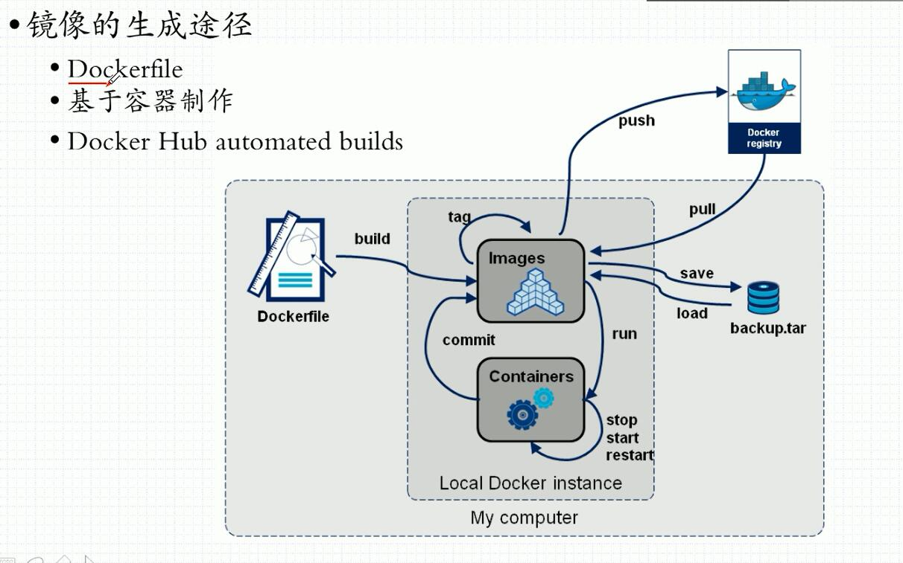  

#### 基于容器制作镜像

* 在容器中创建一个镜像

1. 语法：`docker commit [OPTIONS] CONTAINER [REPOSITORY[:TAG]]`
    1. `-p` 创建镜像时，使镜像暂停
    2. `-c` 修改镜像的Dockerfill指令，可以修改cmd命令等
    3 `-a` 指定镜像的制作作者
    * `docker commit -p xddbox2` #根据正在运行的xddbox2镜像，创建一新的镜像，创建时，不许xddbox2在做任何操作。
    * `docker commit -a "xdd <xdd@xdd.com>" -c 'CMD ["/bin/httpd","-f","-h","/data/html"]' -p xddbox2 xdd/httpd:v0.2` 根据xddbox2镜像制作新的镜像，修改了CMD命令，为`["/bin/httpd","-f","-h","/data/html"]` **注意必须是双引号**

````text
#根据正在运行的xddbox2镜像创建一个镜像
[root@gdy ~]# docker commit -p xddbox2
sha256:7e0338fff785b7ac85bf8590417eca56f5e61af046ebcfa2614723d3a001791b
#查看镜像
[root@gdy ~]# docker image ls
REPOSITORY          TAG                 IMAGE ID            CREATED             SIZE
<none>              <none>              7e0338fff785        6 seconds ago       1.22MB
redis               4-alpine            442c73e7ad1d        3 days ago          20.4MB
alpine              latest              961769676411        3 days ago          5.58MB
busybox             latest              db8ee88ad75f        5 weeks ago         1.22MB
nginx               1.14-alpine         8a2fb25a19f5        4 months ago        16MB
alpine              3.8                 dac705114996        5 months ago        4.41MB
# 将7e0338fff785镜像大一个仓库为xdd/httpd 标记为v0.1-1.
[root@gdy ~]# docker tag 7e0338fff785 xdd/httpd:v0.1-1
[root@gdy ~]# docker image ls
REPOSITORY          TAG                 IMAGE ID            CREATED             SIZE
xdd/httpd           v0.1-1              7e0338fff785        2 minutes ago       1.22MB
redis               4-alpine            442c73e7ad1d        3 days ago          20.4MB
alpine              latest              961769676411        3 days ago          5.58MB
busybox             latest              db8ee88ad75f        5 weeks ago         1.22MB
nginx               1.14-alpine         8a2fb25a19f5        4 months ago        16MB
alpine              3.8                 dac705114996        5 months ago        4.41MB
# 根据xdd/httpd:v0.1-1再添加一个标记Tag为 xdd/httpd:latest
[root@gdy ~]# docker tag xdd/httpd:v0.1-1 xdd/httpd:latest
[root@gdy ~]# docker image ls
REPOSITORY          TAG                 IMAGE ID            CREATED             SIZE
xdd/httpd           latest              7e0338fff785        12 minutes ago      1.22MB
xdd/httpd           v0.1-1              7e0338fff785        12 minutes ago      1.22MB
redis               4-alpine            442c73e7ad1d        3 days ago          20.4MB
alpine              latest              961769676411        3 days ago          5.58MB
busybox             latest              db8ee88ad75f        5 weeks ago         1.22MB
nginx               1.14-alpine         8a2fb25a19f5        4 months ago        16MB
alpine              3.8                 dac705114996        5 months ago        4.41MB
#删除标记为xdd/httpd:latest的标记，不会删除镜像
[root@gdy ~]# docker image rm xdd/httpd:latest
Untagged: xdd/httpd:latest
[root@gdy ~]# docker image ls
REPOSITORY          TAG                 IMAGE ID            CREATED             SIZE
xdd/httpd           v0.1-1              7e0338fff785        14 minutes ago      1.22MB
redis               4-alpine            442c73e7ad1d        3 days ago          20.4MB
alpine              latest              961769676411        3 days ago          5.58MB
busybox             latest              db8ee88ad75f        5 weeks ago         1.22MB
nginx               1.14-alpine         8a2fb25a19f5        4 months ago        16MB
alpine              3.8                 dac705114996        5 months ago        4.41MB
#重新在添加个标记
[root@gdy ~]# docker tag xdd/httpd:v0.1-1 xdd/httpd:latest
[root@gdy ~]# docker image ls
REPOSITORY          TAG                 IMAGE ID            CREATED             SIZE
xdd/httpd           latest              7e0338fff785        14 minutes ago      1.22MB
xdd/httpd           v0.1-1              7e0338fff785        14 minutes ago      1.22MB
redis               4-alpine            442c73e7ad1d        3 days ago          20.4MB
alpine              latest              961769676411        3 days ago          5.58MB
busybox             latest              db8ee88ad75f        5 weeks ago         1.22MB
nginx               1.14-alpine         8a2fb25a19f5        4 months ago        16MB
alpine              3.8                 dac705114996        5 months ago        4.41MB
[root@gdy ~]# 
````

#### 推送仓库到远程服务器

1. 先登录`docker login -u 1263351411`输入用户名和密码，会显示连接成功
2. 制作镜像：`docker commit -a "xdd <xdd@xdd.com>" -c 'CMD ["/bin/httpd","-f","-h","/data/html"]' -p xddbox2 1263351411/xdd:latest`
    * 注意：本地创库名称一定要和远程仓库名称一致
    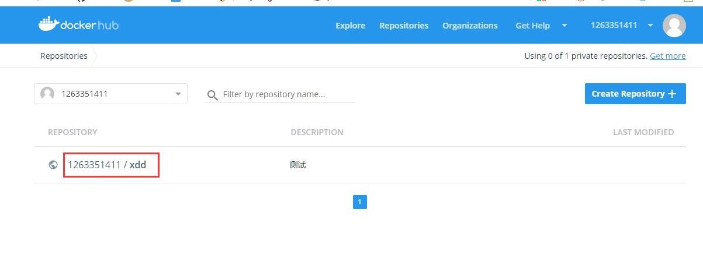  
3. 推送仓库到远程仓库`docker push 1263351411/xdd`

````text
[root@gdy ~]# docker login -u 1263351411
Password:
WARNING! Your password will be stored unencrypted in /root/.docker/config.json.
Configure a credential helper to remove this warning. See
https://docs.docker.com/engine/reference/commandline/login/#credentials-store

Login Succeeded
[root@gdy ~]# docker image ls
REPOSITORY          TAG                 IMAGE ID            CREATED             SIZE
xdd/httpd           v0.2                40e4281a313c        14 minutes ago      1.23MB
xdd/httpd           latest              7e0338fff785        About an hour ago   1.22MB
xdd/httpd           v0.1-1              7e0338fff785        About an hour ago   1.22MB
redis               4-alpine            442c73e7ad1d        3 days ago          20.4MB
alpine              latest              961769676411        3 days ago          5.58MB
busybox             latest              db8ee88ad75f        5 weeks ago         1.22MB
nginx               1.14-alpine         8a2fb25a19f5        4 months ago        16MB
alpine              3.8                 dac705114996        5 months ago        4.41MB
[root@gdy ~]# docker commit -a "xdd <xdd@xdd.com>" -c 'CMD ["/bin/httpd","-f","-h","/data/html"]' -p xddbox2 1263351411/xdd:latest
sha256:8faf31d9f5aa6c9078a19df9f71ef03480f94472a799187257d30074a0913f8e
[root@gdy ~]# docker image ls
REPOSITORY          TAG                 IMAGE ID            CREATED             SIZE
1263351411/xdd      latest              8faf31d9f5aa        4 seconds ago       1.23MB
xdd/httpd           v0.2                40e4281a313c        15 minutes ago      1.23MB
xdd/httpd           latest              7e0338fff785        About an hour ago   1.22MB
xdd/httpd           v0.1-1              7e0338fff785        About an hour ago   1.22MB
redis               4-alpine            442c73e7ad1d        3 days ago          20.4MB
alpine              latest              961769676411        3 days ago          5.58MB
busybox             latest              db8ee88ad75f        5 weeks ago         1.22MB
nginx               1.14-alpine         8a2fb25a19f5        4 months ago        16MB
alpine              3.8                 dac705114996        5 months ago        4.41MB
[root@gdy ~]# docker push 1263351411/xdd
The push refers to repository [docker.io/1263351411/xdd]
f185c6337d6a: Pushed
0d315111b484: Mounted from library/busybox 
latest: digest: sha256:9d3fdb0a087e4c45d16734fa8c6d180d9d7e0171d70c55c3759b7c24336ec6c1 size: 734
[root@gdy ~]#
````

#### 镜像导入和导出

1. 导出语法`docker save [OPTIONS] IMAGE [IMAGE...]`
    1. 选项
        * `--output`,-o:写入文件
    * `docker save -o xdd.gz xdd/httpd:v0.2 xdd/httpd:latest`将“xdd/httpd:v0.2 xdd/httpd:latest”这两个镜像打包保存为xdd.gz
        * 打包后可以使用scp推送文件到指定主机：`scp xdd.gz 192.168.61.108:/root/`#将xdd.gz推送到108主机上的/root/目录下
2. 导入语法`docker load [OPTIONS]`
    1. 选项：
        * `--input,-i`从tar中读取文件而不是从stdin中读取
        * `--quiet,-q`抑制负载输出
    * `docker load -i xdd.gz`在新的主机上可以使用load命令将打包好的文件加载

## docker容器虚拟化网络

* `docker network ls` 查看docker支持的网络
    1. `bridge` #桥接网络，默认为docker容器的默认网络
    2. `host` #宿主机网络模型
    3. `none` #不指定网络，即相当于没有网卡

* docker一共有四种网络模型
    1. `closed container`私有网络，即没有网卡。
    2. `Bridged container`桥接网络模型
    3. `Joined container` 联盟式网络(相当于两个容器之间共享网络，即两台主机共享同一个网卡等。)
    4. `Open container`开放式网络(通常开发的是物理网卡的网络接口，相当于共享宿主机网络)
    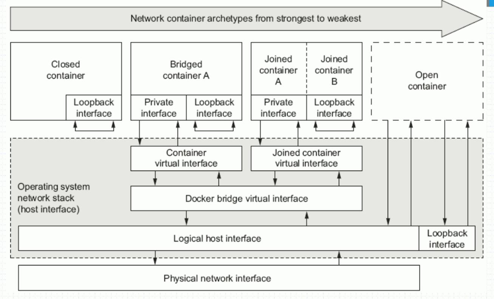  

* `docker network inspect bridge`#查看bridge网络的配置信息
    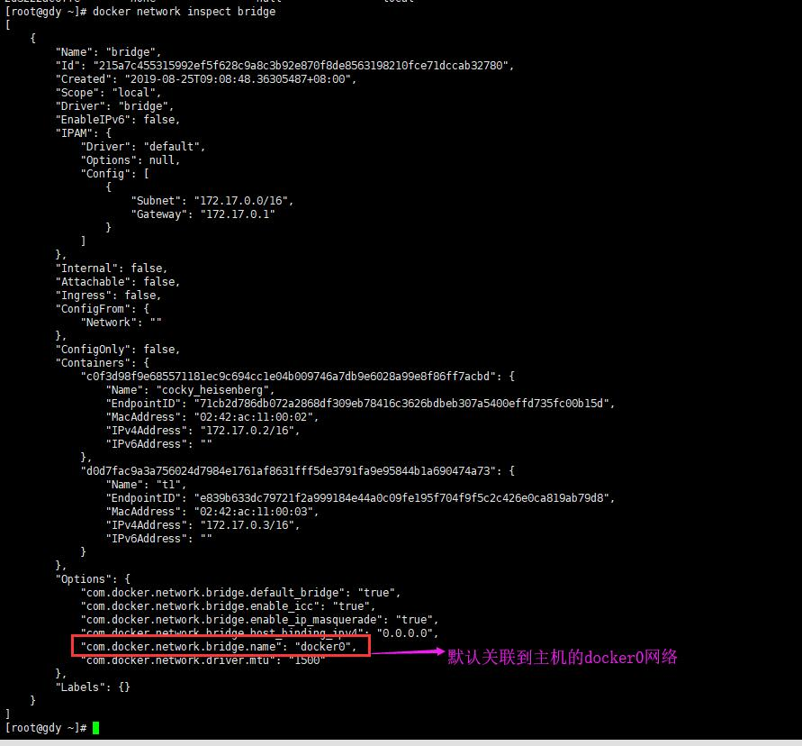  

* 使用ip命令模拟名称空间之间的通信
    1. `ip netns add r2` #为宿主机添加一个网络名称空间为r2
    2. `ip netns add r1` #为宿主机添加一个网络名称空间为r1
        * `ip netns list` *#查看宿主机的所有网络名称空间
        * `ip netns exec r1 ifconfig` #查看名称空间为r1的网络(如果没有可用网络，即没有显示)
        * `ip netns exec r1 ifconfig -a` #查看名称空间为r1的网络详细信息
    3. `ip link add name veth1.1 type veth peer name veth1.2` #创建一组虚拟网卡对veth1.1和veth1.2
        * `ip link show` #可用查看虚拟网卡。
    4. `ip link set dev veth1.1 netns r1`#将虚拟网卡veth1.1移动到网络名称空间r1中
        * `ip netns exec r1 ifconfig -a` 可用看到已经移动过来的veth1.1网卡，但是没有激活
    5. `ip netns exec r1 ip link set dev veth1.2 name eth0` #将网络名称r1中的虚拟网卡veth1.2的名称修改为eth0
    6. `ifconfig veth1.1 10.1.0.2/24 up` 激活虚拟网卡veth1.1,ip为10.1.0.2/24
    7. `ip netns exec r1 ifconfig eth0 10.1.0.2/24 up` #激活r1中的虚拟网卡eth0 ip为：10.1.0.2/24
        * `ip netns exec r1 ifconfig` #此时key看到激活后的虚拟网络eth0,已经激活
        * `ping 10.1.0.2` #在宿主机上直接ping，可以看到链接成功
    8. `ip link set dev veth1.2 netns r2`#将虚拟网卡veth1.2移动到网络名称空间r2中
    9. `ip netns exec r2 ifconfig veth1.2 10.1.0.3/24 up` #激活r2中的虚拟网卡veth1.2 ip为 10.1.0.3/24
    10 `ip netns exec r2 ping 10.1.0.2` 使用r2名称空间访问r1名称空间的ip地址，可以链接。

### 四种网络模型的创建

* 相关命令
    1. `--rm` 停止后自动删除容器
        * `docker run --name t1 -it --rm busybox:latest`#创建容器，关闭后容器会被自动删除
    2. `--network` #为创建的容器指定网络，如果不指定，默认为桥接模式bridge
        * `docker run --name t1 -it --network bridge --rm busybox:latest`
    3. `-h --hostname` #为容器创建的容器指定主机名,如果不指定，默认为容器id
        * `docker run --name t1 -it --network bridge -h t1.xdd.com --rm busybox:latest` #同上面例子，指定了主机名为t1.xdd.com
    4. `--dns` #为创建的容器指定dns服务器地址
        * `docker run --name t1 -it --network bridge -h t1.xdd.com --dns 114.114.114.114 --rm busybox:latest` #指定创建的容器dns为114.114.114.114
    5. `--dns-search` 指定搜索域
        * `docker run --name t1 -it --network bridge -h t1.xdd.com --dns 114.114.114.114 --dns-search ilinux.io --rm busybox:latest` #指定创建的容器dns-search搜索域为：ilinux.io
    6. `--add-host`添加指定的容器本地主机名解析
        * `docker run --name t1 -it --network bridge -h t1.xdd.com --dns 114.114.114.114 --dns-search ilinux.io --add-host www.xdd.com:1.1.1.1 --rm busybox:latest` #为新创建的主机添加www.xdd.com域名指定到1.1.1.1主机上
    7 `-p，--publish-all`选项的使用格式
        * `-p <containerPort>` #将指定的容器端口映射至主机所有地址的一个动态端口
        * `-p <hostPort>:<containerPort>` #将容器端口`<containerPort>`映射到指定的主机端口`<hostPort>`
        * `-p <ip>::<containerPort>` #将指定的容器端口`<containerPort>`映射至主机指定`<ip>`的动态端口
        * `-p <ip>:<hostPort>:<containerPort>` #将指定的容器端口`<containerPort>`映射至主机指定的`<ip>`的端口`<hostPort>`
        1. "动态端口"指随机端口，具体的映射结果可使用docker port命令查看

1. **closed container**私有网络
    * `docker run --name t1 -it --network none --rm busybox:latest`#根据busybox:latest镜像创建一个容器，容器名为t1,容器停止后自动删除，容器使用的网络模型为none,即仅主机模式。
2. **Bridged container**桥接模式
    * Docker0为NAT桥，因此容器一般获得的是私有网络地址
    * 可以把容器想像为宿主机NAT服务背后的主机
    * 如果开发容器或其上的服务为外部网络反问，需要在宿主机上为其定义DNAT规则，例如
        1. 对宿主机某IP地址的访问全部映射给某容器地址
            * 主机IP 容器IP
                * `-A PREROUTING -d 主机IP -j DNAT --to-destination容器IP`
        2. 对宿主机某IP地址的某端口的访问映射给某容器地址的某端口
            * 主机IP:PORT 容器IP：PORT
                * `-A PREROUTING -d 主机IP -p {tcp|udp} --dport主机端口 -j DNAT --to-destination容器IP:容器端口`
    * 为docker run命令使用-p选项即可实现端口映射，无需手动添加规则

    1. `docker run --name web1 --network bridge -p 80 --rm xdd/httpd:v0.2`启动xdd/httpd:v0.2镜像，将启动后的容器暴露内部80端口随机映射到宿主机上的一个端口。(注意：这里xdd/httpd:v0.2默认会启动一个httpd的web服务在80端口上，上面文档有说明配置方法)
        * 注意：如果宿主机上有多个ip地址，默认是映射到所有ip地址上对应的这个端口上。即`0.0.0.0:port`
        * `docker inspect web1`可以查看容器详细信息
        * `iptables -t nat -vnl`可以查看网络映射地址和端口
            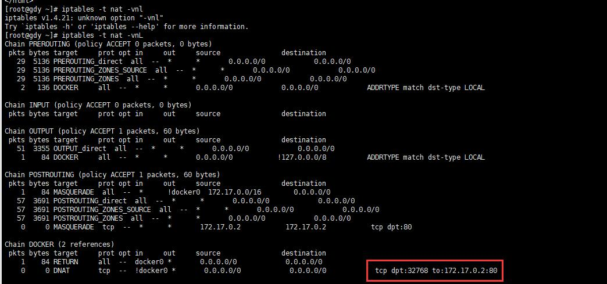  
              
        * `docker port web1`可以查看容器web1上映射的端口信息
    2. `docker run --name web1 --network bridge -p 192.168.61.109::80 --rm xdd/httpd:v0.2` 同上，在宿主机的端口映射为：`192.168.61.108:随机post <-- web1容器80端口`
    3. `docker run --name web1 --network bridge -p 80:80 --rm xdd/httpd:v0.2` 同上，端口映射为：`web1容器80 -->  0.0.0.0:80`
    4. `docker run --name web1 --network bridge -p 192.168.61.109:80:80 --rm xdd/httpd:v0.2` 同上，端口映射为：`web1容器80 -->  192.168.61.109:80`
    * 如果需要多个端口，-p选项可以使用多次。
3. **Joined container**联盟式容器网络
    * 联盟式容器时指使用某个已存在容器的网络接口的容器，接口被联盟内的各容器共享使用；因此联盟式容器彼此间完全隔离，例如：
        1. 创建一个监听与2222端口的http服务容器
            * `docker run -d -it --rm -p 2222 busybox:latest /bin/httpd -p 2222 -f`
        2. 创建一个联盟式容器，并查看监听的端口
            * `docker run -it --rm --net container:web --name joincd busybox:latest netstat -tan`
    * 联盟式容器彼此间虽然共享同一个网络名称空间，但其他名称空间如User、Mount等还是隔离的
    * 联盟式容器彼此间存在端口冲突的可能性，因此，通常只会在多个容器上的程序需要程序loopback接口互相通信、或对某已存在容器的网络属性进行监控时才使用此种模式的网络模型

    1. **创建联盟的两个容器**
        * `docker run --name b1 -it --rm busybox` #正常先启动一个容器，默认会分配一个ip为桥接模式
            1. `mkdir /tmp/dir`创建目录
            2. `echo "hello word" >/tmp/index.html` #在tmp目录下创建index.html文件
            3. `httpd -h /tmp/` #启动httpd服务器，root目录为/tmp目录下
        * `docker run --name b2 -it --network  container:b1 --rm busybox` #启动第二个容器，指定和b1共享同一个网络。
        * 测试
            1. `ls /tmp/` 可以看到谁然共享网络，单不会共享文件目录
            2. `wget -O - -q 127.0.0.1` #可以看到能获取到80端口的web服务器文件内容“Hello word”
4. **Open container**（共享主机网络)
    1. 建立和宿主机的联盟(共享宿主机网络)
        * `docker run --name b2 -it --network host --rm busybox` #新运行的容器b2和宿主机共享同一网络和ip

### docker网络相关配置

1. 自定义docker0桥的网络属性信息：`/etc/docker/daemon.json`文件

    ````json
    {
        "bip": "192.168.1.5/24", //docker0桥接网络ip和子掩码
        "fixed-cidr": "10.20.0.0/16",
        "fixed-cidr-v6": "2001:db8::/64",
        "mtu": 1500,
        "default-gateway": "10.20.1.1", //每个容器启动时，获得的默认网关
        "default-gateway-v6": "2001:db8:abcd::89", //每个容器启动时，获得的ipv6网关
        "dns": ["10.20.1.2","10.20.1.3"], //每个容器启动后自动拥有响应的服务器dns地址
        "hosts": ["tcp://0.0.0.0:2375","unix:///var/run/docker.sock"] //docker客户端连接的docker服务器地址，默认为docker.sock表示连接本机。
    }
    ````

2. dockerd守护进程的C/S，其默认仅监听Unix SOcket格式的地址`/var/run/docker.sock`;如果使用TCP套接字，需要修改`/etc/docker/daemon.json文件中的"hosts"属性`
    * `hosts: ["tcp://0.0.0.0:2375","unix:///var/run/docker.sock"]` #注意：ip端口可以自己定义
        * docker客户端访问不同服务器上的docker，可以向dockerd直接传递"-H|--host"选项

        ````sh
        [root@gdy ~]# cat /etc/docker/daemon.json 
        {
        "registry-mirrors": ["https://qx4pe1od.mirror.aliyuncs.com"],
        "bip": "10.10.0.1/16",
        "hosts": ["tcp://192.168.61.108:8888","unix:///var/run/docker.sock"]
        }

        [root@gdy ~]# systemctl stop docker
        [root@gdy ~]# systemctl restart docker
        [root@gdy ~]# ss -tnl
        State       Recv-Q Send-Q             Local Address:Port                            Peer Address:Port              
        LISTEN      0      128                            *:25672                                      *:*                  
        LISTEN      0      50                             *:3306                                       *:*                  
        LISTEN      0      128                            *:111                                        *:*                  
        LISTEN      0      128                            *:4369                                       *:*                  
        LISTEN      0      5                  192.168.122.1:53                                         *:*                  
        LISTEN      0      128                            *:22                                         *:*                  
        LISTEN      0      128                    127.0.0.1:631                                        *:*                  
        LISTEN      0      128               192.168.61.108:8888                                       *:*                  
        LISTEN      0      128                            *:15672                                      *:*                  
        LISTEN      0      100                    127.0.0.1:25                                         *:*                  
        LISTEN      0      128                    127.0.0.1:6010                                       *:*                  
        LISTEN      0      128                           :::5672                                      :::*                  
        LISTEN      0      128                           :::111                                       :::*                  
        LISTEN      0      128                           :::3888                                      :::*                  
        LISTEN      0      128                           :::4369                                      :::*                  
        LISTEN      0      128                           :::22                                        :::*                  
        LISTEN      0      128                          ::1:631                                       :::*                  
        LISTEN      0      100                          ::1:25                                        :::*                  
        LISTEN      0      128                          ::1:6010                                      :::*                  
        [root@gdy ~]#
        ````

        * 修改完成后再其他主机上可以使用如下命令访问：
            1. `docker -H 192.168.61.108:8888 ps` #查看指定docker主机的容器信息。
        * 注意：如果重新启动出现如下错误：
            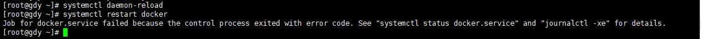  
            1. 解决办法：修改`/lib/systemd/system/docker.service`配置文件，将`ExecStart=/usr/bin/dockerd -H fd:// --containerd=/run/containerd/containerd.sock`中的`-H fd://`去掉即可
            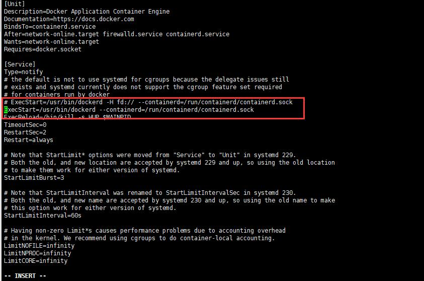  

3. 创建网络
    * `docker network create -d bridge --subnet "172.26.0.0/16" --gateway "172.26.0.1" mybr0` #创建一个mybr0的网络，网络模式为bridge桥接模式，子网络为`172.26.0.0/16`,网关为`172.26.0.1`
    * `docker run --name t1 --it --net mybr0 busybox:latest` # `--net是--network的简写`，从镜像busybox:latest中启动一个容器为t1,并加入mybr0网络
    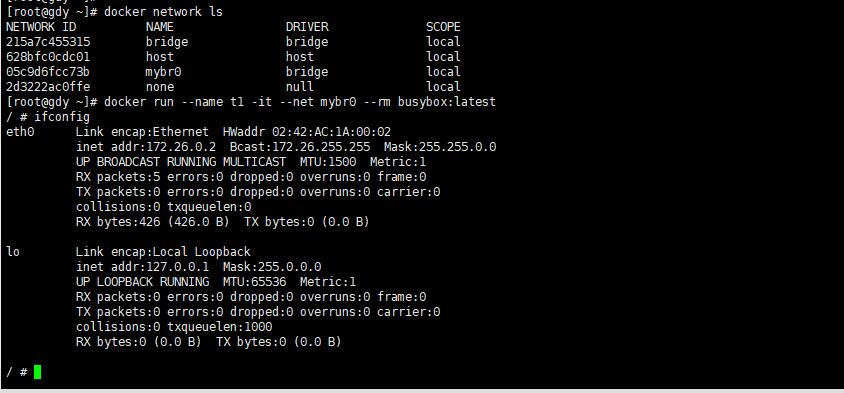  

## docker存储卷


