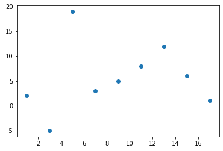
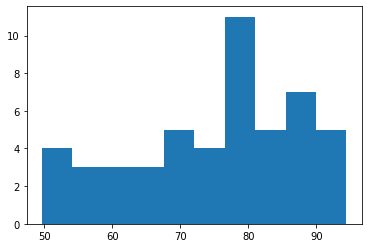

# 可视化Matplotlib画图

@[toc]

使用matplotlib可以很轻松的解决数据展示问题，通常用作绘制图表。Matplotlib是最流行的Python二维底层绘图，主要用做数据可视化图表绘制，支持所有2D作图和部分3D作图。生成印刷质量图像

* 官方绘图示例展示：[http://matplotlib.org/gallery.html](http://matplotlib.org/gallery.html)  

## matplotlib.pyplot模块

* 参考文档[https://matplotlib.org/api/_as_gen/matplotlib.pyplot.html#module-matplotlib.pyplot](https://matplotlib.org/api/_as_gen/matplotlib.pyplot.html#module-matplotlib.pyplot)
* 常用方法
    1. pyplot.plot([x],y,[fmt],*,data=None,**kwargs)
    2. plot([x], y, [fmt], [x2], y2, [fmt2], ..., **kwargs)
        * [x],y:数组或标量。可选参数，不能作为关键字传递。数据点的水平(x),垂直坐标(y)，x的值是可选参数，默认为range(len(y))的值。通常x,y是一维数据，也可以是二维数据，需要用列表表示。
        * fmt:str类型参数。格式字符串。例如'ro'表示红色圆其中r表示red,o表示圆圈

* fmt中的颜色和样式类型

|颜色字符|风格字符|标记字符1|标记字符2|
|:-----|:-------|:--------|:-------|
|`r`红色|`-`实线|`o`实心圆标记|`1`下花三角标记|
|`g`绿色|`--`或`:`虚线，破折线|`.`点标记|`2`上花三角标记|
|`b`蓝色|`-.`点划线|`,`橡树标记，极小的点|`3`左花三角标记|
|`w`白色|`:`点虚线，虚线|`v`倒三角标记|`4`右花三角标记|
|`""`留空或空格。无线条|`^`上三角标记|`s`实心方形标记|
|`c`青色|`>`右三角标记|`p`实心五角标记||
|`m`洋红|`<`左三角标记|`h`竖六边形标记||
|`y`黄色|`*`星形标记|`H`横六边形标记||
|`k`黑色|`+`十字标记|`D`菱形标记||
||`x`x标记|`d`瘦菱形标记||
||`|`vline竖线标记|`_`水平线标记||

* kwargs参数中线条标记的结点样式

|名称|参数|
|:-----|:------|
|线条颜色|`color='g'`|
|线条风格|`linestyle='--'`|
|线条粗细|`linewidth=5.0`|
|标记风格|`marker='o'`|
|标记颜色|`markerfacecolor='b'`|
|标记尺寸|`markersize=20`|
|透明度|`alpha=0.5`|

* 简单示例绘图

````python
import matplotlib.pyplot as plt

plt.plot(1,2,'g^')
plt.plot(2,5,'bo')
plt.plot(6,7,'go')
plt.plot(2,2,'g^',3,4,'go')
plt.show()
````

  

* 绘制折线图

````python
plt.rcParams["font.family"] = ["华文新魏","Arial Unicode MS","Microsoft Yahei","SimHei","sans-serif"] #设置字体，默认使用数组第一个字体，其他为第一个字体不存在时使用
plt.rcParams["axes.unicode_minus"] = False
plt.title("折线图")
plt.plot([1,2,3,4,5],[5,4,9,2,1])
plt.show() #绘图
````

  

* 点图,默认x为range(len(y))

````python
plt.plot([1,2,3,4,3,4,2,3,8],'r2')
plt.show()
````

  

* 多参数绘制

````python
import matplotlib.pyplot as plt

plt.plot(
    [1,2,3,4,5,6], #x轴坐标
    [3,4,5,2,7,8], #y轴坐标
    # 线条样式
    #color='red',
    #color='r',
    color = '#000000',#线条颜色
    linestyle='--',#线条样式
    linewidth=20,#线条粗细

    #标记样式
    marker='*',#标记样式
    markerfacecolor='r',#标记颜色
    markersize=50,#标记大小

    alpha=0.5,#透明度
)
plt.show()
````

  

## 图形显示

* matplotlib导入pyplot时会默认导入inline，直接在网页中显示图形，图形显示方式有以下几种，只需要在渲染图形前使用就行

````python
%matplotlib inline #直接在网页上显示图形，内联导入(导入pyplot库时同步导入)
%matplotlib qt5  #GUI输出图形，窗口图
%matplotlib notebook #
````

## 散点图、气泡图

* 散点图作用：
    1. 单组数据，可以查看数据分布(不常用，最好使用直方图实现)
    2. 多组数据，可以查看各数据之间是否存在相关性
* 坐标系中，每一个值用一个点(x轴，y轴确定)表示

````python
import matplotlib.pylab as plt

# 数据
x = [1,3,5,7,9,11,13,15,17]
y = [2,-5,19,3,5,8,12,6,1]

plt.scatter(x,y)
plt.show()
````

  

* 多组散点图同时绘制

````python
import matplotlib.pylab as plt

plt.scatter(
    [1,3,5,7,9,11,13,15,17], #x轴坐标
    [2,-5,19,3,5,8,12,6,1], #y轴坐标
    # color='r', #点颜色
    c=[1,2,3,4,5,6,7,8,9],
    marker="*",#点样式
    linewidth=1, #线宽
    alpha=0.5,#透明度

    # 点大小
    #s=1000,
    s=[50,100,150,200,250,300,350,400,450]
)

plt.scatter(
    [10,12,16,18],
    [5,10,12,15],
)

plt.show()
````

  

## 条形图barh/柱状图bar

* 条形图(横向)
* 柱状图(纵向)

条形图和柱状图用来比较各**独立类别**下的单独数据**大小**

* 柱状图plt.bar

````python
import matplotlib.pylab as plt

x = [1,2,3,4,5]
y = [3,6,1,8,2]
plt.bar(x,y,width=0.5,color='r',alpha=0.3)

# 修改坐标标注
# plt.xticks([1,2,5,8,10])
plt.xticks([1,2,3,4,5],['a','b','c','d','e']) #1-5分别对应a-e
plt.yticks([3,6,1,8,2],[11,22,33,44,55]) #对应别名
plt.show()
````

  

* 条形图plt.barh

````python
import matplotlib.pylab as plt

x = [1,2,3,4,5]
y = [3,6,1,8,2]
plt.barh(x,y,height=0.5)

plt.show()
````

  

### 柱状图案例

* 某班班级男生和女生各科成绩平均分数据可视化

|学科|男生|女生|
|----|:----|:----|
|语文|85.5|94|
|数学|91|82|
|英语|72|89.5|
|物理|59|62|
|化学|66|49|

* 使用柱状图显示

````python
import matplotlib.pylab as plt

# 男生平均分，语文/数学/英语/物理/化学
boy = [85.5,91,72,59,66]
# 女生平均分
girl = [94,82,89.5,62,49]
#坐标轴,帮助显示男生成绩
x = [1,2,3,4,5]
#x坐标轴，帮助显示女生成绩
x1 = [1.3,2.3,3.3,4.3,5.3]

plt.bar(x,boy,width=0.3,color='g',alpha=0.3)
plt.bar(x1,girl,width=0.3,color='r',alpha=0.3)
plt.xticks([1.15,2.15,3.15,4.15,5.15],["Chi","Math","Eng","Phy","Che"])

# 设置标签函数
def plttext(plt,x,j):
    plt.text(x, #x轴，course学科位置
             j, #y轴，boy分数
             '%.1f' % j, #数据转换为一位小数
             ha='center',#水平对齐
             va='bottom',#垂直对齐
             alpha = 0.5
            )
# 将数据标注在柱状图上
for i in range(len(x)):
    plttext(plt,x[i],boy[i])
    plttext(plt,x1[i],girl[i])

plt.grid(linewidth=0.1) #添加网络虚线
plt.show()
````

  

## 饼图

* 饼图用于显示各项相对总和的百分比大小

* 简单示例

````python
import matplotlib.pylab as plt

p = [15,30,45,10]
plt.pie(p)
plt.show()
````

  

* 案例：2017年9国军费占比数据可视化

|国家|军费占比|
|:-----|:-----------|
|美国|    0.5548467|
|中国|    0.14444868|
|印度|    0.05094268|
|沙特|    0.04846696|
|俄国|    0.046753|
|日本|    0.04418206|
|英国|    0.04161112|
|德国|    0.03799276|
|法国|    0.03075605|

````python
import matplotlib.pylab as plt

mark = ['America','China','India','Saudi','Russia','Japan','Britain','Germany','France']
# 各国占9国军费的比例
percent = [0.5548467,0.14444868,0.05094268,0.04846696,0.046753,0.04418206,0.04161112,0.03799276,0.03075605]
plt.figure(figsize=(8,8))

plt.pie(
    percent,#百分比
    labels = mark, #名称
    explode = (0,0.1,0,0,0,0,0,0,0),  # 突出块，突出比例
    autopct = '%1.1f%%', #显示百分比方式
    startangle = -110, #饼图起始的角度，度数，默认0为右侧水平180度开始，逆时针旋转
)

plt.axis('equal') #正圆形饼图，x/y轴尺寸相等，默认是扁图
plt.show()
````

  

## 直方图

* 直方图是表达数据的**分布情况**的统计图表，一般用来表示同等区间内，某类数值出现的个数或频率(频率=出现次数/总数)
* x轴表示分组数据，y轴表示分布情况
* 从频率分布直方图可以直观估计出：
    1. **众数**：频率分布直方图中最高矩形的低边中点的横坐标(数据中出现次数最多的数字叫做**众数**)
    2. **中位数**：把频率分布直方图分成两个面积相等部分的平行于Y轴的直线横坐标(按顺序排列的一组数据中居于中间位置的数,如果观察值有偶数个，通常取最中间的两个数值的平均数作为**中位数**)
* 直方图与柱状图的区别：
    1. **直方图**：分区之间连续无间断，表示连续变量；值用矩形面积表示
    2. **条形图**：各柱之间有间隙，表示孤立的、不连续分类变量；值用矩形长度表示

* **众数、平均数、中位数的区别**
    1. 众数：出现频率最高的数。
    2. 平均数：对极端值非常敏感
    3. 中位数：
        * 对极端值不敏感
        * 95%置信区间
    4. 总结：
        1. 数据区间范围固定的，一般用平均值
        2. 数据区间范围不固定，一般用中位数或者95%置信区间
    5. 比赛打分之所以使用平均数，利用平均值的敏感(中位数会出现大量的相同份数)，同时为了降低平均值的敏感程度，去掉最高分和最低分

* 示例：中位数，平均值

````python
import numpy as np
a = [1,2,3,4,5,6,7,8,9,10,11]
print("a中位数是：",np.mean(a))
print("a平均值是：",np.median(a))

b = a.copy()
b.append(10000) #添加极端值
print("b中位数是：",np.mean(b))
print("b平均值是：",np.median(b))
````

* 输出结果为：

````txt
a中位数是： 6.0
a平均值是： 6.0
b中位数是： 838.8333333333334
b平均值是： 6.5
````

### 案例：1班和2班语文成绩统计数据可视化

* 简单显示

````python
import matplotlib.pylab as plt
# 成绩数据
h1 = [ 88.2,  83.5,  68.8,  85.4,  78.6,  69.3,  60.6,  91.2,  52.7,
        85.9,  57.1,  68. ,  66.6,  78.2,  78.8,  85. ,  89.1,  74.4,
        93.6,  75.7,  54.3,  55. ,  90.9,  79.4,  94.4,  86.7,  82.4,
        76.7,  78.7,  72.3,  83.9,  78.6,  80. ,  70.5,  87.1,  80.3,
        87.9,  65.1,  67.4,  61.5,  49.7,  77.1,  91.4,  72. ,  61.5,
        73.9,  76.9,  88.2,  51.2,  53.9]

h2 = [ 79.5,  99. ,  80. ,  71. ,  79.2,  85.6,  79.2,  68.8,  68.7,
        96.5,  63.8,  81.8,  76.9,  80. ,  73.8,  77.1,  79.6,  76.8,
        73.9,  73.2,  66. ,  76.2,  76.4,  65.3,  75.2,  74.5,  87.5,
        78.4,  95. ,  72.6,  86. ,  71.7,  71. ,  87.7,  83.9,  76.8,
        72.3,  67. ,  67.8,  79.6,  81.9,  83. ,  65.6,  91.6,  75.5,
        77.6,  82.8,  87.5,  75.1,  79.4]

plt.hist(h1)
plt.show()
````

  

* 着色显示

````python
import matplotlib.pylab as plt
# 成绩数据
h1 = [ 88.2,  83.5,  68.8,  85.4,  78.6,  69.3,  60.6,  91.2,  52.7,
        85.9,  57.1,  68. ,  66.6,  78.2,  78.8,  85. ,  89.1,  74.4,
        93.6,  75.7,  54.3,  55. ,  90.9,  79.4,  94.4,  86.7,  82.4,
        76.7,  78.7,  72.3,  83.9,  78.6,  80. ,  70.5,  87.1,  80.3,
        87.9,  65.1,  67.4,  61.5,  49.7,  77.1,  91.4,  72. ,  61.5,
        73.9,  76.9,  88.2,  51.2,  53.9]

h2 = [ 79.5,  99. ,  80. ,  71. ,  79.2,  85.6,  79.2,  68.8,  68.7,
        96.5,  63.8,  81.8,  76.9,  80. ,  73.8,  77.1,  79.6,  76.8,
        73.9,  73.2,  66. ,  76.2,  76.4,  65.3,  75.2,  74.5,  87.5,
        78.4,  95. ,  72.6,  86. ,  71.7,  71. ,  87.7,  83.9,  76.8,
        72.3,  67. ,  67.8,  79.6,  81.9,  83. ,  65.6,  91.6,  75.5,
        77.6,  82.8,  87.5,  75.1,  79.4]

plt.hist(
    h1, #直方图数据
    10,#直方图个数
    density = 1,#默认0 数据出现个数，1出现个数归一化为出现的频率
    histtype = 'bar',#直方图样式：默认bar,stepfilled填充颜色，step不填充只有线条
    facecolor = 'gray', #直方图颜色
    edgecolor = 'w', #直方图边框颜色
    alpha = 0.3,
)

#直方图叠加
plt.hist(
    h2,
    10,
    density = 1,
    histtype = 'bar',
    facecolor = 'r',
    alpha = 0.3
)
plt.show()
````

  

## 箱线图

* 箱线图又名盒须图，是一种用作显示一组数据离散情况的统计图表，常用作多组数据的综合统计比较
* 四分位数：
    1. 第一四分位：(Q1)，又称为“小四分位数”，等于该样本中所有数值由小到大排列后第25%的数字。
    2. 第二四分位：(Q2),又称为“中位数”，等于该样本中所有数值由小到大排列后第50%的数字。
    3. 第三四分位：(Q3),又称为“较大四分位数”，等于该样本中所有数值由小到大排列后第75%的数字。
* 箱线图主要包含5个统计量，从上到下，从高到低：
    1. 最大非异常值，上边线
    2. Q3，箱体上边缘上四分位数
    3. Q2,中位数线
    4. Q1,箱体下边缘四分位数
    5. 最小非异常值，下边线
    6. 除了上面5个统计量，上下边缘外侧可能还有异常值
* Q3和Q1的差值，即四分位数差
    1. 大于Q3 1.5倍四分位数差的值，或者小于Q1 1.5倍四分位数差的值，划为异常值

````python
import matplotlib.pylab as plt

a = [15,5,9,22,4,-5,45,-22]
plt.boxplot(a)
plt.show()
````

  

### 案例

* **某班级a/b/c三组学员数学成绩统计分析可视化**

|组别\编号|1|2|3|4|5|6|7|8|
|:-------|:--|:--|:--|:--|:--|:--|:--|:--|
|a|42|55|79|68 |15 |98 | | |
|b|32|59|77|100| 92| 88|5|0|
|c|92|98|78|65 |97 |100|0| |

````python
import matplotlib.pylab as plt

a = [42,55,79,68,15,98]
b = [32,59,77,100,92,88,5,0]
c = [92,98,78,65,97,100,0]

plt.boxplot(
    (a,c,b),
    labels = ("a","c","b"), #标签
    # showfliers = False, #是否显示异常值，默认显示
    # whis = 1.5, #指定异常值参数：默认1.5倍四分位差
    showmeans = True, #是否显示平均值，默认不显示
    meanline = True, #是否用线标示平均值，默认用点
    widths = 0.5, #柱子宽度
    # vert = False, #默认True纵向，False横向
    patch_artist = True, #是否填充颜色
    boxprops = {'facecolor':'#ffff00','color':'green'},#箱体样式
)
plt.show()
````

  

## 热力图

* 热力图以二维形式展示数据的大小，主要用于数据的重要程度/相关度展示

````python
import matplotlib.pylab as plt

dt = [
    [1,2,3],
    [4,5,6],
    [7,8,9]
]
plt.imshow(
    dt,#数据
    cmap = 'gray',#配色，gray灰色
#     origin='lower',#水平翻转，默认upper,lower
#     interpolation='lanczos',#渲染，模糊
)
plt.colorbar() #侧栏
plt.show()
````

  

* 例子：可视化班级同学成绩和座位关系

````python
import matplotlib.pylab as plt
import numpy as np

a = np.random.randint(0,100,(10,10)) #生成一个10*10的二维书籍数组
print(a)
plt.figure(figsize=(10,10))
plt.imshow(
    a,#数据
#     cmap = 'gray',#配色，gray灰度
    interpolation = 'lanczos', #渲染，模糊
)

plt.xticks([0,1,2,3,4,5,6,7,8,9])
plt.yticks([0,1,2,3,4,5,6,7,8,9])
plt.grid()
plt.colorbar() #侧栏
plt.show()
````

  

## 叠加图像到背景上

````python
import matplotlib.pylab as plt

# 灰度图像数组
imghuidu = [
    [3,50,2,4],
    [45,22,3,4],
    [1,2,3,4],
]

plt.imshow(imghuidu)
plt.show()

# 彩色图像数组

imgcs = [
    [[255, 0, 255],[255, 0, 255],[255, 0, 255],[255, 0, 255]],
    [[255, 0, 255],[255, 0, 255],[255, 0, 255],[255, 0, 255]],
    [[255, 0, 255],[255, 0, 255],[255, 0, 255],[255, 0, 255]],
]

plt.imshow(imgcs)
plt.show()

img = plt.imread('d:/pyplot_001.jpg') #将图像转为数组
plt.imshow(img)
plt.show()
````

  

* 图像叠加与拉升

````python
import matplotlib.pylab as plt

img = plt.imread('d:/pyplot_001.jpg') #将图像转为数组
plt.imshow(img,
           extent = (0,25,0,25) #按照左右下上拉伸填充图像
)

plt.scatter(
    [10.5,14.5],
    [14,14.5],
    s=[100,200],
    color='r',
    alpha=0.7
)
# plt.axis("off") #去掉坐标轴
plt.show()
````

  
