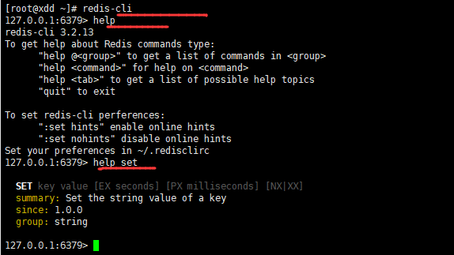
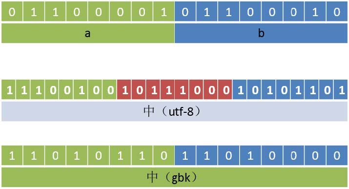
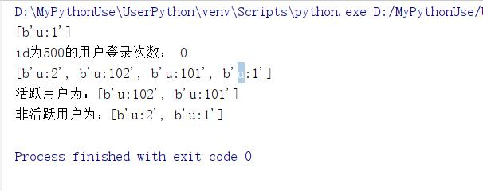
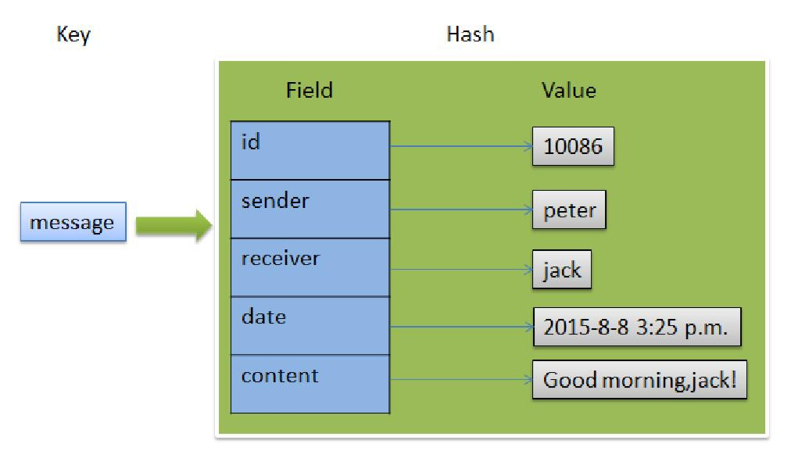
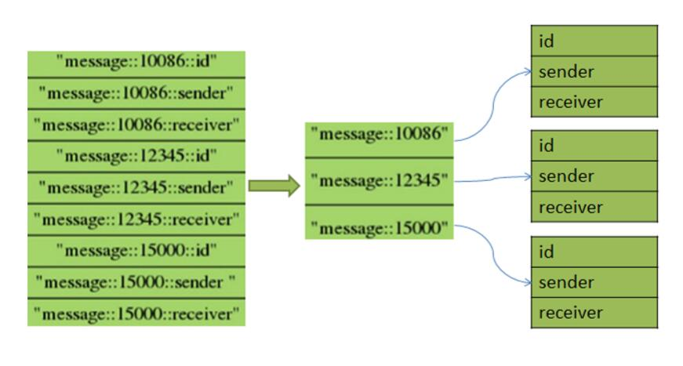

# Redis数据模型

* redis支持数据模型非常丰富

## 键Key

* Redis key需要一个二进制值，可以用任何二进制序列作为key值，可以是简单字符串，也可以是个JPEG文件的二精制序列。空字符串也有效率key值

* key取值原则
    1. 键值不需要太长，消耗内存，而且查找这类键值的计算成本较高
    2. 键值不宜过短，可读性较差
    3. 习惯上key采用`user:123:password`形式，表示用户id为123的用户的密码

## 字符串

* 字符串是一种基本简单的Redis值类型。说是字符串，其实可以是任意可以序列化的数据。
* 一个字符串类型的值最多能存储**512M字节**的内容。

## python中的redis编程

* 安装redis库`pip install redis`

````python
import redis

db = redis.Redis("192.168.61.109") #默认本地6379的0号库

print(db.keys('*')) #查看所有匹配keys

db.set("xdd",0b01100010) #0x62
print(db.get("xdd"))

db.set(0b11,0x63)
print(db.get(0b11))
print(db.get(3))
print(db.get("3"))

print("- "*30)
print(db.keys('*')) #查看所有匹配keys
````  

注意：上列中0x62实际上发生了类型变化，因为返回的bytes类型98，实际上对应的ASCII的98，已经是2字节了。数值会转换成10进制64位有符号数后，再转成字符串，存入redis中。  

## 查看帮助

* 使用redis-cli可以进入redis命令行界面

````shell
> Help 查看帮助
> Help <tab> 使用tab建切换帮助
> Help set 查看set命令帮助
> Help @string 查看命令组帮助
````



## 字符串设置

* 语法：`SET key value [Ex seconds][PX milliseconds] [NX|XX]`设置字符串值（设置单个键值）
    1. `EX`设置过期时间，秒，等同于`SETEX key seconds value`
    2. `PX`设置过期时间，毫秒，等同于`PSETEX key millieconds value`
    3. `NX`键不存在，才能设置，等同于`SETNX key value`
    4. `XX`键存在时，才能设置
* 设置多个键值`MSET key value [key value ...]`
    1. 设置多个键值字符串，key存在则覆盖，key不存在则增加。原子操作
* `MSETNX key value [key value ...]`可以不存在则设置，key存在则失败。nx指代不存在。也是原子操作命令。

````shell
127.0.0.1:6379> set s1 abc
OK
127.0.0.1:6379> get s1
"abc"
127.0.0.1:6379> mset s2 a s3 b s4 c
OK
127.0.0.1:6379> keys *
1) "xdd"
2) "3"
3) "s1"
4) "s2"
5) "s3"
6) "s4"
127.0.0.1:6379> msetnx s1 s
(integer) 0
127.0.0.1:6379> get s1
"abc"
127.0.0.1:6379>
````

### 过期操作和生存时间

* Redis中可以给每个Key设置一个生存时间(秒或毫秒),当达到这个时长后，这些键值将会被自动删除
* 设置多少秒或者毫秒后过期
    1. `EXPIRE key seconds`设置key多少秒后过期
    2. `PEXPIRE key milliseconds`设置key多少毫秒后过期
* 设置在指定Unix时间戳过期
    1. `EXPIREAT key timestamp` 设置到指定时间戳后过期
    2. `PEXPIREAT key milliseconds-timestamp`
* 持久key，即取消过期
    1. `PERSIST key`持久key，即取消过期

* **适用场景**
    1. 多少秒过期，例如一个缓存数据失效
    2. `PEXPIREAT key milliseconds-timestamp`比如现在开始缓存数据，0点失效
* Time to Live,key的剩余生存时间
    1. `TTL key`查看key的剩余生存时间，秒级别
    2. `PTTL key`查看key的剩余生存时间，毫秒级别
    3. 命令返回结果：
        * key存在但没有设置TTL，返回-1
        * key存在，但还在生存期内，返回剩余的秒或者毫秒
        * key曾经存在，但已经消亡，返回-2(2.8版本之前返回-1)

* 示例一：

````shell
设置键值s5:abc 20 秒后过期
# set s5 abc ex 20
查看s5剩余过期时间
# ttl s5
127.0.0.1:6379[1]> set s5 abc ex 20
OK
127.0.0.1:6379[1]> ttl s5
(integer) 17
127.0.0.1:6379[1]> ttl s5
(integer) 15
127.0.0.1:6379[1]> ttl s5
(integer) 14
127.0.0.1:6379[1]> ttl s5
(integer) 12
127.0.0.1:6379[1]> ttl s5
(integer) 11
127.0.0.1:6379[1]> ttl s5
(integer) -2
127.0.0.1:6379[1]>
````

|命令|意义|
|:------|:--------|
|`ttl s6`|查看key为s6的键过期时间，秒级别|
|`pttl s6`|查看key为s6的键过期时间，毫秒级|
|`setnx s6 6`|设置key为s6的值为6|
|`expire s6 60`|设置key为s6的键60秒后过期|
|`persist s6`|取消key为s6的过期时间，即永不过期|
|`EXPIREAT cache 1355292000`|设置key为cache在1355292000(秒)时间戳后过期|
|`PEXPIREAT cache 1555555555005`|设置key为cache在1555555555005(毫秒)时间戳后过期|

### key操作

* 语法：`keys pattern`查询key
    1. pattern可以取如下值：
        1. `*`任意长度字符
        2. `?`任意一个字符
        3. `[]`字符集合，表示一个字符

|命令|意义|
|:--------|:----------|
|`keys *`|查看当前库中所有key键|
|`keys s?`|查看当前库中以s开头，只有两个字符的key|
|`keys s[13]`|查看当前库中以s开头，只有两个字符，且第二个字符时1或者3的key|
|`keys s[1-3]`|查看当前库中以s开头，只有两个字符，且第二字符在[1,3]之间的key|
|`keys s*`|查看当前库中以s开头的字符|
|`keys ??`|查看当前库中是两个字符组成的key|

* 其他相关命令
|命令|意义|
|:-----------|:--------------|
|`TYPE key`|key类型|
|`EXISTS key`|key是否存在|
|`RENAME key newkey`|将key的建值重命名为newkey
|`RENAMENX key newkey`|将key的键值重命令为newkey
|`DEL key [key ...]`|将key键值对删除

### 字符串获取

|命令|意义|
|:---------|:------------|
|`GET key`|获取值|
|`MGET key [key ...]`|获取多个给定的键的值|
|`GETSET key value`|返回旧值并设置新值，如果键不存在，就创建并赋值|
|`STRLEN key`|获取key的value字符串长度|

````shell
127.0.0.1:6379> keys *
1) "xdd"
2) "3"
3) "s2"
4) "s3"
5) "s4"
127.0.0.1:6379> get s4
"c"
127.0.0.1:6379> mget s2 s3 s1
1) "a"
2) "b"
3) (nil)
127.0.0.1:6379> strlen s2
(integer) 1
127.0.0.1:6379> getset s5 100
(nil)
127.0.0.1:6379> get s5
"100"
127.0.0.1:6379> keys *
1) "xdd"
2) "3"
3) "s2"
4) "s3"
5) "s4"
6) "s5"
127.0.0.1:6379>
````

### 字符串操作

* 追加字符串
    1. `APPEND key value`追加字符串。如果键存在就追加；如果不存在就等同于`SET key value`
* 获取子字符串
    1. `GETRANGE key start end`索引值从0开始，支持负索引，-1表示最后一个字符。范围是[start,end],start必须在end的左边，否则返回空串
* 覆盖字符串
    1. `SETRANGE key offset value`从指定索引处开始覆盖字符串，返回覆盖后字符串长度。key不存在会创建新的。

* 简单示例

````shell
127.0.0.1:6379> select 1
OK
127.0.0.1:6379[1]> keys *
(empty list or set)
127.0.0.1:6379[1]> append s2 abc
(integer) 3
127.0.0.1:6379[1]> get s2
"abc"
127.0.0.1:6379[1]> append s2 efg
(integer) 6
127.0.0.1:6379[1]> get s2
"abcefg"
127.0.0.1:6379[1]> getrange s2 1 3
"bce"
127.0.0.1:6379[1]> getrange s2 0 -1
"abcefg"
127.0.0.1:6379[1]> setrange s2 3 12
(integer) 6
127.0.0.1:6379[1]> get s2
"abc12g"
127.0.0.1:6379[1]> setrange s2 -1 123456
(error) ERR offset is out of range
127.0.0.1:6379[1]> get s2
"abc12g"
127.0.0.1:6379[1]> setrange s2 3 123456789
(integer) 12
127.0.0.1:6379[1]> get s2
"abc123456789"
127.0.0.1:6379[1]> setrange s7 3 abc
(integer) 6
127.0.0.1:6379[1]> get s7
"\x00\x00\x00abc"
127.0.0.1:6379[1]>
````

### 自增、自减

* `INCR key`将key键对应的值增加1.必须是integer类型
* `DECR key`将key键对应的值减少1，必须是integer类型
* `INCRby key decrement`将key键对应的值增加decrement。
    1. decrement是数字，可以为正负
    2. key对应的value必须是integer类型
* `DECRBY key decrement`将key键对应的值减少加decrement。
    1. decrement是数字，可以为正负
    2. key对应的value必须是integer类型

* 简单示例

````shell
127.0.0.1:6379[1]> flushdb
OK
127.0.0.1:6379[1]> keys *
(empty list or set)
127.0.0.1:6379[1]> set s1 ab1
OK
127.0.0.1:6379[1]> set s2 4
OK
127.0.0.1:6379[1]> incr s1
(error) ERR value is not an integer or out of range
127.0.0.1:6379[1]> incr s2
(integer) 5
127.0.0.1:6379[1]> incr s3
(integer) 1
127.0.0.1:6379[1]> incr s2
(integer) 6
127.0.0.1:6379[1]> get s2
"6"
127.0.0.1:6379[1]> keys *
1) "s3"
2) "s2"
3) "s1"
127.0.0.1:6379[1]> get s3
"1"
127.0.0.1:6379[1]> incrby s2 -10
(integer) -4
127.0.0.1:6379[1]> incrby s2 8
(integer) 4
127.0.0.1:6379[1]> decrby s2 -10
(integer) 14
127.0.0.1:6379[1]> get s2
"14"
127.0.0.1:6379[1]>
````

## 库操作

* `redis-cli --help` #查看帮助
* `redis-cli -n 2` # 登录到第2号库
    1. 登录后命令上中切换库
        * `SELECT n`选择第n号库
        * `FLUSHDB` 清除**当前库**数据
        * `FLUSHALL`清除**所有库**中的数据

## 位图bitmap

* 位图不是真正的数类型，它是定义在字符串类型上，只不过把字符串按位操作
* 一个字符串类型的值最多能存储512M字节的内容，可以表示$2^{32}$位
    1. 位上限：
        * 512 = $2^9$
        * 1M = 1024*1024=$2^{10+10}$
        * 1Byte = 8bit = $2^3$bit
        * $2^{9+10+10+3}=2^{32}b=4294967296b$,接近43忆个位
* `SETBIT key offset value`设置某一位上的值
    1. offset 偏移量，从0开始
    2. value不写，默认是0，只能是0或1
* `GETBIT key offset`获取某一位上的值
* `BITPOS key bit [start][end]`返回指定值bit[0或者1]在指定区间上第一次出现的位置
    1. key 要查找的值所对应的键
    2. bit 只能是0或者1
    3. start 起始位置，默认每8个bit位所对应的索引为1
    4. end 结束位置，注意：每8个bit位所对应的索引为1
    5. 返回值：找到返回bit位的相对应0位置的偏移量。(注意此时不会按照每8个bit位作为一个索引)找不到返回-1
    6. 示例：

        ````shell
        127.0.0.1:6379[1]> SETBIT ss 2 1
        (integer) 0
        127.0.0.1:6379[1]> SETBIT ss 18 1
        (integer) 0
        127.0.0.1:6379[1]> get ss
        " \x00 "
        127.0.0.1:6379[1]> BITPOS ss 1
        (integer) 2
        127.0.0.1:6379[1]> BITPOS ss 1 1
        (integer) 18
        127.0.0.1:6379[1]> BITPOS ss 1 2
        (integer) 18
        127.0.0.1:6379[1]> BITPOS ss 1 3
        (integer) -1
        127.0.0.1:6379[1]> STRLEN ss
        (integer) 3
        127.0.0.1:6379[1]>
        ````

* `BITCOUNT key [start] [end]`统计指针位区间上值为1的个数，从左向右从0开始，从右向左从-1开始，注意：官方start,end指的是位，测试后是**字节**(即，1字节等于8位)
    1. `BITCOUNT testkey 0 0`**表示从索引为0个字节到索引为0个字节，就是第一个字节的统计**
    2. `BITCOUNT testkey 0 -1`等同于`BITCOUNT testkey`

````shell
127.0.0.1:6379> set str1 abc
OK
127.0.0.1:6379> setbit str1 6 1
(integer) 0
127.0.0.1:6379> setbit str1 7 0
(integer) 1
127.0.0.1:6379> get str1
"bbc"
127.0.0.1:6379>
````

### 位操作

* 对于一个或多个保存二进制位的字符串key进行位元操作，并将结果保存到destkey上operation可以是AND、OR、NOT、XOR这四种操作中的任意一种
* `BITOP AND destkey key [key ...]`对一个或多个key求**位与**，并将结果保存到destkey
* `BITOP OR destkey key [key ...]`对一个或多个key求**位或**，并将结果保存到destkey
* `BITOP XOR destkey key [key ...]`对一个或多个key求**位异或**,并将结果保存到destkey
* `BITOP NOT destkey key`对给定key求**逻辑非**，并将结果保存到destkey

* 除了NOT操作之外，其他操作都可以接受一个或多个key作为输入，当BITOP处理不同长度的字符串时，较短的那个字符串所缺少的部分会被看作0.空的key也被看作是包含0的字符串序列

* 示例：a位或b

````shell
127.0.0.1:6379> set s1 a
OK
127.0.0.1:6379> set s2 b
OK
127.0.0.1:6379> BITOP OR ss s1 s2
(integer) 1
127.0.0.1:6379> get ss
"c"
127.0.0.1:6379> set s3 中
OK
127.0.0.1:6379> get s3
"\xe4\xb8\xad"
127.0.0.1:6379> BITCOUNT s3
(integer) 13
127.0.0.1:6379>
````



* 位图应用练习:
    1. 网站用户上线次数统计(活跃用户)
    2. 按天统计网站活跃用户
* 参考
    1. 网站用户的上线次数统计(活跃用户)
    2. 为每一个用户做上线记录，某天登陆就标记一次。
    3. 用户ID为key，天作为offset，上线置为1，ID为500的用户，今年的第一天上线，第30天上线：
        * setbit u:500 1 1 #使用位图标记，上线一次在对应天数上标记一次
        * setbit u:500 30 1
        * bitcount u:500 #统计一共上线次数

````python
import redis

# 链接redis数据库
db = redis.Redis("192.168.61.109",6379,db=2)
print(db.keys("*")) #查看所有keys

# user1
db.setbit("u:1",1,1) #第一天登录，标记一次
db.setbit("u:1",30,1) #第30天登陆，标记一次
print("id为500的用户登录次数：",db.bitcount("u:500")) #统计

# user2
db.setbit("u:2",110,1)
db.setbit("u:2",300,1)

# user101，模拟登录，每3天登陆一次
for i in range(3,365,3):
    db.setbit("u:101",i,1)

# user102,模拟登录，每2天登陆一次
for i in range(3,365,2):
    db.setbit("u:102",i,1)

userlist = db.keys("u*") #查询所有用户登录信息
print(userlist)

active = [] #统计活跃用户
inactive = [] #统计非活跃用户

for u in userlist:
    logincount = db.bitcount(u)
    if logincount >100:
        active.append(u)
    else:
        inactive.append(u)

print("活跃用户为：{}".format(active))
print("非活跃用户为：{}".format(inactive))
````

  

* 2.按天统计网站活跃用户
    1.这是日活、周活、月活等统计。天作为key,用户ID为offset，上线设置为1
    2. 一段时间内活跃用户数：
        * setbit 20160602 15 1
        * setbit 20160601 123 1
        * setbit 20160606 123 1
    3. 求6月1日到6月10日的活跃用户
        * BITOP OR 20160601-10 20160601 20160602 20160603 20160610
        * bitcount 20160601-10 #结果为2

    ````shell
    127.0.0.1:6379> setbit 20160602 15 1
    (integer) 0
    127.0.0.1:6379> setbit 20160601 123 1
    (integer) 0
    127.0.0.1:6379> setbit 20160606 123 1
    (integer) 0
    127.0.0.1:6379> BITOP OR 20160601-10 20160601 20160602 20160603 20160610 
    (integer) 16
    127.0.0.1:6379> bitcount 20160601-10
    (integer) 2
    127.0.0.1:6379>
    ````

## redis中的List列表模型

* 其列表是基于双向链表实现，列表头尾增删快，中间增删慢
* 元素是字符串类型
* 元素可以重复出现
* 索引支持正索引和负索引，从左至右从0开始，从右至左从-1开始

* 命令说明

|字母|说明|
|:------|:---------|
|`B`|Block阻塞|
|`L`|Left左起，或指列表|
|`R`|Right右起|
|`X`|exist存在|

1. **查看长度**
    * `LLEN key`返回列表元素个数
2. **添加元素**
    * `LPUSH key value [value ...]`从左边向队列中压入元素
    * `LPUSHX key value` 从左边向队列加入元素，要求key必须存在(即列表已经存在)
    * `RPUSH key value [value ...]`从右边向队列中压如数据
    * `RPUSHX key value`要求key存在(即列表已经存在)，从右边向队列中加入元素
    * `LINSERT key BEFORE|AFTER pivot value`在列表中某个存在的值(pivot)前后后插入元素一次，key或pivot不存在，不进行任何操作

    ````shell
    127.0.0.1:6379> rpush lst 1 2 3 4 5
    (integer) 5
    127.0.0.1:6379> lrange lst 0 -1
    1) "1"
    2) "2"
    3) "3"
    4) "4"
    5) "5"
    127.0.0.1:6379> LINSERT lst after 2 python
    (integer) 6
    127.0.0.1:6379> lrange lst 0 -1
    1) "1"
    2) "2"
    3) "python"
    4) "3"
    5) "4"
    6) "5"
    127.0.0.1:6379> LINSERT lst before 2 ruby
    (integer) 7
    127.0.0.1:6379> lrange lst 0 -1
    1) "1"
    2) "ruby"
    3) "2"
    4) "python"
    5) "3"
    6) "4"
    7) "5"
    127.0.0.1:6379>
    ````

3. **弹出元素**
    * `LPOP key`从左边弹出列表中一个元素
    * `RPOP key`从右边弹出列表中一个元素
4. `RPOPLPUSH source destination`从源列表中右边pop一个元素，从左边加入到目标列表
    * source 源列表，需要从右边弹出一个元素的列表
    * destination 目标列表，需要从左边加入元素的列表

    ````shell
    127.0.0.1:6379> lpush s1 1 2 3 4 5 6
    (integer) 6
    127.0.0.1:6379> lpop s1
    "6"
    127.0.0.1:6379> lpush s2 11 12 13
    (integer) 3
    127.0.0.1:6379> RPOPLPUSH s1 s2
    "1"
    127.0.0.1:6379> RPOPLPUSH s1 s2
    "2"
    127.0.0.1:6379> rpop s2
    "11"
    127.0.0.1:6379> lpop s2
    "2"
    127.0.0.1:6379> lpop s2
    "1"
    127.0.0.1:6379>
    ````

5. **元素访问与修改**
    * `LRANGE key start stop`返回列表中指定访问的元素，例如`LRANGE user 0 -1`
    * `LINDEX key index`返回列表中指定索引位置的元素
    * `LSET key index value`设置列表中指定索引位置的元素值，index不能超界
6. **移除元素**
    * `LREM key count value`从左边删除列表中与value相等的元素删除count个
        * count>0 从左至右搜索，移除与value相等的元素，数量至多为count次
        * count<0 从右至左搜索，移除与value相等的元素，数量至多为-count次
        * count = 0 移除列表中所有value值
    * `LTRIM key start stop`去除指定**范围外**的元素
        * 保留范围区间[start,stop]其余全部移除
7. **阻塞**
    * 如果弹出的列表不存在或者为空，就会**阻塞**
    * 超时时间设置为0，就是永久阻塞，直到有数据可以弹出
    * 如果多个客户端阻塞就在同一个列表上，使用First In First Service原则，先到先服务
    * `BLPOP key [key ...] timeout`列表右边阻塞弹出一个元素。
        * key列表键名
        * timeout是超时秒数，为0表示永久阻塞
        * 返回弹出列表名和弹出的值，如果有多个列表，会优先从第一个列表中弹出。
    * `BRPOP key [key ...] timeout`列表右边阻塞弹出一个元素
    * `BRPOPLPUSH source destination timeout`从一个列表尾部阻塞弹出元素压入到另一个列表的头部
    * 应用场景

    ````shell
    # 阻塞式消息队列
    BLPOP MyQueue 0 #阻塞获取
    RPUSH MyQueue hello #向消息队列添加值
    ````

* 应用：微博某贴最后评论的50条

````shell
LPUSH u1234:forumid:comments "这是第1条评论"
LPUSH u1234:forumid:comments "这是第2条评论"
LPUSH u1234:forumid:comments "这是第3条评论"
# 使用LTRIM原因是，获取后可以清楚多余存放在redis中的评论
LTRIM u1234:forumid:comments 0 49
````

## hash散列

* 值是由field和value组成的map键值对
* field和value都是字符串类型
* 模型如下：
  

1. 设置key
    * `HSET key field value`设置单个字段。field不存在就创建，存在覆盖value
    * `HSETNX key field value`设置单个字段，要求field不存在。如果key不存在，相当于field也不存在
    * `HMSET key field value [field value ...]`设置多个字段
2. 长度和判断
    * `HLEN key`返回字段个数
    * `HEXSTS key field`判断字段是否存在。key或者field不存在，返回0
3. 获取值
    * `HGET key field`返回字段值
    * `HMGET key field [field ...]`返回多个字段值
    * `HGETALL key`返回所有的键值对
    * `HKEYS key`返回所有字段名
    * `HVALS key`返回所有值
4. 计算
    * `HINCRBY key field increment`在字段对应的值上进行整数的增量计算
    * `HINCRBYFLOAT key field increment`在字段对应的值上进行浮点数的增量计算
5. 删除
    * `HDEL key field [field ...]`删除指定的字段

* 简单示例

````shell
127.0.0.1:6379> HINCRBY number x -50
(integer) -50
127.0.0.1:6379> HGET number x
"-50"
127.0.0.1:6379> HINCRBYFLOAT number x 3.14
"-46.86"
127.0.0.1:6379> HGET number x
"-46.86"
127.0.0.1:6379> hdel number x
(integer) 1
````

* **Hash用途**

* 节约内存空间
* 每创建一个键，它就会为这个键存储一些附加的管理信息(比如这个键的类型，这个键最后一次被访问的时间等等)
* 所以数据库里面的键越多，redis数据库服务器在储存附加管理信息方面耗费的内存就越多，花在管理数据库键上的CPU时间也会越多  

  


