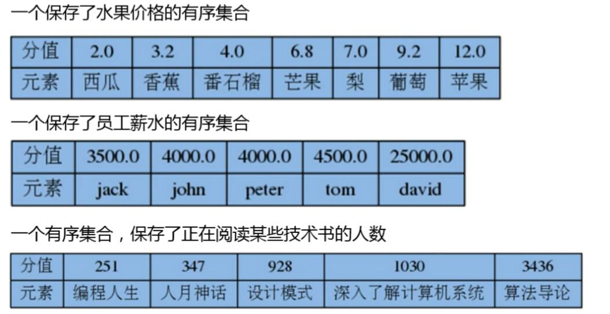
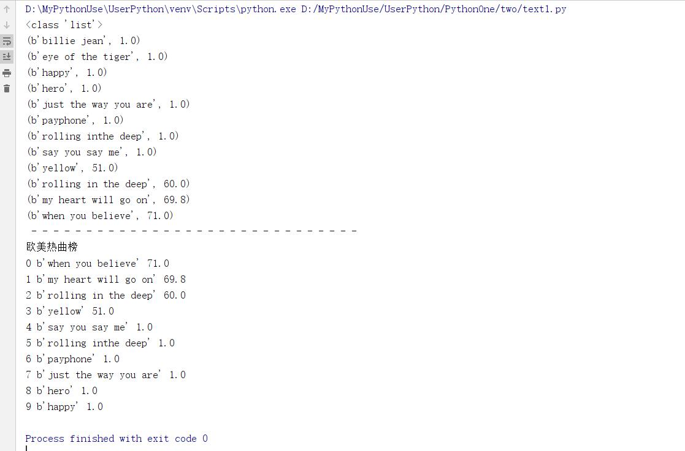

# Redis数据模型

[toc]

* redis支持数据模型非常丰富

## 键Key

* Redis key需要一个二进制值，可以用任何二进制序列作为key值，可以是简单字符串，也可以是个JPEG文件的二精制序列。空字符串也有效率key值

* key取值原则
    1. 键值不需要太长，消耗内存，而且查找这类键值的计算成本较高
    2. 键值不宜过短，可读性较差
    3. 习惯上key采用`user:123:password`形式，表示用户id为123的用户的密码

## 字符串

* 字符串是一种基本简单的Redis值类型。说是字符串，其实可以是任意可以序列化的数据。
* 一个字符串类型的值最多能存储**512M字节**的内容。

## python中的redis编程

* 安装redis库`pip install redis`

````python
import redis

db = redis.Redis("192.168.61.109") #默认本地6379的0号库

print(db.keys('*')) #查看所有匹配keys

db.set("xdd",0b01100010) #0x62
print(db.get("xdd"))

db.set(0b11,0x63)
print(db.get(0b11))
print(db.get(3))
print(db.get("3"))

print("- "*30)
print(db.keys('*')) #查看所有匹配keys
````  

注意：上列中0x62实际上发生了类型变化，因为返回的bytes类型98，实际上对应的ASCII的98，已经是2字节了。数值会转换成10进制64位有符号数后，再转成字符串，存入redis中。  

## 查看帮助

* 使用redis-cli可以进入redis命令行界面

````shell
> Help 查看帮助
> Help <tab> 使用tab建切换帮助
> Help set 查看set命令帮助
> Help @string 查看命令组帮助
````


## 字符串设置

* 语法：`SET key value [Ex seconds][PX milliseconds] [NX|XX]`设置字符串值（设置单个键值）
    1. `EX`设置过期时间，秒，等同于`SETEX key seconds value`
    2. `PX`设置过期时间，毫秒，等同于`PSETEX key millieconds value`
    3. `NX`键不存在，才能设置，等同于`SETNX key value`
    4. `XX`键存在时，才能设置
* 设置多个键值`MSET key value [key value ...]`
    1. 设置多个键值字符串，key存在则覆盖，key不存在则增加。原子操作
* `MSETNX key value [key value ...]`可以不存在则设置，key存在则失败。nx指代不存在。也是原子操作命令。

````shell
127.0.0.1:6379> set s1 abc
OK
127.0.0.1:6379> get s1
"abc"
127.0.0.1:6379> mset s2 a s3 b s4 c
OK
127.0.0.1:6379> keys *
1) "xdd"
2) "3"
3) "s1"
4) "s2"
5) "s3"
6) "s4"
127.0.0.1:6379> msetnx s1 s
(integer) 0
127.0.0.1:6379> get s1
"abc"
127.0.0.1:6379>
````

### 过期操作和生存时间

* Redis中可以给每个Key设置一个生存时间(秒或毫秒),当达到这个时长后，这些键值将会被自动删除
* 设置多少秒或者毫秒后过期
    1. `EXPIRE key seconds`设置key多少秒后过期
    2. `PEXPIRE key milliseconds`设置key多少毫秒后过期
* 设置在指定Unix时间戳过期
    1. `EXPIREAT key timestamp` 设置到指定时间戳后过期
    2. `PEXPIREAT key milliseconds-timestamp`
* 持久key，即取消过期
    1. `PERSIST key`持久key，即取消过期

* **适用场景**
    1. 多少秒过期，例如一个缓存数据失效
    2. `PEXPIREAT key milliseconds-timestamp`比如现在开始缓存数据，0点失效
* Time to Live,key的剩余生存时间
    1. `TTL key`查看key的剩余生存时间，秒级别
    2. `PTTL key`查看key的剩余生存时间，毫秒级别
    3. 命令返回结果：
        * key存在但没有设置TTL，返回-1
        * key存在，但还在生存期内，返回剩余的秒或者毫秒
        * key曾经存在，但已经消亡，返回-2(2.8版本之前返回-1)

* 示例一：

````shell
设置键值s5:abc 20 秒后过期
# set s5 abc ex 20
查看s5剩余过期时间
# ttl s5
127.0.0.1:6379[1]> set s5 abc ex 20
OK
127.0.0.1:6379[1]> ttl s5
(integer) 17
127.0.0.1:6379[1]> ttl s5
(integer) 15
127.0.0.1:6379[1]> ttl s5
(integer) 14
127.0.0.1:6379[1]> ttl s5
(integer) 12
127.0.0.1:6379[1]> ttl s5
(integer) 11
127.0.0.1:6379[1]> ttl s5
(integer) -2
127.0.0.1:6379[1]>
````

|命令|意义|
|:------|:--------|
|`ttl s6`|查看key为s6的键过期时间，秒级别|
|`pttl s6`|查看key为s6的键过期时间，毫秒级|
|`setnx s6 6`|设置key为s6的值为6|
|`expire s6 60`|设置key为s6的键60秒后过期|
|`persist s6`|取消key为s6的过期时间，即永不过期|
|`EXPIREAT cache 1355292000`|设置key为cache在1355292000(秒)时间戳后过期|
|`PEXPIREAT cache 1555555555005`|设置key为cache在1555555555005(毫秒)时间戳后过期|

### key操作

* 语法：`keys pattern`查询key
    1. pattern可以取如下值：
        1. `*`任意长度字符
        2. `?`任意一个字符
        3. `[]`字符集合，表示一个字符

|命令|意义|
|:--------|:----------|
|`keys *`|查看当前库中所有key键|
|`keys s?`|查看当前库中以s开头，只有两个字符的key|
|`keys s[13]`|查看当前库中以s开头，只有两个字符，且第二个字符时1或者3的key|
|`keys s[1-3]`|查看当前库中以s开头，只有两个字符，且第二字符在[1,3]之间的key|
|`keys s*`|查看当前库中以s开头的字符|
|`keys ??`|查看当前库中是两个字符组成的key|

* 其他相关命令

|命令|意义|
|:-----------|:--------------|
|`TYPE key`|key类型|
|`EXISTS key`|key是否存在|
|`RENAME key newkey`|将key的建值重命名为newkey
|`RENAMENX key newkey`|将key的键值重命令为newkey
|`DEL key [key ...]`|将key键值对删除

### 字符串获取

|命令|意义|
|:---------|:------------|
|`GET key`|获取值|
|`MGET key [key ...]`|获取多个给定的键的值|
|`GETSET key value`|返回旧值并设置新值，如果键不存在，就创建并赋值|
|`STRLEN key`|获取key的value字符串长度|

````shell
127.0.0.1:6379> keys *
1) "xdd"
2) "3"
3) "s2"
4) "s3"
5) "s4"
127.0.0.1:6379> get s4
"c"
127.0.0.1:6379> mget s2 s3 s1
1) "a"
2) "b"
3) (nil)
127.0.0.1:6379> strlen s2
(integer) 1
127.0.0.1:6379> getset s5 100
(nil)
127.0.0.1:6379> get s5
"100"
127.0.0.1:6379> keys *
1) "xdd"
2) "3"
3) "s2"
4) "s3"
5) "s4"
6) "s5"
127.0.0.1:6379>
````

### 字符串操作

* 追加字符串
    1. `APPEND key value`追加字符串。如果键存在就追加；如果不存在就等同于`SET key value`
* 获取子字符串
    1. `GETRANGE key start end`索引值从0开始，支持负索引，-1表示最后一个字符。范围是[start,end],start必须在end的左边，否则返回空串
* 覆盖字符串
    1. `SETRANGE key offset value`从指定索引处开始覆盖字符串，返回覆盖后字符串长度。key不存在会创建新的。

* 简单示例

````shell
127.0.0.1:6379> select 1
OK
127.0.0.1:6379[1]> keys *
(empty list or set)
127.0.0.1:6379[1]> append s2 abc
(integer) 3
127.0.0.1:6379[1]> get s2
"abc"
127.0.0.1:6379[1]> append s2 efg
(integer) 6
127.0.0.1:6379[1]> get s2
"abcefg"
127.0.0.1:6379[1]> getrange s2 1 3
"bce"
127.0.0.1:6379[1]> getrange s2 0 -1
"abcefg"
127.0.0.1:6379[1]> setrange s2 3 12
(integer) 6
127.0.0.1:6379[1]> get s2
"abc12g"
127.0.0.1:6379[1]> setrange s2 -1 123456
(error) ERR offset is out of range
127.0.0.1:6379[1]> get s2
"abc12g"
127.0.0.1:6379[1]> setrange s2 3 123456789
(integer) 12
127.0.0.1:6379[1]> get s2
"abc123456789"
127.0.0.1:6379[1]> setrange s7 3 abc
(integer) 6
127.0.0.1:6379[1]> get s7
"\x00\x00\x00abc"
127.0.0.1:6379[1]>
````

### 自增、自减

* `INCR key`将key键对应的值增加1.必须是integer类型
* `DECR key`将key键对应的值减少1，必须是integer类型
* `INCRby key decrement`将key键对应的值增加decrement。
    1. decrement是数字，可以为正负
    2. key对应的value必须是integer类型
* `DECRBY key decrement`将key键对应的值减少加decrement。
    1. decrement是数字，可以为正负
    2. key对应的value必须是integer类型

* 简单示例

````shell
127.0.0.1:6379[1]> flushdb
OK
127.0.0.1:6379[1]> keys *
(empty list or set)
127.0.0.1:6379[1]> set s1 ab1
OK
127.0.0.1:6379[1]> set s2 4
OK
127.0.0.1:6379[1]> incr s1
(error) ERR value is not an integer or out of range
127.0.0.1:6379[1]> incr s2
(integer) 5
127.0.0.1:6379[1]> incr s3
(integer) 1
127.0.0.1:6379[1]> incr s2
(integer) 6
127.0.0.1:6379[1]> get s2
"6"
127.0.0.1:6379[1]> keys *
1) "s3"
2) "s2"
3) "s1"
127.0.0.1:6379[1]> get s3
"1"
127.0.0.1:6379[1]> incrby s2 -10
(integer) -4
127.0.0.1:6379[1]> incrby s2 8
(integer) 4
127.0.0.1:6379[1]> decrby s2 -10
(integer) 14
127.0.0.1:6379[1]> get s2
"14"
127.0.0.1:6379[1]>
````

## 库操作

* `redis-cli --help` #查看帮助
* `redis-cli -n 2` # 登录到第2号库
    1. 登录后命令上中切换库
        * `SELECT n`选择第n号库
        * `FLUSHDB` 清除**当前库**数据
        * `FLUSHALL`清除**所有库**中的数据

## 位图bitmap

* 位图不是真正的数类型，它是定义在字符串类型上，只不过把字符串按位操作
* 一个字符串类型的值最多能存储512M字节的内容，可以表示$2^{32}$位
    1. 位上限：
        * 512 = $2^9$
        * 1M = 1024*1024=$2^{10+10}$
        * 1Byte = 8bit = $2^3$bit
        * $2^{9+10+10+3}=2^{32}b=4294967296b$,接近43忆个位
* `SETBIT key offset value`设置某一位上的值
    1. offset 偏移量，从0开始
    2. value不写，默认是0，只能是0或1
* `GETBIT key offset`获取某一位上的值
* `BITPOS key bit [start][end]`返回指定值bit[0或者1]在指定区间上第一次出现的位置
    1. key 要查找的值所对应的键
    2. bit 只能是0或者1
    3. start 起始位置，默认每8个bit位所对应的索引为1
    4. end 结束位置，注意：每8个bit位所对应的索引为1
    5. 返回值：找到返回bit位的相对应0位置的偏移量。(注意此时不会按照每8个bit位作为一个索引)找不到返回-1
    6. 示例：

        ````shell
        127.0.0.1:6379[1]> SETBIT ss 2 1
        (integer) 0
        127.0.0.1:6379[1]> SETBIT ss 18 1
        (integer) 0
        127.0.0.1:6379[1]> get ss
        " \x00 "
        127.0.0.1:6379[1]> BITPOS ss 1
        (integer) 2
        127.0.0.1:6379[1]> BITPOS ss 1 1
        (integer) 18
        127.0.0.1:6379[1]> BITPOS ss 1 2
        (integer) 18
        127.0.0.1:6379[1]> BITPOS ss 1 3
        (integer) -1
        127.0.0.1:6379[1]> STRLEN ss
        (integer) 3
        127.0.0.1:6379[1]>
        ````

* `BITCOUNT key [start] [end]`统计指针位区间上值为1的个数，从左向右从0开始，从右向左从-1开始，注意：官方start,end指的是位，测试后是**字节**(即，1字节等于8位)
    1. `BITCOUNT testkey 0 0`**表示从索引为0个字节到索引为0个字节，就是第一个字节的统计**
    2. `BITCOUNT testkey 0 -1`等同于`BITCOUNT testkey`

````shell
127.0.0.1:6379> set str1 abc
OK
127.0.0.1:6379> setbit str1 6 1
(integer) 0
127.0.0.1:6379> setbit str1 7 0
(integer) 1
127.0.0.1:6379> get str1
"bbc"
127.0.0.1:6379>
````

### 位操作

* 对于一个或多个保存二进制位的字符串key进行位元操作，并将结果保存到destkey上operation可以是AND、OR、NOT、XOR这四种操作中的任意一种
* `BITOP AND destkey key [key ...]`对一个或多个key求**位与**，并将结果保存到destkey
* `BITOP OR destkey key [key ...]`对一个或多个key求**位或**，并将结果保存到destkey
* `BITOP XOR destkey key [key ...]`对一个或多个key求**位异或**,并将结果保存到destkey
* `BITOP NOT destkey key`对给定key求**逻辑非**，并将结果保存到destkey

* 除了NOT操作之外，其他操作都可以接受一个或多个key作为输入，当BITOP处理不同长度的字符串时，较短的那个字符串所缺少的部分会被看作0.空的key也被看作是包含0的字符串序列

* 示例：a位或b

````shell
127.0.0.1:6379> set s1 a
OK
127.0.0.1:6379> set s2 b
OK
127.0.0.1:6379> BITOP OR ss s1 s2
(integer) 1
127.0.0.1:6379> get ss
"c"
127.0.0.1:6379> set s3 中
OK
127.0.0.1:6379> get s3
"\xe4\xb8\xad"
127.0.0.1:6379> BITCOUNT s3
(integer) 13
127.0.0.1:6379>
````


* 位图应用练习:
    1. 网站用户上线次数统计(活跃用户)
    2. 按天统计网站活跃用户
* 参考
    1. 网站用户的上线次数统计(活跃用户)
    2. 为每一个用户做上线记录，某天登陆就标记一次。
    3. 用户ID为key，天作为offset，上线置为1，ID为500的用户，今年的第一天上线，第30天上线：
        * setbit u:500 1 1 #使用位图标记，上线一次在对应天数上标记一次
        * setbit u:500 30 1
        * bitcount u:500 #统计一共上线次数

````python
import redis

# 链接redis数据库
db = redis.Redis("192.168.61.109",6379,db=2)
print(db.keys("*")) #查看所有keys

# user1
db.setbit("u:1",1,1) #第一天登录，标记一次
db.setbit("u:1",30,1) #第30天登陆，标记一次
print("id为500的用户登录次数：",db.bitcount("u:500")) #统计

# user2
db.setbit("u:2",110,1)
db.setbit("u:2",300,1)

# user101，模拟登录，每3天登陆一次
for i in range(3,365,3):
    db.setbit("u:101",i,1)

# user102,模拟登录，每2天登陆一次
for i in range(3,365,2):
    db.setbit("u:102",i,1)

userlist = db.keys("u*") #查询所有用户登录信息
print(userlist)

active = [] #统计活跃用户
inactive = [] #统计非活跃用户

for u in userlist:
    logincount = db.bitcount(u)
    if logincount >100:
        active.append(u)
    else:
        inactive.append(u)

print("活跃用户为：{}".format(active))
print("非活跃用户为：{}".format(inactive))
````

  

* 2.按天统计网站活跃用户
    1.这是日活、周活、月活等统计。天作为key,用户ID为offset，上线设置为1
    2. 一段时间内活跃用户数：
        * setbit 20160602 15 1
        * setbit 20160601 123 1
        * setbit 20160606 123 1
    3. 求6月1日到6月10日的活跃用户
        * BITOP OR 20160601-10 20160601 20160602 20160603 20160610
        * bitcount 20160601-10 #结果为2

    ````shell
    127.0.0.1:6379> setbit 20160602 15 1
    (integer) 0
    127.0.0.1:6379> setbit 20160601 123 1
    (integer) 0
    127.0.0.1:6379> setbit 20160606 123 1
    (integer) 0
    127.0.0.1:6379> BITOP OR 20160601-10 20160601 20160602 20160603 20160610 
    (integer) 16
    127.0.0.1:6379> bitcount 20160601-10
    (integer) 2
    127.0.0.1:6379>
    ````

## redis中的List列表模型

* 其列表是基于双向链表实现，列表头尾增删快，中间增删慢
* 元素是字符串类型
* 元素可以重复出现
* 索引支持正索引和负索引，从左至右从0开始，从右至左从-1开始

* 命令说明

|字母|说明|
|:------|:---------|
|`B`|Block阻塞|
|`L`|Left左起，或指列表|
|`R`|Right右起|
|`X`|exist存在|

1. **查看长度**
    * `LLEN key`返回列表元素个数
2. **添加元素**
    * `LPUSH key value [value ...]`从左边向队列中压入元素
    * `LPUSHX key value` 从左边向队列加入元素，要求key必须存在(即列表已经存在)
    * `RPUSH key value [value ...]`从右边向队列中压如数据
    * `RPUSHX key value`要求key存在(即列表已经存在)，从右边向队列中加入元素
    * `LINSERT key BEFORE|AFTER pivot value`在列表中某个存在的值(pivot)前后后插入元素一次，key或pivot不存在，不进行任何操作

    ````shell
    127.0.0.1:6379> rpush lst 1 2 3 4 5
    (integer) 5
    127.0.0.1:6379> lrange lst 0 -1
    1) "1"
    2) "2"
    3) "3"
    4) "4"
    5) "5"
    127.0.0.1:6379> LINSERT lst after 2 python
    (integer) 6
    127.0.0.1:6379> lrange lst 0 -1
    1) "1"
    2) "2"
    3) "python"
    4) "3"
    5) "4"
    6) "5"
    127.0.0.1:6379> LINSERT lst before 2 ruby
    (integer) 7
    127.0.0.1:6379> lrange lst 0 -1
    1) "1"
    2) "ruby"
    3) "2"
    4) "python"
    5) "3"
    6) "4"
    7) "5"
    127.0.0.1:6379>
    ````

3. **弹出元素**
    * `LPOP key`从左边弹出列表中一个元素
    * `RPOP key`从右边弹出列表中一个元素
4. `RPOPLPUSH source destination`从源列表中右边pop一个元素，从左边加入到目标列表
    * source 源列表，需要从右边弹出一个元素的列表
    * destination 目标列表，需要从左边加入元素的列表

    ````shell
    127.0.0.1:6379> lpush s1 1 2 3 4 5 6
    (integer) 6
    127.0.0.1:6379> lpop s1
    "6"
    127.0.0.1:6379> lpush s2 11 12 13
    (integer) 3
    127.0.0.1:6379> RPOPLPUSH s1 s2
    "1"
    127.0.0.1:6379> RPOPLPUSH s1 s2
    "2"
    127.0.0.1:6379> rpop s2
    "11"
    127.0.0.1:6379> lpop s2
    "2"
    127.0.0.1:6379> lpop s2
    "1"
    127.0.0.1:6379>
    ````

5. **元素访问与修改**
    * `LRANGE key start stop`返回列表中指定访问的元素，例如`LRANGE user 0 -1`
    * `LINDEX key index`返回列表中指定索引位置的元素
    * `LSET key index value`设置列表中指定索引位置的元素值，index不能超界
6. **移除元素**
    * `LREM key count value`从左边删除列表中与value相等的元素删除count个
        * count>0 从左至右搜索，移除与value相等的元素，数量至多为count次
        * count<0 从右至左搜索，移除与value相等的元素，数量至多为-count次
        * count = 0 移除列表中所有value值
    * `LTRIM key start stop`去除指定**范围外**的元素
        * 保留范围区间[start,stop]其余全部移除
7. **阻塞**
    * 如果弹出的列表不存在或者为空，就会**阻塞**
    * 超时时间设置为0，就是永久阻塞，直到有数据可以弹出
    * 如果多个客户端阻塞就在同一个列表上，使用First In First Service原则，先到先服务
    * `BLPOP key [key ...] timeout`列表右边阻塞弹出一个元素。
        * key列表键名
        * timeout是超时秒数，为0表示永久阻塞
        * 返回弹出列表名和弹出的值，如果有多个列表，会优先从第一个列表中弹出。
    * `BRPOP key [key ...] timeout`列表右边阻塞弹出一个元素
    * `BRPOPLPUSH source destination timeout`从一个列表尾部阻塞弹出元素压入到另一个列表的头部
    * 应用场景

    ````shell
    # 阻塞式消息队列
    BLPOP MyQueue 0 #阻塞获取
    RPUSH MyQueue hello #向消息队列添加值
    ````

* 应用：微博某贴最后评论的50条

````shell
LPUSH u1234:forumid:comments "这是第1条评论"
LPUSH u1234:forumid:comments "这是第2条评论"
LPUSH u1234:forumid:comments "这是第3条评论"
# 使用LTRIM原因是，获取后可以清楚多余存放在redis中的评论
LTRIM u1234:forumid:comments 0 49
````

## hash散列

* 值是由field和value组成的map键值对
* field和value都是字符串类型
* 模型如下：
  

1. 设置key
    * `HSET key field value`设置单个字段。field不存在就创建，存在覆盖value
    * `HSETNX key field value`设置单个字段，要求field不存在。如果key不存在，相当于field也不存在
    * `HMSET key field value [field value ...]`设置多个字段
2. 长度和判断
    * `HLEN key`返回字段个数
    * `HEXSTS key field`判断字段是否存在。key或者field不存在，返回0
3. 获取值
    * `HGET key field`返回字段值
    * `HMGET key field [field ...]`返回多个字段值
    * `HGETALL key`返回所有的键值对
    * `HKEYS key`返回所有字段名
    * `HVALS key`返回所有值
4. 计算
    * `HINCRBY key field increment`在字段对应的值上进行整数的增量计算
    * `HINCRBYFLOAT key field increment`在字段对应的值上进行浮点数的增量计算
5. 删除
    * `HDEL key field [field ...]`删除指定的字段

* 简单示例

````shell
127.0.0.1:6379> HINCRBY number x -50
(integer) -50
127.0.0.1:6379> HGET number x
"-50"
127.0.0.1:6379> HINCRBYFLOAT number x 3.14
"-46.86"
127.0.0.1:6379> HGET number x
"-46.86"
127.0.0.1:6379> hdel number x
(integer) 1
````

* **Hash用途**

* 节约内存空间
* 每创建一个键，它就会为这个键存储一些附加的管理信息(比如这个键的类型，这个键最后一次被访问的时间等等)
* 所以数据库里面的键越多，redis数据库服务器在储存附加管理信息方面耗费的内存就越多，花在管理数据库键上的CPU时间也会越多  

  

* 应用场景

1. 用户纬度统计
    * 统计数包括：关注数、粉丝数、喜欢商品数、发帖数
    * 用户为key，不同维度为Field,value为统计数
    * 比如关注了5个人

    ````shell
    HSET user:100000 follow 5
    HINCRBY user:100000 follow 1
    ````

2. 商品维度统计
    * 统计值包括喜欢数，评论数，购买数，浏览数等

    ````shell
    HSET item:58000 fav 500
    HINCRBY item:58000 fav 1
    ````

3. 缓存用户信息
    * 登录后，反复需要读取用户的常用信息，最好的方式就是缓存起来

    ````shell
    set user:001 "bob,18,20010101"
    mset user:001:name "bob" user:001:age 18 user:001:birthday "20010101" #不可取，重复值多
    hmset user:001 name "bob" age 18 birthday "20010101"
    ````

## Set集合

* 集合的元素是无序的、去重的、元素是字符串类型。

1. **添加和删除**
    * `SADD key member [member ...]`增加一个或多个元素，元素已经存在将忽略
    * `SREM key member [member ...]`移除一个或多个元素，元素不存在自动忽略
    * `SMOVE source destination member`把元素从源集合移动到目标集合
2. **查询和长度**
    * `SCARD key`返回集合中元素的个数。不需要遍历。
    * `SMEMBERS key`返回集合中的所有元素。注意，如果集合中元素过多，应当避免使用该方法
    * `SISMEMBER key number`元素是否在集合中

    ````shell
    127.0.0.1:6379> SADD ss 1 2 1 2 3 5 6 8 5 6
    (integer) 6
    127.0.0.1:6379> SCARD ss
    (integer) 6
    127.0.0.1:6379> SMEMBERS ss
    1) "1"
    2) "2"
    3) "3"
    4) "5"
    5) "6"
    6) "8"
    127.0.0.1:6379> SREM ss 1 2 5
    (integer) 3
    127.0.0.1:6379> SMEMBERS ss
    1) "3"
    2) "6"
    3) "8"
    127.0.0.1:6379>
    ````

    * 注意：元素相同的两个集合未必有相同的顺序，去重且有序可使用有序集合
3. **随机获取移除**
    * `SRANDMEMBER key [count]`随机返回结合中个鸡丁个数的元素
        1. 如果count为正数，且小于集合基数，那么命令返回一个包含count个元素的数组，数组中的元素各不相同。如果count大于等于集合基数，那么返回整个集合
        2. 如果count为负数，那么命令返回一个数组，数组中的元素可能会重复出现多次，而数组长度为count的绝对值
        3. 如果count为0 返回空
        4. 如果count不指定，随机返回一个元素
    * `SPOP key`从集合中随机移除一个元素并返回该元素
4. **集合运算**
    * **差集**
        * `SDIFF key [key ...]`从第一个key的集合中去除其他集合和自己的交集部分
        * `SDIFFSTORE destination key [key ...]`将差集结果存储在目标key中

        ````shell
        127.0.0.1:6379> sadd number1 123 456 789
        (integer) 3
        127.0.0.1:6379> sadd number2 123 456 999
        (integer) 3
        127.0.0.1:6379> sdiff number1 number2
        1) "789"
        127.0.0.1:6379>
        ````

    * **交集**
        * `SINTER key [key ...]`取所有集合交集部分
        * `SINTERSTORE destination key [key ...]`将交集结果存储在目标key中

        ````shell
        127.0.0.1:6379> sadd number1 123 456 789
        (integer) 3
        127.0.0.1:6379> sadd number2 123 456 999
        (integer) 3
        127.0.0.1:6379> sinter number1 number2
        1) "123"
        2) "456"
        127.0.0.1:6379>
        ````

    * **并集**
        * `SUNION key [key ...]`取所有集合交集部分
        * `SINTERSTORE destination key [key ...]`将交集结果存储在目标key中

        ````shell
        127.0.0.1:6379> sadd number1 123 456 789
        (integer) 3
        127.0.0.1:6379> sadd number2 123 456 999
        (integer) 3
        127.0.0.1:6379> SUNION number1 number2
        1) "123"
        2) "456"
        3) "789"
        4) "999"
        127.0.0.1:6379>
        ````

* 应用场景示例：微博的共同关注
    1. 需求：当用户访问另一个用户的时候，会显示出两个用户共同关注哪些相同的用户
    2. 设计：将每个用户关注的用户放在集合中，求交集即可

````shell
peter = {"john","jack","may"}
ben = {"john","jack","tom"}
那么peter和ben的共同关注为：
SINTER peter ben #结果为：{“john","jack"}
````

## SortedSet有序集合

* 类似Set集合，有序的集合。每一个元素都关联着一个浮点数分值(Score)，并按照分值从小到大的顺序排列集合中的元素。分值可以相同

  

1. **添加**
    * `ZADD key score member [score member ...]`增加一个或多个元素。如果元素已经存在，则使用新的score
2. **简单查询**
    * `ZCARD key`返回集合的元素个数
    * `ZCOUNT key min max`返回指定score范围元素的个数
    * `ZSCORE key member`显示分值
3. **修改**
    * `ZINCRBY key increment member`增加或减少分值。increment为负数就是减少
4. **高级查询**
    * `ZRANGE key start stop [WITHSCORES]`返回指定索引区间元素(从大到小)
        * WITHSCORES 选项，带上时返回序列中会携带分值
        * 有序集合里面，如果score相同，则按照字典序lexicographical order排列
        * 默认按照score从大到小，如果需要score从小到大排列，使用ZREVRANGE
    * `ZREVRANGE key start stop [WITHSCORES]`返回指定索引区间元素(从小到大)
        * WITHSCORES 选项，带上时返回序列中会携带分值
        * 如果score相同，则按照字典序lexicographical order的**逆序**排列
        * 默认按照score从大到小，如果需要score从小到大排列，使用ZRANGE
    * `ZRANK key number`返回元素的排名(索引)
    * `ZREVRANK key number`返回元素的逆序排名(索引)
    * `ZRANGEBYSCORE key min max [WITHSCORES][LIMIT offset count]`返回指定分数区间的元素
        * 返回score默认属于[min,max]之间，元素按照score升序排列，score相同字典序
        * LIMIT中offset代表跳过多少个元素，count是返回几个。类似于Mysql
        * 使用小括号，修改区间为开区间，例如`(5`或者`(10,5)`
        * -inf和+inf表示负无穷和正无穷
    * `ZREVRANGEBYSCORE key max min [WITHSCORES][LIMIT offset count]`降序返回指定分数区间的元素
        * 返回score默认属于[min,max]之间，元素按照score降序排列，score相同字典降序

    ````shell
    #添加过个值到employees中
    127.0.0.1:6379> ZADD employees 3500 jack 4000 peter 4000 john 4500 tom 2500 david
    (integer) 0
    #显示employees集合所有key
    127.0.0.1:6379> zrange employees 0 -1
    1) "david"
    2) "jack"
    3) "john"
    4) "peter"
    5) "tom"
    #统计employees有序集合中分值在[3000,4000]的集合个数
    127.0.0.1:6379> ZCOUNT employees 3000 4000
    (integer) 3
    #添加值david 其分值为3.2
    127.0.0.1:6379> zadd employees 3.2 david
    (integer) 0
    #查看david的分值
    127.0.0.1:6379> ZSCORE employees david
    "3.2000000000000002"
    #将jack的分值增加1.5
    127.0.0.1:6379> ZINCRBY employees 1.5 jack
    "3501.5"
    #将tom的分值减少500
    127.0.0.1:6379> zincrby employees -500 tom
    "4000"
    #带分值显示employees有序集合
    127.0.0.1:6379> zrange employees  0 -1 WITHSCORES
    1) "david"
    2) "3.2000000000000002"
    3) "jack"
    4) "3501.5"
    5) "john"
    6) "4000"
    7) "peter"
    8) "4000"
    9) "tom"
    10) "4000"
    #查询peter的排名
    127.0.0.1:6379> zrank employees peter
    (integer) 3

    #逆序后的索引0到-1，即返回所有
    127.0.0.1:6379> zrevrange employees 0 -1 WITHSCORES
    1) "tom"
    2) "4000"
    3) "peter"
    4) "4000"
    5) "john"
    6) "4000"
    7) "jack"
    8) "3501.5"
    9) "david"
    10) "3.2000000000000002"
    #查询peter的逆序排名
    127.0.0.1:6379> zrevrank employees peter
    (integer) 1
    127.0.0.1:6379>

    #高级查询示例
    #查询分值在[3500,4000]范围内的键，升序排列显示
    127.0.0.1:6379> zrangebyscore employees 3500 4000
    1) "jack"
    2) "john"
    3) "peter"
    4) "tom"
    127.0.0.1:6379> zrangebyscore employees (4000 5000 WITHSCORES
    (empty list or set)
    #查询分值在(2000,5000)范围内的键和值，升序排列显示
    127.0.0.1:6379> zrangebyscore employees (2000 5000 WITHSCORES
    1) "jack"
    2) "3501.5"
    3) "john"
    4) "4000"
    5) "peter"
    6) "4000"
    7) "tom"
    8) "4000"
    #查询分值在(2000,5000)范围内的键和值，升序排列显示，跳过第一个，最多显示2个
    127.0.0.1:6379> zrangebyscore employees (2000 5000 WITHSCORES LIMIT 1 2
    1) "john"
    2) "4000"
    3) "peter"
    4) "4000"
    #查询分值在[正无穷大，负无穷大]的键，降序显示
    127.0.0.1:6379> zrevrangebyscore employees +inf -inf
    1) "tom"
    2) "peter"
    3) "john"
    4) "jack"
    5) "david"
    127.0.0.1:6379>
    ````

5. **删除**
    * `ZREM key member [member ...]`移除一个或多个元素。元素不存在，自动忽略
    * `ZREMRANGEBYRANK key start stop`移除指定排名范围的元素
    * `ZREMRANGEBYSCORE key min max`移除指定分值范围的元素

    ````shell
    127.0.0.1:6379> zadd employees 1000 tom 2000 john 2000 jahh 3000 peter 4000 david 5000 xdd
    (integer) 6
    127.0.0.1:6379> ZRANGEBYSCORE employees -inf +inf WITHSCORES
    1) "tom"
    2) "1000"
    3) "jahh"
    4) "2000"
    5) "john"
    6) "2000"
    7) "peter"
    8) "3000"
    9) "david"
    10) "4000"
    11) "xdd"
    12) "5000"
    #删除employees中分索引在[0,1]范围内的值
    127.0.0.1:6379> ZREMRANGEBYRANK employees 0 1
    (integer) 2
    127.0.0.1:6379> ZRANGEBYSCORE employees -inf +inf WITHSCORES
    1) "john"
    2) "2000"
    3) "peter"
    4) "3000"
    5) "david"
    6) "4000"
    7) "xdd"
    8) "5000"
    #删除employees集合中分值在[4000,5000]范围内的值
    127.0.0.1:6379> ZREMRANGEBYSCORE employees 4000 5000
    (integer) 2
    127.0.0.1:6379> ZRANGEBYSCORE employees -inf +inf WITHSCORES
    1) "john"
    2) "2000"
    3) "peter"
    4) "3000"
    127.0.0.1:6379>
    ````

6. **集合运算**
    * **并集**
    * `ZUNIONSTORE destination numkeys key [key ...] [WEIGHTS weight] [AGGREGATE SUM|MIN|MAX]` 并集运算
        * numkeys指定key的数量，必须
        * WEIGHTS选项，与前面设定的key对应，对应key中每一个score都要乘以这个权重
        * AGGREGATE选项，指定并集结果的聚合方式
        * SUM:将所有集合中某一个元素的score值之和作为结果集中该成员的score值，默认行为
        * MIN：将所有集合中某一个元素的score值中最小值作为结果集中该成员的score值
        * MAX:将所有集合中某一个元素的score值中最大值作为结果集中该成员的score值

        ````shell
        127.0.0.1:6379> zadd s1 70 tom 80 peter 60 john
        (integer) 3
        127.0.0.1:6379> zadd s2 90 peter 60 ben
        (integer) 2
        #求s1 s2的交集，s1的权重是1，s2的权重是1，默认合并后的分支使用sum求和方式
        127.0.0.1:6379> ZUNIONSTORE scores-all 2 s1 s2
        (integer) 4
        127.0.0.1:6379> ZRANGEBYSCORE scores-all -inf +inf WITHSCORES
        1) "ben"
        2) "60"
        3) "john"
        4) "60"
        5) "tom"
        6) "70"
        7) "peter"
        8) "170"
        #求s1 s2的交集，s1的权重是1，s2的权重是1，合并后的分支使用sum求和方式
        127.0.0.1:6379> ZUNIONSTORE scores-all1 2 s1 s2 aggregate sum
        (integer) 4
        127.0.0.1:6379> ZRANGEBYSCORE scores-all1 -inf +inf WITHSCORES
        1) "ben"
        2) "60"
        3) "john"
        4) "60"
        5) "tom"
        6) "70"
        7) "peter"
        8) "170"
        #求s1 s2的交集，s1的权重是1，s2的权重是0.5，合并后的分支使用sum求和方式
        127.0.0.1:6379> ZUNIONSTORE scores-all2 2 s1 s2 weights 1 0.5 aggregate sum
        (integer) 4
        127.0.0.1:6379> ZRANGEBYSCORE scores-all2 -inf +inf WITHSCORES
        1) "ben"
        2) "30"
        3) "john"
        4) "60"
        5) "tom"
        6) "70"
        7) "peter"
        8) "125"
        127.0.0.1:6379>
        ````

    * **交集**
    * `ZINTERSTORE destination numkeys key [key ...] [WEIGHTS weight] [AGGREGATE SUM|MIN|MAX]`
        * numkeys指定key的数量，必须
        * WEIGHTS选项，与前面设定的key对应，对应key中每一个score都要乘以这个权重
        * AGGREGATE选项，指定交集结果的聚合方式
        * SUM:将所有集合中某一个元素的score值之和作为结果集中该成员的score值
        * MIN:将所有结合中某一个元素的score值中最小值作为结果集中该成员的score值
        * MAX:将所有集合中某一个元素的score值中最大值作为结果集中该成员的score值

* 应用练习：音乐排行榜的实现

  

* 每首歌的歌名作为元素(先补补考虑重复)  
* 每首歌的播放次数作为分值
* ZREVRANGE来获取播放次数最多的歌曲(就是最多播放榜了，云音乐热歌榜，没有竞价，没有权重)

* python中redis库是3.x版本代码如下：

````python
# redis版本3.x版本
import redis

r = redis.Redis(host="192.168.61.109",port=6379,db=3)
#清空数据库
r.flushdb()
r.zadd("mboard",{"yellow":1,"rolling inthe deep":1,"happy":1,"just the way you are":1})
r.zadd("mboard",{"eye of the tiger":1,"billie jean":1,"say you say me":1,"payphone":1})
r.zadd("mboard",{"my heart will go on":1,"when you believe":1,"hero":1})

# 修改yellow的分值为50
r.zincrby("mboard",50,"yellow")
r.zincrby("mboard",60,"rolling in the deep")
r.zincrby("mboard",68.8,"my heart will go on")
r.zincrby("mboard",70,"when you believe")

# 所有元素
allmusic = r.zrange("mboard",0,-1,withscores=True)
print(type(allmusic))

for m in allmusic:
    print(m)

print(" -"*30)
# 排行榜
musicboard = r.zrevrange("mboard",0,9,withscores=True)
print("欧美热曲榜")

for i,m in enumerate(musicboard):
    print(i,*m)
````

  

* python中如果redis版本是2.x代码如下：

````python
# redis库 2.x版本
import redis

r = redis.Redis(host='192.168.142.135', port=6379, db=3)

r.zadd('mboard','yellow',1,'rolling in the deep',1,'happy',1,'just the way you are',1)
r.zadd('mboard','eye of the tiger',1,'billie jean',1,'say you say me',1,'payphone',1)
r.zadd('mboard','my heart will go on',1,'when you believe',1,'hero',1)

r.zincrby('mboard','yellow',50)
r.zincrby('mboard','rolling in the deep',60)
r.zincrby('mboard','my heart will go on',68.8)
r.zincrby('mboard','when you believe',70)
# 所有元素
allmusic = r.zrange('mboard', 0, -1, withscores=True)
print(type(allmusic))
for m in allmusic:
    print(m)

print('-'*30)

# 排行榜
musicboard = r.zrevrange('mboard', 0, 9, True)
print('欧美热曲榜')
for i, m in enumerate(musicboard):
    print(i, *m)
````

* **应用场景**

1. 新浪微博翻页
    * 新闻网站、播客、论坛、搜索引擎，页面列表条目多，都需要分页
    * blog这个key使用时间戳作为score
        1. `ZADD blog 1407000000 '今天天气不错'`
        2. `ZADD blog 1450000000 '今天我们学习Redis'`
        3. `ZADD blog 1560000000 '几个Redis使用示例'`
        4. `ZREVRANGE blog 10 20`显示所有播客中最后的评论的条目
2. 京东图书畅销榜
    * 统计单日榜，计算出周榜单、月榜单、年榜单

    ````shell
    每天统计一次榜单
    ZADD bk:it:01 1000 'java' 1500 'Redis' 2000 'haoop' 100 'scala' 80 'python'
    ZADD bk:it:02 1020 'java' 1500 'Redis' 2100 'haoop' 120 'python' 110 'scala'
    ZADD bk:it:03 1620 'java' 1510 'Redis' 3000 'haoop' 150 'storm' 120 'python'
    ````

    * 求销售前10名
        1. 由于上面的日榜单是累计值，所以不能直接使用并集，要指定聚合运算为MAX

    ````shell
    ZUNIONSTORE bk:it:01-03 3 bk:it:01 bk:it:02 bk:it:03 AGGREGATE MAX
    ZREVRANGE bk:it:01-03 0 9 WITHSCORES
    ````

    * 注意：如果参与并集元素的元素太多，会消耗大量内存和计算时间，可能会导致Redis服务阻塞，如果非要计算，选在空闲时间或备用服务器上计算。
    * 另一种统计

    ````shell
    ZADD bk:it:01 50 'java' 20 'Redis' 40 'haoop'
    ZADD bk:it:02 70 'java' 30 'Redis' 20 'haoop'
    ZADD bk:it:03 20 'java' 30 'Redis' 5 'haoop'
    每天统计当天销量，统计IT类图书一段时间的新销售榜单
    ZUNIONSTORE bk:it:01-03 bk:it:01 bk:it:02 bk:it:03 AGGREGATE SUM
    ZREVRANGE bk:it:01-03 0 9 WITHSCORES
    ````
