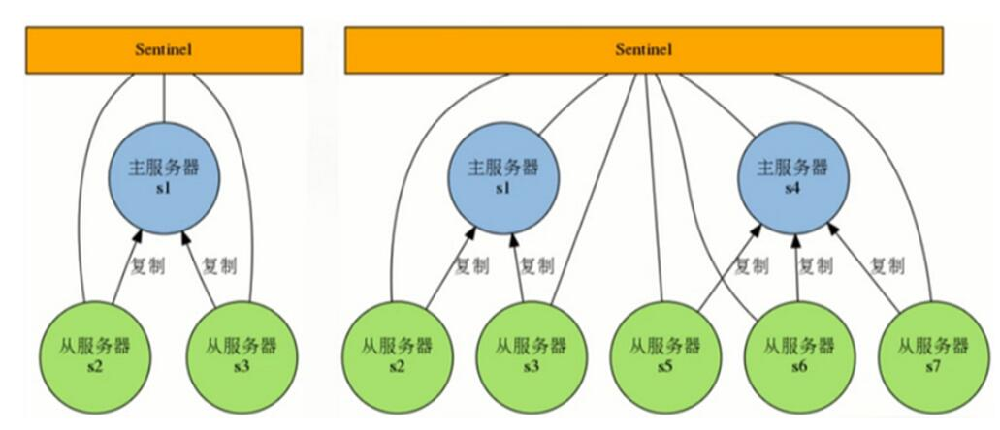

# Reids持久化和高可用

[toc]

## Redis持久化

* 持久化：将书籍从掉电易失的内存存放到能够永久存储的设备上
* Redis服务是使用内存来存储数据，如果掉电、服务崩溃都会导致Redis中数据丢失，如有必要，可以持久化数据。
* Redis持久化方式：RDB(Redis DB)、AOF(AppendOnlyFile)

### RDB

* 在默认情况下，Redis将某时间点的数据快照保存在名字为dump.rdb的二进制文件中
* 策略
    1. 自动：按照配置文件中的条件满足就执行BGSAVE
    2. 手动：客户端发起SAVE、BGSAVE命令
* 配置
    1. `/etc/redis/redis.config`配置文件。注意这里是我自己安装时修改了配置文件路径。具体配置文件请查找redis配置文件

    ````conf
    save 900 1 #如果900秒内，有一次更新，或者增加过，会保持落地数据一次
    save 300 10 # 如果在300秒内，有10次以上的改动，会自动保存落地数据一次
    save 60 10000 # 如果在60秒有10000次改动，或10000次以上的改动，就自动保存落地数据一次

    #数据文件名称
    dbfilename dump.rdb
    #数据文件存放目录
    dir /var/lib/redis/6379
    ````

    1. save 60 1000,Redis要满足在60秒内至少有1000个键被改动，会自动保存一次，只要满足上面3个条件之一，就自动执行快照。
        * 执行完成后，时间计数器和次数计数器都会归零重新计数。这多个条件不是叠加效果
        * SAVE命令：阻塞式命令，执行期间不响应客户端请求
        * BGSAVE:非阻塞命令，执行期间还可以接受并处理请求，会**folk一个子进程**创建RDB文件

        ````shell
        127.0.0.1:6379> SAVE
        127.0.0.1:6379> BGSAVE
        ````

* 优点
    1. 完全备份，不同时机的数据集备份可以做到多版本恢复
    2. 紧凑的单一文件，方便网络传输，适合灾难恢复
    3. 快照文件直接恢复，大数据集速度比AOF快些
* 缺点
    1. 会丢失最近写入、修改的而未能持久化的数据
    2. folk过程较耗时，会造成毫秒级不能响应客户端请求
* RDB备份策略
    1. 创建一个定时任务cron job,每小时或者每天将dump.rdb复制到指定目录
    2. 确保备份文件名称带有日期时间信息，便于管理和还原对应的时间点的快照版本
    3. 启用定时任务删除过期的备份
    4. 如果有必要，跨物理主机、跨机架、异地备份

### AOF

* Append only file,采用追加的方式保存，默认文件appendonly.aof。
* AOF实质是记录所有的**写操作命令**，在服务启动的时候使用这些命令就可以还原数据库

#### AOF写入机制

* **AOF方式不能保证绝对不丢失数据**
* 目前常见的操作系统中，执行系统调用write函数，将一些内容写入到某个文件里面时，为了提高效率，系统通常不会直接将内容写入硬盘里面，而是先将内容放入一个内存缓冲区(buffer)里面，等到缓冲区被填满，或者用户执行fsync调用fdatasync调用时才将存储在缓冲区里面的内容真正的写入到硬盘里，未写入磁盘之前，数据可能会丢失

* **写入磁盘的策略**

1. appendfsync选项，这个选项的值可以是always、everysec或者no
    * Always:服务器每写入一个命令，就调用一次fdatasync，将缓冲区里面的命令写入到磁盘。这种模式下，服务器出现故障，也不会丢失任何已经成功执行的命令**数据**
    * **Everysec(默认)**: 服务器每一秒重调用一次fdatasync,将缓冲区里面的命令写入到磁盘。这种模式下，服务器出现故障，最多只丢失一秒钟内的执行的命令数据
    * No:服务器不主动调用fdatasync,由操作系统决定何时将缓冲区里面的命令写入到磁盘。这种模式下，服务器遭遇意外停机时，丢失命令的数量是不确定的

2. 运行速度：always的速度慢，everysec和no都很快

* **AOF重写机制**

1. 写操作越来越多的被记录，AOF文件会很大。Redis会合并写操作，以压缩AOF文件。合并重复的写操作，AOF会使用尽可能少的命令来记录。
2. **重写过程**
    1. folk一个子进程负者重写AOF文件
    2. 子进程会创建一个临时文件写入AOF信息
    3. 父进程会开辟一个内存缓冲区接受新的写命令
    4. 子进程重写完成后，父进程会获得一个信号，将父进程接受到的新的写操作由子进程写入到临时文件中
    5. 新文件替代旧文件
3. 注意：如果写入操作的时候出现故障导致命令写半截，可以使用redis-check-aof工具修修复

* AOF文件重写简单模拟示例：

  

* **AOF重写触发**

1. 手动：客户端向服务器发送BGREWRITEAOF命令
2. 自动：配置文件中的选项，自动执行BGREWRITEAOF命令

* `auto-aof-rewrite-min-size <size>`，触发AOF重写所需要的最小体积：只要在AOF文件的体积大于等于size时，才会考虑是否需要进行AOF重写，这个选项用于避免对体积过小的AOF文件进行重写
* `auto-aof-rewrite-percentage <percent>`,指定触发重写所需要的AOF文件体积百分比：当AOF文件的体积大于auto-aof-rewrite-min-size指定的体积，并且超过上一次重写之后的AOF文件体积的percent%时，就会触发AOF重写。(如果服务器刚刚启动不久，还没有进行过AOF重写，那么使用服务器启动时载入的AOF文件的体积类作为基准值)。将这个值设置为0表示关闭自动AOF重写
* 重写配置举例：

````conf
auto-aof-rewrite-percentage 100
auto-aof-rewrite-min-size 64mb
当ADF文件大于64MB时候，可以考虑重写AOF文件。
如果当AOF文件的增量相当于上一次重写之后的体积size增大了100%以上时(自上次重写后文件大小翻了一倍),启动重写，执行BGRWRITEAOF命令

appendonly yes
默认关闭，如需要AOF，使用yes开启
````

* 优点
    1. 写入机制，默认fysnc每秒执行，性能很好不阻塞服务，最多丢失一秒的数据
    2. 重写机制，可以优化AOF文件体积
    3. 如果误操作了(FLUSHALL等)，只要AOF未被重写，停止服务移除AOF文件尾部FLUSHALL命令，重启Redis，可以将数据集恢复到FLUSHALL执行之前的状态
* 缺点
    1. 相同数据集，AOF文件体积较RDB大了很多
    2. 恢复数据速度较RDB慢(文本文件，命令重演)
* 选择
    1. 一般来讲，选择RDB。如果同时开启，优先使用AOF，因为它的数据更新

## Redis集群

* Redis集群分为：
    1. 主从复制Replication
    2. 高可用Sentinel
    3. 集群Cluster

### 主从复制

* 典型的主从模型，主Redis服务称为Master,从Redis服务称为Slave。
* 一主可用多从。
* Master会一直将自己的数据更新同步到Slave，以保持主从数据同步。
* 只有Master可用执行**读写**操作，Slave只能执行**读**操作。客户端可用链接到任一Slave执行读操作，来降低Master的读取压力。

* 创建主从复制
    1. 命令创建`redis-server --slaveof <master-ip> <master-port>`
        * 配置当前服务称为某Redis服务的Slave
        * redis-server --port 6380 --slaveof 127.0.0.1 6379
    2. 指令创建
        * SLAVEOF host port命令，将当前服务器状态从Master修改为别的服务器的Slave

        ````shell
        redis>SLAVEOF 192.168.1.1 6379 #将服务器转换为Slave
        redis>SLAVEOF NO ONE #将服务器重新恢复到Master，不会丢弃已同步数据
        ````

    3. 配置方式
        * 启动时，服务器读取配置文件，并自动成为指定服务器的从服务器
        * `slaveof <masterip> <masterport>`
        * slaveof 127.0.0.1 6379
* 主从实验
    1. Master 192.168.140.135 6379
    2. Slave 192.168.140.140 6379

    ````bin
    # redis-cli -h 192.168.142.140 -p 6379
    slave> Set testkey abc
    slave> KEYS *
    slave> SLAVEOF 192.168.142.135 6379
    slave> KEYS * #看看是否反生改变
    slave> set slavekey 123
    (error) READONLY You can't write against a read only slave. 

    master> SET masterkey 123
    slave> GET masterkey

    slave> SLAVEOF NO ONE #解除从
    slave> KEYS *
    slave> SET slavekey1 abc #发现可以写了
    slave> KEYS *
    ````

    1. 采用上面的多种方式都可以实现主从模式，一般来说，主从服务器都是固定的，采用配置文件方式。
* **主从复制问题**
    1. 一个Master可以有多个Slaves。如果Slave下线，只是读请求的处理能力下降。但Master下线，写请求无法执行。
    2. 当Master下线，其中一台Slave使用SLAVEOF no one命令成为Master,其他Slave执行SLAVEOF命令指向这个新的Master,从它这里同步数据。
    3. 这个主从转移的过程手动的，如果要实现**自动故障转移**，这就需要Sentinel哨兵，实现故障转移Fallover操作

### 高可用Sentinel

* Redis官方的高可用方案，可用用它管理多个Redis服务实例。
* Redis Sentinel是一个分布式系统，可以在一个架构中运行多个Sentinel进程

1. 使用编译时产生的redis-sentinel文件，在新的版本中，它就是redis-server的软链接。
2. Sentinel启动会启动一个运行在Sentinel模式下的Redis服务实例
3. 推荐使用第一种

````conf
redis-sentinel /path/to/sentinel.conf
redis-server /path/to/sentinel.conf --sentinel
````

* **Sentinel原理**  
  

1. Sentinel会监控Master、Slave是否正常，可以监控多个Master、Slave。
2. Sentinel网络：监控同一个Master的Sentinel会自动连接，组成分布式的Sentinel网络，相互通信并交换监控信息。

* **服务器下线**

1. 当一个sentinel认为被监视的服务器已经下线时，它会向网络中的其他Sentinel进行确认，判断该服务器是否真的已经下线。
2. 如果下线的服务器为主服务器，那么sentinel网络将对下线主服务器进行自动故障转移，通过将下线服务器的某个服务器提升为新的主服务器，并让其从服务器转为复制新的主服务器，以此来让系统重新回到上线的状态。
3. 如果原来的组服务器恢复，只能成为一台Slave服务器。

* 主观下线sdown:单个Sentinel认为服务器下线
* 客观下线odown：多个Sentinel通信后做出了服务器下线的判断

* Sentinel网络模型：
  
  
  

* **配置**

1. 至少包含一个监控配置选项，用于指定被监控Master的相关信息`Sentinel monitor <name><ip><port><quorum>`,例如`sentinel monitor mymaster 127.0.0.1 6379 2`监视mymaster主服务器，服务器ip和端口，将这个主服务器判断未下线失效至少需要2个Sentinel同意，如果多数Sentinel同意才会执行故障转移
2. Sentinel会根据Master的配置自动发现Master的Slaves

* `sentinel down-after-milliseconds mymaster 60000`认为服务器下线的毫秒数。Sentinel在指定的毫秒数内没有返回给Sentinel的Ping回复，视为主观下线Sdown。

* `sentinel failover-timeout mymaster 180000` 若sentinel在该配置值内未能完成failover操作(即故障时主从自动切换),则认为本次failover失败

* `sentinel parallel-syncs mymaster 1`在执行故障转移时，最多可以有多少个服务器同时对新的主服务器进行同步。1表示只能有1台从服务器从新主服务器同步数据，以便其他从服务器继续提供客户端服务的响应。

* `port 26379` Sentinel默认端口号为26379

### Sentinel实验

* Master 192.168.140.135 6379
* slave 192.168.140.140 6379

1. 先启动主从2个Redis服务

* 提供Sentinel配置文件

````conf
sentinel1.conf文件内容如下

port 26379
sentinel monitor s1 192.168.142.135 6379 1
sentinel down-after-milliseconds s1 6000
sentinel failover-timeout s1 10000
sentinel parallel-syncs s1 1
````

* 启动Sentinel `redis-sentinel sentinel.conf`
* 从服务器的配置中增加`slaveof 192.168.142.135 6379`，并重启该服务
  

* 模拟Master下线

````linux
# ps aux | grep redis-server
root       4588  0.1  0.9  38736  9752 ?        Ssl  14:44   0:34 /magedu/redis/bin/redis-server 192.168.142.135:6379
root       4754  0.0  0.0 103244   852 pts/2    S+   20:23   0:00 grep redis-server
# kill -9 4588
````

  

* Master下线后，开始投票，决议通过后，提升为新主
* Master再次上线  
  
* 原来的主上线后，被迫转换为从。

### Redis Cluster分布式集群

* 从3.0开始，Redis支持分布式集群
* Redis集群采用无中心节点设计，每一个Redis节点互相通信。
* 客户端可用链接任意一个集群的节点。

  

* **Redis集群节点复制**

1. redis集群的每个结点都有两种角色可选：主节点master node、从节点slave node。其中主节点用于存储数据，而从节点则是某个主节点的复制品
2. 当用户需要处理更多读请求的时候，添加从节点可以扩展系统的读性能，因为Redis集群重用了单机Redis复制特性的代码，所以集群的复制行为和我们之前介绍的单机复制特性的行为是完全一样的  

  

* **Redis集群故障转移**

1. Redis集群的主节点内置了类似Redis Sentinel的结点故障转移能力，当集群中的某个主节点下线时，集群中的其他在线主节点会注意到这一点，并对已下线的主节点进行故障转移
2. 集群进行故障转移的方法和Redis Sentinel进行故障转移的方法基本一样，不同的是，在集群里面，故障转移是由集群中其他在线的主节点负责进行的，所以集群不必另外使用Redis Sentinel

* **Redis集群分片**

1. 集群将整个数据库分为16384个槽位slot,所有key的数据都是这些slot中的一个，key的槽位计算公式为：`slot_number = crc16(key)%16384`，其中crc16为16位的循环冗余效验和函数
2. 集群中的每个主节点都可以处理0个至16383个槽位的访问请求，当16384个槽都有某个节点在负责处理时，集群进入上线状态，并开始处理客户端发送的数据命令请求

* 举例
    1. 三个主节点7000、7001、7002平均分配16384个slot槽位
    2. 节点7000指派的槽位为0到5460
    3. 节点7001指派的槽位为5461到10922
    4. 节点7002指派的槽位为10923到16383
* **Redis集群Redirect转向**
    1. 由于Redis集群无中心节点，请求会发给任意主节点
    2. 主节点只会处理自己负者槽位的命令请求，其他槽位的命令请求，该主节点会返回客户端一个转向错误。
    3. 客户端会根据错误中包含的地址和端口，重新向正确的负责的主节点发起命令请求
* **Redis集群总结**
    1. Redis集群是一个由多个节点组成的分布式服务集群，它具有复制、高可用和分片特性
    2. Redis的集群没有中心节点，并且带有复制和故障转移特性，这可用避免单个结点成为性能瓶颈，或者因为某个结点下线而导致整个集群下线
    3. 集群中的主节点负者处理槽(存储数据)，而从节点则是主节点的复制品
    4. Redis集群将整个数据库分为16384个槽，数据库中的每个键都属于16384个槽中的其中一个
    5. 集群中的每个主节点都可以管理槽，当16384个槽都有结点在负责时，集群进入上线状态，可以执行客户端发送的数据命令
    6. 主节点只会执行和自己负责的槽有关的命令，当节点接受到不属于自己处理的槽的命令时，它将会把处理指定槽位的结点的地址返回给客户端，而客户端会向正确的结点重新发送
