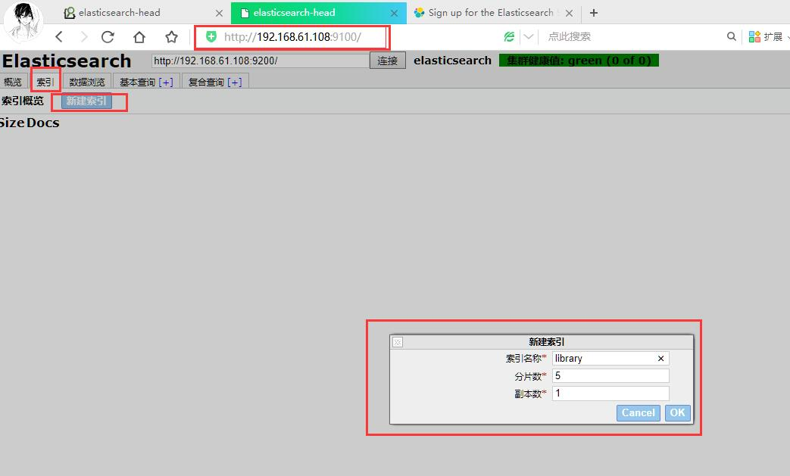
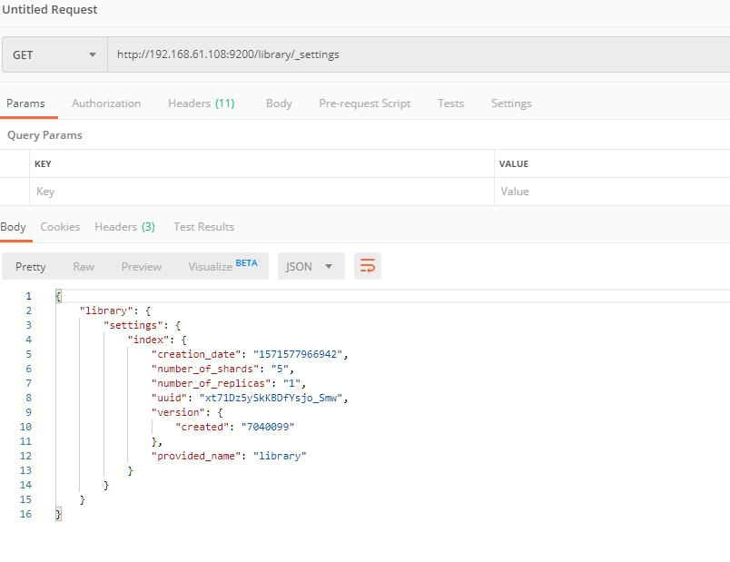

# Elasticsearch

[Toc]

Elasticearch是一个采用Restful API标准的高扩展性和高可用性的实时数据分析的全文搜索工具。  

1. **Node节点**:单个的装有Elasticsearch服务并且提供故障转移和扩展的服务器
2. **Cluster(集群)**：一个集群就是由一个或多个node组织在一起，共同工作，共同分享整个数据具有负载均衡功能的集群。
3. **Document(文档)**：一个文档是一个可被索引的基础信息单元。
4. **Index(索引)**：索引就是一个拥有几分相似特征的文档的集合。
5. **Type(类型)**：一个索引中，你可以定义一种或多种类型。
6. **Field(列)**：Field是Elasticsearch的最小单位，相当于数据的某一列。
7. **Shards(分片)**：Elasticsearch将索引分成若干份，每个部分就是一个shard。
8. **Replicas(复制)**：Replicas是索引一份或多份拷贝。

* **与关系型数据库的对比**
    |关系型数据库(比如Mysql)|非关系型数据库(Elasticsearch)|
    |:--------------------|:---------------------------|
    |数据库Database|索引Index|
    |表Table|类型Type|
    |数据行Row|文档Document|
    |数据列Column|字段Field|

* Elasticsearch架构图
      
* Elasticsearch官网[https://www.elastic.co/cn/products/elasticsearch](https://www.elastic.co/cn/products/elasticsearch)
* Elasticsearch文档[https://www.elastic.co/guide/en/elasticsearch/reference/current/docs.html](https://www.elastic.co/guide/en/elasticsearch/reference/current/docs.html)

* **1.1 什么是ElasticSearch**
    1. Elaticsearch，简称es,es是一个开源的高扩展的分布式全文搜索引擎，它可以近乎实时的存储、检索数据；本身扩展性很好，可以扩展到上百万台服务器，处理PB级别的数据。es也使用Java开发并使用Lucene作为其核心来实现所有索引和搜索的功能，但是它的目的是通过简单的RESTFul API来隐藏Lucene的复杂性，从而让全文搜索变得简单。
* **1.2ElasticSearch的使用案例**
    1. 2013年初，GitHub抛弃了Solr，采取ElasticSearch来做PB级的搜索。“GitHub使用ElasticSearch搜索20TB的数据，包括13忆文件和1300忆行代码”
    2. 维基百科：启用elasticsearch为基础的核心搜索架构
    3. SoundCloud:"SoundCloud"使用ElasticSearch为1.8忆用户提供即时而精准的音乐搜索服务
    4. 百度：百度目前广泛使用ElasticSearch作为文本数据分析，采集百度所有服务器上的各类指标数据及用户自定义数据，通过对各种数据进行多维分析展示，辅助定位分析实例异常或业务层面异常。目前覆盖百度内部20多个业务线(包括casio、云分析、网盟、预测、文库、直达号、钱包、风控等)，单集群最大100台机器，200个ES节点，每天导入30TB+数据
    5. 新浪使用ES分析处理32忆条实时日志
    6. 阿里使用ES构建挖财自己的日志采集和分析体系
* **1.3ElasticSearch对比solr**
    1. Solr利用Zookeeper进行分布式管理，而Elasticsearch自身带有分布式协调管理功能：
    2. Solr支持更多格式的数据，而Elasticsearch仅支持json文件格式
    3. Solr官方提供的功能更多，而Elasticsearch本身更注重于核心功能，高级功能多由第三方插件提供；
    4. Solr在传统的搜索应用中表现好于Elasticsearch，但在处理实时搜索应用时效率明显低于Elasticsearch
* **倒排索引**
    1. **倒排索引**(Inverted index)，也常被称为**反向索引、置入档案**或**反向档案**，是一种索引方法，被用来存储在全文搜索下某个单词在一个文档或一组文档中的存储位置的映射。它是文档检索系统中最常用的数据结构。
        * 常规的索引建立方式：文档-->关键词的映射过程(正向索引)
        * 倒排反向建立索引：关键词-->文档的映射。把正向索引的结果重新构成倒排索引(反向索引)

## 1. ElasticSearch安装与启动

1. 安装Elasticsearch[历史版本下载](https://www.elastic.co/cn/downloads/past-releases#elasticsearch)
    * 操作系统：CentOS6.5 64bit
    * 软件版本：Elasticsearch7.4
        * 注意：Elasticsearch安装包中包含了jdk版本。可以直接运行。如果下载的未包含jdk版本，需要配置JDK环境变量。7.4版本，对应的jdk版本是13以上

* Elasticsearch下载地址[https://artifacts.elastic.co/downloads/elasticsearch/elasticsearch-7.4.0-linux-x86_64.tar.gz](https://artifacts.elastic.co/downloads/elasticsearch/elasticsearch-7.4.0-linux-x86_64.tar.gz)

1. Elastic默认启动后默认会启动两个端口，
    * Restful，HTTP端口：`127.0.0.1:9200`,
    * TCP端口：`127.0.0.1:9300`
2. windows下解压后，启动`/bin/elasticsearch.bat`文件后，可以访问`http://127.0.0.1:9200/`
      
3. linux下需要配置JDK的环境变量后再启动(注意：elasticsearch在linux环境中不能用root用户运行)
    * 配置JDK环境变量`vim ~/.bash_profile`添加如下内容：

        ````sh
        export JAVA_HOME=/root/elasticsearch-7.4.0/jdk/
        export JAVA_BIN=/root/elasticsearch-7.4.0/jdk/bin
        export PATH=$JAVA_HOME/bin:$PATH
        ````

        1. 配置完成后，重新登录用户，就生效了。

* Elasticsearch目录结构
    |文件夹|作用|
    |:------------|:------------------------|
    |`/bin`|运行ElasticSearch实例和管理插件的一些脚本|
    |`/config`|配置文件路径，包含elasticsearch.yml|
    |`data`|在节点上每个索引或碎片的数据文件的位置。可以有多个目录|
    |`lib`|ElasticSearch使用的库|
    |`logs`|日志的文件夹|
    |`plugins`|已经安装的插件的存放位置|

## 2. 安装ES的图形化界面插件(Head插件)

ElasticSearch不同于Solr自带图形化界面，我们可以通过安装ElasticSearch的head插件，完成图形化界面的效果，完成索引数据的查看。安装插件的方式有两种，在线安装和本地安装。

* **Head插件**
    1. head插件是一个elasticsearch的集群管理工具，它是完全由html5编写的独立网页程序。
    2. GitHub地址[https://github.com/mobz/elasticsearch-head](https://github.com/mobz/elasticsearch-head)  

* **本地安装head插件**

1. **windows系统上**
    1. 下载head插件[https://codeload.github.com/mobz/elasticsearch-head/zip/master](https://codeload.github.com/mobz/elasticsearch-head/zip/master)
    2. 由于head插件是用node.js开发，需要安装node.js。下载node.js[https://nodejs.org/en/download/](https://nodejs.org/en/download/)
        * node.js的安装，本次不演示
    3. 使用npm安装grunt-cli.
        * `pip install -g grunt-cli`
    4. 在Head插件的解压目录中打开cmd窗口执行`npm install`安装Head脚手架所需要的插件
        * 注意：可以配置阿里源路径-->新建`.npmrc`文件添加`registry=https://registry.npm.taobao.org`
          
2. **linux系统上安装**
    1. 下载head插件[https://codeload.github.com/mobz/elasticsearch-head/zip/master](https://codeload.github.com/mobz/elasticsearch-head/zip/master)
    2. 使用uzip解压
    3. 由于head插件是用node.js开发，需要安装node.js。下载node.js[https://nodejs.org/en/download/](https://nodejs.org/en/download/)
        * node.js的安装，本次不演示
    4. 在Head插件的解压目录中打开cmd窗口执行`npm install`安装Head脚手架所需要的插件
        * 注意：可以配置阿里源路径-->新建`.npmrc`文件添加`registry=https://registry.npm.taobao.org`
    5. 在`npm install`执行完成后执行`npm run start`启动
    6. 修改elasticsearch软件中的elasticsearch.yml配置文件，添加如下内容

        ````yml
        #设置启动的ip地址
        network.host: 192.168.61.108
        # 允许跨域访问
        http.cors.enabled: true
        # 允许所有域名访问
        http.cors.allow-origin: "*"
        ````

    7. 启动elasticsearch，如果出现如下错误：
          
        * 切换到root账户：`vim /etc/sysctl.conf`中增加一行`vm.max_map_count=655360`
        * 修改完成后执行：`sysctl -p`
        * 使用root账户：`vim /etc/security/limits.conf`添加如下内容：

            ````conf
            # elasticsearch 配置 start
            * soft nofile 65536
            * hard nofile 131072
            * soft nproc 2048
            * hard nproc 4096
            # elasticsearch 配置 stop
            ````

        * 切换ES账户，启动elasticsearch。发现如下错误：
              
            * 修改 `vim ./elasticsearch-7.4.0/config/elasticsearch.yml`配置文件，开启如下注释：

                ````conf
                network.host: 192.168.61.108
                cluster.initial_master_nodes: ["node-1"]
                # 允许跨域访问
                http.cors.enabled: true
                # 允许所有域名访问
                http.cors.allow-origin: "*"
                ````

            * 启动elasticsearch，成功

3. 上面环境都安装完成和插件head都安装完成后，在插件Head目录中运行`npm run start`启动head插件
      
      

## 3. ElasticSearch相关概念

* Elasticsearch是面向文档(document oriented)的，这意味着它可以存储整个对象或文档(document)。然而它不仅仅是存储，还会索引(index)每个文档的内容使之可以被搜索。在Elasticsearch中，你可以对文档(而非成行成列的数据)进行索引、搜索、排序、过滤。Elasticsearch比传统关系型数据库如下：

````txt
Relational DB -> Databases -> Tables -> Rows -> Columns
Elasticsearch -> Indices   -> Types  -> Documents -> Fields
````

1. **索引index**
    * 索引就是一个拥有几分相似特征的文档的集合。比如说，你可以有一个客户数据的索引，另外一个产品目录的索引，还有一个订单数据的索引。一个索引由一个名字来标识(必须全部是小写字母的)，并且当我们要对对应于这个索引的文档进行索引、搜索、更新、和删除的时候，都要使用到这个名字。在一个集群中，可以定义任意多的索引
2. **类型type**
    * 在一个索引中，你可以定义一种或多种类型。一个类型是你的索引的一个逻辑上的分类/分区，其语义完全由你来定。通常，会为具有一组共同字段的文档定义一个类型。比如说，我们假设你运营一个播客平台并且将你所有的数据存储到一个索引中。在这个索引中，你可以为用户数据定义一个类型，为播客数据定义一个类型，当然，也可以为评论数据定义另一个类型。
3. **字段Field**
    * 相当于是数据表的字段，对文档数据根据不同属性进行的分类标识
4. **映射mapping**
    * mapping是处理数据方式和规则方面做一些限制，如某个字段的数据类型、默认值、分线器、是否被索引等等，这些都是映射里面可以设置的，其他就是处理es里面数据的一些使用规则设置也叫做映射，按着最优规则处理数据对性能提高很大，因此需要建立映射，并且需要思考如何建立映射才能对性能更好。
5. **文档Document**
    * 一个文档是一个可被索引的基础信息单元。比如，你可以拥有某一个客户的文档，某一个产品的一个文档，当然，也可以拥有某个订单的一个文档。文档以JSON(javascript object Notation)格式类表示，而JSON是一个到处存在的互联网数据交互格式。
6. **接近实时NRT**
    * Elasticsearch是一个接近实时的搜索平台。这意味着，从索引一个文档直到这个文档能够被搜索到有一个轻微的延迟(通常是1秒以内)
7. **集群cluster**
    * 一个集群就是由一个或多个节点组织在一起，他们共同持有整个的数据，并一起提供索引和搜索功能。一个集群由一个唯一的名字标识，这个名字默认就是"Elasticsearch"。这个名字是重要的，因为一个节点通过指定某个集群的名字，加入这个集群
8. **节点node**
    * 一个节点是集群中的服务器，作为集群的一部分，它存储数据，参与集群的索引和搜索功能。和集群类似，一个节点也是由一个名字类标识的，默认情况下，这个名字是一个随机的满位漫画角色的名字，这个名字会在启动的时候赋予节点。这个名字对于管理工作来说挺重要的，因为这个管理过程中，你会去确定网络中的那些服务器对应于Elasticsearch集群中的那些节点。
    * 一个节点可以通过配置集群名称的方式来加入一个指定的集群。默认情况下，每个节点都会被安排加入到一个叫做"Elasticsearch"的集群中，这意味着，如果你在你的网络中启动了若干个结点，并假定它们能够相互发现彼此，它们将会自动地形成并加入到一个叫做"elasticsearch"的集群中。
    * 在一个集群里，只要你想，可以拥有任意多个节点。而且，如果当前你的网络中没有运行任何Elasticsearch节点，这时启动一个节点，会默认创建并加入一个叫做“elasticsearch”的集群
9. **分片和复制shards&replicas**
    * 一个索引可以存储超出单个结点硬件限制的大量数据。比如，一个具有10忆文档的索引占据1TB的磁盘空间，而任一节点都没有这样大的磁盘空间；或者单个结点处理搜索请求，响应太慢。为了解决这个问题，Elasticsearch提供了将索引划分成多份的功能，这些份就叫做分片。当你创建一个索引的时候，你可以指定你想要的分片的数量。每个分片本身也就是一个功能完善并且独立的"索引"，这个"索引"可以被放置到集群中的任何节点上。分片很重要，主要有两方面的原因：
        1. 允许你水平分割/扩展你的内容容量。
        2. 允许你在分片(潜在地，位于多个节点上)之上进行分布式的，并行的操作，进而提高性能/吞吐量。
    * 至于一个分片怎样分布，它的文档怎样聚合回搜索请求，是完全由Elasticsearch管理的，对于作为用户的你来说，这些都是透明的。
    * 在一个网络/云环境里，失败随时都可能发生，在某个分片/节点不知怎么的就处于离线状态，或者由任何原因消失了，这种情况下，有一个故障转移机制是非常有用并且是强烈推荐的。为此目的，Elasticsearch允许你创建分片的一份或多份拷贝，这些拷贝叫做复制分片，或者直接叫复制。
    * 复制之所以重要，有两个主要原因：在分片/节点失败的情况下，提供了高可用性。因为这个原因，注意到复制分片不与原/主要(original/primary)分片置于同一节点上是非常重要的。扩展你的搜索量/吞吐量，因为搜索可用在所有的复制上并行运行。总之，每个索引可以被分成多个分片。一个索引也可以被复制0次(意思是没有复制)或多次。一旦复制了，每个索引就有了主分片(作为复制源的原来的分片)和复制分片(主分片的拷贝)之别。分片和复制的数量可以在索引创建的时候指定。在索引创建之后，你可以在任何时候动态地改变复制的数量，但是你事后不能改变分片的数量。
    * 默认情况下，Elasticsearch中的每个索引被分片5个主分片和1个复制，这意味着，如果你的集群中至少有两个节点，你的索引将会有5个主分片和另外5个复制分片(1个完全拷贝)，这样的话每个索引总共就有10个分片。

## 4 增删改查操作

### 4.1 索引的初始化操作

* 创建索引之前可以对索引做初始化操作，比如指定shards数量以及replicas数量。
    1. linux命令行下可以如下操作：

        ````json
            put操作    http端口地址                   索引名
        CURL -XPUT "http://192.168.61.108:9200/library/' -d '{
            "settings":{
                "index":{
                    "number_of_shards":5, #索引分片数量
                    "number_of_replicas":1 #完全拷贝数量
                }
            }
        }"
        `````

        * 初始化索引
        * 创建索引之前可以对索引做初始化操作
        * 比如指定shards数量以及replicas的数量
        * 上面的number_of_replicas还可以换成：
            * blocks.read_only：设为true,则禁止读操作
            * blocks.write: 设为true,则禁止写操作
            * blocks.metadata: 设为true,则禁止对metadata操作

    2. 使用web界面操作如下：
          
    3. 也可以使用Postman软件提交请求.
        * 直接使用put请求，创建blog索引
          

* 使用 GET请求获取`http://192.168.61.108:9200/library/_settings`可以获得该索引详细的配置信息
      
    1. 如果需要同时获取两个或多个索引的信息可以在索引直接使用逗号`,`分割`GET /library,library2/_settings`
      
    2. 如果需要获取所有索引信息则：`GET /_all/_settings`


