# Elasticsearch增删改查操作

## 1. 索引的初始化操作

* 创建索引之前可以对索引做初始化操作，比如指定shards数量以及replicas数量。
    1. linux命令行下可以如下操作：

        ````json
            put操作    http端口地址                   索引名
        CURL -XPUT "http://192.168.61.108:9200/library/' -d '{
            "settings":{
                "index":{
                    "number_of_shards":5, #索引分片数量
                    "number_of_replicas":1 #完全拷贝数量
                }
            }
        }"
        `````

        * 初始化索引
        * 创建索引之前可以对索引做初始化操作
        * 比如指定shards数量以及replicas的数量
        * 上面的number_of_replicas还可以换成：
            * blocks.read_only：设为true,则禁止读操作
            * blocks.write: 设为true,则禁止写操作
            * blocks.metadata: 设为true,则禁止对metadata操作

    2. 使用web界面操作如下：
        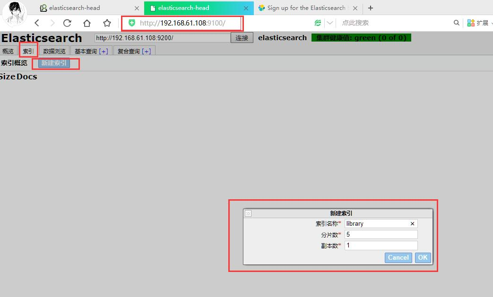  
    3. 也可以使用Postman软件提交请求.
        * 直接使用put请求，创建blog索引
        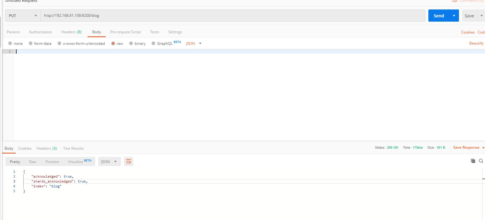  

* 使用 GET请求获取`http://192.168.61.108:9200/library/_settings`可以获得该索引详细的配置信息
    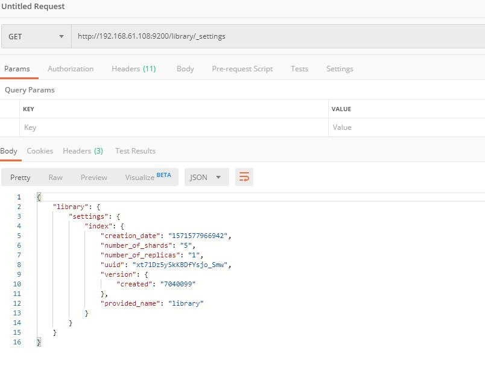  
    1. 如果需要同时获取两个或多个索引的信息可以在索引直接使用逗号`,`分割`GET /library,library2/_settings`
    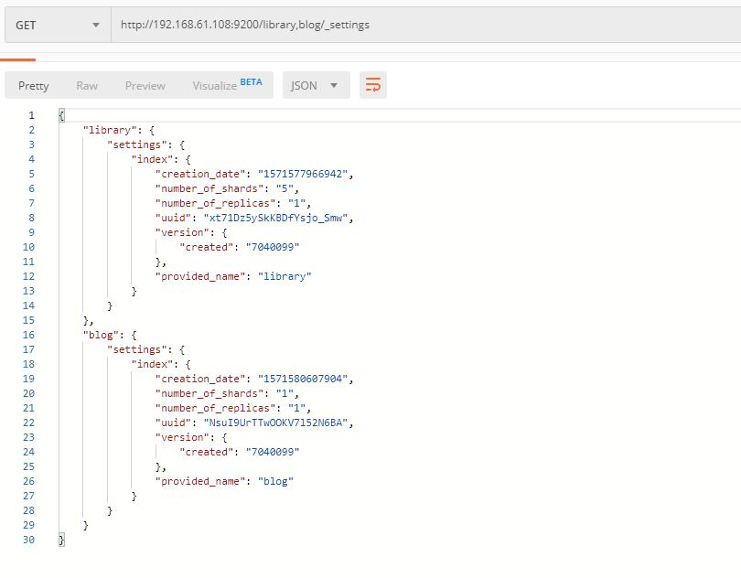  
    2. 如果需要获取所有索引信息则：`GET /_all/_settings`

## 2. type与简单文档的操作

1. **创建一个type**
    * 创建一个type时使用PUT请求，并同时可以设置文档。
    * **注意：当type已经存在时，需要为type中添加文档信息，这时需要使用POST请求。**
    * 创建文档时，如果不指定id，会默认生成一个id，这种id通常称为UUID.

    ````json
    //   -----索引名称
    //   |           Type名称
    //   |           |
    //   |           |   文档ID(不设置会默认生成，对应字段`_id`)
    //   |           |   |
    //   V           V   V
    PUT /library/books/1
    {
        "title": "Elasticsearch: The Definitive Guide",
        "name": {
            "first": "Zachary",
            "last": "Tong"
        },
        "publish_date":"2019-11-02",
        "price":"49.99"
    }

    // 成功添加后返回结果：
    {
        "_index": "library",
        "_type": "books",
        "_id": "1",
        "_version": 1,
        "result": "created",
        "_shards": {
            "total": 2,
            "successful": 1,
            "failed": 0
        },
        "_seq_no": 0,
        "_primary_term": 1
    }
    ````

    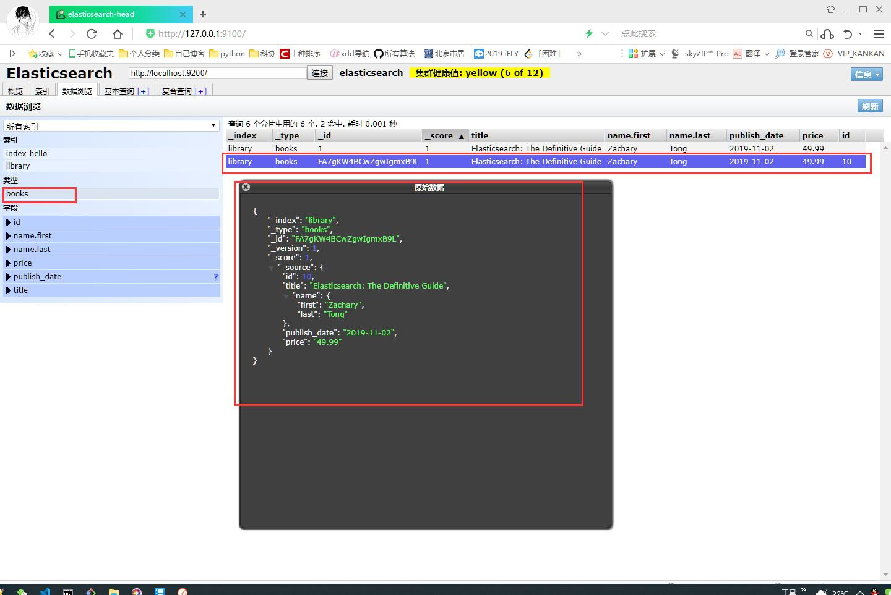  

2. **查询文档**：
    * 通过ID获得文档信息
        * `GET /library/books/1` 获取文档id为1的文档信息
        * `GEt /library/books/FA7gKW4BCwZgwIgmxB9L` 获取id为FA7gKW4BCwZgwIgmxB9L的文档信息  
        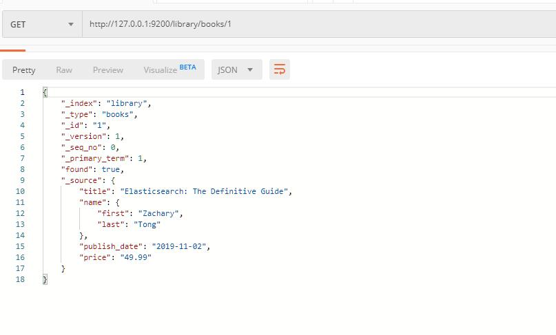  
    * 查询时只需要指定字段。可以**使用`_source`获取指定字段**
        * `GET /library/books/1?_source=title,price` 只查询`_id`为1的文档中title字段和price字段内容
        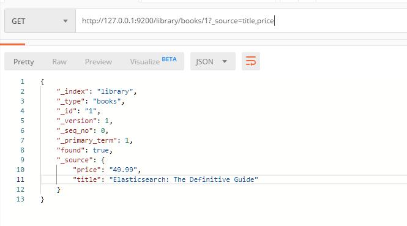  
3. **更新文档**
    * **覆盖的方式更新**：重新提交一次PUT请求，使用`_id`与需要更新的`_id`同名。这样可以替换整个原来的`_id`中所有的文档信息。**文档全部更新**
    * **_update参数更新**：API的方式单独更新你想要更新的字段。**文档中部分更新**

        ````json
        POST /library/books/1/_update
        {
            "doc":{
                "price": 10,
                "title": "fly"
            }
        }

        // 更新后返回
        {
            "_index": "library",
            "_type": "books",
            "_id": "1",
            "_version": 2,
            "result": "updated",
            "_shards": {
                "total": 2,
                "successful": 1,
                "failed": 0
            },
            "_seq_no": 2,
            "_primary_term": 1
        }
        ````

        * 更新前信息为：
        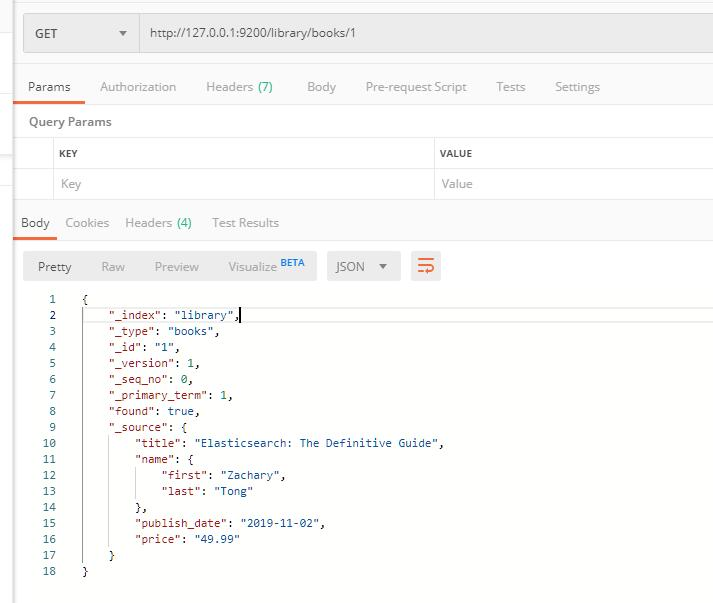  
        * 更新后信息为：
        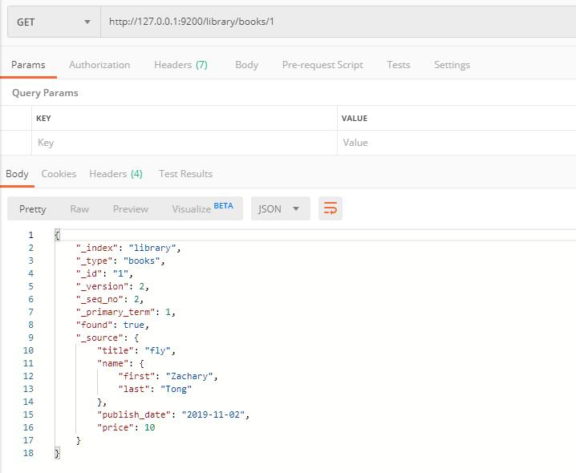  

4. **删除**
    * 删除文档: `DELETE /library/books/1`在索引为library中type为books的文档中删除`_id`为1的文档
    * 删除type: `DELETE /library/books` 在library上删除type为books中的所有信息
    * 删除索引: `DELETE /library` 删除索引为library中的所有信息

## 3. Mget获取多个文档

1. Multi GET API
    * 可以更快迅速的同时检索多个文档
    * mget API参数是一个docs数组，数组的每个节点定义一个文档的`_index`,`_type`,`_id`元数据。
    * 官方文档：[https://www.elastic.co/guide/en/elasticsearch/reference/current/docs-multi-get.html](https://www.elastic.co/guide/en/elasticsearch/reference/current/docs-multi-get.html)  

* 示例：
    1. 同时获取多个文档信息
    2. 获取index:bank和shakespaeare中id为1,2,3,4,15的文档详细
        * `GET /bank/bank_account/1`
        * `GET /bank/bank_account/2`
        * `GEt /bank/bank_account/4`
        * `GET /shakespeare/line/3`
        * `GEt /shakespeare/line/15`
    3. 使用`_mget`查询如下：

        ````json
        GET /_mget
        {
            "docs":[
                {"_index":"bank","_type":"bank_account","_id":1},
                {"_index":"bank","_type":"bank_account","_id":2},
                {"_index":"bank","_type":"bank_account","_id":4},
                {"_index":"shakespaeare","_type":"line","_id":3},
                {"_index":"shakespaeare","_type":"line","_id":15},
            ]
        }
        ````

    4. 获取相同index相同type下不同ID的文档

        ````json
        GET /shakespeare/line/_mget
        {
            "docs":[
                {"_id":6},
                {"_type":"line","_id":28}
            ]
        }
        ````

        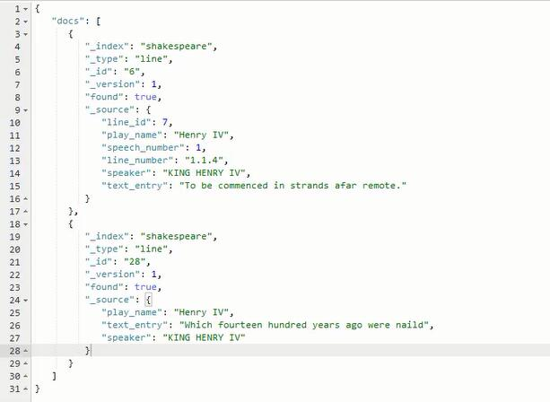  

    5. 如果没有对应的"_type"则返回一个found:为false表示没有找到

        ````json
        GET /shakespeare/line/_mget
        {
            "docs":[
                {"_id":6},
                {"_type":"line","_id":28}
            ]
        }
        ````

        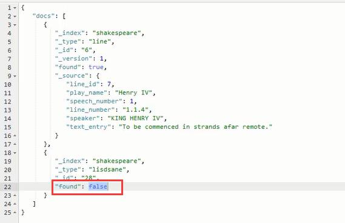  

    6. 查询多个id，也可以使用ids查询

        ````json
        GET /shakespeare/line/_mget
        {
            "ids":["6","28"]
        }
        ````

        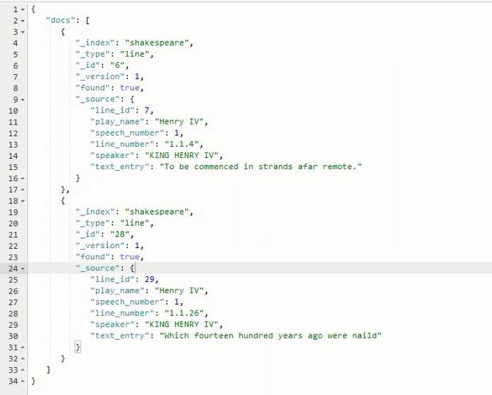  

## 4. bulk批量操作API

* 实现了多个文档的create,index,update或delete
* 官方文档：[https://www.elastic.co/guide/en/elasticsearch/reference/current/docs-bulk.html](https://www.elastic.co/guide/en/elasticsearch/reference/current/docs-bulk.html)

### 4.1 请求体格式

|action行为|解释|
|:--------|:----|
|create|当文档不存在时创建之。|
|index|创建新文档或替换已有文档|
|update|局部更新文档。|
|delete|删除一个文档。|

* 请求体格式(注意：不要美化，每行为一个钟行为)：

    ````json
    {action:{metadata}}\n  //对那个数据操作的行为
    {request body}\n        //请求体
    {action:{metadate}}\n   //继续对那个数据操作
    {request body}\n        //操作对应的请求体
    ...
    ...
    ````

* 示例：多重模式，批量操作bulk

    ````json
    POST /library/books/_bulk
    {"index":{"_id":1}}
    {"title":"Elasticsearch: The Definitive Guide","price":5}
    {"index":{"_id":2}}
    {"title":"The Elasticsearch cookbook","price":15}
    {"index":{"_id":3}}
    {"title":"Elasticsearch Blueprints","price":9}
    {"index":{"_id":5}}
    {"title":"Thinking in Java","price":7}

    ````

    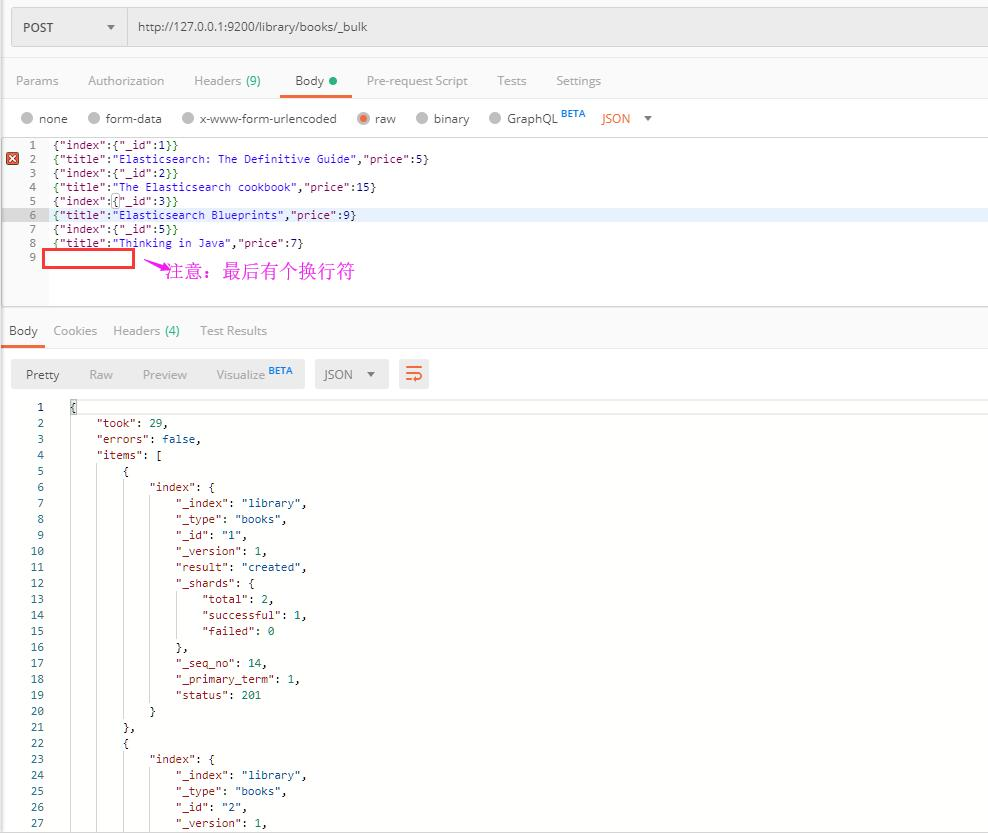  


## 5. 内置的字段以及类型

|内置字段|含义|
|:------|:--------|
|`_uid`||
|`_id`||
|`_type`||
|`_source`||
|`_all`||
|`_analyzer`||
|`_boost`||
|`_parent`||
|`_routing`||
|`_index`||
|`_size`||
|`_timestamp`||
|`_ttl`||

|字段类型||
|:-----|:----|
|String|字符串|
|Integer/long|整形|
|Float/double|浮点型|
|Boolean|布尔类型|
|Null|空|
|Date|时间|

|相关操作|含义|
|:-----|:------|
|`GET /library/_settings`|获取索引为librarry的详细信息|
|`GET /library,library2/_settings`|获取索引为librarry和librarry2的详细信息|
|`GET /_all/_settings`|获取所有索引的信息|
|`GET /library/books/1`|获取索引为library中type为books的文档，且文档`_id`为1|
|`GEt /library/books/1?_source=title,price`|查询的文档中只需要title字段和price字段|
|`PUT /library`|使用默认配置创建一个library索引(默认情况，索引的分片数为1)|
|`PUT /library/books/1`|在library索引上创建一个type为books的文档，且文档`_id`为1.文档内容需要使用json.格式定义传入。<br/>如果id为1的文档已经存在，会更新整个文档内容|
|`POST /library/books/1/_update`|根据JSON更新指定文档id为1的文档，中的指定字段。字段需要在JSON中"doc"节点下面定义其修改内容。|
|`DELETE /library/books/1`|在索引为library中type为books的文档中删除`_id`为1的文档|
|`DELETE /library/books` |在library上删除type为books中的所有信息|
|`DELETE /library` |删除索引为library中的所有信息|


