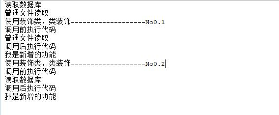

## 装饰模式
* 特征：为接口增强性能
    1. 必须有一个装饰的对象
    2. 必须拥有与被装饰对象相同的接口
    3. 可以给被装饰对象添加额外的功能。
* 装饰器通过包装一个装饰对象来扩展其功能，而又不改变其接口，这实际上是基于对象的适配器模式的一种变种。他与对象的适配器模式有异同点。
    * 相同点：都拥有一个目标对象
    * 不同点：适配器模式需要实现另外一个接口，而装饰器模式必须实现该对象的接口。
#### 典型的装饰器模式图：


#### 简单实现  
1. 装饰模式前代码示例：
    * 接口：MyReader需要继承者实现读取功能
    * 继承类：MyDataReader 实现了接口，完成了数据库读取
    * 继承类：MyFileReader 实现了接口，完成了文件读取
````java
/** 接口类， 定义基本方法 **/
interface  MyReader{
    /**文件读取方法**/
    public void read();
}

/** 实现数据库内容读取  **/
class MydataReader implements MyReader{
    public void read(){
        System.out.println("读取数据库");
    }
}

/**实现普通文件读取**/
class MyFileReader implements MyReader{
    public void read(){
        System.out.println("普通文件读取");
    }
}

class bbb {
	public static void main(String[] args) {
		//实例化一个数据库读取对象
		MyReader datr = new MydataReader();
		//实例化一个文件读取对象
		MyReader filr = new MyFileReader();
		datr.read();
		filr.read();
	}
}
````   
2. 现在需要对读取文件时，在读取文件前后做相应操作，而不改变原来的代码情况下。可以定义一个装饰类，来实现
````java
/**定义装饰类，用来装饰MyReader **/
class BufferReader implements MyReader{
	MyReader mread;
	public BufferReader(MyReader mread) {
		this.mread = mread;
	}

	public void read() {
		System.out.println("调用前执行代码");
		//调用父类的读取方法。
		this.mread.read(); 
		System.out.println("调用后执行代码");
	}
	
	//为装饰对象提供新增装饰功能
	public void newread(){
		System.out.println("我是新增的功能");
	}
}
````    
3. 此时就可以创建用装饰类装饰的MyReader
````java
class bbb {
	public static void main(String[] args) {
		
		//实例化一个数据库读取对象
		MyReader datr = new MydataReader();
		//实例化一个文件读取对象
		MyReader filr = new MyFileReader();
		datr.read();
		filr.read();
		
		System.out.println("使用装饰类，类装饰-------------------No0.1");
		//使用bufferreader装饰了MyfileReader普通文件读取功能
		BufferReader bfread = new BufferReader(new MyFileReader());
		bfread.read();
		//使用新增装饰功能
		bfread.newread();
		System.out.println("使用装饰类，类装饰-------------------No0.2");
		//使用MydataReader对MydataReader数据读取功能进行了装饰
		BufferReader bdread = new BufferReader(new MydataReader());
		bdread.read();
		bdread.newread();
		
	}
}
````  
运行结果如下：  


#### 装饰模式与继承的区别
* 降低了类与类之间的关系
* 避免了继承体现的拥堵
* 装饰类因为增强已有对象，具备功能和已有的功能是相同的，只不过，提供了更加强的功能。所有装饰类和被装饰类通常是属于一个体系中的。

#### 总结：
* 简单的说，如果要装饰谁，就使用构造方法将谁作为成员变量传入。重新定义需要装饰的功能（即方法）在调用被装饰的代码前后，可以做相应的处理。